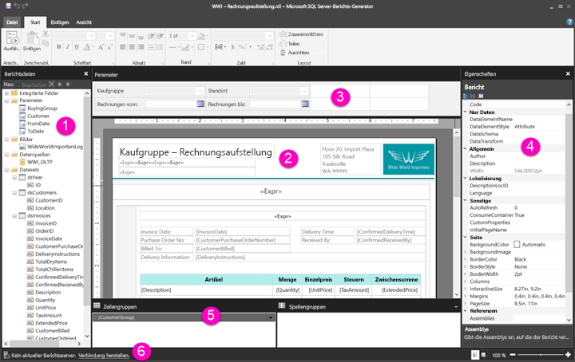

# Tour durch die Berichtsentwurfsansicht für paginierte Berichte (Vorschau)

Die Berichtsentwurfsansicht im Berichts-Generator ist der Entwurfsbereich zur Erstellung paginierter Berichte, die Sie im Power BI-Dienst veröffentlichen können. Die Entwurfsfläche befindet sich im Zentrum des Berichts-Generators, und das Menüband und die Bereiche sind rundherum angeordnet. Auf der Entwurfsfläche können Sie Berichtselemente hinzufügen und organisieren. Dieser Artikel erläutert die Bereiche zum Hinzufügen, Auswählen und Anordnen von Berichtsressourcen sowie zum Ändern der Eigenschaften von Berichtselementen.  

1. [Berichtsdatenbereich](#1-report-data-pane) 
2. [Berichtsentwurfsfläche](#2-report-design-surface)  
3. [Parameterbereich](#3-parameters-pane) 
4. [Eigenschaftenbereich](#4-properties-pane) 
5. [Gruppierungsbereich](#5-grouping-pane) 
6. [Statusleiste für aktuellen Bericht](#6-current-report-status-bar)  
  
## 1 Berichtsdatenbereich  
 Über den Berichtsdatenbereich definieren Sie die Berichtsdaten und Berichtsressourcen, die Sie für einen Bericht benötigen, bevor Sie das Berichtslayout entwerfen. Beispielsweise können Sie dem Berichtsdatenbereich Datenquellen, Datasets, berechnete Felder, Berichtsparameter und Bilder hinzufügen.  
  
 Nachdem Sie dem Berichtsdatenbereich Elemente hinzugefügt haben, ziehen Sie Felder auf Berichtselemente auf der Entwurfsfläche, um zu steuern, wo die Daten im Bericht angezeigt werden.  
  
> [!TIP]  
>  Wenn Sie ein Feld aus dem Berichtsdatenbereich direkt auf die Berichtsentwurfsfläche ziehen, statt es in einem Datenbereich wie einer Tabelle oder einem Diagramm abzulegen, wird bei Ausführung des Berichts nur der erste Wert aus den Daten in diesem Feld angezeigt.  
  
 Sie können auch integrierte Felder aus dem Berichtsdatenbereich auf die Berichtsentwurfsfläche ziehen. Beim Rendern enthalten diese Felder Informationen zum Bericht, wie z.B. den Namen des Berichts, die Gesamtzahl der Seiten im Bericht und die aktuelle Seitennummer.  
  
 Einige Elemente werden dem Berichtsdatenbereich automatisch hinzugefügt, wenn Sie der Berichtsentwurfsfläche etwas hinzufügen. Wenn Sie beispielsweise ein Bild in Ihrem Bericht einbetten, wird es dem Ordner „Bilder“ im Berichtsdatenbereich hinzugefügt.  
  
> [!NOTE]  
>  Über die Schaltfläche **Neu** können Sie dem Berichtsdatenbereich ein neues Element hinzufügen. Sie können dem Bericht mehrere Datasets aus derselben Datenquelle oder aus anderen Datenquellen hinzufügen. Um ein neues Dataset aus derselben Datenquelle hinzuzufügen, klicken Sie mit der rechten Maustaste auf eine Datenquelle, und wählen Sie **Dataset hinzufügen**.  
  
## 2. Berichtsentwurfsfläche  
 Die Berichtsentwurfsfläche des Berichts-Generators ist der Hauptarbeitsbereich zum Entwerfen Ihrer Berichte. Um Berichtselemente wie Datenbereiche, Unterberichte, Textfelder, Bilder, Rechtecke und Linien in Ihrem Bericht zu platzieren, fügen Sie sie der Entwurfsfläche aus dem Menüband oder dem Berichtsteilkatalog hinzu. Dort können Sie Ihren Berichtselementen Gruppen, Ausdrücke, Parameter, Filter, Aktionen, Sichtbarkeit und Formatierung hinzufügen.  
  
 Zudem können Sie Folgendes ändern:  
  
-   Die Eigenschaften des Berichtshauptteils, z.B. Rahmen und Füllfarbe, indem Sie außerhalb von Berichtselementen auf den weißen Bereich der Entwurfsfläche klicken und **Textkörpereigenschaften** auswählen.  
  
-   Die Eigenschaften von Kopf- und Fußzeile, z.B. Rahmen und Füllfarbe, indem Sie im Kopf- und Fußzeilenbereich außerhalb von Berichtselementen auf den weißen Bereich der Entwurfsfläche klicken und **Kopfzeileneigenschaften** bzw. **Fußzeileneigenschaften** auswählen.  
  
-   Die Eigenschaften des Berichts selbst, beispielsweise die Seiteneinrichtung, indem Sie mit der rechten Maustaste auf den grauen Bereich rund um die Entwurfsfläche klicken und **Berichtseigenschaften** auswählen.  
  
-   Die Eigenschaften von Berichtselementen, indem Sie mit der rechten Maustaste darauf klicken und **Eigenschaften** auswählen.  
  
### Größe der Entwurfsfläche und Druckbereich  
Die Größe der Entwurfsfläche kann sich vom Druckbereich der Seitengröße unterscheiden, die Sie zum Drucken des Berichts angeben. Durch das Ändern der Entwurfsflächengröße ändert sich nicht der Druckbereich Ihres Berichts. Ihre Festlegung der Größe für den Druckbereich des Berichts hat keine Auswirkungen auf die Größe des vollständigen Entwurfsbereichs. Weitere Informationen finden Sie unter „Renderingverhalten“. 
  
- Um das Lineal anzuzeigen, aktivieren Sie auf der Registerkarte **Ansicht** das Kontrollkästchen **Lineal**.  
  
## 3 Parameterbereich  
 Mithilfe von Berichtsparametern können Sie Berichtsdaten steuern, verwandte Berichte miteinander verbinden und die Berichtspräsentation anpassen. Der Bereich „Parameter“ bietet ein flexibles Layout für die Berichtsparameter.  
  
 Informieren Sie sich über Berichtsparameter.   
  
## 4 Eigenschaftenbereich
 Jedes Element in einem Bericht, einschließlich Datenbereiche, Bilder, Textfelder und der Hauptteil des Berichts selbst, verfügt über Eigenschaften. Beispielsweise zeigt die Eigenschaft „BorderColor“ für ein Textfeld den Farbwert des Rahmens um das Textfeld, und die Eigenschaft „PageSize“ für den Bericht zeigt die Seitengröße des Berichts.  
  
 Diese Eigenschaften werden im Bereich „Eigenschaften“ angezeigt. Die Eigenschaften im Bereich ändern sich je nach Auswahl des Berichtselements.  
  
- Um den Eigenschaftenbereich anzuzeigen, klicken Sie auf der Registerkarte **Ansicht** in der Gruppe **Ein-/ausblenden** auf **Eigenschaften**.  
  
### Ändern von Eigenschaftswerten  
 Im Berichts-Generator können Sie die Eigenschaften für Berichtselemente auf unterschiedliche Weise ändern:  
  
-   Durch Auswählen von Schaltflächen und Listen auf dem Menüband.  
  
-   Durch Ändern von Einstellungen in Dialogfeldern.  
  
-   Durch Ändern von Eigenschaftswerten im Eigenschaftenbereich.  
  
 Die am häufigsten verwendeten Eigenschaften sind in den Dialogfeldern und auf dem Menüband verfügbar.  
  
 Abhängig von der Eigenschaft können Sie einen Eigenschaftswert aus einer Dropdownliste festlegen, den Wert eingeben oder `<Expression>` auswählen, um einen Ausdruck zu erstellen.  
  
### Ändern der Eigenschaftenbereichsansicht  
 Standardmäßig werden Eigenschaften im Eigenschaftenbereich in umfassende Kategorien eingeteilt, z.B. „Aktion“, „Rahmen“, „Füllung“, „Schriftart“ und „Allgemein“. Jeder Kategorie ist eine Reihe von Eigenschaften zugeordnet. Beispielsweise werden in der Schriftartkategorie folgende Eigenschaften aufgeführt: „Color“, „FontFamily“, „FontSize“, „FontStyle“, „FontWeight“, „LineHeight“ und „TextDecoration“. Falls gewünscht, können Sie alle im Bereich aufgelisteten Eigenschaften auch alphabetisch sortieren. Dadurch werden die Kategorien entfernt und alle Eigenschaften unabhängig von der Kategorie in alphabetischer Reihenfolge aufgeführt.  
  
 Am oberen Rand des Eigenschaftenbereichs befinden sich drei Schaltflächen: **Kategorie**, **Alphabetisch** und **Eigenschaftenseite**. Wählen Sie die Schaltflächen „Kategorie“ und „Alphabetisch“, um zwischen den Ansichten des Eigenschaftenbereichs zu wechseln. Wählen Sie die Schaltfläche **Eigenschaftenseiten**, um das Dialogfeld „Eigenschaften“ für ein ausgewähltes Berichtselement zu öffnen.  
  
  
## 5 Gruppierungsbereich

 Gruppen werden zum Organisieren Ihrer Berichtsdaten in einer visuellen Hierarchie und zum Berechnen von Gesamtsummen verwendet. Sie können die Zeilen- und Spaltengruppen in einem Datenbereich in der Entwurfsfläche und auch im Gruppierungsbereich anzeigen. Der Gruppierungsbereich enthält zwei Bereiche: Zeilengruppen und Spaltengruppen. Wenn Sie einen Datenbereich auswählen, werden im Gruppierungsbereich alle Gruppen innerhalb dieses Datenbereichs als hierarchisch angeordnete Liste angezeigt: Untergeordnete Gruppen werden eingerückt unter ihren übergeordneten Gruppen angezeigt.  
  
 Sie können Gruppen erstellen, indem Sie Felder aus dem Berichtsdatenbereich ziehen und auf der Entwurfsfläche oder im Gruppierungsbereich ablegen. Im Gruppierungsbereich können Sie übergeordnete, angrenzende und untergeordnete Gruppen hinzufügen, Gruppeneigenschaften ändern und Gruppen löschen.  
  
 Der Gruppierungsbereich wird standardmäßig angezeigt. Sie können ihn jedoch schließen, indem Sie auf der Registerkarte „Ansicht“ das Kontrollkästchen „Gruppierungsbereich“ deaktivieren. Der Gruppierungsbereich ist für die Datenbereiche „Diagramm“ und „Messgerät“ nicht verfügbar.  
  
 Weitere Informationen finden Sie unter „Gruppierungsbereich“ und „Grundlegendes zu Gruppen“.  
  
## 6 Statusleiste für aktuellen Bericht

Die Statusleiste für den aktuellen Bericht zeigt den Namen des Servers, mit dem der Bericht verbunden ist, oder „Kein aktueller Berichtsserver“ an. Sie können **Verbinden** auswählen, um eine Verbindung mit einem Server herzustellen.

## Nächste Schritte

[Was sind paginierte Berichte in Power BI Premium (Vorschau)?](paginated-reports-report-builder-power-bi.md) 

  
  
