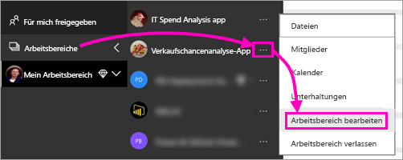
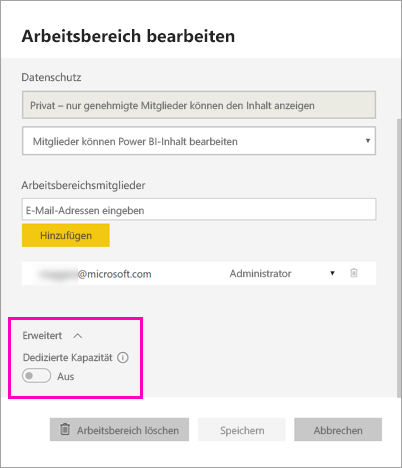
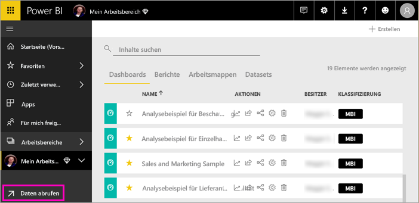
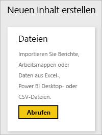
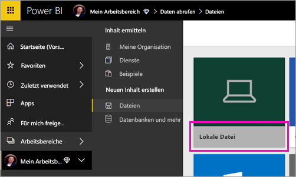
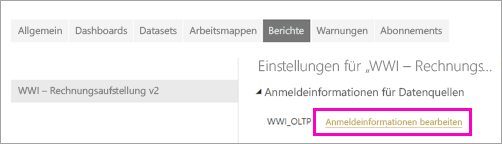
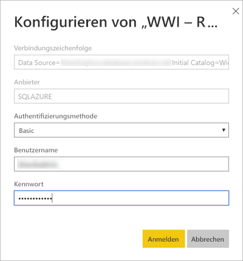
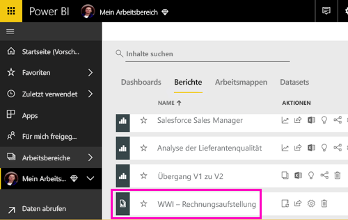
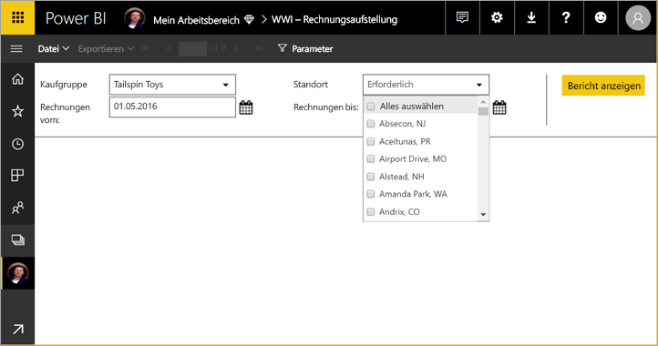

# Veröffentlichen eines paginierten Berichts im Power BI-Dienst (Vorschau)

In diesem Artikel erfahren Sie, wie Sie einen paginierten Bericht durch Hochgeladen von Ihrem lokalen Computer im Power BI-Dienst veröffentlichen. Sie können paginierte Berichte in Ihren Arbeitsbereich oder einen anderen Arbeitsbereich hochladen, sofern sich der Arbeitsbereich in einer Premium-Kapazität befindet. Suchen Sie nach dem Diamantsymbol  neben dem Namen des Arbeitsbereichs. 

Wenn Sie über eine lokale Berichtsdatenquelle verfügen, müssen Sie nach dem Hochladen des Berichts [ein Gateway erstellen](#create-a-gateway).

## Hinzufügen eines Arbeitsbereichs zu einer Premium-Kapazität

Wenn im Arbeitsbereich das Diamantsymbol  neben dem Namen nicht angezeigt wird, müssen Sie den Arbeitsbereich einer Premium-Kapazität hinzufügen. 

1. Wählen Sie **Arbeitsbereiche**, die Auslassungspunkte (**...**) neben dem Arbeitsbereichsnamen und dann **Arbeitsbereich bearbeiten** aus.

    

1. Erweitern Sie im Dialogfeld **Arbeitsbereich bearbeiten** **Erweitert**, und ziehen Sie **Dedizierte Kapazität** dann auf **Ein**.

    

   Möglicherweise können Sie diese Einstellung nicht ändern. Wenn das der Fall ist, wenden Sie sich an Ihren Power BI Premium-Kapazitätsadministrator, damit er Ihnen die Berechtigung erteilt, Ihren Arbeitsbereich einer Premium-Kapazität hinzuzufügen.

## Hochladen eines paginierten Berichts

1. Erstellen Sie Ihren paginierten Bericht im Berichts-Generator, und speichern Sie ihn auf Ihrem lokalen Computer.

1. Öffnen Sie den Power BI-Dienst in einem Browser, und navigieren Sie zu dem Premium-Arbeitsbereich, in dem Sie den Bericht veröffentlichen möchten. Achten Sie auf das Diamantsymbol  neben dem Namen des Arbeitsbereichs. 

1. Wählen Sie **Daten abrufen** aus.

    

1. Wählen Sie im Feld **Dateien** die Option **Abrufen**aus.

    

1. Wählen Sie **Lokale Datei** aus, navigieren Sie zum paginierten Bericht, und wählen Sie **Öffnen** aus.

    

1. Wählen Sie **Weiter** > **Anmeldeinformationen bearbeiten** aus.

    

1. Konfigurieren Sie Ihre Anmeldeinformationen, und wählen Sie **Anmelden** aus.

    

   Ihr Bericht wird in der Liste der Berichte angezeigt.

    

1. Wählen sie den Bericht aus, um ihn im Power BI-Dienst zu öffnen. Wenn er über Parameter verfügt, müssen Sie diese auswählen, bevor der Bericht angezeigt werden kann.
 
    

## Erstellen eines Gateways

Wie bei allen Power BI-Berichten müssen Sie im Falle einer lokalen Berichtsdatenquelle ein Gateway erstellen oder eine Verbindung mit diesem herstellen, um auf Daten zuzugreifen.

1. Wählen Sie neben dem Berichtsnamen **Verwalten** aus.

   

1. Im Power BI-Artikel [Installieren eines Gateways](service-gateway-install.md) finden Sie weitere Informationen und Anleitungen.

### Gatewayeinschränkungen

Derzeit unterstützen Gateways keine mehrwertigen Parameter.

## Nächste Schritte

- [Anzeigen eines paginierten Berichts im Power BI-Dienst](paginated-reports-view-power-bi-service.md)
- [Was sind paginierte Berichte in Power BI Premium? (Vorschau)?](paginated-reports-report-builder-power-bi.md)

