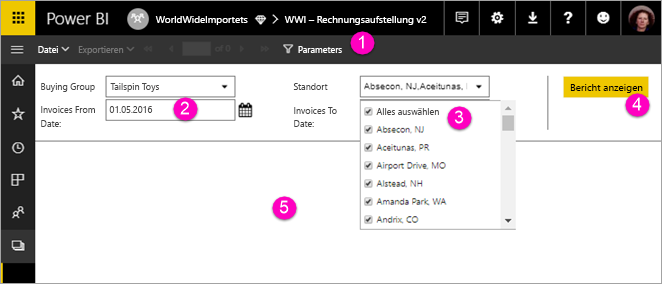

# Anzeigen von Parametern für paginierte Berichte im Power BI-Dienst (Vorschau)

In diesem Artikel erfahren Sie, wie Sie mit Parametern für paginierte Berichte im Power BI-Dienst arbeiten.  Mit Berichtsparametern können Sie Berichtsdaten filtern. Parameter stellen eine Liste der verfügbaren Werte zur Verfügung, und Sie können mindestens einen Wert auswählen. Manchmal verfügen Parameter über einen Standardwert, und manchmal müssen Sie einen Wert auswählen, bevor Sie den Bericht anzeigen können.  

Wenn Sie einen Bericht mit Parametern anzeigen, zeigt die Symbolleiste der Berichtanzeige jeden Parameter an, sodass Sie interaktiv Werte angeben können. Die folgende Abbildung zeigt den Bereich „Parameter“ für einen Bericht mit Parametern für **Kaufgruppe**, **Standort**, **Rechnungsdatum von** und **Rechnungsdatum bis** an.  

## Bereich „Parameter“ in Power BI

  
1.  **Bereich „Parameter“**: In der Symbolleiste der Berichtanzeige wird eine Eingabeaufforderung wie „Erforderlich“ oder der Standardwert jedes Parameters angezeigt.    
  
2.  **Parameter für „Rechnungsdatum von/bis“**: Die beiden Datenparameter verfügen über Standardwerte. Um das Datum zu ändern, geben Sie ein Datum in das Textfeld ein, oder wählen Sie ein Datum im Kalender aus.  
  
3.  **Parameter für „Standort“**: Der Standortparameter ist so festgelegt, dass Sie einen Wert, mehrere Werte oder alle Werte auswählen können. 
  
4.  **Bericht anzeigen**: Wenn Sie die Parameterwerte eingegeben oder geändert haben, klicken Sie auf **Bericht anzeigen**, um den Bericht auszuführen. 

5. **Standardwerte**: Wenn alle Parameter über Standardwerte verfügen, wird der Bericht beim ersten Anzeigen automatisch ausgeführt. Einige Parameter in diesem Bericht hatten keine Standardwerte, sodass der Bericht erst angezeigt wird, wenn Sie Werte ausgewählt haben.  

## Nächste Schritte

[Erstellen von Parametern für paginierte Berichte im Power BI-Dienst](paginated-reports-parameters.md)
