# Ändern der Größe einer Berichtsseite (Tutorial)
Im [vorherigen Artikel und Video](power-bi-report-display-settings.md) haben Sie zwei unterschiedliche Arten zum Steuern der Seitenanzeige in Power BI-Berichten kennengelernt: **Ansicht** und **Seitengröße**. Nun versuchen Sie das einmal selbst.

## Ändern Sie zunächst die Einstellung für die Seitenansicht.
1. Öffnen Sie einen Bericht in der Leseansicht oder der Bearbeitungsansicht. In diesem Beispiel wird die Seite „Neue Filialen“ des [Analysebeispiels für den Einzelhandel](sample-retail-analysis.md) verwendet.  Die Seite nutzt die Einstellung **An Seite anpassen** .  In diesem Fall zeigt „An Seite anpassen“ die Berichtsseite ohne Scrollleisten an, einige Details und Titel sind jedoch zu klein zum Lesen.
   
   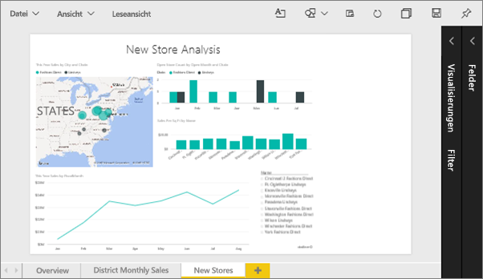
2. Stellen Sie sicher, dass im Zeichenbereich keine Visualisierungen ausgewählt sind. Wählen Sie **Ansicht** aus, und überprüfen Sie die Anzeigeoptionen.

* In der Leseansicht wird dies angezeigt.
  
     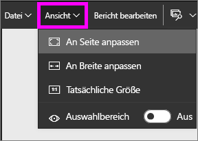
* Die Bearbeitungsansicht sieht wie folgt aus.
  
    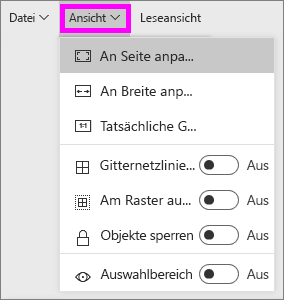

1. So sieht die Seite mit der Einstellung **Tatsächliche Größe** aus.
   
   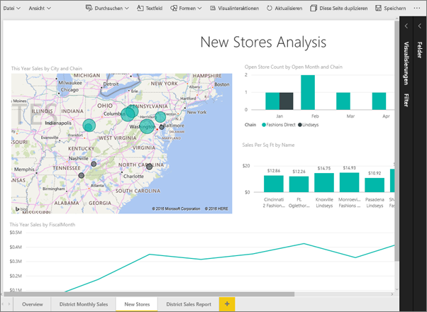
   
   Allerdings hat das Dashboard jetzt zwei Bildlaufleisten.
2. Wechseln Sie zu **An Breite anpassen**.
   
   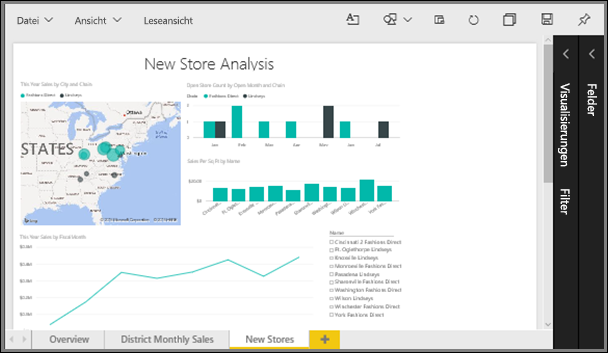
   
   Das sieht besser aus. Nun sind zwar Scrollleisten vorhanden, aber die Details sind einfacher zu lesen.

## Festlegen der Standardansicht für eine Berichtsseite
Power BI-Berichte werden standardmäßig in der Ansicht **An Seite anpassen** angezeigt. Angenommen, Sie möchten diese Berichtsseite immer in der Ansicht **Tatsächliche Größe** anzeigen.

1. Wechseln Sie auf der Seite **Neue Filialen** des Berichts zurück zur Ansicht **Tatsächliche Größe**.
   
   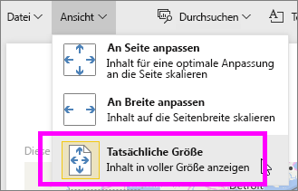
2. Speichern Sie den Bericht über **Datei > Speichern unter** unter einem anderen Namen. Sie verfügen jetzt über zwei Kopien dieses Berichts: Im ursprünglichen Bericht wird **Neue Filialen** in der Standardansicht geöffnet, im neuen Bericht hingegen in der Ansicht **Tatsächliche Größe**. Sehen wir uns das einmal an.
   
   
3. Wählen Sie den Namen des aktuellen Arbeitsbereichs in der oberen Navigationsleiste aus, um zu diesem Arbeitsbereich zurückzuwechseln.  
   
   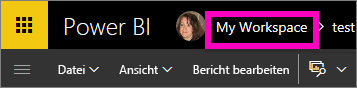
4. Wählen Sie die Registerkarte **Berichte** aus, und wählen Sie den gerade erstellten neuen Bericht aus (mit einem gelben Sternchen markiert).
   
    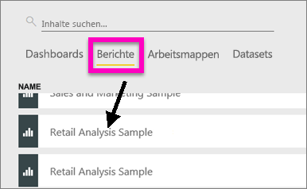
5. Der Bericht wird in der Ansicht **Tatsächliche Größe** geöffnet.
   
   

## Betrachten wir nun die Einstellung *Seitengröße*.
Die Seitengrößeneinstellungen sind nur in der [Bearbeitungsansicht](service-interact-with-a-report-in-editing-view.md) verfügbar. Sie benötigen Besitzerberechtigungen für einen Bericht, um ihn in der Bearbeitungsansicht zu öffnen. Wenn Sie eine Verbindung mit einem der [Beispiele](sample-datasets.md) hergestellt haben, verfügen Sie über Besitzerberechtigungen für diese Berichte.

1. Öffnen Sie die Seite „Monatliche Verkäufe nach Region“ des [Analysebeispiels für den Einzelhandel](sample-retail-analysis.md) in der Bearbeitungsansicht.
2. Stellen Sie sicher, dass im Zeichenbereich keine Visualisierungen ausgewählt sind.  Wählen Sie im Bereich **Visualisierungen** das Farbrollersymbol aus .
3. Wählen Sie **Seitengröße** &gt; **Typ** aus, um die Optionen für die Seitengröße anzuzeigen.
   
   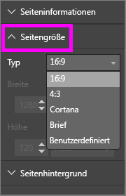
4. Wählen Sie **Brief**.  Nur die Inhalte innerhalb des Formats 816 x 1056 Pixel (Letter-Format) werden im weißen Teil des Zeichenbereichs angezeigt.
   
   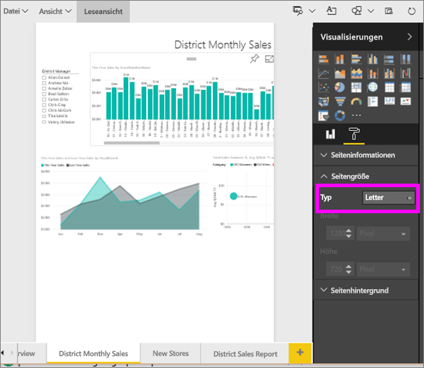
5. Wenn die **Ansicht** in „An Breite anpassen“ geändert wird, wird im Zeichenbereich nur der Seiteninhalt angezeigt, der innerhalb der Briefgröße liegt.
   
   
6. Wählen Sie **Seitengröße** und das Verhältnis **16:9** aus.
   
   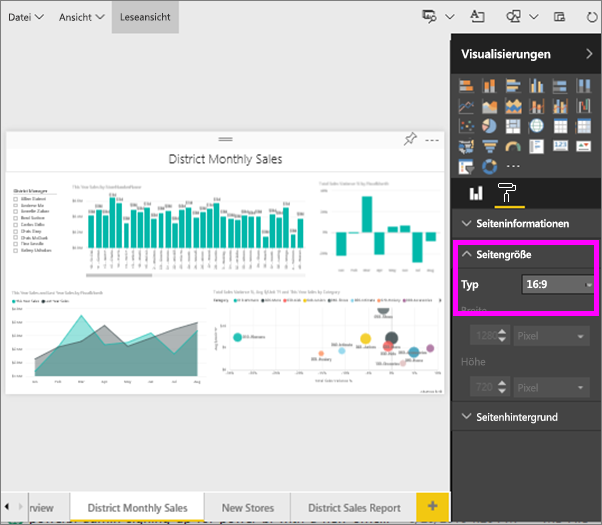
   
   Die Berichtsseite wird mit der Seitenbreite 16 im Verhältnis zur Höhe 9 angezeigt. Die tatsächlich verwendete Pixelgröße wird Ihnen in den abgeblendeten Feldern für Breite und Höhe angezeigt (1280 x 720). Um den Berichtszeichenbereich wird ein leerer Bereich angezeigt, da für die **Ansicht** zuvor „An Breite anpassen“ festgelegt wurde.
7. Lernen Sie die Optionen für **Seitengröße** genauer kennen.

## Gemeinsame Verwendung der Optionen „Ansicht“ und „Seitengröße“
Verwenden Sie die Optionen „Ansicht“ und „Seitengröße“ gemeinsam, um einen Bericht zu erstellen, der besonders übersichtlich ist, wenn er in eine andere Anwendung eingebettet wird.

In dieser Übung erstellen Sie eine Berichtsseite, die in einer Anwendung mit 500 Pixel Breite und 750 Pixel Höhe angezeigt wird.

Aus dem letzten Schritt wissen wir, dass unsere Berichtsseite derzeit mit einer Breite von 1280 Pixel und einer Höhe von 720 Pixel angezeigt wird. Wir müssen also die Größe verändern und die Daten neu anordnen, damit die Visualisierung Platz hat.

1. Ändern Sie die Größe und Position der Visualisierung, sodass sie mit weniger als der Hälfte an Platz verglichen mit dem derzeitigen Zeichenbereich auskommt.
   
    
2. Wählen Sie **Seitengröße** &gt; **Benutzerdefiniert**.
3. Legen Sie die Breite auf 500 und die Höhe auf 750 fest.
   
    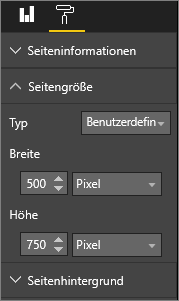
4. Optimieren Sie die Berichtsseite für eine ideale Darstellung. Wechseln Sie zwischen **Ansicht > Tatsächliche Größe** und **Ansicht > An Seite anpassen**, während Sie die Anpassungen vornehmen.
   
    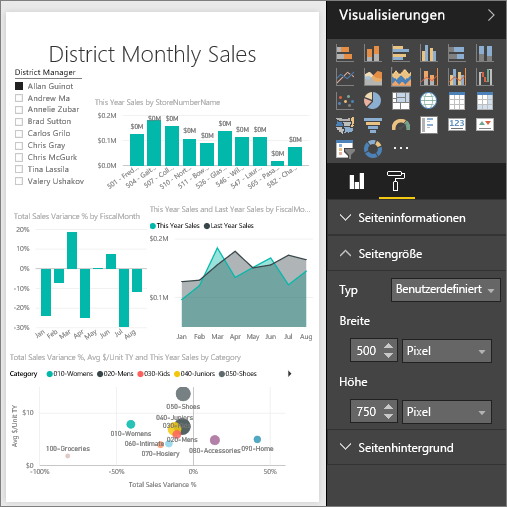

## Nächste Schritte
[Erstellen von Berichten für Cortana](service-cortana-answer-cards.md)

[Einstellungen für die Seitenanzeige in einem Power BI-Bericht](power-bi-report-display-settings.md)

Erfahren Sie mehr über [Berichte in Power BI](service-reports.md).

Weitere Fragen? [Wenden Sie sich an die Power BI-Community](http://community.powerbi.com/)

