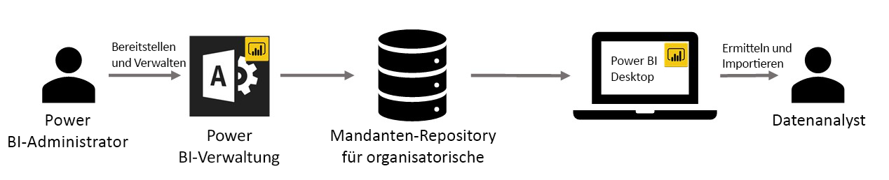

# Verwenden von benutzerdefinierten Visuals für Organisationen in Power BI

Sie können benutzerdefinierte Visuals in Power BI verwenden, um ein einzigartiges Visual zu erstellen, das auf Sie oder die Einblicke in Daten, die Sie übermitteln möchten, angepasst ist. Diese benutzerdefinierten Visuals werden häufig von Entwicklern erstellt. Der Grund dafür ist oft, dass die Visuals, die in Power BI enthalten sind, deren Anforderungen nicht erfüllen. 

In einigen Organisationen sind benutzerdefinierte Visuals sogar noch wichtiger, da sie notwendig sein können, um bestimmte Daten oder Einsichten zu übermitteln, die für die Organisation einzigartig sind. Sie können ebenfalls spezielle Anforderungen für Daten enthalten oder private Geschäftsmethoden hervorheben. Solche Organisationen müssen benutzerdefinierte Visuals entwickeln, diese innerhalb der Organisation freigeben und sicherstellen, dass sie ordnungsgemäß verwaltet werden. Durch benutzerdefinierte Power BI-Visuals können Organisationen dies erreichen.

Die folgende Abbildung stellt den Prozess dar, den benutzerdefinierte Visuals für Organisationen in Power BI durchlaufen. Dieser beginnt beim Administrator, wird in der Entwicklung und Verwaltung fortgesetzt und endet beim Datenanalysten.

Visuals für Organisationen werden vom Power BI-Administrator über das Verwaltungsportal bereitgestellt und verwaltet. Nach der Bereitstellung im Repository der Organisation können die Benutzer in der Organisation diese benutzerdefinierten Visuals für Organisationen einfach ermitteln und direkt über Power BI Desktop in ihre Berichte importieren.

## Verwenden von benutzerdefinierten Visuals für Organisationen

Weitere Informationen zur Verwendung von benutzerdefinierten Visuals für Organisationen in den von Ihnen erstellten Berichten finden Sie im Artikel [Power BI-Verwaltungsportal](power-bi-custom-visuals.md).
 
## Verwalten von benutzerdefinierten Visuals für Organisationen

Weitere Informationen zum Verwalten und Bereitstellen von benutzerdefinierten Visuals für Organisationen innerhalb Ihrer Organisation finden Sie im Artikel [Power BI-Verwaltungsportal](https://go.microsoft.com/fwlink/?linkid=866790).

> [!WARNING]
> Ein benutzerdefiniertes Visual kann Code mit Sicherheits- oder Datenschutzrisiken enthalten. Stellen Sie sicher, dass Sie dem Autor und der Quelle eines benutzerdefinierten Visuals vertrauen können, bevor Sie dieses für das Repository der Organisation bereitstellen. 
> 

## Überlegungen und Einschränkungen
 
Es gibt einige Überlegungen und Einschränkungen, die Sie berücksichtigen müssen.
 
Administrator:

* Veraltete benutzerdefinierte Visuals (z.B. benutzerdefinierte Visuals, die nicht mit den neuen API-Versionen erstellt wurden) werden nicht unterstützt.

* Wenn ein benutzerdefiniertes Visual aus dem Repository gelöscht wird, wird das Rendern aller vorhandenen Berichte beendet, die das gelöschte Visual verwenden. Das Löschen des Visuals aus dem Repository kann nicht rückgängig gemacht werden. Um ein benutzerdefiniertes Visual vorübergehend zu deaktivieren, verwenden Sie die Funktion „Deaktivieren“.
 
Benutzer:

* Die Power BI-Arbeitsbereichssammlung wird für Visuals für Organisationen nicht unterstützt.

* Visio-Visuals, PowerApps-Visuals und GlobeMap-Visuals aus dem AppSource-Marketplace werden nicht gerendert, wenn diese über das Repository der Organisation bereitgestellt wurden.
