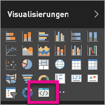

# Problembehandlung bei benutzerdefinierten Power BI-Visuals

## Debuggen

**Pbiviz-Befehl wurde nicht gefunden (oder ähnliche Fehler)**

Wenn Sie `pbiviz` über die Befehlszeile Ihres Terminals ausführen, sollte das Hilfefenster angezeigt werden. Wenn dies nicht der Fall ist, war die Installation fehlerhaft. Stellen Sie sicher, dass Sie mindestens Version 4.0 von NodeJS installiert haben.

**Das Debug-Visual wird nicht auf der Registerkarte „Visualisierungen“ angezeigt**

Die Debug-Visualisierung sieht wie ein Eingabeaufforderungssymbol auf der Registerkarte **Visualisierungen** aus.

Wenn sie nicht angezeigt wird, vergewissern Sie sich, dass Sie sie in den Power BI-Einstellungen aktiviert haben.

> [!NOTE]
> Die Debug-Visualisierung ist derzeit nur im Power BI-Dienst und nicht in Power BI Desktop oder in der mobilen App verfügbar. Die gepackte Visualisierung kann aber überall ausgeführt werden.

**Server für visuelle Elemente kann nicht erreicht werden**

Führen Sie den Server für Visuals mit dem Befehl `pbiviz start` über die Befehlszeile Ihres Terminals im Stammverzeichnis des Visualprojekts aus. Wenn der Server ausgeführt wird, wurden vermutlich die SSL-Zertifikate nicht ordnungsgemäß installiert.

## Nächste Schritte

Weitere Informationen und Antworten auf Fragen finden Sie in den [häufig gestellten Fragen zu benutzerdefinierten Power BI-Visuals](power-bi-custom-visuals-faq.md#organizational-custom-visuals).