# Überblick über den Berichtsbereich „Filter“
In diesem Artikel sehen wir uns den Bereich „Filter“ in Berichten genauer an. Sie sehen den Bereich in der [Leseansicht und Bearbeitungsansicht für Berichte im Power BI-Dienst](service-reading-view-and-editing-view.md) sowie in der [Berichtsansicht in Power BI Desktop](desktop-report-view.md).

Es gibt viele verschiedene Arten von Datenfiltern in Power BI. Lesen Sie den Artikel [Informationen zu Filtern und Hervorhebungen](power-bi-reports-filters-and-highlighting.md).

## Arbeiten mit dem Bereich „Filter“ in Berichten
In Power BI Desktop werden Berichte in der Berichtsansicht geöffnet. Im Power BI-Dienst können Berichte in der [Bearbeitungsansicht oder Leseansicht](service-reading-view-and-editing-view.md) geöffnet werden. In der Bearbeitungs- und Berichtsansicht in Power BI Desktop können Besitzer eines Berichts [einem Bericht Filter hinzufügen](power-bi-report-add-filter.md). Diese Filter werden mit dem Bericht gespeichert. Personen, die den Bericht in der Leseansicht anzeigen, können mit den Filtern interagieren, aber dem Bericht keine neuen Filter hinzufügen.

Im Power BI-Dienst speichern Berichte alle von Ihnen im Bereich „Filter“ vorgenommen Veränderungen, und diese Veränderungen werden in der mobilen Version des Berichts übernommen. Klicken Sie in der oberen Menüleiste auf **Auf Standardwert zurücksetzen**, um den Bereich „Filter“ auf den Standard zurückzusetzen.     

## Öffnen Sie den Bereich „Filter“.
Wenn ein Bericht geöffnet ist, wird der Bereich „Filter“ auf der rechten Seite des Berichtszeichenbereichs angezeigt. Wenn der Bereich nicht angezeigt wird, können Sie ihn mit dem Pfeil in der oberen rechten Ecke erweitern. Wenn Sie sich in der Leseansicht des Power BI-Diensts befinden, ist auf der rechten Seite nur der Bereich „Filter“ verfügbar.

In diesem Beispiel arbeiten wir mit einer Visualisierung mit sechs Filtern. Auch die Berichtsseite verfügt über Filter, die Sie unter der Überschrift **Seitenfilter** finden. Es ist ein [Drillthrough-Filter](power-bi-report-add-filter.md) vorhanden, und der gesamte Bericht weist ebenfalls einen Filter auf: **Geschäftsjahr** ist 2013 oder 2014.

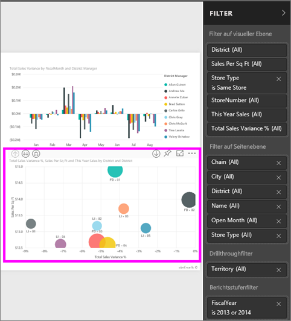

Neben einigen Filtern sehen Sie das Wort **Alle**; dies bedeutet, dass sämtliche Werte in den Filter eingeschlossen werden.  Beispiel: **Kette(Alle)** (siehe Screenshot unten) zeigt an, dass diese Berichtsseite Informationen über alle Ketten enthält.  Andererseits können wir der Angabe **Geschäftsjahr ist 2013 oder 2014** entnehmen, dass der Bericht ausschließlich Informationen aus den Geschäftsjahren 2013 und 2014 umfasst.

Jeder, der den Bericht aufruft, kann auch mit den Filtern interagieren.

* Einzelheiten zum Filter können angezeigt werden, indem mit dem Cursor auf den Pfeil neben dem Filter gezeigt und dieser ausgewählt wird.
  
   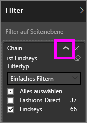
* Sie können den Filter anpassen, indem Sie z.B. **Lindseys** in **Fashions Direct** ändern.
  
     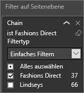

* Setzen Sie die Filter auf ihren Ausgangszustand zurück, indem Sie auf **Auf Standardwert zurücksetzen** in der oberen Menüleiste klicken.    
    
    
* Löschen Sie den Filter, indem Sie das **x** neben dem Filternamen auswählen.
  
  Wenn Sie einen Filter löschen, wird nur der Filter aus der Liste entfernt. Die Informationen des Berichts bleiben selbstverständlich erhalten.  Beispiel: Wenn Sie den Filter **Geschäftsjahr gleich 2013 oder 2014** löschen, bleiben die Informationen zum Geschäftsjahr intakt. Da der Filter entfernt wurde, ist der Bericht dann allerdings nicht mehr auf die Geschäftsjahre 2013 und 2014 eingeschränkt. Vielmehr werden alle Geschäftsjahre, die in den Daten enthalten sind, angezeigt.  Sobald Sie einen Filter löschen, können Sie ihn nicht mehr anpassen, da er aus der Liste entfernt wird. Daher wird empfohlen, den Filter mit dem Radierersymbol  zu löschen.
  
  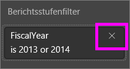

## Filter in der Bearbeitungsansicht
Wenn ein Bericht in Desktop oder der Bearbeitungsansicht des Power BI-Diensts geöffnet ist, wird der Bereich „Filter“ auf der rechten Seite des Berichtszeichenbereichs in der unteren Hälfte des **Bereichs „Visualisierung“** angezeigt. Wenn der Bereich nicht angezeigt wird, können Sie ihn mit dem Pfeil in der oberen rechten Ecke erweitern.

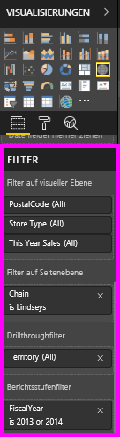.  

Wenn auf der Canvas kein Visual ausgewählt ist, zeigt der Filterbereich nur die Filter an, die für die gesamte Berichtsseite oder den gesamten Bericht gelten, sowie etwaige Drillthroughfilter (sofern diese festgelegt wurden). Im folgenden Beispiel ist kein Visual ausgewählt, und es gibt keine Filter auf Seitenebene oder Drillthroughfilter, dafür aber einen Filter auf Berichtsebene.  

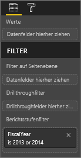  

Wenn eine Visualisierung im Zeichenbereich ausgewählt ist, werden Ihnen auch die Filter angezeigt, die nur für diese Visualisierung gelten:   

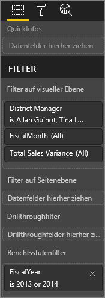

Um die Optionen für einen bestimmten Filter anzuzeigen, wählen Sie neben dem Filternamen den Pfeil nach unten aus.  Im folgenden Beispiel sind für den Filter auf Berichtsebene die Werte 2013 und 2014 festgelegt. Dies ist ein Beispiel für **Standardfilter**.  Um die erweiterten Optionen anzuzeigen, wählen Sie **Erweiterte Filterung** aus.

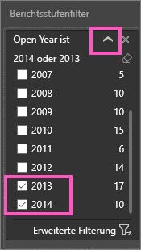

## Löschen eines Filters
 Wählen Sie im erweiterten oder Standardfiltermodus das Radierersymbol  aus, um den Filter zu löschen. 

## Hinzufügen eines Filters
* Fügen Sie in der Bearbeitungsansicht in Desktop und Power BI einem Visual, einer Seite, einem Drillthrough oder einem Bericht einen Filter hinzu. Wählen Sie dazu im Bereich „Felder“ ein Feld aus und ziehen dieses in den entsprechenden Filterbereich mit dem Text **Felder hierher ziehen**. Sobald das Feld als Filter hinzugefügt wurde, können Sie den Filter mit den Steuerelementen „Einfaches Filtern“ und „Erweiterte Filterung“ anpassen (siehe unten).

- **Wenn Sie ein neues Feld auf Ebene der Visuals in den Filterbereich ziehen, wird das Feld nicht dem Visual hinzugefügt**, aber Sie können das Visual anhand dieses neuen Felds filtern. Im Beispiel unten wird der Visualisierung als neuer Filter **Kette** hinzugefügt. Wenn Sie **Kette** als Filter hinzufügen, ändert sich die Visualisierung noch nicht. Dazu müssen Sie erst „Einfaches Filtern“ oder „Erweiterte Filterung“ verwenden.

    

* Alle zum Erstellen einer Visualisierung verwendeten Felder sind ebenfalls als Filter verfügbar. Wählen Sie zuerst eine Visualisierung aus, um sie zu aktivieren. Alle Felder, die in der Visualisierung verwendet werden, sind in den Bereichen „Visualisierungen“ und „Filter“ unter der Überschrift **Filter auf visueller Ebene** aufgelistet.
  
   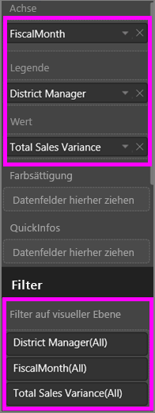  
  
   Jedes dieser Felder kann über die Steuerelemente „Einfaches Filtern“ und „Erweiterte Filterung“ angepasst werden (siehe unten).

## Arten von Filtern: Textfeldfilter
### Listenmodus
Das Aktivieren eines Kontrollkästchens aktiviert oder deaktiviert den Wert. Das Kontrollkästchen **Alle** kann verwendet werden, um den Status aller Kontrollkästchen ein- und auszuschalten. Die Kontrollkästchen stellen die verfügbaren Werte für dieses Feld dar.  Wenn Sie den Filter anpassen, wird er mit Ihrer Auswahl aktualisiert. 

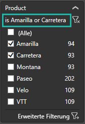

Beachten Sie, das die Anpassung jetzt „ist Amarilla oder Carretera“ angibt.

### Erweiterter Modus
Wählen Sie **Erweiterte Filterung** aus, um in den erweiterten Modus zu wechseln. Verwenden Sie die Dropdownsteuerelemente und Textfelder, um die einzubeziehenden Felder zu identifizieren. Durch die Wahl zwischen **Und** und **Oder**können Sie komplexe Filterausdrücke erstellen. Wählen Sie die Schaltfläche **Filter anwenden** , wenn Sie die Werte wie gewünscht festgelegt haben.  

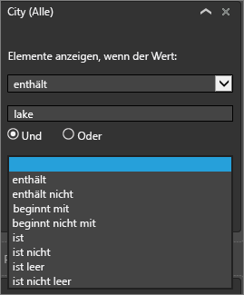

## Arten von Filtern: Nummernfeldfilter
### Listenmodus
Bei endlichen Werten wird beim Auswählen des Feldnamens eine Liste angezeigt.  Unter **Textfeldfilter** &gt; **Listenmodus** oben finden Sie Hilfe zur Verwendung von Kontrollkästchen.   

### Erweiterter Modus
Wenn die Werte unendlich sind oder einen Bereich darstellen, wird beim Auswählen des Feldnamens der erweiterte Filtermodus geöffnet. Verwenden Sie die Dropdownliste und Textfelder, um den Bereich von Werten anzugeben, die Sie anzeigen möchten. 

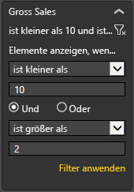

Durch die Wahl zwischen **Und** und **Oder**können Sie komplexe Filterausdrücke erstellen. Wählen Sie die Schaltfläche **Filter anwenden** , wenn Sie die Werte wie gewünscht festgelegt haben.

## Arten von Filtern: Datum und Uhrzeit
### Listenmodus
Bei endlichen Werten wird beim Auswählen des Feldnamens eine Liste angezeigt.  Unter **Textfeldfilter** &gt; **Listenmodus** oben finden Sie Hilfe zur Verwendung von Kontrollkästchen.   

### Erweiterter Modus
Wenn die Feldwerte Datum oder Uhrzeit darstellen, können Sie bei der Verwendung von Datums-/Uhrzeitfiltern eine Start- bzw. Endzeit angeben.  

## Nächste Schritte
[Filter und Hervorhebungen in Berichten](power-bi-reports-filters-and-highlighting.md)  
[Interagieren mit Filtern und Hervorhebungen in der Leseansicht von Berichten](service-reading-view-and-editing-view.md)  
[Erstellen von Filtern in der Bearbeitungsansicht für Berichte](power-bi-report-add-filter.md)  
[Ändern der Kreuzfilterung und -hervorhebung von Berichtsvisualisierungen](service-reports-visual-interactions.md)

Erfahren Sie mehr über [Berichte in Power BI](service-reports.md).  
[Power BI – Grundkonzepte](service-basic-concepts.md)

Weitere Fragen? [Wenden Sie sich an die Power BI-Community](http://community.powerbi.com/)

