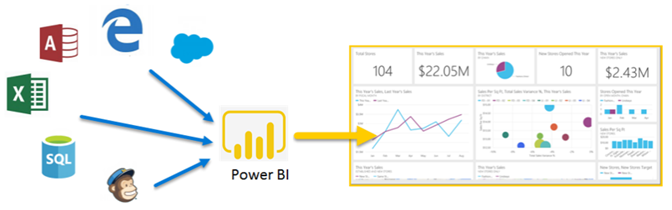
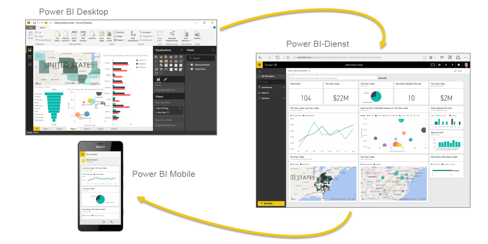
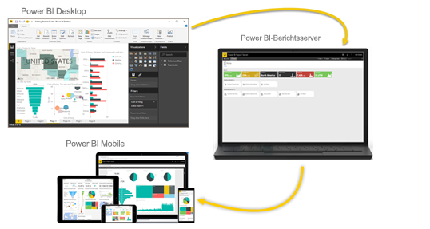

# Was ist Power BI?
**Power BI** ist eine Sammlung von Softwarediensten, Apps und Connectors, die zusammenwirken, um Ihre nicht verbundenen Datenquellen in kohärente, visuell überzeugende und interaktive Einblicke umzuwandeln. Unabhängig davon, ob es sich bei Ihren Daten um ein einfaches Excel-Arbeitsblatt oder eine Sammlung von cloudbasierten und lokalen hybriden Data Warehouses handelt, mit **Power BI** können Sie mühelos und schnell eine Verbindung mit Ihren Datenquellen herstellen, wichtige Daten visualisieren (oder ermitteln) und diese Daten für alle gewünschten Benutzer freigeben.

**Power BI** kann einfach und schnell sein – und Schnelleinblicke aus einem Excel-Arbeitsblatt oder einer lokalen Datenbank erstellen. Aber **Power BI** ist auch stabil und unternehmenstauglich und kann sofort zur umfassenden Modellierung, für Echtzeitanalysen und bei der benutzerdefinierten Entwicklung eingesetzt werden. Somit kann Power BI als persönliches Tool für Berichte und Visualisierungen genutzt werden und darüber hinaus als Engine für Analyse und Entscheidungsfindung für Gruppenprojekte, Abteilungen oder gesamte Unternehmen dienen.

## Komponenten von Power BI
Power BI besteht aus einer Windows-Desktopanwendung mit dem Namen **Power BI Desktop**, einem SaaS-Onlinedienst (*Software-as-a Service*), dem sogenannten **Power BI-Dienst**, und mobilen Power BI-**Apps**, die für Windows-Mobiltelefone und -Tablets sowie für iOS- und Android-Geräte zur Verfügung stehen.

Diese drei Komponenten – **Power BI Desktop**, der **Power BI-Dienst** und **Power BI für mobile Geräte** – wurden entwickelt, damit Benutzer ihren Anforderungen oder ihrer Rolle entsprechend Geschäftseinblicke möglichst effektiv erstellen, freigeben und nutzen können.

## Verwendung von Power BI entsprechend Ihrer Rolle
Wie Sie Power BI verwenden, kann von Ihrer Rolle in einem Projekt oder einem Team abhängen. Und andere Personen in anderen Rollen verwenden Power BI möglicherweise auf andere Weise.

Während Sie beispielsweise in erster Linie den **Power BI-Dienst** nutzen, verwendet ein anderer Mitarbeiter, der viel mit Zahlen arbeitet und Geschäftsberichte erstellt, unter Umständen vorwiegend **Power BI Desktop** (und veröffentlicht Desktop-Berichte im Power BI-Dienst, die Sie dann anzeigen können). Eine andere Mitarbeiterin im Vertrieb verwendet dagegen hauptsächlich die Power BI-App auf ihrem Mobiltelefon, um den Status ihrer Absatzquoten zu überwachen und einen Drilldown in die Details zu neuen potenziellen Interessenten auszuführen.

Wenn Sie Entwickler sind, können Sie Power BI-APIs verwenden, um Daten per Push in Datasets zu übertragen oder um Dashboards und Berichte in Ihre eigenen benutzerdefinierten Anwendungen zu integrieren. Sie haben eine Idee für ein neues Visual? Erstellen Sie es selbst, und geben Sie es für andere frei.  

Möglicherweise verwenden Sie die einzelnen Komponenten von **Power BI** zu unterschiedlichen Zeitpunkten, je nachdem, welche Ziele Sie erreichen möchten oder welche Rolle Ihnen für ein bestimmtes Projekt zugewiesen ist.

Vielleicht zeigen Sie den Bestands- und Herstellungsstatus in einem Echtzeitdashboard im Power BI-Dienst an und verwenden zudem **Power BI Desktop**, um Berichte mit statistischen Angaben zur Kundenbindung für Ihr Team zu erstellen. Wie Sie Power BI verwenden, kann ferner darauf beruhen, welches Feature oder welcher Dienst von Power BI jeweils das am besten geeignete Tool in einer bestimmten Situation ist. Ihnen stehen jedoch immer alle Komponenten von Power BI zur Verfügung – gerade deshalb ist diese Software so flexibel und überzeugend.

Untersuchen Sie Dokumente, die sich auf ihre Rolle beziehen:
- Power BI für [***Designer***](desktop-what-is-desktop.md)
- Power BI für [***Verbraucher***](consumer/end-user-consumer.md)
- Power BI für [***Entwickler***](developer/what-can-you-do.md)
- Power BI für [***Administratoren***](service-admin-administering-power-bi-in-your-organization.md)

## Arbeitsablauf in Power BI
Ein häufiger Workflow in Power BI beginnt mit dem Herstellen einer Verbindung mit Datenquellen und dem Erstellen eines Berichts in **Power BI Desktop**. Dieser Bericht wird dann von **Desktop** im **Power BI-Dienst** veröffentlicht und freigegeben, sodass Benutzer des **Diensts** und **mobiler Funktionen** den Bericht *nutzen* (anzeigen und damit interagieren) können.
In einigen Fällen möchten Sie Kollegen Berechtigungen ähnlich Ihren eigenen erteilen (Berechtigungen als *Ersteller*), damit diese den **Dienst** verwenden können, um Berichte zu bearbeiten, Dashboards zu erstellen und ihre Arbeit ebenfalls für die gemeinsame Nutzung freizugeben.

Diese Vorgehensweise kann nicht immer angewendet werden, obwohl es sich hier um einen der häufigeren Workflows handelt, und sie zeigt, wie die drei Hauptelemente von Power BI einander ergänzen.

Was aber, wenn Sie noch nicht für eine Migration in die Cloud bereit sind und Ihre Berichte hinter einer Unternehmensfirewall speichern möchten?  Lesen Sie weiter.

## Lokale Berichterstellung mit Power BI-Berichtsserver
Mithilfe der zahlreichen sofort einsetzbaren Tools und Dienste von Power BI-Berichtsserver können Sie Power BI-, mobile und paginierte Berichte lokal erstellen, bereitstellen und verwalten.

Power BI-Berichtsserver ist eine Lösung, die Sie hinter Ihrer Firewall bereitstellen. Danach stellen Sie Ihre Berichte den richtigen Benutzern auf unterschiedliche Weise zur Verfügung: in einem Webbrowser, auf einem mobilen Gerät oder per E-Mail. Power BI-Berichtsserver ist mit Power BI in der Cloud kompatibel, sodass Sie jederzeit zur Cloud wechseln können.

## Nächste Schritte
[Melden Sie sich an, rufen Sie Daten ab, und lernen Sie den Power BI-Dienst kennen.](service-the-new-power-bi-experience.md)   
[Erste Schritte mit dem Power BI-Dienst (app.powerbi.com)](service-get-started.md)
