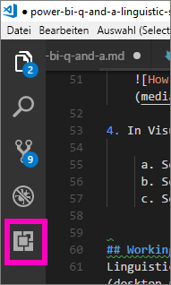
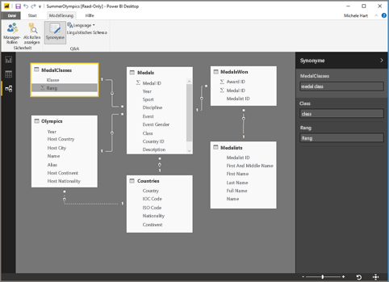
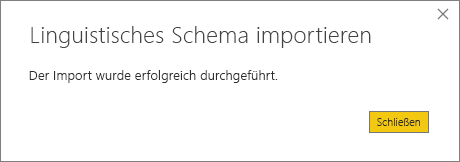

# <a name="language-modeling-and-the-linguistic-schema"></a>Sprachmodellierung und das linguistische Schema 
Indem Sie gängige Ausdrücke und natürliche Sprache verwenden, können Sie Ihre Daten effizient auswerten. Wenn die Daten Ihnen dann noch Antworten liefern, sind sie noch leistungsfähiger – und genau das ist mit Q&A in Power BI möglich. Wenn Sie Power BI eine Frage stellen, bemüht sich das Programm, diese richtig zu beantworten. 

Doch für noch bessere Q&A-Interaktionen gibt es Möglichkeiten, die Antworten zu verbessern. Eine davon ist die Bearbeitung des linguistischen Schemas. 

Alles beginnt mit Ihren Unternehmensdaten.  Je besser das Datenmodell, desto einfacher ist es für Benutzer, qualitativ hochwertige Antworten zu erhalten. Eine Möglichkeit zur Verbesserung des Modells besteht darin, ein linguistisches Schema hinzuzufügen, das Terminologie und Beziehungen zwischen Tabellen- und Spaltennamen in Ihrem Dataset definiert und kategorisiert. Ihre linguistischen Schemas verwalten Sie mit Power BI Desktop. 

## <a name="what-is-a-linguistic-schema"></a>Was ist ein linguistisches Schema?
Ein linguistisches Schema beschreibt Begriffe und Satzglieder, die Q&A für Objekte innerhalb eines Datasets verstehen soll, einschließlich Wortarten, Synonymen und Ausdrücken, die sich auf dieses Dataset beziehen. Beim Importieren oder Verbinden mit einem Dataset erstellt Power BI ein linguistisches Schema, das auf der Struktur des Datasets basiert. Wenn Sie Q&A eine Frage stellen, wird nach Übereinstimmungen und Beziehungen in den Daten gesucht, um die Absicht Ihrer Frage herauszufinden. Beispielsweise wird nach Nomen, Verben, Adjektiven, Ausdrücken und anderen Elementen gesucht. Außerdem wird nach Beziehungen gesucht, z.B. welche Spalten Objekte eines Verbs sind. 

Sie sind wahrscheinlich mit Wortarten vertraut (falls nicht, siehe unten), aber Ausdrücke könnten hier in dieser Form ein neuer Begriff für Sie sein.  Ein Ausdruck beschreibt das, wie Sie über die Beziehungen zwischen Dingen reden (bzw. diese „ausdrücken“). Um beispielsweise die Beziehung zwischen Kunden und Produkten zu beschreiben, könnten Sie sagen: „Kunden kaufen Produkte“. Oder um die Beziehung zwischen Kunden und Alter zu beschreiben, könnten Sie sagen: „Das Lebensalter gibt an, wie alt Kunden sind“. Um die Beziehung zwischen Kunden und Telefonnummern zu beschreiben, könnten Sie einfach sagen: „Kunden haben Telefonnummern“.

Diese Ausdrücke gibt es in verschiedenen Formen und Ausprägungen. Einige entsprechen Beziehungen im Datenmodell direkt. Einige setzen Spalten mit Tabellen in Beziehung, in denen sie enthalten sind. Andere verknüpfen mehrere Tabellen und Spalten in komplexen Beziehungen. In allen Fällen beschreiben sie Zusammenhänge mit alltäglichen Begriffen.

Linguistische Schemas werden im YAML-Format gespeichert. Dieses Format ist mit dem sehr beliebten JSON-Format verwandt, bietet aber eine flexiblere und leichter lesbare Syntax. Linguistische Schemas können bearbeitet, exportiert und in Power BI Desktop importiert werden.

## <a name="prerequisites"></a>Voraussetzungen
- Wenn Sie den Artikel [Verwenden von Q&A in Power BI Desktop für Abfragen in natürlicher Sprache](desktop-qna-in-reports.md) noch nicht gelesen haben, sollten Sie diesen Artikel zuerst lesen. Er enthält zahlreiche Tipps zur Gestaltung und Verbesserung Ihres Datenmodells und einen wichtigen Abschnitt zum Hinzufügen von Synonymen.  

- Bei Q&A gibt es zwei Seiten.  Der erste Teil ist die Vorbereitung, die „Modellierung“.  Die zweite Seite ist das Stellen von Fragen und Erkunden der Daten, die „Nutzung“. In einigen Unternehmen können Mitarbeiter, die als Datenmodellierer oder IT-Administratoren fungieren, die Datasets zusammenstellen, die Datenmodelle erstellen und die Datasets in Power BI veröffentlichen.  Zur zweiten Gruppe gehören Mitarbeiter, die die Daten online „nutzen“.  In anderen Unternehmen werden diese Rollen ggf. kombiniert. 

    Diese Thema richtet sich an Datenmodellierer. Also an die Mitarbeiter, die ein Dataset wählen und optimieren, um die bestmöglichen Q&A-Ergebnisse zu erzielen. 

- [YAML- und PBIX-Beispieldateien](https://go.microsoft.com/fwlink/?linkid=871858)    
- YAML-Datei-Editor, wir empfehlen [Visual Studio Code](https://code.visualstudio.com/)


### <a name="set-up-an-editor-for-yaml-files"></a>Einrichten eines Editors für YAML-Dateien
Wir empfehlen, linguistische Schemadateien mit der Erweiterung YAML mit Visual Studio Code zu bearbeiten. Visual Studio Code unterstützt standardmäßig YAML-Dateien und kann erweitert werden, um das linguistische Schemaformat von Power BI gezielt zu validieren.
1. Installieren Sie [Visual Studio Code](https://code.visualstudio.com/).    

2. Wählen Sie das linguistische Beispielschema aus, das Sie zuvor gespeichert haben: [YAML-Datei](https://go.microsoft.com/fwlink/?linkid=871858) (SummerOlympics.lsdl.yaml).    
4. Wählen Sie **Visual Studio Code** und **Always use this app to open .yaml files** (Immer diese App verwenden, um YAML-Dateien zu öffnen) aus.

    

4. Installieren Sie in Visual Studio Code die Erweiterung „YAML Support by Red Hat“.

   

    a. Wählen Sie die Registerkarte **Erweiterungen** (die letzte auf der linken Seite) aus, oder drücken Sie STRG+UMSCHALT+X.    
        
    b. Suchen Sie nach „yaml“, und wählen Sie in der Liste **YAML Support by Red Hat** aus.    
    c. Klicken Sie auf **Installieren > Neu laden**.


## <a name="working-with-linguistic-schemas"></a>Arbeiten mit linguistischen Schemas
Linguistische Schemas können in Power BI Desktop in der Ansicht [Beziehung](desktop-relationship-view.md) bearbeitet, importiert und exportiert werden. Eine Möglichkeit, ein linguistisches Schema zu bearbeiten, besteht darin, [Synonyme dem Bereich **Synonyme** hinzuzufügen](desktop-qna-in-reports.md). Dabei wird die YAML-Datei nicht geöffnet.




 Die andere Möglichkeit, ein linguistisches Schema zu bearbeiten, besteht darin, die YAML-Datei direkt zu exportieren und zu bearbeiten.  Wenn Sie eine YAML-Datei eines linguistischen Schemas bearbeiten, kennzeichnen Sie Spalten in der Tabelle als unterschiedliche grammatische Elemente und legen Wörter fest, die ein Kollege verwenden könnte, um eine Frage zu formulieren. Sie geben beispielsweise die Spalten an, die das Subjekt und das Objekt des Verbs sind, und Sie fügen alternative Wörter hinzu, die Kollegen verwenden können, um auf Tabellen, Spalten und Maße in Ihrem Modell zu verweisen. 


Bevor Sie ein linguistisches Schema bearbeiten können, müssen Sie es in Power BI Desktop öffnen (exportieren). Wenn Sie die YAML-Datei zurück an den gleichen Speicherort speichern, gilt dies als Importieren.  Sie können stattdessen aber auch andere YAML-Dateien importieren.  Angenommen, Sie haben ein ähnliches Dataset und bereits viel Arbeit in das Hinzufügen von Wortarten, das Bestimmen von Beziehungen sowie das Erstellen von Ausdrücken und Synonymen investiert. 

Q&A nutzt all diese Informationen zusammen mit allen Verbesserungen, die Sie vornehmen, um eine bessere Antwort, automatische Vervollständigung und Zusammenfassung der Fragen zu liefern.


## <a name="edit-a-linguistic-schema"></a>Bearbeiten eines linguistischen Schemas
Wenn Sie Ihr linguistisches Schema erstmals in Power BI Desktop exportieren, werden die meisten oder alle Inhalte der Datei automatisch vom Q&A-Modul generiert. Diese generierten Entitäten, Wörter (Synonyme), Beziehungen und Ausdrücke werden mit dem Tag **State: Generated** gekennzeichnet und sind in der Datei meist zu Informationszwecken enthalten, können aber ein nützlicher Ausgangspunkt für eigene Änderungen sein. 

> [!NOTE]
> Die in diesem Tutorial enthaltene YAML-Beispieldatei enthält nicht die Tags **State:Generated** oder **State:Deleted**, da sie speziell für dieses Tutorial vorbereitet wurde. Um diese Tags zu sehen, öffnen Sie eine unbearbeitete PBIX-Datei in der Ansicht „Beziehung“ und exportieren das linguistische Schema.


Wenn Sie Ihre linguistische Schemadatei wieder in Power BI Desktop importieren, wird alles, was mit **State: Generated** gekennzeichnet ist, tatsächlich ignoriert (und später neu generiert). Wenn Sie also eine Änderung an einigen generierten Inhalten vornehmen möchten, müssen Sie auch das entsprechende Tag **State: Generated** entfernen. Wenn Sie einige generierte Inhalte entfernen möchten, müssen Sie das Tag **State: Generated** in **State: Deleted** ändern, damit es nicht neu generiert wird, sobald Sie Ihre linguistische Schemadatei importieren.

1. Öffnen Sie das Dataset in der Power BI Desktop-Ansicht *Beziehung*. 
2. Wählen Sie die Registerkarte **Modellierung** aus, und klicken Sie auf **Linguistisches Schema exportieren**.
3. Wählen Sie Visual Studio Code (oder einen anderen Editor) aus.
4. Nehmen Sie Ihre Bearbeitungen vor, und speichern Sie die YAML-Datei.
5. Wählen Sie in Power BI Desktop **Ansicht „Beziehung“ > Registerkarte „Modellierung“ > Linguistisches Schema > Linguistisches Schema importieren** aus.
6. Navigieren Sie zum Speicherort der bearbeiteten YAML-Datei, und wählen Sie sie aus. Eine Erfolgsmeldung lässt Sie wissen, dass die YAML-Datei des linguistischen Schemas erfolgreich importiert wurde.

    

### <a name="add-phrasings-to-the-linguistic-schema"></a>Hinzufügen von Ausdrücken zum linguistischen Schema
Ein Ausdruck beschreibt das, wie Sie über die Beziehungen zwischen Dingen reden (bzw. diese „ausdrücken“). Um beispielsweise die Beziehung zwischen Kunden und Produkten zu beschreiben, könnten Sie sagen: „Kunden kaufen Produkte“. Oder um die Beziehung zwischen Kunden und Alter zu beschreiben, könnten Sie sagen: „Das Lebensalter gibt an, wie alt Kunden sind“. Oder um die Beziehung zwischen Sportlern und Medaillen zu beschreiben, könnten Sie einfach sagen: „Sportler gewinnen Medaillen“.

Diese Ausdrücke gibt es in verschiedenen Formen und Ausprägungen. Einige entsprechen Beziehungen im semantischen Modell direkt. Einige setzen Spalten mit Tabellen in Beziehung, in denen sie enthalten sind. Andere verknüpfen mehrere Tabellen und Spalten in komplexen Beziehungen. In allen Fällen beschreiben sie Zusammenhänge mit alltäglichen Begriffen.

## <a name="where-do-phrasings-come-from"></a>Woher stammen Ausdrücke?
Viele einfache Ausdrücke werden dem linguistischen Schema automatisch hinzugefügt, und zwar basierend auf der Struktur des Modells und einigen Vermutungen über Spaltennamen. Beispiel:
- Die meisten Spalten werden durch einen einfachen Ausdruck wie „Produkte haben Beschreibungen“ mit der Tabelle in Beziehung gesetzt, die sie enthält.
- Modellbeziehungen resultieren in Standardausdrücken für beide Richtungen der Beziehung wie „Bestellungen haben Produkte“ und „Produkte haben Bestellungen“.
- Einige Modellbeziehungen können basierend auf ihren Spaltennamen einen komplexeren Standardausdruck wie „Bestellungen werden an Städte geliefert“ erhalten.

Es gibt viele Möglichkeiten, wie Ihre Benutzer über Dinge reden, die Q&A jedoch nicht erraten kann. Hierfür können Sie Ihre eigenen Ausdrücke manuell hinzufügen.


## <a name="why-should-i-add-phrasings"></a>Warum sollte ich sollte ich Ausdrücke hinzufügen?
Der erste Grund für das Hinzufügen eines Ausdrucks ist die Definition eines neuen Begriffs. Wenn Sie z.B. „die ältesten Kunden auflisten“ möchten, müssen Sie Q&A zunächst erläutern, was Sie mit „alt“ meinen. Dazu müssen Sie einen Ausdrucks wie „Das Lebensalter gibt an, wie alt die Kunden sind“ hinzufügen.

Der zweite Grund für das Hinzufügen einer Formulierung ist die Beseitigung von Unklarheiten. Mit der einfachen Stichwortsuche kommen Sie nicht weit, wenn Wörter mehr als eine Bedeutung haben. Zum Beispiel bedeutet „Flüge nach Köln“ etwas ganz anderes als „Flüge ab Köln“, aber Q&A weiß nicht, was Sie meinen, wenn Sie nicht die Ausdrücke „Flüge gehen von Abflugorten ab“ und „Flüge kommen an Ankunftsorten an“ hinzufügen. Ebenso wird die Unterscheidung zwischen „Autos, die Johann Marie verkauft hat“ und „Autos, die Johann von Maria gekauft hat“ erst verstanden, wenn Sie die Ausdrücke „Kunden kaufen Autos von Mitarbeitern“ und „Mitarbeiter verkaufen Kunden Autos“ hinzufügen.

Der letzte Grund für das Hinzufügen eines Ausdrucks ist die Verbesserung von Neuformulierungen. Anstatt dass Q&A „Die Kunden und ihre Produkte zeigen“ an Sie zurückgibt, wäre es klarer, wenn es sagen würde „Die Kunden und die Produkte, die sie gekauft haben“ oder „Die Kunden und die Produkte, die sie bewertet haben“, je nachdem, wie es die Frage verstanden hat. Das Hinzufügen benutzerdefinierter Ausdrücke ermöglicht eine deutlichere und eindeutigere Neuformulierung.


## <a name="what-kinds-of-phrasings-are-there"></a>Welche Arten von Ausdrücken gibt es?
Um die verschiedenen Typen von Ausdrücken zu verstehen, wollen wir zunächst ein paar sehr einfache Grammatikbegriffe auffrischen:
- Ein *Nomen* ist eine Person, ein Ort oder eine Sache. 
    - Beispiele: Auto, Teenager, Marty, Fluxkompensator
- Ein *Verb* ist eine Handlung oder ein Daseinszustand. 
    - Beispiele: brüten, zerspringen, verschlingen, herauswerfen
- Ein *Adjektiv* ist ein beschreibendes Wort, das ein Nomen modifiziert. 
    - Beispiele: leistungsstark, magisch, golden, gestohlen
- Eine *Präposition* ist ein Wort, das vor einem Nomen verwendet wird, um es mit einem vorangehenden Nomen, Verb oder Adjektiv in Beziehung zu setzen. 
    - Beispiele: von, für, bei, auf
-  Ein *Attribut* ist eine Eigenschaft oder ein Merkmal von etwas.
-  Ein *Name* ist ein Wort oder eine Wortgruppe zum Benennen von oder Verweisen auf eine Person, ein Tier, einen Ort oder eine Sache.   


## <a name="attribute-phrasings"></a>Attributausdrücke
Attributausdrücke sind das Hauptarbeitsmittel von Q&A, das verwendet wird, wenn eine Sache als Attribut einer anderen Sache fungiert. Sie sind einfach, unkompliziert und leisten die meiste Arbeit, wenn kein feinerer, detaillierterer Ausdruck definiert wurde. Attributausdrücke werden mit dem Basisverb „haben“ („Produkte haben Kategorien“ und „Gastgeberländer haben Gastgeberstädte“) beschrieben und erlauben automatisch auch, Fragen mit den Präpositionen „von“ und „für“ („Kategorien von Produkten“, „Aufträge für Produkte“) und besitzanzeigend („Johanns Aufträge“) zu stellen. In Fragen wie diesen werden Attributausdrücke verwendet:
- Welche Kunden haben Aufträge?
- Gastgeberstädte nach Land aufsteigend auflisten
- Aufträge anzeigen, die Chai enthalten
- Kunden mit Aufträgen auflisten
- Was ist die Kategorie jedes Produkts?
- Aufträge von Robert König zählen    

Die überwiegende Mehrheit der in Ihrem Modell benötigten Attributausdrücke wird automatisch basierend auf dem Tabellen-/Spalteninhalt und Modellbeziehungen generiert, sodass Sie diese in der Regel nicht selbst erstellen müssen.
Dies ist ein Beispiel eines Attributausdrucks im linguistischen Schema:

```json
product_has_category:
  Binding: {Table: Products}
  Phrasings:
  - Attribute: {Subject: product, Object: product.category}
```
 
## <a name="name-phrasings"></a>Namensausdrücke
Namensausdrücke sind hilfreich, wenn Ihr Datenmodell eine Tabelle enthält, die benannte Objekte wie Sportler- und Kundennamen enthält. Beispielsweise ist der Ausdruck „Produktnamen sind Namen von Produkten“ unerlässlich, um Produktnamen in Fragen verwenden zu können. Während Namensausdrücke auch „namens“ als Attribut (z.B. „Kunden namens Johann Schmitz“) ermöglichen, ist es besonders wichtig, dass in Verbindung mit anderen Ausdrücken ein Namenswert verwendet werden kann, um auf eine bestimmte Tabellenzeile zu verweisen. Bei „Kunden, die Chai gekauft haben“ kann Q&A beispielsweise erkennen, dass sich der Wert „Chai“ auf die gesamte Zeile der Produkttabelle bezieht und nicht nur auf einen Wert in der Spalte mit dem Produktnamen. In Fragen wie diesen werden Namensausdrücke verwendet:    
- Welche Mitarbeiter heißen Robert König
- Wer heißt Ernst Handel
- Sportarten von Fernand De Montigny
- Anzahl der Sportler namens Marie
- Was hat Robert König gekauft?

Wenn Sie eine sinnvolle Namenskonvention für die Namensspalten im Modell gewählt haben (z.B. „Name“ oder "Produktname“ anstatt „PrdNm“), wird die Mehrzahl der in Ihrem Modell benötigten Namensausdrücke automatisch generiert, sodass Sie diese in der Regel nicht selbst erstellen müssen.

Dies ist ein Beispiel eines Namensausdrucks im linguistischen Schema:

```json
employee_has_name:
  Binding: {Table: Employees}
  Phrasings:
  - Name:
      Subject: employee
      Name: employee.name
```

 
## <a name="adjective-phrasings"></a>Adjektivausdrücke
Adjektivausdrücke definieren neue Adjektive, die Objekte in Ihrem Modell beschreiben. Beispiel: Der Ausdruck „Zufriedene Kunden sind Kunden mit einer Bewertung > 6“ ist nötig, um Fragen wie „Zufriedene Kunden in Düsseldorf auflisten“ zu stellen. Es gibt mehrere Typen von Adjektivausdrücken zur Verwendung in der jeweiligen Situation.

*Einfache Adjektivausdrücke* definieren ein neues Adjektiv auf Grundlage einer Bedingung, beispielsweise „Eingestellte Produkte sind Produkte mit dem Status = D“. In Fragen wie diesen werden einfache Adjektivausdrücke verwendet:
- Welche Produkte wurden eingestellt?
- Eingestellte Produkte auflisten
- Goldmedaillengewinner auflisten
- Produkte mit Lieferrückstand

Dies ist ein Beispiel eines einfachen Adjektivausdrucks im linguistischen Schema: product_is_discontinued:

```json
Binding: {Table: Products}
  Conditions:
  - Target: product.discontinued
    Operator: Equals
    Value: true
  Phrasings:
  - Adjective:
      Subject: product
      Adjectives: [discontinued]
```

*Maß-Adjektivausdrücke* definieren ein neues Adjektiv basierend auf einem numerischen Wert, der angibt, inwieweit das Adjektiv gilt, z.B. „Längen geben an, wie lang Flüsse sind“ und „Kleine Länder haben kleine Landflächen“. In Fragen wie diesen werden Maß-Adjektivausdrücke verwendet:
- Lange Flüsse auflisten
- Welche Flüsse sind am längsten?
- Die kleinsten Länder auflisten, die Gold im Handball gewonnen haben
- Wie lang ist der Rhein?

Dies ist ein Beispiel eines Maß-Adjektivausdrucks im linguistischen Schema: river_has_length:

 ```json
Binding: {Table: Rivers}
  Phrasings:
  - Adjective:
      Subject: river
      Adjectives: [long]
      Antonyms: [short]
      Measurement: river.length
```

*Dynamische Adjektivausdrücke* definieren einen Satz neuer Adjektive basierend auf Werten in einer Spalte im Modell, beispielsweise „Farben beschreiben Produkte“ und „Wettkämpfe haben Wettkampfsgeschlechter“. In Fragen wie diesen werden dynamische Adjektivausdrücke verwendet:
- Rote Produkte auflisten
- Welche Produkte sind grün?
- Eislaufwettbewerbe für Frauen anzeigen
- Aktive Probleme zählen

Dies ist ein Beispiel eines dynamischen Adjektivausdrucks im linguistischen Schema: product_has_color:
```json
Binding: {Table: Products}
  Phrasings:
  - DynamicAdjective:
      Subject: product
      Adjective: product.color
```

 
## <a name="noun-phrasings"></a>Nomenausdrücke
Nomenausdrücke definieren neue Nomen, die Teilmengen von Objekten in Ihrem Modell beschreiben. Sie enthalten oft eine Art modellspezifischer Messgröße oder Bedingung. Zum Beispiel können wir für unser Olympia-Modell Ausdrücke hinzufügen, um Champions von Medaillengewinnern, Ballsportarten von Wassersportarten, Mannschaften von Einzelsportlern, Alterskategorien von Athleten (Jugendliche, Erwachsene, Senioren) usw. zu unterscheiden. Für unsere Filmdatenbank können wir Nomenausdrücke für „Flops sind Filme mit einem Reingewinn < 0“ hinzufügen, damit wir Fragen wie „Flops nach Jahr zählen“ stellen können. Es gibt zwei Formen von Nomenausdrücken zur Verwendung in der jeweiligen Situation.

*Einfache Nomenausdrücke* definieren ein neues Nomen basierend auf einer Bedingung, wie z.B. „Auftragnehmer sind Mitarbeiter, bei denen Vollzeit = falsch" und „Champion ist Sportler mit einer Anzahl von Medaillen > 5“. In Fragen wie diesen werden einfache Nomenausdrücke verwendet:

- Welche Mitarbeiter sind Auftragnehmer?
- Auftragnehmer in Berlin zählen
- Wie viele Champions 2016

Dies ist ein Beispiel eines einfachen Nomenausdrucks im linguistischen Schema: employee_is_contractor:

```json
Binding: {Table: Employees}
  Conditions:
  - Target: employee.full_time
    Operator: Equals
    Value: false
  Phrasings:
  - Noun:
      Subject: employee
      Nouns: [contractor]
```

*Dynamische Nomenausdrücke* definieren einen Satz neuer Nomen basierend auf Werten in einer Spalte im Modell, beispielsweise „Berufe definieren Teilmengen von Mitarbeitern“. In Fragen wie diesen werden dynamische Nomenausdrücke verwendet:

- Kassierer in Köln auflisten
- Welche Mitarbeiter sind Baristas?
- Schiedsrichter 1992 auflisten

Dies ist ein Beispiel eines dynamischen Nomenausdrucks im linguistischen Schema: employee_has_job:

 ```json
Binding: {Table: Employees}
  Phrasings:
  - DynamicNoun:
      Subject: employee
      Noun: employee.job
```

## <a name="preposition-phrasings"></a>Präpositionsausdrücke
Präpositionsausdrücke dienen zum Beschreiben, wie Objekte in Ihrem Modell über Präpositionen zusammenhängen. Beispielsweise verbessert der Ausdruck „Städte sind in Ländern“ das Verständnis für Fragen wie „Städte in NRW zählen“. Einige Präpositionsausdrücke werden automatisch erstellt, wenn eine Spalte als geografische Entität erkannt wird. In Fragen wie diesen werden Präpositionsausdrücke verwendet:

- Kunden in New York zählen
- Bücher über Linguistik auflisten
- In welcher Stadt befindet sich Johann Müller?
- Wie viele Bücher sind von Stephen Queen?
 
Dies ist ein Beispiel eines Präpositionsausdrucks im linguistischen Schema: customers_are_in_cities:

 ```json
Binding: {Table: Customers}
  Phrasings:
  - Preposition:
      Subject: customer
      Prepositions: [in]
      Object: customer.city
```

 
## <a name="verb-phrasings"></a>Verbausdrücke
Verbausdrücke dienen zum Beschreiben, wie Objekte in Ihrem Modell über Verben zusammenhängen. Zum Beispiel verbessert der Ausdruck „Kunden kaufen Produkte“ das Verständnis für Fragen wie „Wer hat Käse gekauft?“ und „Was hat Johann gekauft?“. Verbausdrücke sind die flexibelsten aller Arten von Ausdrücken, die oft mehr als zwei Dinge miteinander in Beziehung setzen, wie z.B. in „Mitarbeiter verkaufen Kunden Produkte“. In Fragen wie diesen werden Verbausdrücke verwendet:

- Wer hat was wem verkauft?
- Welcher Mitarbeiter hat Johann Chai verkauft?
- Wie viele Kunden haben Chai von Marie gekauft?
- Produkte auflisten, die Marie Johann verkauft hat
- Welche eingestellten Produkte wurden Kunden aus Köln von Mitarbeitern in Berlin verkauft?

Verbausdrücke können auch Präpositionsausdrücke enthalten und damit ihre Flexibilität erhöhen, z.B. bei „Sportler gewinnen Medaillen bei Wettkämpfen“ oder „Kunden erhalten Rückerstattungen für Produkte“. In Fragen wie diesen werden Verbausdrücke mit Präpositionsausdrücken verwendet:

- Wie viele Sportler haben eine Goldmedaille beim Alpencup gewonnen?
- Welche Kunden haben eine Rückerstattung für Käse erhalten?
- Bei welchem Wettkampf hat Daniel Ley eine Bronzemedaille gewonnen?

Einige Verbausdrücke werden automatisch erstellt, wenn erkannt wird, dass eine Spalte sowohl ein Verb als auch eine Präposition enthält.

Dies ist ein Beispiel eines Verbausdrucks im linguistischen Schema: customers_buy_products_from_salespeople:

```json
Binding: {Table: Orders}
  Phrasings:
  - Verb:
      Subject: customer
      Verbs: [buy, purchase]
      Object: product
      PrepositionalPhrases:
      - Prepositions: [from]
        Object: salesperson
```

## <a name="relationships-with-multiple-phrasings"></a>Beziehungen mit mehreren Ausdrücken
Häufig kann eine einzelne Beziehung auf mehrere Arten beschrieben werden. In diesem Fall kann eine einzelne Beziehung mehr als einen Ausdruck aufweisen. Es ist durchaus üblich, dass die Beziehung zwischen einer Tabellen- und einer Spaltenentität sowohl einen Attributausdruck als auch einen anderen Ausdruck besitzt. In der Beziehung zwischen Kunde und Kundenname wünschen Sie sich beispielsweise sowohl einen Attributausdruck (z.B. „Kunden haben Namen“) als auch einen Namensausdruck (z.B. „Kundennamen sind die Namen von Kunden“), damit Sie beide Arten von Fragen stellen können.

Dies ist ein Beispiel einer Beziehung mit zwei Ausdrücken im linguistischen Schema: customer_has_name:

  ```json
Binding: {Table: Customers}
  Phrasings:
    - Attribute: {Subject: customer, Object: customer.name}
    - Name:
        Subject: customer
        Object: customer.name
```

Ein weiteres Beispiel ist das Hinzufügen des alternativen Ausdrucks „Mitarbeiter verkaufen Kunden Produkte“ zur Beziehung „Kunden kaufen Produkte von Mitarbeitern“. Beachten Sie, dass Sie keine Varianten wie "Mitarbeiter verkaufen Produkte **an Kunden**" oder "Produkte werden an Kunden **von Mitarbeitern** verkauft" hinzufügen müssen, da die Varianten "an" und "von" des Subjekts und des indirekten Objekts automatisch von Q&A hergeleitet werden.

## <a name="considerations-and-troubleshooting"></a>Zu beachtende Aspekte und Problembehandlung
Wenn Sie eine Änderung an einer Datei des Typs „.lsdl.yaml“ vornehmen, die nicht dem Format des linguistischen Schemas entspricht, werden nun Validierungssymbole wie diese angezeigt, um Probleme anzuzeigen: 

    


Weitere Fragen? [Wenden Sie sich an die Power BI-Community](http://community.powerbi.com/)
