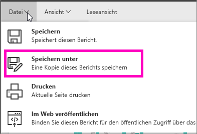
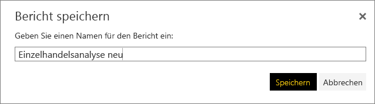
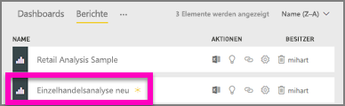

# Erstellen eines neuen Berichts aus einem vorhandenen Bericht (Kopieren eines Berichts)
Möglicherweise verfügen Sie über einen Bericht, der bereits eine Verbindung zu Ihren Daten aufgebaut hat und einige Visualisierungen enthält, die Sie wiederverwenden oder ändern möchten.  Warum kopieren Sie diesen Bericht nicht einfach und nutzen ihn als Grundlage für einen neuen Bericht?  Dazu müssen Sie Folgendes tun:

1. [Öffnen Sie einen Bericht](service-report-open.md).
2. Wählen Sie im Menü **Datei****Speichern unter**.
   
   
3. Geben Sie einen Namen für den neuen Bericht ein und wählen Sie **Speichern**.
   
   
   
   In einer Erfolgsmeldung werden Sie darüber informiert, dass der neue Bericht in Ihrem aktuellen Arbeitsbereich in Power BI gespeichert wurde.
   
   
4. Öffnen Sie die Registerkarte **Berichte** in Ihrem Arbeitsbereich, und wählen Sie den neuen Bericht aus, um ihn zu öffnen. Löschen Sie optional die Visualisierungen die Sie nicht behalten möchten, ändern Sie andere Visualisierungen und fügen Sie neue hinzu.
   
   
5. Viel Spaß beim Aktualisieren und Bearbeiten des neuen Berichts.

## Nächste Schritte:
[Erstellen neuer Visualisierungen](visuals/power-bi-report-add-visualizations-ii.md)

[Löschen von Visualisierungen](service-delete.md), die Sie nicht benötigen

[Create a report using Power BI Desktop (Erstellen eines Berichts in Power BI Desktop)](desktop-report-view.md)
