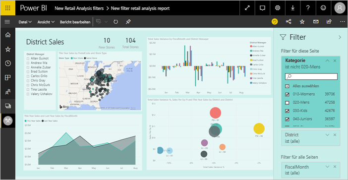
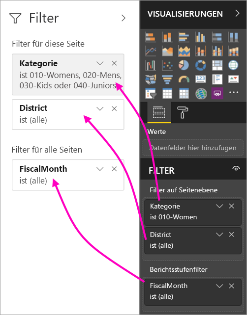
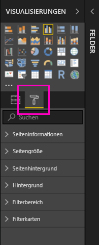
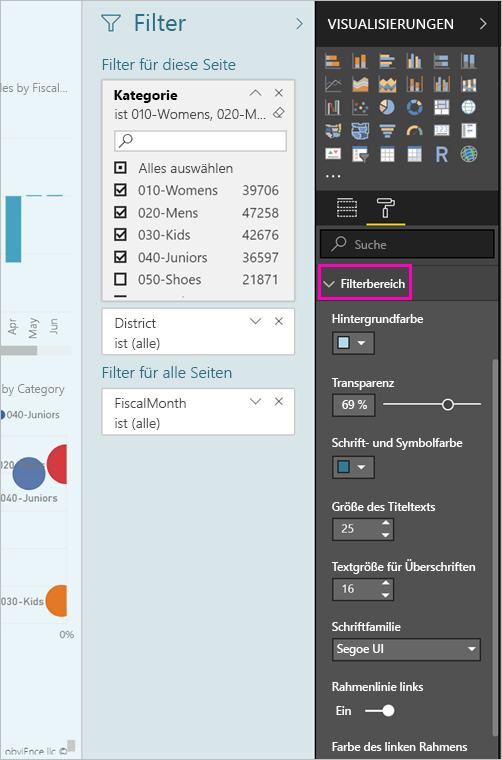
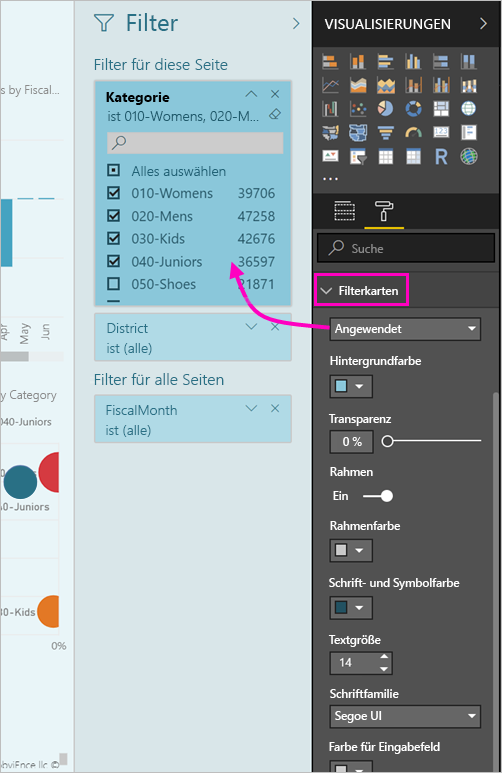
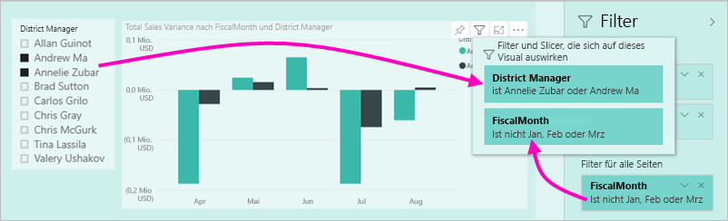

# Die neue Filteroberfläche in Power BI-Berichten (Vorschau)

In diesem Artikel wird die neue Filteroberfläche beschrieben: Filter in Power BI erhalten eine neue Funktionalität und ein neues Design. Wenn Sie in Power BI Desktop oder im Power BI-Dienst Berichte entwerfen, können Sie den Filterbereich in Bezug auf Aussehen und Verhalten an den gesamten Bericht anpassen. In der neuen Benutzeroberfläche fungiert der alte Filterbereich als Bereich für die Filterbearbeitung, die Berichtnutzer sehen nur den neuen Filterbereich. 
 

> [!NOTE]
> Die neue Filterfunktion befindet sich in der Vorschau. Neue Builds überschreiben möglicherweise Ihre festgelegte Formatierung.

Beim Berichtentwurf bieten Ihnen die neuen Filter folgende Möglichkeiten:

- Sie können eine schreibgeschützte Ansicht der Filter im Visualheader anzeigen, damit die Nutzer genau wissen, welche Filter für ein Visual gelten.
- Sie können den Filterbereich formatieren und anpassen, damit der zu Ihrem Bericht passt.
- Sie können festlegen, ob der Filterbereich beim Öffnen des Berichts durch den Nutzer standardmäßig geöffnet oder ausgeblendet werden soll.
- Sie können den gesamten Filterbereich oder bestimmte Filter ausblenden, die den Nutzern nicht angezeigt werden sollen.
- Sie können die Sichtbarkeit und den Zustand (geöffnet/ausgeblendet) des neuen Filterbereichs steuern und sogar als Lesezeichen festlegen.
- Sie können Filter sperren, die die Nutzer nicht bearbeiten sollen.

## Aktivieren der neuen Filteroberfläche 

Sie aktivieren die neue Benutzeroberfläche in Power BI Desktop. Anschließend können Sie die Filter dort oder im Power BI-Dienst ändern (https://app.powerbi.com). Die neue Filteroberfläche befindet sich in der Vorschau, deshalb muss sie zunächst in Power BI Desktop aktiviert werden. Wenn Sie beginnen, indem Sie einen Bericht im Power BI-Dienst erstellen, darf dieser keine neuen Filter aufweisen.

### Aktivieren der neuen Filter für alle neuen Berichte

1. Wählen Sie in Power BI Desktop**Datei** > **Optionen und Einstellungen** > **Optionen** > **Vorschaufeatures** aus, und aktivieren Sie anschließend das Kontrollkästchen **Neue Filteroberfläche**. 
2. Starten Sie Power BI Desktop neu, um die neue Filteroberfläche in allen neuen Berichten anzuzeigen.

Nachdem Sie Power BI Desktop neu gestartet haben, wird die neue Filteroberfläche standardmäßig für alle neu erstellten Berichte aktiviert.  

### Aktivieren der neuen Filter für einen vorhandenen Bericht

Sie können die Filter auch für vorhandene Berichte aktivieren.

1. Wählen Sie in Power BI Desktop in einem vorhandenen Bericht **Datei** > **Optionen und Einstellungen** > **Optionen** aus.
2. Wählen Sie unter **Berichteinstellungen** die Option **Aktualisierten Filterbereich aktivieren und Filter im Visualheader für diesen Bericht anzeigen** aus.

## Erstellen des neuen Filterbereichs

Nachdem Sie den neuen Filterbereich aktiviert haben, wird dieser rechts neben der Berichtseite angezeigt und ist standardmäßig basierend auf Ihren aktuellen Berichteinstellungen formatiert. Der alte Filterbereich fungiert jetzt als Bereich für die Filterbearbeitung. Der neue Filterbereich zeigt an, wie der Bericht nach dem Veröffentlichen für Ihre Berichtnutzer angezeigt wird. Sie können vorhandene Filter im neuen Bereich aktualisieren, aber Sie verwenden den alten Filterbereich, um die einzuschließenden Filter zu konfigurieren.

1. Entscheiden Sie zunächst, ob der Filterbereich für Ihre Berichtnutzer sichtbar sein soll. Wenn der Filterbereich sichtbar sein soll, klicken Sie auf das Augensymbol  neben „Filter“.

2. Um mit der Erstellung Ihres neuen Filterbereichs zu beginnen, ziehen Sie für Sie relevante Felder entweder als Filter auf Visual-, Seiten- oder Berichtsebene in den Bereich zur Filterbearbeitung. Diese werden anschließend im neuen Filterbereich angezeigt.

    

Wenn Sie dem Zeichenbereich für einen Bericht ein Visual hinzufügen, fügt Power BI automatisch einen Filter für jedes Feld im Visual hinzu. Power BI fügt diese automatischen Filter nicht dem schreibgeschützten Filterbereich hinzu. Sie müssen das Augensymbol auswählen, um diese explizit hinzuzufügen.

 
## Sperren oder Ausblenden von Filtern

Sie können einzelne Filterkarten sperren oder ausblenden. Wenn Sie einen Filter sperren, können Ihre Berichtnutzer den Filter sehen, aber nicht ändern. Wenn Sie einen Filter ausblenden, können die Berichtnutzer den Filter nicht einmal sehen. Das Ausblenden von Filterkarten kann insbesondere dann nützlich sein, wenn Sie Datenbereinigungsfilter ausblenden möchten, die NULL-Werte oder unerwartete Werte ausschließen. 

- Aktivieren oder deaktivieren Sie im Bereich zur Filterbearbeitung die Symbole **Filter sperren** oder **Filter ausblenden** auf einer Filterkarte.

   

Wenn Sie diese Einstellungen im Filterbearbeitungsbereich aktivieren oder deaktivieren, werden die Änderungen im neuen Filterbereich reflektiert. Ausgeblendete Filter werden im Filterpopup für ein Visual nicht angezeigt.

Sie können den Filterbereichszustand auch so konfigurieren, dass er ihren Berichtslesezeichen folgt. Der Zustand (geöffnet/geschlossen) und der Sichtbarkeitsstatus können als Lesezeichen festgelegt werden.
 
## Formatieren des neuen Filterbereichs

Ein wichtiger Aspekt der neuen Benutzeroberfläche ist der, dass Sie den Filterbereich nun so formatieren können, dass er dem Erscheinungsbild Ihres Berichts entspricht. Sie können den Filterbereich für jede Seite im Bericht anders formatieren. Diese Elemente können formatiert werden: 

- Hintergrundfarbe
- Hintergrundtransparenz
- Rahmen für Filterbereich (ein/aus)
- Rahmenfarbe für Filterbereich
- Schriftart, Farbe und Textgröße für Titel und Header des Filterbereichs

Für Filterkarten können Sie außerdem diese Elemente formatieren – je nachdem, ob sie angewendet wurden (auf einen Wert festgelegt) oder verfügbar (deaktiviert) sind: 

- Hintergrundfarbe
- Hintergrundtransparenz
- Rahmen: ein/aus
- Rahmenfarbe
- Schriftart, Farbe und Textgröße
- Farbe für Eingabefeld

### Festlegen des Formats für Filterbereich und -karten

1. Klicken Sie im Bericht auf den Bericht selbst oder den Hintergrund (*Hintergrundbild*), und wählen Sie dann im Bereich **Visualisierungen** die Einstellung **Format** aus. 
    Es werden Optionen zum Formatieren der Berichtseite, des Hintergrundbilds sowie Filterbereichs und der Filterkarten angezeigt.

        

1. Erweitern Sie den **Filterbereich**, um die Farbe für den Hintergrund, das Symbol und den linken Rahmen festzulegen und die Berichtseite zu vervollständigen.

    

1. Erweitern Sie **Filterkarten**, um Farbe und Rahmen für **Verfügbar** und **Angewendet** festzulegen. Wenn Sie unterschiedliche Farben für verfügbare und angewendete Karten festlegen, ist offensichtlich, welche Filter angewendet wurden. 
  
    

## Anzeigen von Filtern für ein Visual im Lesemodus

Bewegen Sie im Lesemodus den Mauszeiger über das Filtersymbol, um für ein Visual ein Popup mit allen Filtern, Slicern usw. anzuzeigen, die sich auf das Visual auswirken. Die Formatierung des Popups entspricht der des Filterbereichs. 

Diese Filtertypen werden in der Ansicht angezeigt: 
- Basisfilter
- Datenschnitte
- Übergreifende Hervorhebung 
- Kreuzfilterung
- Erweiterte Filter
- Top N-Filter
- Relative Datenfilter
- Synchronisierungsslicer
- Einschluss-/Ausschlussfilter
- Per URL übergebene Filter

## In Kürze verfügbar

In den kommenden Monaten sind die folgenden Verbesserungen geplant:
- Möglichkeit zum Ändern der Reihenfolge von Filterkarten
- Ein zentraler Filterbereich für Berichtersteller 
- Weitere Formatierungsoptionen

Probieren Sie die neue Filteroberfläche aus! Senden Sie uns Feedback zu diesem Feature, und lassen Sie uns wissen, wie wir diese Benutzeroberfläche weiter verbessern können. 

## Nächste Schritte
[Verwenden von Berichtsfiltern](consumer/end-user-report-filter.md)

[Filter und Hervorhebungen in Berichten](power-bi-reports-filters-and-highlighting.md)

[Interagieren mit Filtern und Hervorhebungen in der Leseansicht von Berichten](consumer/end-user-reading-view.md)

[Ändern der Kreuzfilterung und -hervorhebung von Berichtsvisualisierungen](consumer/end-user-interactions.md)

Weitere Fragen? [Wenden Sie sich an die Power BI-Community](http://community.powerbi.com/)

