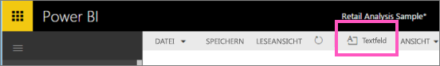
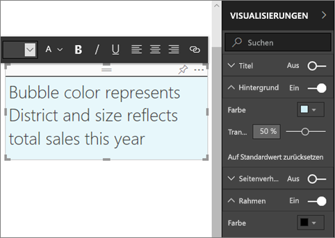
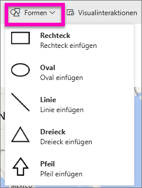
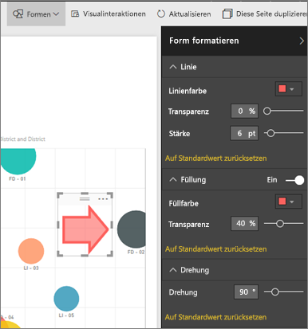

# Statische Inhalte in Power BI-Berichten
Sie können den Power BI-Dienst oder Power BI Desktop verwenden, um Textfelder und Formen zu Berichten hinzuzufügen. In beiden Fällen benötigen Sie Berechtigungen zum Bearbeiten des Berichts. Wenn ein Bericht mit Ihnen im Power BI-Dienst geteilt wurde, verfügen Sie nicht über Berechtigungen zur Bearbeitung. 

Schauen Sie sich an, wie Will mit Power BI Desktop [statische Bilder zu einem Bericht hinzufügt](guided-learning/visualizations.yml#step-11). Führen Sie anschließend die unten beschriebenen Schritte aus, um selbst auszuprobieren, stattdessen den Power BI-Dienst zu verwenden.
> 
> <iframe width="560" height="315" src="https://www.youtube.com/embed/_3q6VEBhGew" frameborder="0" allowfullscreen></iframe>
> 

## Hinzufügen eines Textfelds zu einem Bericht
1. Öffnen Sie einen Bericht in der Bearbeitungsansicht.

2. Platzieren Sie den Cursor an einer leeren Stelle im Berichtszeichenbereich, und wählen Sie **Textfeld** aus.
   
   
2. Geben Sie den Text in das Textfeld ein und optional Format, Schriftart, Farbe und Textausrichtung an. 
   
   
3. Um das Textfeld zu positionieren, wählen Sie den grauen Bereich oben und ziehen Sie diesen mit dem Mauszeiger. Um die Größe des Textfeldes zu ändern, wählen und ziehen Sie einen der Konturziehpunkte. 
   
   

4. Fügen Sie bei aktivem Textfeld zusätzliche Formatierungen im Bereich „VISUALISIERUNGEN“ hinzu. In diesem Beispiel haben wir den Hintergrund und Rahmen formatiert. Sie können auch die genaue Größe oder Position für ein Textfeld festlegen.  

   

5. Um das Textfeld zu schließen, klicken Sie auf eine beliebige leere Stelle im Berichtszeichenbereich. 

5. Wählen Sie das Anheftsymbol , um das Textfeld an ein Dashboard anzuheften. 

## Hinzufügen einer Form zu einem Bericht
1. Platzieren Sie den Cursor an einer beliebigen Stelle im Berichtszeichenbereich, und wählen Sie **Formen** aus.
   
   
2. Wählen Sie in der Dropdownliste eine Form aus, um sie dem Berichtszeichenbereich hinzuzufügen. Lassen Sie uns einen Pfeil hinzufügen, um die Aufmerksamkeit auf die Blase mit der höchsten Gesamtabweichung beim Umsatz zu lenken. 
   
   Passen Sie Ihre Form im Bereich **Form formatieren** an. In diesem Beispiel haben wir einen roten um 90 Grad gedrehten Pfeil mit einem dunkelroten Rahmen erstellt.
   
   
3. Um die Form zu positionieren, wählen Sie den grauen Bereich oben aus und ziehen diesen mit dem Mauszeiger. Um die Größe der Form zu ändern, wählen und ziehen Sie einen der Konturziehpunkte. Wie beim Textfeld können Sie auch die genaue Größe oder Position für eine Form festlegen.

> **HINWEIS**: Formen können nicht an ein Dashboard angeheftet werden. Eine Ausnahme bilden die visuellen Elemente beim [Anheften einer Liveseite](service-dashboard-pin-live-tile-from-report.md). 
> 
> 

### Nächste Schritte
[Hinzufügen eines Links zu einem Textfeld](service-add-hyperlink-to-text-box.md)

[Power BI – Grundkonzepte](service-basic-concepts.md)

Weitere Fragen? [Wenden Sie sich an die Power BI-Community](http://community.powerbi.com/)
