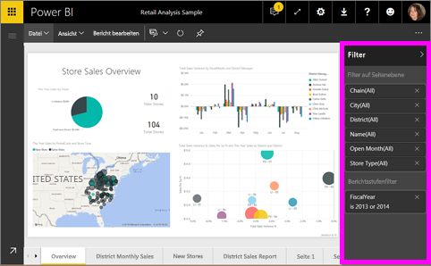
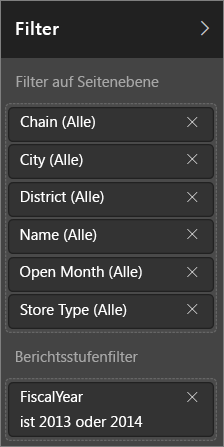
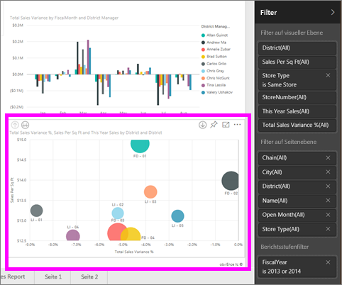
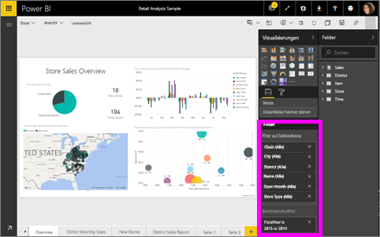

# Informationen zu Filtern und Hervorhebungen in Power BI-Berichten
***Filter*** entfernen alles bis auf die Daten, auf die Sie sich konzentrieren möchten.  ***Hervorheben*** ist kein Filtern, da hierbei keine Daten entfernt, sondern eine Teilmenge der sichtbaren Daten hervorgehoben wird. Die nicht hervorgehobenen Daten bleiben sichtbar, sind jedoch abgeblendet.

Zum Zuweisen von Filtern und Hervorhebungen zu Berichten haben Sie in Power BI verschiedene Möglichkeiten. Diese eingehend zu beschreiben, würde den Rahmen dieses Artikels sprengen. Wir haben also folgende Aufteilung vorgenommen:

* Einführung in Filter und Hervorhebungen (dieser Artikel)
* Über das [Erstellen und Verwenden von Filtern und Hervorhebungen in der Bearbeitungsansicht von Berichten, deren Besitzer Sie sind](power-bi-report-add-filter.md). Wenn Sie über die erforderlichen Berechtigungen zum Bearbeiten des Berichts verfügen, können Sie darin Filter und Hervorhebungen erstellen, Änderungen vornehmen und diese auch wieder löschen.
* Über das [Verwenden von Filtern und Hervorhebungen in einem Bericht, der für Sie freigegeben wurde oder den Sie in der Leseansicht aufgerufen haben](service-reading-view-and-editing-view.md). Hier bestehen Einschränkungen, Power BI bietet Ihnen jedoch in jedem Fall eine Vielzahl von Optionen für Filter und Hervorhebungen.  
* [Eine ausführliche Tour, in der Sie die Benutzeroberfläche für die Steuerung der Filter und Hervorhebungen kennenlernen](power-bi-how-to-report-filter.md), einschließlich der verschiedensten Filtertypen (z.B. Datum und Uhrzeit, Nummern- und Textfilter) und einer Erklärung des Unterschieds zwischen Standard- und erweiterten Optionen.
* Sobald Sie das Standardverfahren für die Verwendung von Filtern und Hervorhebungen kennen, fahren wir mit der Art und Weise fort, [wie verschiedene Visualisierungen auf einer Seite einander durch Filter und Hervorhebungen beeinflussen (und wie Sie deren Verhalten ändern können)](service-reports-visual-interactions.md).

> [!TIP]
> Wie wird in Power BI ermittelt, welche Daten wie zusammenhängen?  Es werden die Beziehungen zwischen den verschiedenen Tabellen und Feldern im zugrunde liegenden [Datenmodell](https://support.office.com/article/Create-a-Data-Model-in-Excel-87e7a54c-87dc-488e-9410-5c75dbcb0f7b?ui=en-US&rs=en-US&ad=US) herangezogen, damit Elemente auf einer Berichtsseite miteinander interagieren.
> 
> 

## Einführung in Filter und Hervorhebungen in Berichte im Bereich „Filter“
 Dieser Artikel informiert Sie über das Zuweisen von Filtern und Hervorhebungen im Power BI-Dienst.  Die Benutzeroberfläche ist nahezu identisch wie in Power BI Desktop.  

Filter und Hervorhebungen können über den Bereich **Filter** angewendet werden oder indem Sie eine Auswahl direkt im Bericht selbst treffen (Informationen zu diesem als „Ad-hoc“ bezeichneten Verfahren finden Sie am Ende dieser Seite). Im Bereich „Filter“ werden die Tabellen und Felder, die im Bericht verwendet werden, sowie die ggf. angewendeten Filter angezeigt. Die Filter sind in die Kategorien **Seitenebene**, **Berichtsebene**, **Drillthrough** und **Visualebene** aufgeteilt.  Die Filter auf visueller Ebene werden nur angezeigt, wenn Sie auf dem Berichtszeichenbereich eine Visualisierung ausgewählt haben.

> [!TIP]
> Wenn neben einem Filter die Bezeichnung **Alle** erscheint, wird das Feld insgesamt als Filter verwendet.  Beispiel: **Kette(Alle)** (siehe Screenshot unten) zeigt an, dass diese Berichtsseite Informationen über alle Ketten enthält.  Andererseits können wir der Angabe **Geschäftsjahr ist 2013 oder 2014** entnehmen, dass der Bericht ausschließlich Informationen aus den Geschäftsjahren 2013 und 2014 umfasst.
> 
> 

## Filter in der Leseansicht und Filter in der Bearbeitungsansicht
Es gibt zwei Modi für die Interaktion mit Berichten: [Leseansicht und Bearbeitungsansicht](service-reading-view-and-editing-view.md).  Es hängt vom Modus ab, in dem Sie sich befinden, welche Filterfunktionen verfügbar sind.

* In der Bearbeitungsansicht können Sie Berichts-, Seiten-, Drillthrough- und Visualfilter hinzufügen. Selbst wenn Sie den Bericht in einer mobilen App öffnen und speichern, werden die Filter zusammen mit dem Bericht gespeichert. Personen, die den Bericht in der Leseansicht anzeigen, können mit den von Ihnen hinzugefügten Filtern interagieren, aber keine neuen Filter hinzufügen.
* In der Leseansicht können Sie mit allen Filtern interagieren, die in diesem Bericht schon vorhanden sind, und Ihre Auswahl anschließend speichern.  Allerdings können Sie keine neuen Filter hinzufügen.

### Der Bereich „Filter“ in der Leseansicht
Wenn Sie auf einen Bericht nur über die Leseansicht zugreifen können, wird der Bereich „Filter“ wie hier angezeigt:

Diese Berichtsseite verfügt über sechs Filter auf Seitenebene und einen Filter auf Berichtsebene.

Um herauszufinden, ob auch Filter auf visueller Ebene vorhanden sind, wählen Sie eine Visualisierung aus. Im Bild unten wurden sechs Filter auf das Blasendiagramm angewendet.

In der Leseansicht können Sie die Daten untersuchen, indem Sie die bestehenden Filter modifizieren. Selbst wenn Sie den Bericht in einer mobilen App öffnen, werden die von Ihnen vorgenommenen Veränderungen zusammen mit dem Bericht gespeichert. Informationen hierzu finden Sie unter [Reading view and Editing view in Power BI service (Leseansicht und Bearbeitungsansicht im Power BI-Dienst)](service-reading-view-and-editing-view.md).

### Der Bereich „Filter“ in der Bearbeitungsansicht
Wenn Sie über die Besitzerberechtigungen für einen Bericht verfügen und diesen in der Bearbeitungsansicht öffnen, sehen Sie, dass der Bereich **Filter** nur einer von einer Reihe an verfügbaren Bearbeitungsbereichen ist.

Wie in der Leseansicht (oben) verfügt diese Berichtsseite über sechs Filter auf Seitenebene und einen Filter auf Berichtsebene. Durch Auswahl des Blasendiagramms erfahren wir, dass sechs Filter auf visueller Ebene angewendet wurden.

Allerdings haben Sie bei der Arbeit mit Filtern und Hervorhebungen in der Bearbeitungsansicht viel mehr Möglichkeiten. Der größte Unterschied besteht darin, dass wir neue Filter hinzufügen können. Weitere ausführliche Informationen dazu finden Sie im Artikel [Hinzufügen eines Filters zu einem Bericht](power-bi-report-add-filter.md).

## Ad-hoc-Filter und -Hervorhebungen
Wählen Sie zum Filtern und Hervorheben des übrigen Teils der Seite im Berichtszeichenbereich ein Feld aus. Wählen Sie in derselben Visualisierung einen leeren Bereich an, um die eben getroffene Auswahl wieder zu entfernen. Dieser Filter- und Hervorhebungstyp ermöglicht es Ihnen, den Einfluss von Daten schnell zu untersuchen. Wie Sie das Verhalten dieser Art von Kreuzfiltern und -hervorhebungen anpassen können, erfahren Sie unter [Interaktionen mit Visuals](service-reports-visual-interactions.md).

Wenn Sie den Bericht verlassen, werden Ihre Veränderungen gespeichert. Klicken Sie auf **Auf Standardwert zurücksetzen** in der oberen Menüleiste, um die Filtereinstellung rückgängig zu machen.

## Nächste Schritte
[Interagieren mit Filtern und Hervorhebungen (in der Leseansicht)](service-reading-view-and-editing-view.md)

[Hinzufügen eines Filters zu einem Bericht (in der Bearbeitungsansicht)](power-bi-report-add-filter.md)

[Überblick über Berichtsfilter](power-bi-how-to-report-filter.md)

[Ändern der Kreuzfilterung und -hervorhebung von Berichtsvisualisierungen](service-reports-visual-interactions.md)

Erfahren Sie mehr über [Berichte in Power BI](service-reports.md).

Weitere Fragen? [Wenden Sie sich an die Power BI-Community](http://community.powerbi.com/)

