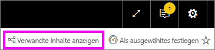
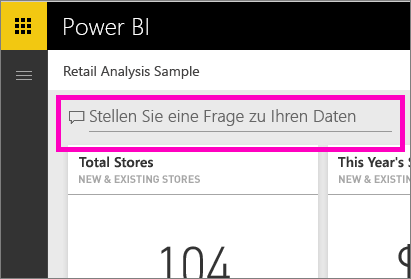
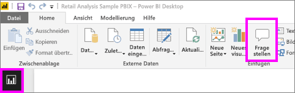
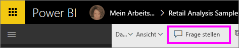
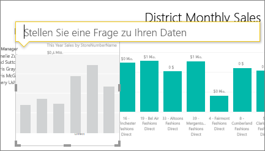
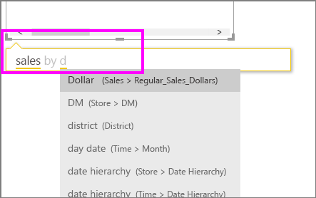
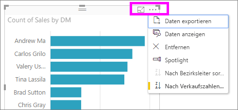

# Verwenden von Power BI F & A zum Untersuchen der Daten und Erstellen von visuellen Elementen

Manchmal ist die schnellste Möglichkeit, um eine Antwort auf Basis Ihrer Daten zu erhalten, eine Frage in natürlicher Sprache zu stellen. Das Q & A-Feature in Power BI können Sie Ihre Daten in Ihren eigenen Worten zu untersuchen.  Der erste Teil des in diesem Artikel wird gezeigt, wie Sie F & A in Dashboards im Power BI-Dienst verwenden. Der zweite Teil werden die Funktionen mit Q & A können beim Erstellen von Berichten in der Power BI-Dienst oder Power BI Desktop. Weitere Informationen finden Sie unter den [Q & A für Consumer](consumer/end-user-q-and-a.md) Artikel. 

[F & A in den mobilen Power BI-apps](consumer/mobile/mobile-apps-ios-qna.md) und [Q & A mit Power BI Embedded](developer/qanda.md) in eigenen Artikeln behandelt werden. 

Fragen und Antworten sind interaktive und sogar unterhaltsam. Führt eine Frage häufig für andere, wie die Visualisierungen interessante Verweise enthalten. Sehen Sie sich an, wie Amanda mithilfe von Q&A Visualisierungen erstellt, diese Visuals erläutert und sie an Dashboards anheftet.

<iframe width="560" height="315" src="https://www.youtube.com/embed/qMf7OLJfCz8?list=PL1N57mwBHtN0JFoKSR0n-tBkUJHeMP2cP" frameborder="0" allowfullscreen></iframe>

## Teil 1: Verwenden von Q & A in einem Dashboard in Power BI-Dienst

Im Power BI-Dienst ("App.powerbi.com") enthält ein Dashboard angeheftete Kacheln aus ein oder mehrere Datasets, damit Sie Fragen zu den Daten in einem dieser Datasets stellen können. Um anzuzeigen, welche Berichte und Datasets zum Erstellen des Dashboards verwendet wurden, wählen Sie **verwandte Inhalte anzeigen** in der Menüleiste.

Das f & A-Fragefeld befindet sich in der oberen linken Ecke des Dashboards, in dem Sie Ihre Frage in natürlicher Sprache eingeben. Werden das Q & A-Feld nicht angezeigt? Finden Sie unter [und Problembehandlungsinformationen](consumer/end-user-q-and-a.md#considerations-and-troubleshooting) in die **Q & A für Consumer** Artikel.  Q & A erkennt die eingegebenen Wörter und schließt, wo (in welchem Dataset), um dies herauszufinden. Q&A unterstützt Sie mit automatischer Vervollständigung, Neuformulierung und anderen textlichen und visuellen Hilfsmitteln bei der Formulierung Ihrer Frage.

Die Antwort auf Ihre Frage wird als eine interaktive Visualisierung angezeigt und beim Ändern der Frage aktualisiert.

1. Öffnen Sie ein Dashboard, und platzieren Sie den Cursor im Fragefeld. Wählen Sie in der oberen rechten Ecke **neue f & A**.

    

1. Noch bevor Sie mit der Eingabe beginnen, zeigt Q&A einen neuen Bildschirm mit Vorschlägen für die Formulierung Ihrer Frage an. Sie finden Sie in Ausdrücken und vollständige Fragen, die mit den Namen der Tabellen in der zugrunde liegenden Datasets und möglicherweise sogar vollständige Fragen aufgeführt, wenn der datasetbesitzer erstellt hat [ausgewählte Fragen](service-q-and-a-create-featured-questions.md),

   

   Sie können wählen Sie eine der folgenden Fragen als Ausgangspunkt und die Frage, um eine genaue Antwort darauf zu verfeinern. Oder verwenden Sie einen Tabellennamen können Sie eine neue Frage zu word.

2. Wählen Sie aus der Liste der Fragen, oder beginnen Sie, geben Sie Ihre Frage ein, und Vorschläge aus der Dropdownliste auswählen.

   

3. Wenn Sie eine Frage eingeben, wählt Q & A die optimale Visualisierung, um Ihre Antwort anzuzeigen.

   

4. Die Visualisierung ändert dynamisch, wie Sie die Frage ändern.

   

1. Wenn Sie eine Frage eingeben, sucht Power BI nach der besten Antwort, unter Verwendung jedes Datasets, das über eine Kachel auf diesem Dashboard verfügt.  Wenn alle Kacheln von *DatasetA* stammen, ergibt sich Ihre Antwort ebenfalls aus *DatasetA*.  Wenn Kacheln aus *DatasetA* und *DatasetB*, F & A sucht dann nach der besten Antwort 2 Datasets.

   > [!TIP]
   > Gehen Sie umsichtig vor. Wenn es für *datasetA* nur eine Kachel gibt und Sie diese aus dem Dashboard entfernen, hat Q&A keinen Zugriff mehr auf *datasetA*.
   >

5. Wenn Sie mit dem Ergebnis, heften Sie die Visualisierung an ein Dashboard, indem Sie Sie in der oberen rechten Ecke das Symbol zum Anheften auswählen zufrieden sind. Wenn das Dashboard für Sie freigegeben wurde oder Bestandteil einer App ist, können Sie die Visualisierung nicht anheften.

   

## Teil 2: Verwenden von Q&A in einem Bericht im Power BI-Dienst oder in Power BI Desktop

Verwenden Sie Q&A, um das Dataset zu untersuchen und dem Bericht sowie Dashboards Visualisierungen hinzuzufügen. Ein Bericht basiert auf einem einzelnen Dataset. Er kann vollständig leer sein oder mit Visualisierungen gefüllte Seiten enthalten. Wenn ein Bericht leer ist, bedeutet dies jedoch nicht unbedingt, dass er keine Daten enthält, die Sie untersuchen können. Das Dataset ist mit dem Bericht verknüpft, und Sie können es untersuchen und Visualisierungen erstellen.  Um festzustellen, welches Dataset zum Erstellen eines Berichts verwendet wird, öffnen Sie den Bericht in der Leseansicht des Power BI-Diensts, und wählen Sie auf der Menüleiste **Verwandte Inhalte anzeigen** aus.

Um Q & A in Berichten verwenden zu können, benötigen Sie Bearbeitungsberechtigungen für den Bericht und das zugrunde liegende Dataset. In der [Q & A für Consumer](consumer/end-user-q-and-a.md) Artikel wir bezeichnen dies als eine *Ersteller* Szenario. Stattdessen haben *nutzen* ein Bericht, der für Sie F & A freigegeben wurde, ist nicht verfügbar.

1. Öffnen Sie einen Bericht in der Bearbeitungsansicht (Power BI-Dienst) oder Berichtsansicht (Power BI Desktop), und wählen Sie **stellen Sie eine Frage** in der Menüleiste.

    **Power BI Desktop**    
    

    **Power BI-Dienst**    
    

2. Das Q&A-Fragefeld wird im Zeichenbereich des Berichts angezeigt. Im folgenden Beispiel wird das Fragefeld auf einer anderen Visualisierung angezeigt. Dies ist in Ordnung, jedoch ist es möglicherweise besser, dem Bericht eine leere Seite hinzuzufügen, bevor Sie eine Frage stellen.

    

3. Platzieren Sie den Cursor im Fragefeld. Während Sie Text eingeben, werden in Q&A Vorschläge angezeigt, die Sie bei der Formulierung der Frage unterstützen.

   

4. Wenn Sie eine Frage eingeben, wählt Q&A die optimale [Visualisierung](visuals/power-bi-visualization-types-for-reports-and-q-and-a.md), um Ihre Antwort anzuzeigen. Wenn Sie die Frage ändern, wird die Visualisierung dynamisch angepasst.

   

5. Sobald die gewünschte Visualisierung angezeigt wird, drücken Sie die EINGABETASTE. Wählen Sie zum Speichern der Visualisierung mit dem Bericht **Datei > Speichern** aus.

6. Interagieren Sie mit der neuen Visualisierung. Es spielt keine Rolle, wie Sie die Visualisierung erstellt haben – es sind immer die gleichen Interaktivitätsfunktionen, Formatierungen und Features verfügbar.

   

   Wenn Sie die Visualisierung im Power BI-Dienst erstellt haben, können Sie sie sogar [an ein Dashboard anheften](service-dashboard-pin-tile-from-q-and-a.md).

## Angeben der verwendeten Visualisierung für Q&A
Mit Q&A lassen Sie nicht nur Ihre Daten für sich selbst sprechen, Sie können sogar festlegen, wie die Antwort in Power BI angezeigt werden soll. Hängen Sie am Ende Ihrer Frage einfach den Zusatz „als <visualization type>“ an.  Beispiel: „Bestandsvolumen nach Werk als Karte anzeigen“ und „Gesamtvolumen als Karte anzeigen“.  Probieren Sie es einfach aus.

## Zu beachtende Aspekte und Problembehandlung
- Wenn Sie mit einer Liveverbindung oder über ein Gateway die Verbindung mit einem Dataset hergestellt haben, muss Q&A [für dieses Dataset aktiviert](service-q-and-a-direct-query.md) sein.

- Sie haben einen Bericht geöffnet, und die Q&A-Option wird nicht angezeigt. Wenn Sie den Power BI-Dienst verwenden, stellen Sie sicher, dass der Bericht in der Bearbeitungsansicht geöffnet ist. Wenn Sie die Bearbeitungsansicht, dass bedeutet, dass Sie keine Bearbeitungsberechtigungen für diesen Bericht haben, und Verwenden von Q & A für diesen Bericht öffnen können.

## Nächste Schritte

- [Q & A für Consumer](consumer/end-user-q-and-a.md)   
- [Tipps zum Stellen von Fragen mit Q&A](consumer/end-user-q-and-a-tips.md)   
- [Vorbereiten einer Arbeitsmappe für Q&A](service-prepare-data-for-q-and-a.md)  
- [Vorbereiten eines lokalen Datasets für Q & A](service-q-and-a-direct-query.md)   
- [Anheften einer Kachel an das Dashboard aus Q&A](service-dashboard-pin-tile-from-q-and-a.md)
