# ArcGIS Maps von ESRI im Power BI-Dienst und in Power BI Desktop
Dieses Tutorial richtet sich an Personen, die eine ArcGIS-Karte erstellen. Sobald der Ersteller eine ArcGIS-Karte für einen Kollegen freigegeben hat, kann dieser die Karte anzeigen und mit ihr interagieren, jedoch keine Änderungen speichern. Weitere Informationen zum Anzeigen von ArcGIS-Karten finden Sie unter [Interagieren mit ArcGIS-Karten](visuals/power-bi-visualizations-arcgis.md).

Die Kombination von ArcGIS Maps und Power BI bietet völlig neue Möglichkeiten der Kartendarstellung, die über die Darstellung von Punkten auf einer Karte weit hinausgeht. Wählen Sie Basiskarten, Standorttypen, Designs, Symbolstile und Referenzebenen aus, um beeindruckende, aussagekräftige Kartenvisualisierungen zu erstellen. Die Kombination von autoritativen Datenebenen auf einer Karte mit räumlicher Analyse vermittelt ein tieferes Verständnis der Daten in der Visualisierung.

 Sie können auf einem mobilen Gerät zwar keine ArcGIS-Karten erstellen, aber diese anzeigen und mit ihnen interagieren. Siehe [Interagieren mit ArcGIS-Karten](visuals/power-bi-visualizations-arcgis.md).

> [!TIP]
> GIS steht für „Geographic Information Science“.

Im folgenden Beispiel werden in einem dunkelgrauen Zeichenbereich regionale Umsatzdaten als Heatmap auf einer demografischen Ebene des Medians des verfügbaren Einkommens im Jahr 2016 angezeigt. Wie Sie bei der weiteren Lektüre feststellen werden, bieten ArcGIS-Karten nahezu unbegrenzte erweiterte Mappingfunktionen, demografische Daten und noch eindrucksvollere Kartenvisualisierungen für optimales Storytelling.

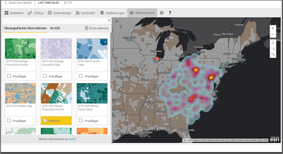

> [!TIP]
> Besuchen Sie die [Seite von ESRI für Power BI](https://www.esri.com/powerbi), auf der Sie viele Beispiele und Kommentare von Kunden finden. Und besuchen Sie dann die [Seite für erste Schritte mit ArcGIS Maps für Power BI](https://doc.arcgis.com/en/maps-for-powerbi/get-started/about-maps-for-power-bi.htm) (in englischer Sprache) von ESRI.

## Zustimmung des Benutzers
ArcGIS Maps for Power BI werden von Esri (www.esri.com) bereitgestellt. Die Verwendung von ArcGIS-Karten für Power BI unterliegt den Nutzungsbedingungen und der Datenschutzrichtlinie von Esri. Power BI-Benutzer, die Visualisierungen von ArcGIS Maps für Power BI verwenden möchten, müssen die Informationen im Zustimmungsdialogfeld akzeptieren.

**Ressourcen**

[Nutzungsbedingungen](https://go.microsoft.com/fwlink/?LinkID=826322)

[Datenschutzrichtlinie](https://go.microsoft.com/fwlink/?LinkID=826323)

[Produktseite zu ArcGIS-Karten für Power BI](https://www.esri.com/powerbi)

 

## Aktivieren einer ArcGIS-Karte
ArcGIS-Karten sind derzeit im Power BI-Dienst, in Power BI Desktop und in Power BI – Mobilgeräte verfügbar. Dieser Artikel enthält Anweisungen für den Power BI-Dienst und für Power BI Desktop.

### Aktivieren der ArcGIS-Karte ***im Power BI-Dienst („app.powerbi.com“)***
Dieses Lernprogramm verwendet das [Analysebeispiel für den Einzelhandel](sample-retail-analysis.md). So aktivieren Sie **ArcGIS Maps für Power BI**:

1. Wählen Sie im rechten oberen Abschnitt der Menüleiste das Zahnradsymbol aus, und öffnen Sie **Einstellungen**.
   
    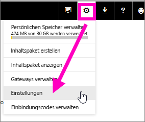
2. Aktivieren Sie das Kontrollkästchen **ArcGIS Maps für Power BI**. Sie müssen Power BI neu starten, nachdem Sie die Auswahl vorgenommen haben.
   
    
3. Öffnen Sie einen Bericht in der [Bearbeitungsansicht](service-reading-view-and-editing-view.md), und wählen Sie im Bereich „Visualisierungen“ das Symbol „ArcGIS Maps für Power BI“ aus.
   
    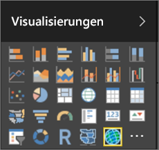
4. Power BI fügt eine leere ArcGIS-Kartenvorlage zur Berichtszeichenfläche hinzu.
   
   

 

## Erstellen eines ArcGIS-Kartenvisuals
Sehen Sie sich an, wie Will verschiedene ArcGIS-Kartenvisualisierungen erstellt, und probieren Sie es dann anhand des [Analysebeispiels für Einzelhandel](sample-datasets.md) selbst aus.

<iframe width="560" height="315" src="https://www.youtube.com/embed/EKVvOZmxg9s" frameborder="0" allowfullscreen></iframe>

1. Ziehen Sie aus dem Bereich **Felder** ein Datenfeld in den Bucket **Ort** oder **Breitengrad** und/oder **Längengrad**. In diesem Beispiel verwenden wir **Store > Ort**.
   
   > [!NOTE]
   > ArcGIS-Karten für Power BI erkennt automatisch, ob die ausgewählten Felder als Form oder Punkt auf einer Karte angezeigt werden sollen. Sie können die Standardeinstellung in den Einstellungen anpassen (siehe unten).
   > 
   > 
   
    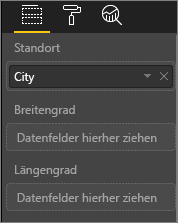
2. Konvertieren Sie die Visualisierung in eine ArcGIS-Karte, indem Sie die Vorlage aus dem Bereich „Visualisierungen“  auswählen.
3. Ziehen Sie ein Measure aus dem Bereich **Felder** in den Bucket **Größe**, um die Darstellung der Daten anzupassen. In diesem Beispiel verwenden wir **Umsätze > Umsätze letztes Jahr**.
   
    

## Einstellungen und Formatierungen für ArcGIS-Karten
So greifen Sie auf die Formatierungsfunktionen für **ArcGIS-Karten für Power BI** zu:

1. Sie können auf zusätzliche Funktionen zugreifen, indem Sie die Auslassungszeichen in der rechten oberen Ecke der Visualisierung auswählen und **Bearbeiten** wählen.
   
   
   
   Die verfügbaren Funktionen werden am oberen Rand der Visualisierung angezeigt. Wenn Sie eine Funktion auswählen, wird ein Aufgabenbereich mit detaillierten Optionen angezeigt. 
   
   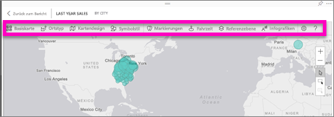
   
   > [!NOTE]
   > Weitere Informationen zu den Einstellungen und Funktionen finden Sie unten unter **Ausführliche Dokumentation**.
   > 
   > 
2. Wenn Sie zum Bericht zurückkehren möchten, wählen Sie links oben in der Berichtszeichenfläche **Zurück zum Bericht** aus.

 

## Ausführliche Dokumentation
**Esri** bietet eine [umfassende Dokumentation](https://go.microsoft.com/fwlink/?LinkID=828772) zu den Funktionen von **ArcGIS-Karten für Power BI**.

## Übersicht über die Funktionen
### Basiskarten
Es werden vier grundlegende Karten bereitgestellt: „Dunkelgrauer Zeichenbereich“, „Hellgrauer Zeichenbereich“, „OpenStreetMap“ und „Straßen“.  „Straßen“ ist die ArcGIS-Standardbasiskarte.

Wenn Sie eine Basiskarte anwenden möchten, wählen Sie sie im Aufgabenbereich aus.

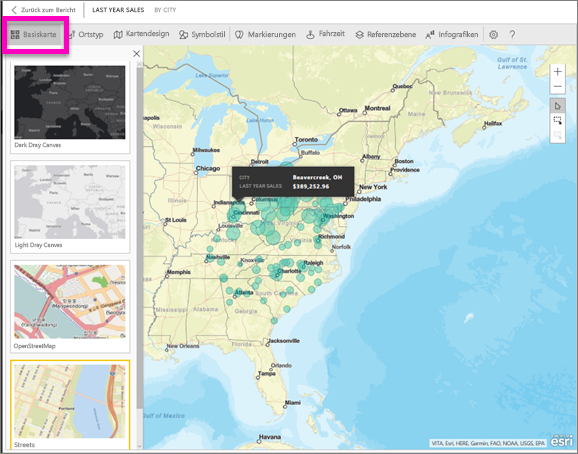

### Ortstyp
ArgGIS-Karten für Power BI erkennt automatisch die beste Darstellungsweise für Daten in der Karte. Dabei wird zwischen Punkten und Begrenzungen ausgewählt. Mit den Optionen für den Ortstyp können Sie die Auswahl anpassen.

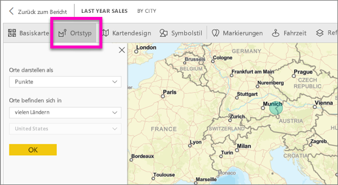

**Begrenzungen** kann nur verwendet werden, wenn die Daten geografische Standardwerte enthalten. Esri ermittelt automatisch die Form, die auf der Karte angezeigt wird. Geografische Standardwerte umfassen Länder, Bundesländer, Postleitzahlen usw. Wie bei der Geocodierung erkennt Power BI jedoch möglicherweise nicht, dass ein Feld standardmäßig eine Begrenzung darstellen soll, oder es ist keine Begrenzung für Ihre Daten vorhanden.  

### Kartendesign
Es werden vier Kartendesigns bereitgestellt. Die Designs „Nur Ort“ und „Größe“ werden automatisch auf Grundlage der Felder ausgesucht, die Sie an den Bucket **Größe** im Power BI-Bereich „Felder“ binden. Zurzeit wird **Größe** verwendet, was wir jetzt in **Wärmebild** ändern.  

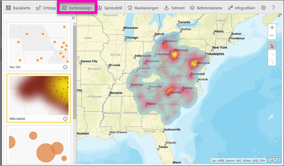

<table>
<tr><th>Design</th><th>Beschreibung</th>
<tr>
<td>Nur Ort</td>
<td>Stellt Datenpunkte oder ausgefüllte Begrenzungen auf der Karte auf Grundlage der Einstellungen für den Ortstyp dar.</td>
</tr>
<tr>
<td>Wärmebild</td>
<td>Zeichnet eine Darstellung von Intensitäten auf der Karte.</td>
</tr>
<tr>
<td>Größe</td>
<td>Stellt Datenpunkte auf der Karte auf Grundlage der Größe des Werts im Bucket für die Größe dar, der im Bereich „Felder“ festgelegt wurde.</td>
</tr>
<tr>
<td>Clustering</td>
<td>Stellt die Anzahl der Datenpunkte in Regionen auf der Karte dar. </td>
</tr>
</table>

### Symbolstil
Mit Symbolstilen können Sie die Darstellung von Daten in der Karte genauer anpassen. Symbolstile sind kontextbezogen und abhängig vom ausgewählten Ortstyp und Kartendesign. Im folgenden Beispiel ist „Ortstyp“ auf **Größe** festgelegt, und an „Transparenz“, „Stil“ und „Größe“ wurden Anpassungen vorgenommen.

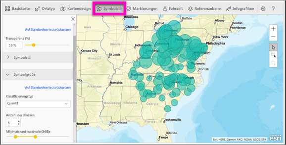

### Stecknadeln
Fügen Sie Stecknadeln hinzu, um die Aufmerksamkeit auf bestimmte Punkte in der Karte zu lenken.  

1. Wählen Sie die Registerkarte **Pins** (Stecknadeln) aus.
2. Geben Sie im Suchfeld Schlüsselwörter (z.B. Adressen, Orte oder Sehenswürdigkeiten) ein, und wählen Sie sie in der Dropdownliste aus. Auf der Karte wird ein Symbol angezeigt, und der Standort wird auf der Karte automatisch vergrößert. Suchergebnisse werden im Bereich „Pins“ (Stecknadeln) als Infokarten für interessante Orte gespeichert. Sie können bis zu 10 Infokarten für interessante Orte speichern.
   
   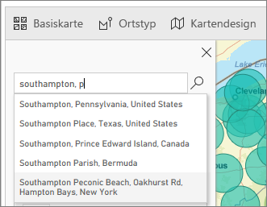
3. Diesem Standort wird eine Stecknadel hinzufügt, und Sie können die Farbe der Stecknadel ändern.
   
   
4. Sie können Stecknadeln hinzufügen und löschen.
   
   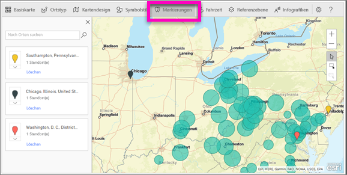

### Drive time (Fahrzeit)
Im Bereich „Drive time“ (Fahrzeit) können Sie einen Ort auswählen und dann bestimmen, welche anderen Kartenfeatures sich in einem angegebenen Radius oder innerhalb einer angegebenen Fahrzeit befinden.  
    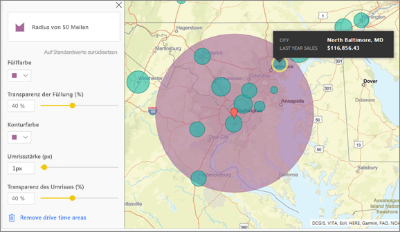

1. Wählen Sie die Registerkarte **Drive time** (Fahrzeit) und dann das Tool für die Einzel- oder Mehrfachauswahl aus. Wählen Sie die Stecknadel für Washington, D.C. aus.
    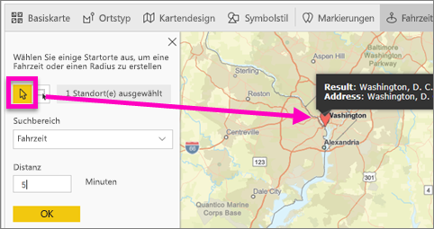
   
   > [!TIP]
   > Wenn Sie die Karte vergrößern (mit dem Symbol „+“), lassen sich Orte einfacher auswählen.
   > 
   > 
2. Angenommen, Sie fliegen für einige Tage nach Washington, D.C. und möchten ermitteln, welche Geschäfte sich mit dem Auto in akzeptabler Zeit erreichen lassen. Ändern Sie „Search area“ (Suchbereich) in **Radius** und „Abstand“ in **50**, wählen Sie als Maßeinheit „miles“ (Meilen) und dann „OK“ aus.    
   
    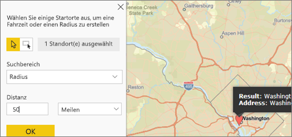
3. Der Radius wird in Violett dargestellt. Wählen Sie einen beliebigen Standort aus, um seine Details anzuzeigen. Optional können Sie den Radius durch Ändern der Farbe und Kontur formatieren.
   
    

### Referenzebenen
#### Referenzebene – Demografie
ArcGIS-Karten für Power BI stellen eine Auswahl von demografischen Ebenen bereit, mit denen Daten aus Power BI in Kontext gestellt werden können.

1. Wählen Sie die Registerkarte **Referenzebene** und anschließend **Demografie** aus.
2. Für jede aufgeführte Ebene wird ein Kontrollkästchen angezeigt. Aktivieren Sie ein Kontrollkästchen, um die entsprechende Ebene zur Karte hinzuzufügen.  In diesem Beispiel wurde das durchschnittliche Haushaltseinkommen hinzugefügt. 
   
    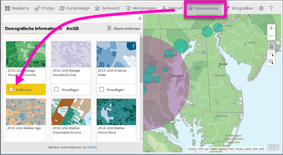
3. Jede Ebene ist außerdem interaktiv. So wie Sie den Mauszeiger über eine Blase halten können, um Details anzuzeigen, können Sie auf einen schattierten Bereich auf die Karte klicken, um die Details zu sehen. 
   
    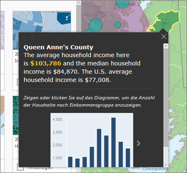

#### Referenzebene – ArcGIS
Über ArcGIS Online können Organisationen öffentliche Webkarten veröffentlichen. Darüber hinaus bietet Esri mit dem „Living Atlas“ einen Satz mit ausgewählten Webkarten. Auf der ArcGIS-Registerkarte können Sie alle öffentlichen Webkarten und Living Atlas-Karten durchsuchen und Ihrer Karte als Referenzebenen hinzufügen.

1. Wählen Sie die Registerkarte **Referenzebene** und anschließend **ArcGIS** aus.
2. Geben Sie Suchbegriffe ein, und wählen Sie dann eine Kartenebene aus. In diesem Beispiel wurden die Kongresswahlbezirke der USA ausgewählt.
   
    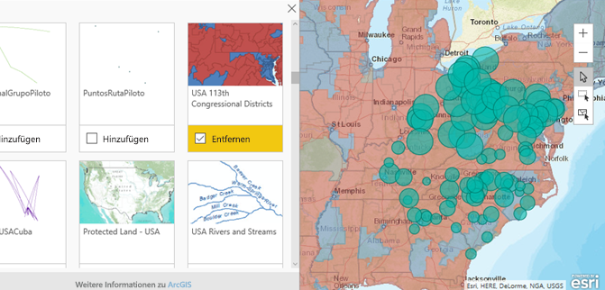
3. Wählen Sie zum Anzeigen der Details einen schattierten Bereich aus. Die Option *Aus Referenzebene auswählen* wird angezeigt. Wählen Sie mit dem Tool zur Auswahl der Referenzebenen Begrenzungen oder Objekte in der Ebene aus.

 

## Auswählen von Datenpunkten
ArcGIS-Karten für Power BI stellt drei Auswahlmodi bereit.

Sie können den Auswahlmodus mit dem Schalter ändern:

 Wählt einzelne Datenpunkte aus.

 Zeichnet ein Rechteck auf der Karte und wählt die darin enthaltenen Datenpunkte aus.

 Ermöglicht die Verwendung von Begrenzungen oder Polygonen in den Referenzebenen zum Auswählen von enthaltenen Datenpunkten.

> [!NOTE]
> Es können maximal 250 Datenpunkte gleichzeitig ausgewählt werden.
> 
> 

 

## Hilfe
**Esri** bietet eine [umfassende Dokumentation](https://go.microsoft.com/fwlink/?LinkID=828772) zu den Funktionen von **ArcGIS-Karten für Power BI**.

In der [Power BI-Community finden Sie einen Thread zu **ArcGIS Maps für Power BI**](https://go.microsoft.com/fwlink/?LinkID=828771) mit aktuellen Informationen. Dort können Sie auch Fragen stellen und Probleme melden.

Verbesserungsvorschläge können Sie an die [Ideensammlung für Power BI](https://ideas.powerbi.com) senden.

 

## Verwalten der Verwendung von ArcGIS-Karten für Power BI in Ihrer Organisation
Mit Power BI können Benutzer, Mandanten- und IT-Administratoren festlegen, ob ArcGIS-Karten für Power BI verwendet werden sollen.

**Benutzeroptionen**: Wenn Benutzer in Power BI Desktop keine ArcGIS-Karten für Power BI mehr verwenden möchten, können sie dieses Feature auf der Sicherheitsregisterkarte in **Optionen** deaktivieren. Wenn die entsprechende Option deaktiviert ist, werden ArcGIS-Karten nicht standardmäßig geladen.

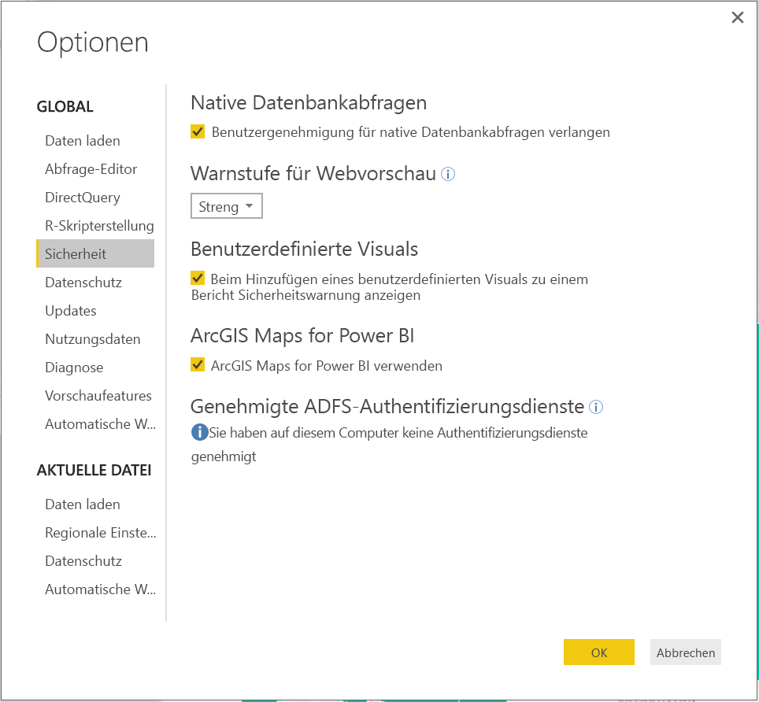

Wenn die Benutzer ArcGIS Maps für Power BI nicht mehr im Power BI-Dienst verwenden möchten, können sie das Feature in den Benutzereinstellungen auf der Registerkarte „ArcGIS Maps für Power BI“ deaktivieren. Wenn die entsprechende Option deaktiviert ist, werden ArcGIS-Karten nicht standardmäßig geladen.

**Optionen für Mandantenadministratoren**: In PowerBI.com können Mandantenadministratoren die Verwendung von ArcGIS-Karten für Power BI für alle Mandantenbenutzer deaktivieren. In diesem Fall wird das Symbol für ArcGIS-Karten für Power BI nicht mehr im Visualisierungsbereich für Power BI angezeigt.

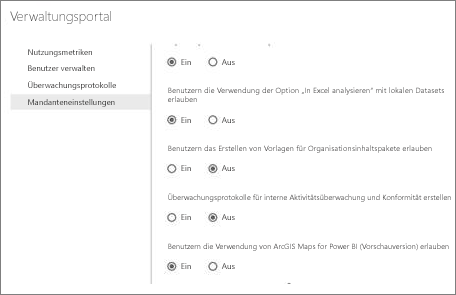

**Optionen für IT-Administratoren**: Power BI Desktop unterstützt die Verwendung von **Gruppenrichtlinien** zum Deaktivieren von ArcGIS-Karten für Power BI auf allen in einer Organisation bereitgestellten Computern.

<table>
<tr><th>Attribut</th><th>Wert</th>
</tr>
<tr>
<td>Schlüssel</td>
<td>Software\Policies\Microsoft\Power BI Desktop&lt;/td&gt;
</tr>
<tr>
<td>valueName</td>
<td>EnableArcGISMaps</td>
</tr>
</table>

Der Wert 1 (dezimal) aktiviert ArcGIS-Karten für Power BI.

Der Wert 0 (dezimal) deaktiviert ArcGIS-Karten für Power BI.

## Überlegungen und Einschränkungen
ArcGIS Maps für Power BI ist in den folgenden Diensten und Anwendungen verfügbar:

<table>
<tr><th>Dienst/App</th><th>Verfügbarkeit</th></tr>
<tr>
<td>Power BI Desktop</td>
<td>Ja</td>
</tr>
<tr>
<td>Power BI-Dienst (PowerBI.com)</td>
<td>Ja</td>
</tr>
<tr>
<td>Mobile Apps für Power BI</td>
<td>Ja</td>
</tr>
<tr>
<td>Power BI-Webveröffentlichung</td>
<td>Nein</td>
</tr>
<tr>
<td>Power BI Embedded</td>
<td>Nein</td>
</tr>
<tr>
<td>Einbettung in den Power BI-Dienst (PowerBI.com)</td>
<td>Nein</td>
</tr>
</table>

In Diensten und Anwendungen, für die ArcGIS Maps für Power BI nicht verfügbar ist, wird statt der Visualisierung ein leeres Visual mit dem Power BI-Logo angezeigt.

Bei der Geocodierung von Adressen werden nur die ersten 1500 Adressen verarbeitet. Ortsnamen und Länder sind von dieser Geocodierung-Einschränkung auf 1500 Einträge nicht betroffen.

 

**Wie interagieren ArcGIS Maps for Power BI miteinander?**
ArcGIS Maps for Power BI werden von Esri (www.esri.com) bereitgestellt. Die Verwendung von ArcGIS Maps for Power BI unterliegt den [Nutzungsbedingungen](https://go.microsoft.com/fwlink/?LinkID=8263222) und der [Datenschutzrichtlinie](https://go.microsoft.com/fwlink/?LinkID=826323) von Esri. Power BI-Benutzer, die Visualisierungen von ArcGIS Maps for Power BI verwenden möchten, müssen die Informationen im Zustimmungsdialogfeld akzeptieren (Details finden Sie unter „Benutzerzustimmung“).  Die Verwendung von ArcGIS Maps for Power BI unterliegt den Nutzungsbedingungen und der Datenschutzrichtlinie von Esri, auf die auch über das Zustimmungsdialogfeld verwiesen wird. Jeder Benutzer muss seine Zustimmung geben, bevor er ArcGIS Maps for Power BI zum ersten Mal verwendet. Sobald der Benutzer seine Zustimmung gegeben hat, werden die Daten, die an das Visual gebunden sind, zumindest für die Geocodierung an die Esri-Dienste gesendet. Das bedeutet, dass Informationen zum Standort in Längen- und Breitengrade umgewandelt werden, die auf einer Karte dargestellt werden können. Gehen Sie davon aus, dass alle Daten, die an die Datenvisualisierung gebunden sind, an die Esri-Dienste gesendet werden können. Esri stellt u.a. Dienste wie Basiskarten, räumliche Analysen und Geocodierung bereit. Die ArcGIS Maps for Power BI-Visualisierung interagiert mit diesen Diensten unter Verwendung einer SSL-Verbindung, die von einem Zertifikat geschützt wird, das von Esri bereitgestellt und verwaltet wird. Zusätzliche Informationen zu ArcGIS Maps for Power BI erhalten Sie auf der [ArcGIS Maps for Power BI-Produktseite](https://www.esri.com/powerbi) von Esri.

Wenn sich ein Benutzer für ein Plus-Abonnement registriert, das von Esri über ArcGIS Maps for Power BI angeboten wurde, wird dadurch eine direkte Beziehung zu Esri hergestellt. Power BI sendet keine persönlichen Informationen über den Benutzer an Esri. Der Benutzer registriert sich für eine AAD-Anwendung, die von Esri bereitgestellt wird, und verwendet dabei seine eigene AAD-Identität. Außerdem vertraut er der Anwendung. Dadurch gibt er seine persönlichen Informationen direkt für Esri frei. Sobald der Benutzer einer ArcGIS Maps for Power BI-Visualisierung Plus-Inhalt hinzufügt, benötigen auch andere Power BI-Benutzer ein Plus-Abonnement von Esri, um den Inhalt anzeigen und bearbeiten zu können. 

Wenn Sie komplexe, technische Fragen zur Funktionsweise von ArcGIS Maps for Power BI haben, können Sie Esri über deren Supportwebsite kontaktieren.

**Fallen Gebühren für die Verwendung von ArcGIS-Karten für Power BI an?**

ArcGIS Maps für Power BI ist für alle Power BI-Benutzer ohne zusätzliche Kosten verfügbar. Dies ist eine von **Esri** bereitgestellte Komponente, die den Nutzungsbedingungen und der Datenschutzrichtlinie von **Esri** unterliegt, wie weiter oben in diesem Artikel beschrieben.

**Ich erhalte in Power BI Desktop eine Fehlermeldung, dass der Cache voll ist**

Dieser Fehler ist bekannt und wird behoben.  Bis der Fehler behoben ist, leeren Sie den Cache, indem Sie Dateien am folgenden Speicherort löschen: „C:\Benutzer\\AppData\Local\Microsoft\Power BI Desktop\CEF“. Starten Sie dann Power BI neu.

**Unterstützen ArcGIS-Karten für Power BI Esri-Shapefiles?**

ArcGIS-Karten für Power BI erkennen automatisch Standardbegrenzungen wie Länder/Regionen, Staaten/Provinzen und Postleitzahlen. Wenn Sie Ihre eigenen Formen bereitstellen möchten, können Sie hierfür [Flächenkartogramme in Power BI Desktop (Preview)](visuals/desktop-shape-map.md) verwenden.

**Kann ich meine ArcGIS-Karten offline anzeigen?**

Nein. Zum Anzeigen der Karten in Power BI ist eine Netzwerkverbindung erforderlich.

**Kann ich über Power BI eine Verbindung mit meinem ArcGIS Online-Konto herstellen?**

Noch nicht. [Stimmen Sie für diese Idee ab](https://ideas.powerbi.com/forums/265200-power-bi-ideas/suggestions/9154765-arcgis-geodatabases). Wir senden Ihnen eine E-Mail, wenn wir mit der Arbeit an dieser Funktion beginnen.  

## Nächste Schritte
[Interagieren mit einer ArcGIS-Karte, die für Sie freigegeben wurde](visuals/power-bi-visualizations-arcgis.md)

[Blogbeitrag mit Ankündigung der Verfügbarkeit von ArcGIS Maps für Power BI](https://powerbi.microsoft.com/blog/announcing-arcgis-maps-for-power-bi-by-esri-preview/) (in englischer Sprache)

Weitere Fragen? [Stellen Sie Ihre Frage in der Power BI-Community.](http://community.powerbi.com/)

