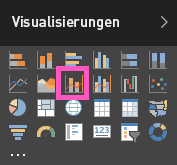

# Kombinationsdiagramm in Power BI (Tutorial)
Ein Kombinationsdiagramm in Power BI ist eine einzelne Visualisierung, die ein Liniendiagramm und ein Säulendiagramm kombiniert. Die Kombination von zwei Diagrammen in einem ermöglicht einen schnelleren Vergleich von Daten.

Kombinationsdiagramme können ein oder zwei y-Achsen haben.

## Einsatz von Kombinationsdiagrammen
Kombinationsdiagramme sind gut für folgende Zwecke geeignet:

* Bei einem Liniendiagramm und ein Säulendiagramm mit der gleichen X-Achse
* Zum Vergleichen mehrerer Kennzahlen mit verschiedenen Wertebereichen
* Zum Verdeutlichen der Zusammenhänge zweier Kennzahlen in einer Visualisierung
* Zum Prüfen, ob eine Kennzahl das durch eine andere Kennzahl vorgegebene Ziel erfüllt
* Zur Platzersparnis im Zeichenbereich

## Erstellen eines einfachen Kombinationsdiagramms mit einer Achse
In diesem Video sehen Sie, wie ein Kombinationsdiagramm anhand des Beispiels für Vertrieb und Marketing erstellt wird.

<iframe width="560" height="315" src="https://www.youtube.com/embed/lnv66cTZ5ho?list=PL1N57mwBHtN0JFoKSR0n-tBkUJHeMP2cP" frameborder="0" allowfullscreen></iframe>

Melden Sie sich zum Erstellen eines Kombinationsdiagramms bei Power BI an, und wählen Sie **Daten abrufen \> Beispiele \> Analysebeispiel für Einzelhandel** aus. 

1. Wählen Sie im Dashboard „Analysebeispiel für Einzelhandel“ die Kachel **Läden gesamt** aus, um den Bericht „Analysebeispiel für Einzelhandel“ zu öffnen.
2. Wählen Sie **Bericht bearbeiten** , um den Bericht in der Bearbeitungsansicht zu öffnen.
3. [Fügen Sie eine neue Seite zu Ihrem Bericht hinzu](power-bi-report-add-page.md).
4. Erstellen Sie ein Säulendiagramm, das den Absatz des laufenden Jahres und den Bruttogewinn pro Monat anzeigt.
   
    a.  Wählen Sie im Bereich „Felder“ die Option **Verkäufe** \> **Verkäufe in diesem Jahr**  >  **Wert**.
   
    b.  Ziehen Sie **Vertrieb** \>**Bruttogewinn in diesem Jahr** in den Bereich **Wert**.
   
    c.  Wählen Sie **Zeit** \> **Geschäftsmonat** aus, um den Wert dem Bereich **Achse** hinzuzufügen. 
   
    
5. Wählen Sie die Auslassungspunkte (...) in der rechten oberen Ecke der Visualisierung aus, und wählen Sie **Nach Geschäftsmonat sortieren**.
6. Konvertieren Sie das Säulendiagramm in ein Kombinationsdiagramm. Wenn Sie das Säulendiagramm ausgewählt haben, wählen Sie im Bereich **Visualisierungen** die Option **Linien- und gruppiertes Säulendiagramm** aus.
   
    
7. Ziehen Sie aus dem Bereich **Felder** die Option **Vertrieb** \> **Verkäufe im letzten Jahr** in den Bucket **Zeilenwerte**.
   
   
   
   Das Kombinationsdiagramm sollten nun ungefähr so aussehen:
   
   

## Erstellen eines Kombinationsdiagramms mit zwei Achsen
In dieser Aufgabe vergleichen wir Bruttogewinn und Umsätze.

1. Erstellen Sie ein neues Liniendiagramm, das den Bruttogewinn in Prozent im letzten Jahr nach Monaten nachverfolgt.  Im Januar lag der Prozentsatz des Bruttogewinns bei 35 %, der Höchststand im April lag bei 45 %, im Juli fiel der Wert, und im August erreichte er wieder einen Spitzenwert. Sehen wir ein ähnliches Muster bei den Umsätzen im letzten und in diesem Jahr?
   
   
2. Fügen Sie dem Liniendiagramm **Verkäufe in diesem Jahr > Wert** und **Verkäufe im letzten Jahr** hinzu. Da der **Bruttogewinn % Vorjahr** wesentlich kleiner ist als die **Umsätze** , können diese Werte nur schwer verglichen werden.      
   
   
3. Konvertieren Sie das Liniendiagramm zu einem Linien- und gestapelten Säulendiagramm, damit die Visualisierung besser gelesen und interpretiert werden kann.
   
   
4. Ziehen Sie **Bruttogewinn % Vorjahr** aus **Spaltenwerte** in **Zeilenwerte**. Power BI erstellt zwei Achsen, sodass die Datasets anders skaliert werden können. Die linke Achse gibt den Dollarbetrag an, die rechte Achse die Prozentzahl.
   
       

## Hinzufügen von Titeln zu den Achsen
1. Wählen Sie das Farbrollersymbol  aus, um den Formatierungsbereich zu öffnen.
2. Wählen Sie den Pfeil nach unten aus, um die Optionen für die **Y-Achse** zu erweitern.
3. Nehmen Sie für **Y-Achse (Spalte)** die folgenden Einstellungen vor: Wählen Sie für **Position** die Option **Links**, für **Titel** die Option **Ein**, für **Stil** die Option **Nur Titel anzeigen** und für **Anzeigen** die Option **Millionen**.
   
   
4. Stellen Sie außerdem sicher, dass unter **Y-Achse (Spalte)** für **Sekundäre anzeigen** die Option **Ein** gewählt wurde. Dadurch werden für den Liniendiagrammanteil des Kombinationsdiagramms Formatierungsoptionen angezeigt.
   
   
5. Unter **Y-Achse (Linie)** ist für **Position** bereits die hier benötigte Option **Rechts** aktiviert. Stellen Sie **Titel**  auf **Ein**, und wählen Sie für **Stil** die Option **Nur Titel anzeigen**.
   
   Das Kombinationsdiagramm verfügt nun über zwei Y-Achsen mit jeweils eigenem Titel.
   
   

Jetzt haben Sie folgende Möglichkeiten:

* [Fügen Sie das Kombinationsdiagramm als Dashboardkachel hinzu.](service-dashboard-tiles.md)
* [Speichern Sie den Bericht](service-report-save.md).

## Hervorheben und Kreuzfiltern
Informationen zur Verwendung des Filterbereichs finden Sie unter [Hinzufügen eines Filters zu einem Bericht in Power BI](power-bi-report-add-filter.md).

Das Markieren einer Spalte oder Zeile in einem Kombinationsdiagramm ermöglicht ein Kreuzfiltern anderer Visualisierungen auf der Berichtsseite und umgekehrt.

## Nächste Schritte
[Hinzufügen einer Visualisierung zu einem Bericht](power-bi-report-add-visualizations-i.md)

[Visualisierungen in Power BI-Berichten](power-bi-report-visualizations.md)

[Visualisierungstypen in Power BI](power-bi-visualization-types-for-reports-and-q-and-a.md)

[Power BI – Grundkonzepte](service-basic-concepts.md)

[Jetzt kostenlos testen](https://powerbi.com/)

Weitere Fragen? [Wenden Sie sich an die Power BI-Community](http://community.powerbi.com/)

