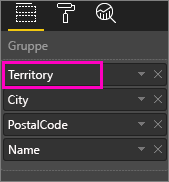
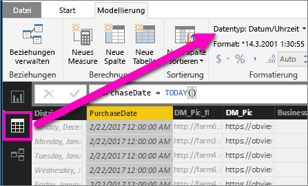

# Drilldown in einer Visualisierung in Power BI
## Ein Drilldown setzt eine Hierarchie voraus
Wenn eine Visualisierung eine Hierarchie aufweist, können Sie einen Drilldown ausführen, um weitere Details einzublenden. Sie verfügen beispielsweise über eine Visualisierung eines Olympia-Medaillenspiegels, hierarchisch geordnet nach Sportart, Disziplin und Ereignis. Standardmäßig würde die Visualisierung die Anzahl der Medaillen nach Sportart anzeigen – Gymnastik, Skisport, Wassersport usw. Da jedoch eine Hierarchie vorhanden ist, wird durch die Auswahl eines Visualisierungselements (etwa eines Balkens, einer Linie oder einer Blase) ein zunehmend detaillierteres Bild angezeigt werden. Sie würden beispielsweise das Element **Wassersport** auswählen, um Daten für Schwimmsport, Kunstspringen und Wasserball anzuzeigen.  Sie wählen das Element **Kunstspringen** aus, um Details zu Sprungbrett, Sprungturm und Synchronsprung-Veranstaltungen anzuzeigen.

Sie können Hierarchien Berichten hinzufügen, deren Eigentümer Sie sind, jedoch nicht Berichten, die für Sie freigegeben wurden.
Sie sind nicht sicher, welche Power BI-Visualisierungen eine Hierarchie enthalten?  Zeigen Sie mit dem Mauszeiger auf eine Visualisierung. Wenn diese Drilldown-Steuerelemente in den oberen Ecken sichtbar sind, weist die Visualisierung eine Hierarchie auf.

    
   

Datumsangaben stellen einen eindeutigen Hierarchietyp dar. Wenn Sie einer Visualisierung ein Datumsfeld hinzufügen, wird in Power BI automatisch eine Zeithierarchie hinzugefügt, die Jahr, Quartal, Monat und Tag enthält. Weitere Informationen finden Sie unter [Visuelle Hierarchien und Drilldownverhalten](guided-learning/visualizations.yml?tutorial-step=18), oder sehen Sie sich das Video unten an.

  <iframe width="560" height="315" src="https://www.youtube.com/embed/MNAaHw4PxzE?list=PL1N57mwBHtN0JFoKSR0n-tBkUJHeMP2cP" frameborder="0" allowfullscreen></iframe>

> [!NOTE]
> Informationen zum Erstellen von Hierarchien mit Power BI Desktop erhalten Sie im Video zum [Erstellen und Hinzufügen von Hierarchien](https://youtu.be/q8WDUAiTGeU).
> 
> 

## Zwei Drilldown-Methoden
Es gibt zwei Methoden, um in Ihrer Visualisierung einen Drilldown (und Drillup) durchzuführen.  Beide werden in diesem Artikel beschrieben. Sie erreichen mit beiden Methoden dasselbe Ziel und können daher beliebig wählen.

> [!NOTE]
> [Öffnen Sie hierfür das Analysebeispiel für Einzelhandel](sample-datasets.md) im Power BI-Dienst, und erstellen Sie eine TreeMap, in der **Total Units This Year** (Summe der Einheiten, dieses Jahr) (Werte) nach **Territory** (Gebiet), **City** (Stadt), **PostalCode** (Postleitzahl) und **Name** (Gruppe) betrachtet werden.  
> 
> 

## Methode 1 für Drilldowns
Bei dieser Methode werden die Drilldownsymbole verwendet, die sich in den oberen Ecken der Visualisierung selbst befinden.

1. Öffnen Sie in Power BI einen Bericht in der [Leseansicht oder der Bearbeitungsansicht](service-reading-view-and-editing-view.md). Der Drilldown erfordert eine Visualisierung mit einer Hierarchie. 
   
   Eine Hierarchie wird in der Animation unten veranschaulicht.  Die Visualisierung weist eine Hierarchie aus Gebiet, Stadt, Postleitzahl und Ortsname auf. Jedes Gebiet umfasst eine oder mehrere Städte, jede Stadt weist eine oder mehrere Postleitzahlen auf usw. In der Standardeinstellung werden in der Visualisierung nur die Gebietsdaten angezeigt, da *Territory* (Gebiet) in der Liste als erster Eintrag aufgeführt wird.
   
   
2. Um einen Drilldown zu aktivieren, wählen Sie das Pfeilsymbol in der oberen rechten Ecke der Visualisierung aus. Ist das Symbol dunkel, ist der Drilldown aktiviert. Wenn Sie den Drilldown nicht aktivieren und ein visuelles Element (wie einen Balken oder eine Blase) auswählen, wird ein übergreifender Filtervorgang für die übrigen Diagramme auf der Berichtsseite ausgeführt.    
   
   
3. Um in **einem Feld nach dem anderen** einen Drilldown auszuführen, wählen Sie eines der Elemente in Ihrer Visualisierung aus. In einem Balkendiagramm bedeutet dies, dass Sie auf einen der Balken klicken müssen. In einem Treemap-Diagramm bedeutet dies, dass Sie auf eines der **Blätter** klicken müssen. Beachten Sie, dass sich der Titel ändert, wenn Sie einen Drilldown und anschließend einen Drillup ausführen. In dieser Animation wird er von „Total Units This Year by Territory“ (Summe der Einheiten, dieses Jahr nach Gebiet) über „Total Units This Year by Territory and City“ (Summe der Einheiten, dieses Jahr nach Gebiet und Stadt) in „Total Units This Year by Territory, City and PostalCode“ (Summe der Einheiten, dieses Jahr nach Gebiet, Stadt und Postleitzahl) und schließlich in „Total Units This Year by Territory, City, PostalCode, and Name“ (Summe der Einheiten, dieses Jahr nach Gebiet, Stadt, Postleitzahl und Name) geändert. Um anschließend einen Drillup auszuführen, wählen Sie das Symbol **Drillup**  in der linken oberen Ecke der Visualisierung aus (siehe unten).
   
   
4. Um für ***alle Felder gleichzeitig*** einen Drilldown durchzuführen, wählen Sie den doppelten Pfeil in der linken oberen Ecke der Visualisierung aus.
   
   
5. Um einen Drilldown bei der Sicherung durchzuführen, wählen Sie den Pfeil nach oben in der oberen linken Ecke der Visualisierung aus.
   
   

## Methode 2 für Drilldowns
Bei dieser Methode wird das Dropdownmenü **Durchsuchen** in der oberen Power BI-Menüleiste verwendet.

1. Öffnen Sie in Power BI einen Bericht in der [Leseansicht oder der Bearbeitungsansicht](service-reading-view-and-editing-view.md). Der Drilldown erfordert eine Visualisierung mit einer Hierarchie. 
   
   Eine Hierarchie wird in der Abbildung unten veranschaulicht.  Die Visualisierung weist eine Hierarchie aus Gebiet, Stadt, Postleitzahl und Ortsname auf. Jedes Gebiet umfasst eine oder mehrere Städte, jede Stadt weist eine oder mehrere Postleitzahlen auf usw. In der Standardeinstellung werden in der Visualisierung nur die Gebietsdaten angezeigt, da *Territory* (Gebiet) in der Liste als erster Eintrag aufgeführt wird.
   
   
2. Um einen Drilldown zu aktivieren, wählen Sie eine Visualisierung aus, um diese zu aktivieren, und wählen Sie in der oberen Menüleiste von Power BI **Durchsuchen** > **Drilldown** aus. Das Drilldownsymbol in der rechten oberen Ecke der Visualisierung erhält einen schwarzen Hintergrund.   
   
   
3. Sobald die Option aktiviert ist, führen Sie einen Drilldown jeweils für ein Feld aus, indem Sie eines der Treemap-Blätter auswählen. In diesem Beispiel wurde das Gebiet **NC** ausgewählt, um die Gesamtzahl der in diesem Jahr in North Carolina verkauften Einheiten nach Stadt anzuzeigen.
   
   
4. Um einen Drilldown für alle Felder gleichzeitig durchzuführen, wählen Sie **Durchsuchen** > **Nächste Ebene anzeigen** aus.
   
   
5. Wählen Sie für einen anschließenden Drillup **Durchsuchen** > **Drillup** aus.
   
   

6. Um die zum Erstellen der Visualisierung verwendeten Daten anzuzeigen, wählen Sie **Daten anzeigen**. Die Daten werden in einem Bereich unterhalb der Visualisierung angezeigt. Dieser Bereich bleibt während des Drilldowns in der Visualisierung erhalten. Weitere Informationen finden Sie unter [Anzeigen der zum Erstellen der Visualisierung verwendeten Daten](service-reports-show-data.md).

## Grundlegendes zur Hierarchieachse und Hierarchiegruppe
Sie können sich die Hierarchieachse und -gruppe als die Mechanismen vorstellen, die Sie zum Erhöhen und Reduzieren der Granularität der anzuzeigenden Daten verwenden können. Alle Daten, die in Kategorien und Unterkategorien eingeteilt werden können, sind dafür qualifiziert, eine Hierarchie zu besitzen. Dies schließt natürlich Datums- und Uhrzeitangaben mit ein.

Sie können in Power BI Visualisierungen erstellen, die über eine Hierarchie verfügen. Wählen Sie dazu mindestens ein Datenfeld aus, das Sie entweder der Datenquelle **Achse** oder **Gruppe** zusammen mit den Daten hinzufügen, die Sie als Datenfelder unter **Werte** untersuchen möchten. Sobald Drillmodussymbole in der oberen linken und rechten Ecke Ihrer Visualisierung angezeigt werden, wissen Sie, dass Ihre Daten hierarchisch sind. 

Es ist ganz praktisch, sich zwei Typen hierarchischer Daten vorzustellen:
- Datums- und Uhrzeitdaten: Wenn Sie über ein Datenfeld mit dem DateTime-Datentyp verfügen, besitzen Sie bereits hierarchische Daten. Power BI erstellt automatisch eine Hierarchie für Datenfelder, deren Werte in eine [DateTime](https://msdn.microsoft.com/library/system.datetime.aspx)-Struktur aufgelöst werden können. Sie müssen der **Achse** oder **Gruppe** jeweils nur ein DateTime-Feld hinzufügen
- Kategorische Daten: Wenn Ihre Daten von Sammlungen abstammen, die untergeordnete Sammlungen enthalten oder in einem anderen Fall über Datenzeilen verfügen, die gemeinsame Werte beinhalten, besitzen Sie hierarchische Daten.

Power BI ermöglicht eine Detailanzeige für eine oder alle Teilmengen. Sie können einen Drilldown durch Ihre Daten ausführen, um eine einzelne Teilmenge pro Ebene anzuzeigen, oder alle Teilmengen gleichzeitig auf jeder Ebene anzuzeigen. Sie können beispielsweise einen Drilldown für ein bestimmtes Jahr durchführen, oder Sie können alle Ergebnisse für jedes Jahr anzeigen, wenn Sie die Hierarchie abgehen. Sie können ebenso einen Drillup ausführen.

In den folgenden Abschnitten werden Drilldowns von der höchsten Ansicht, der mittleren Ansicht und der niedrigsten Ansicht beschrieben

### Hierarchische Datums- und Uhrzeitdaten
Befolgen Sie in diesem Beispiel das [Analysebeispiel für den Einzelhandel](sample-datasets.md), und erstellen Sie eine Ansicht eines gestapelten Säulendiagramms, das die Angaben **Monat** (Achse) nach **TotalSales** (Gesamtverkäufe) (Werte) enthält.  

Obwohl das Datenfeld „Achse“ **Monat** ist, erstellt es noch immer die Kategorie **Jahr** unter **Achse**. Der Grund dafür ist, dass Power BI die vollständige DateTime-Struktur für alle gelesenen Werte bereitstellt. Die oberste Hierarchieebene zeigt Daten für das Jahr.

Mit dem Drilldownmodus können Sie auf die Säule im Diagramm klicken und diese eine Ebene in der Hierarchie heruntersetzen. Es werden drei Säulen für die verfügbaren Daten der Quartale angezeigt. Wählen Sie aus den Symbolen links oben die Option **Expand all down one level of the hierarchy** (Alles eine Hierarchieebene nach unten erweitern) aus. Wiederholen Sie diesen Schritt, um zur niedrigsten Ebene der Hierarchie zu gelangen, die die Ergebnisse für jeden Monat zeigt.

Abgesehen von der Visualisierung können wir die Hierarchie sehen, die in den für jeden Bericht gerenderten Daten übernommen wird. Die folgende Tabelle werden die Ergebnisse von **Daten anzeigen** mit einem Drilldown von einem Monat oder allen Monaten in einem Bericht angezeigt. 

Beachten Sie, dass die Daten für Quartals- und Jahresberichte übereinstimmen. Nach dem Drilldown zur Detailebene, die für **Werte** festgelegt ist, können Sie jedoch sehen, wie der einzelne Bericht genauer wird und dass der Bericht „all months“ (alle Monate) über mehr Daten verfügt.

|Modus „Erweitern“|Jahr|Quartal|Monat|Tag|
| ---|:---:|:---:|:---:|---|
|Einfach|||||
|Alle|||||

### Hierarchische Kategoriedaten
Daten, die aus Sammlungen und Untersammlungen generiert wurden, sind hierarchisch. Ein gutes Beispiel hierfür sind Standortdaten. Nehmen wir hierfür eine Tabelle in einer Datenquelle, die die Säulen „Land“, „Staat“, „Stadt“ und „PLZ“ besitzt. Daten, deren Werte für Land, Staat und Stadt übereinstimmen, sind hierarchisch.

Nehmen Sie hierzu wieder das [Analysebeispiel für Einzelhandel](sample-datasets.md) her. Erstellen Sie eine Ansicht eines gestapelten Säulendiagramms, das so aussieht: **Gesamte Einheiten in diesem Jahr** (Werte) nach **Gebiet**, **Stadt**, **Postleitzahl** und **Name** (Gruppe).  

Wählen Sie mit aktivierten Drilldownmodus aus den Symbolen links oben dreimal die Option **Expand all down one level of the hierarchy** (Alles eine Hierarchieebene nach unten erweitern) aus.
Sie sollten sich auf der untersten Ebene der Hierarchie befinden, auf der die Ergebnisse für Gebiet, Stadt und Postleitzahl angezeigt werden.

Abgesehen von der Visualisierung können wir die Hierarchie sehen, die in den für jeden Bericht gerenderten Daten übernommen wird. Die folgende Tabelle werden die Ergebnisse von **Daten anzeigen** in einem Bericht angezeigt, der einen Drilldown für ein einzelnes Gebiet oder alle Gebiete durchführt. Wenn Sie einen Drilldown ausführen, können Sie sehen, wie ein einzelner Bericht genauer wird und dass der Bericht „alle Gebiete“ über mehr Daten verfügt.

| Modus „Erweitern“|Territory|Stadt|PLZ|Name|
| ---|:---:|:---:|:---:|---|
|Einfach|||||
|Alle|||||

## Überlegungen und Einschränkungen
* Wenn Sie einer Visualisierung ein Datumsfeld hinzufügen, wird dadurch keine Hierarchie erstellt. Möglicherweise wird das Feld „Datum“ nicht tatsächlich als Datum gespeichert. Wenn Sie Eigentümer des Datasets sind, öffnen Sie es in der *Datensicht* in Power BI Desktop, wählen Sie die Spalte mit dem Datum aus, und ändern Sie auf der Registerkarte „Modellierung“ den **Datentyp** in **Datum** oder **Datum/Uhrzeit**. Wenn der Bericht für Sie freigegeben wurde, wenden Sie sich an den Eigentümer, um die Änderung anzufordern.  
  
  

## Nächste Schritte
[Visualisierungen in Power BI-Berichten](power-bi-report-visualizations.md)

[Power BI-Berichte](service-reports.md)

[Power BI – Grundkonzepte](service-basic-concepts.md)

Weitere Fragen? [Wenden Sie sich an die Power BI-Community](http://community.powerbi.com/)

