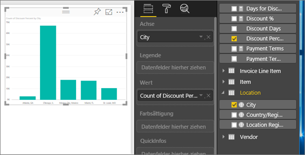

# Exportieren von Daten aus Visualisierungen
Wenn Sie die Daten anzeigen möchten, mit denen eine Visualisierung erstellt wird, können Sie [die Daten in Power BI anzeigen](service-reports-show-data.md) oder (als XLSX- bzw. CSV-Datei) in Excel exportieren.   

Sehen Sie zu, wie Will Daten aus einer der Visualisierungen in seinem Bericht exportiert, als XLSX-Datei speichert und dann in Excel öffnet. Befolgen Sie dann die schrittweisen Anleitungen unter dem Video, um es selbst ausprobieren.

<iframe width="560" height="315" src="https://www.youtube.com/embed/KjheMTGjDXw" frameborder="0" allowfullscreen></iframe>

## Aus einer Visualisierung in einem Power BI-Dashboard
1. Wählen Sie die Auslassungszeichen in der rechten oberen Ecke der Visualisierung aus.
   
    
2. Wählen Sie das Symbol **Daten exportieren** aus.
   
    
3. Die Daten werden in eine CSV-Datei exportiert. Wenn die Visualisierung gefiltert wird, werden auch die heruntergeladenen Daten gefiltert.    
4. Sie werden im Browser zum Speichern der Datei aufgefordert.  Öffnen Sie die CSV-Datei nach dem Speichern in Excel.
   
    

## Aus einer Visualisierung in einem Bericht
Um dies nachzuvollziehen, öffnen Sie den [Bericht Analysebeispiel für Beschaffung](sample-procurement.md) in der [Bearbeitungsansicht](service-reading-view-and-editing-view.md). [Fügen Sie eine neue leere Berichtsseite hinzu](power-bi-report-add-page.md). Befolgen Sie anschließend die untenstehenden Schritte, um eine Aggregation und einen Filter auf Visualisierungsebene hinzuzufügen.

1. Erstellen Sie ein Säulendiagramm.  Wählen Sie im Bereich „Felder“ **Location > City** (Ort > Stadt) und **Invoice > Discount Percent** (Rechnung > Rabatt in Prozent) aus.  Sie müssen den **Rabatt in Prozent** möglicherweise in den Wertebereich verschieben. 
   
    
2. Ändern Sie die Aggregation für **Discount Percent** (Rabatt in Prozent) von **Count** (Anzahl) in **Average** (Durchschnitt). Klicken Sie im Wertebereich auf den Pfeil rechts neben **Discount Percent** (Rabatt in Prozent), wobei die Bezeichnung auch **Count of Discount Percent** (Anzahl von Rabatt in Prozent) lauten kann, und wählen Sie **Average** (Durchschnitt) aus.
   
    
3. Fügen Sie **City** (Stadt) einen Filter hinzu, um **Atlanta** zu entfernen.
   
   
   
   Nun können Sie beide Optionen für das Exportieren von Daten ausprobieren.
4. Wählen Sie die Auslassungszeichen in der rechten oberen Ecke der Visualisierung aus. Wählen Sie  **Daten exportieren**aus.
   
   
5. Wenn Ihre Visualisierung ein Aggregat aufweist (wenn Sie beispielsweise **Count** (Anzahl) in *Average* (Durchschnitt), **Summe** oder *Minimum* geändert haben), verfügen Sie über zwei Optionen: **Zusammengefasste Daten** und **Zugrunde liegende Daten**. Weitere Informationen zu Aggregaten finden Sie unter [Aggregate in Power BI](service-aggregates.md).
   
    
6. Wählen Sie **Zusammengefasste Daten** > **Exportieren** aus, und wählen Sie das Format „.xlsx“ oder „.csv“ aus. Die Daten werden aus Power BI exportiert.  Wenn Sie Filter auf die Visualisierung angewendet haben, werden die Daten entsprechend den Filtereinstellungen exportiert. Wenn Sie **Exportieren** auswählen, werden Sie in Ihrem Browser zum Speichern aufgefordert. Öffnen Sie die Datei nach dem Speichern in Excel.
   
   **Zusammengefasste Daten**: Wählen Sie diese Option aus, wenn kein Aggregat vorhanden ist oder ein Aggregat vorhanden ist, Sie aber nicht die vollständige Aufschlüsselung sehen möchten. Wenn Sie beispielsweise über ein Balkendiagramm mit vier Balken verfügen, erhalten Sie vier Datenzeilen. Zusammengefasste Daten sind im XLSX- und CSV-Format verfügbar.
   
   In diesem Beispiel wird im Excel-Export eine Summe für jede Stadt angezeigt. Da Atlanta herausgefiltert wurde, ist die Stadt nicht in den Ergebnissen enthalten.  In der ersten Zeile der Tabelle sind die Filter aufgeführt, die beim Extrahieren der Daten aus Power BI angewendet wurden.
   
   
7. Wählen Sie nun **Zugrunde liegende Daten** > **Exportieren** aus, und wählen Sie das Format „.xlsx“ aus. Die Daten werden aus Power BI exportiert. Wenn Sie Filter auf die Visualisierung angewendet haben, werden die Daten entsprechend den Filtereinstellungen exportiert. Wenn Sie **Exportieren** auswählen, werden Sie in Ihrem Browser zum Speichern aufgefordert. Öffnen Sie die Datei nach dem Speichern in Excel.
   
   >[!WARNING]
   >Wenn die zugrunde liegenden Daten exportiert werden, sind alle detaillierten Daten – jede Spalte in den Daten – für die Benutzer sichtbar. Power BI-Dienst-Administratoren können dies für ihre Organisation deaktivieren. Wenn Sie Datasetbesitzer sind, können Sie proprietäre Spalten auf „Ausgeblendet“ festlegen, sodass diese weder in Desktop noch im Power BI-Dienst in der Feldliste angezeigt werden.
   
   
   **Zugrunde liegende Daten**: Wählen Sie diese Option aus, wenn die Visualisierung ein Aggregat enthält und Sie alle zugrunde liegenden Details anzeigen möchten. Im Grunde wird durch die Auswahl von *Zugrunde liegende Daten* das Aggregat entfernt. Wenn Sie **Exportieren** auswählen, werden die Daten in eine XLSX-Datei exportiert, und Sie werden im Browser dazu aufgefordert, die Datei zu speichern. Öffnen Sie die Datei nach dem Speichern in Excel.
   
   In diesem Beispiel enthält der Excel-Export eine Zeile für jede einzelne Zeile „City“ (Stadt) im Dataset sowie den Rabatt in Prozent für den jeweiligen Eintrag. Das heißt, die Daten werden vereinfacht und nicht aggregiert. In der ersten Zeile der Tabelle sind die Filter aufgeführt, die beim Extrahieren der Daten aus Power BI angewendet wurden.  
   
   

## Einschränkungen und Überlegungen
* Die maximale Anzahl von Zeilen, die aus **Power BI Desktop** und aus dem **Power BI-Dienst** in das CSV-Format exportiert werden kann, ist 30.000.
* Die maximale Anzahl von Zeilen, die nach XLSX exportiert werden kann, ist 150.000.
* Das Exportieren mithilfe von *Zugrunde liegende Daten* ist nicht möglich, wenn die Datenquelle eine Analysis Services-Liveverbindung ist, die Version älter als 2016 ist und die Tabellen im Modell keinen eindeutigen Schlüssel aufweisen.  
* Das Exportieren mithilfe von *Zugrunde liegende Daten* ist nicht möglich, wenn für die zu exportierende Visualisierung die Option *Elemente ohne Daten anzeigen* aktiviert ist.
* Wenn Sie DirectQuery verwenden, können maximal 16 MB Daten exportiert werden. Dies kann dazu führen, dass weniger als die maximale Anzahl von Zeilen exportiert wird, insbesondere wenn viele Spalten vorhanden sind, die Daten schwierig zu komprimieren sind und weitere Faktoren die Dateigröße erhöhen und die Anzahl exportierter Zeilen verringern.
* Power BI unterstützt nur Exporte in visuelle Elemente mit einfachen Aggregaten. Für visuelle Elemente mit Modell- oder Berichtsmeasures sind keine Exporte verfügbar.
* Benutzerdefinierte Visuals und R-Visuals werden derzeit nicht unterstützt.
* Die Funktion zum Exportieren von Daten steht Benutzern, die der Organisation nicht angehören und ein für sie freigegebenes Dashboard verwenden, nicht zur Verfügung. 
* Ein Feld (eine Spalte) kann in Power BI umbenannt werden, indem Sie doppelt auf das Feld klicken und einen neuen Namen eingeben.  Dieser neue Name wird als *Alias* bezeichnet. Es ist möglich, dass im Power BI-Bericht doppelte Feldnamen vorhanden sind. Excel erlaubt jedoch keine Duplikate.  Wenn die Daten also in Excel importiert werden, werden die Feldaliase auf ihre ursprünglichen Feld- bzw. Spaltennamen zurückgesetzt.  
* Wenn Unicode-Zeichen in der CSV-Datei vorhanden sind, wird der Text in Excel möglicherweise nicht korrekt angezeigt. In Notepad kann die Datei einwandfrei geöffnet werden. Beispiele für Unicode-Zeichen sind Währungssymbole und Fremdwörter. Um dieses Problem zu umgehen, importieren Sie die CSV-Datei in Excel, anstatt sie direkt zu öffnen. Gehen Sie wie folgt vor:
  
  1. Öffnen Sie Excel.
  2. Wählen Sie auf der Registerkarte **Daten** die Befehlsfolge **Externe Daten abrufen** > **Aus Text**.
* Power BI-Administratoren können das Exportieren von Daten deaktivieren.

## Nächste Schritte
[Dashboards in Power BI](service-dashboards.md)  
[Berichte in Power BI](service-reports.md)  
[Power BI – Grundkonzepte](service-basic-concepts.md)

Weitere Fragen? [Stellen Sie Ihre Frage in der Power BI-Community.](http://community.powerbi.com/)

