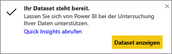
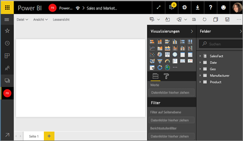
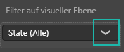
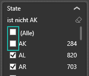
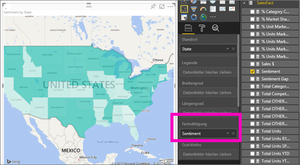
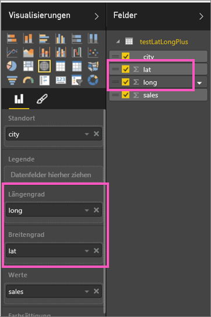

# Flächenkartogramme (Choroplethenkarten) in Power BI (Tutorial)
In einem Flächenkartogramm wird mithilfe von Schattierungen, Farben oder Mustern angezeigt, in welchem Verhältnis Werte innerhalb eines geografischen Gebiets stehen.  Diese relativen Unterschiede werden mithilfe von Schattierungen angezeigt, wobei hell eine geringe Menge/Häufigkeit und dunkel eine große Menge/Häufigkeit anzeigt.    

## An Bing gesendete Informationen
Power BI arbeitet mit Bing zusammen, um Standardkartenkoordinaten bereitzustellen (ein Prozess, der als Geocodierung bezeichnet wird). Wenn Sie im Power BI-Dienst oder in Power BI Desktop eine Kartenvisualisierung erstellen, werden die Daten in den Buckets **Standort**, **Breitengrad** und **Längengrad** (die dazu verwendet werden, diese Visualisierung zu erstellen) an Bing gesendet.

Sie oder der Administrator müssen möglicherweise die Firewall aktualisieren, um den Zugriff auf die von Bing für die Geocodierung verwendeten URLs zuzulassen.  Diese URLs lauten:
* https://dev.virtualearth.net/REST/V1/Locations
* https://platform.bing.com/geo/spatial/v1/public/Geodata
* https://www.bing.com/api/maps/mapcontrol

Weitere Informationen zu den an Bing gesendeten Daten sowie Tipps für eine erfolgreichere Geocodierung finden Sie unter [Tipps und Tricks für Power BI-Kartenvisualisierungen](power-bi-map-tips-and-tricks.md).

## Einsatz von Flächenkartogrammen
Flächenkartogramme sind gut für folgende Zwecke geeignet:

* Zum Anzeigen quantitativer Informationen auf einer Karte
* Zum Anzeigen räumlicher Muster und Beziehungen
* Bei standardisierten Daten
* Bei der Arbeit mit sozioökonomischen Daten
* Wenn bestimmte Regionen von Bedeutung sind
* Für einen Überblick in Bezug auf die Verteilung über geografische Standorte hinweg

### Voraussetzungen
- Power BI-Dienst oder Power BI Desktop
- Beispiel für Vertrieb und Marketing

Im Tutorial wird der Power BI-Dienst und nicht Power BI Desktop verwendet.

## Erstellen eines grundlegenden Flächenkartogramms
In diesem Video wird eine einfache Karte erstellt und in ein Flächenkartogramm umgewandelt.

<iframe width="560" height="315" src="https://www.youtube.com/embed/ajTPGNpthcg" frameborder="0" allowfullscreen></iframe>

1. Um ein eigenes Flächenkartogramm zu erstellen, [laden Sie das Beispiel für Vertrieb und Marketing herunter](sample-datasets.md). Melden Sie sich zu diesem Zweck bei Power BI an, und wählen Sie **Daten abrufen \> Beispiele \> Vertrieb und Marketing\> Verbinden** aus.
2. Wenn die Erfolgsmeldung angezeigt wird, wählen Sie **Dataset anzeigen** aus.

   
3. Power BI öffnet einen leeren Berichtszeichenbereich in der [Bearbeitungsansicht](service-interact-with-a-report-in-editing-view.md).

    
4. Wählen Sie im Bereich „Felder“ das Feld **Geo** \> **Bundesstaat** aus.    

   
5. [Wandeln Sie das Diagramm](power-bi-report-change-visualization-type.md) in ein Flächenkartogramm um. Beachten Sie, dass sich **Bundesstaat** jetzt im Bereich **Standort** befindet. Bing Maps verwendet das Feld unter **Standort**bereich, um die Karte zu erstellen.  Gültige Orte umfassen z. B. Länder, Bundesländer, Landkreise, Städte, Postleitzahlen usw. Bing Maps bietet verschiedene Formen für Orte auf der ganzen Welt. Ohne einen gültigen Wert im Bereich „Ort“ kann Power BI kein Flächenkartogramm erstellen.  

   
6. Filtern Sie die Karte, um nur die kontinentalen USA anzuzeigen.

   a.  Suchen Sie im unteren Teil des Visualisierungsbereichs nach **Filter** .

   b.  Zeigen Sie auf **Bundesland** , und klicken Sie auf das Erweiterungssymbol.  
   

   c.  Setzen Sie ein Häkchen neben **Alle** , und entfernen Sie das Häkchen neben **AK**.

   
7. Wählen Sie **SalesFact** \> **Stimmung**, um diese Option zum Bereich **Farbsättigung** hinzuzufügen. Das Feld im Bereich **Farbsättigung** steuert die Schattierung der Karte.  
   
8. Das Flächenkartogramm ist grün schattiert. Hellgrün steht dabei für schlechtere und dunkelgrün für bessere (d.h. positive) Stimmungsdaten.  Wenn Sie Wyoming (WY) markieren, sehen Sie, dass dieser Bundesstaat über einen positiven Stimmungswert (74) verfügt.  
   
9. [Speichern Sie den Bericht](service-report-save.md).

## Hervorheben und Kreuzfiltern
Informationen zur Verwendung des Filterbereichs finden Sie unter [Hinzufügen eines Filters zu einem Bericht in Power BI](power-bi-report-add-filter.md).

Das Markieren eines Orts in einem Flächenkartogramm ermöglicht ein Kreuzfiltern anderer Visualisierungen auf der Berichtsseite – und umgekehrt.

Kopieren Sie nun das Flächenkartogramm, und fügen Sie es auf der Seite **Stimmung** des Berichts *Vertrieb und Marketing* ein.

1. Wählen Sie auf dem Flächenkartogramm einen Bundesstaat aus.  Dadurch werden die anderen Visualisierungen auf der Seite hervorgehoben. Wenn Sie z. B. **Texas** auswählen, wird angezeigt, dass die Stimmung einen Wert von 74 aufweist, Texas sich im „District \#23“ befindet und der Großteil des Verkaufsvolumens den Bereichen „Moderation“ und „Verbrauchsgüter“ zuzuordnen ist.   
   
2. Wechseln Sie im Liniendiagramm zwischen **Nein** und **Ja**. Dadurch wird das Flächenkartogramm gefiltert, und die Stimmung wird für VanArsdel sowie für die Wettbewerber von VanArsdel angezeigt.  
   

## Zu beachtende Aspekte und Problembehandlung
Kartendaten sind unter Umständen nicht eindeutig.  Neben Paris in Frankreich gibt es auch noch ein Paris in Texas. Ihre geografischen Daten sind wahrscheinlich in separaten Spalten gespeichert – eine Spalte für den Ortsnamen, eine Spalte für den Namen des Bundeslands oder des Landkreises usw. Für Bing ist es daher nicht eindeutig, welches Paris gemeint ist. Wenn das Dataset bereits Daten für die Breiten- und Längengrade enthält, umfasst Power BI spezielle Felder, mithilfe derer die Kartendaten eindeutig zugeordnet werden können. Ziehen Sie das Feld mit den Breitengraddaten in den Bereich „Visualisierungen \> Breitengrad“.  Führen Sie für den Längengrad die gleichen Schritte aus.  

Wenn Sie zum Bearbeiten des Datasets in Power BI Desktop berechtigt sind, erfahren Sie in diesem Video, wie Sie Mehrdeutigkeiten in Karten beheben.

<iframe width="560" height="315" src="https://www.youtube.com/embed/Co2z9b-s_yM" frameborder="0" allowfullscreen></iframe>

Wenn Sie keinen Zugriff auf die Breiten- und Längengraddaten haben, [befolgen Sie diese Anleitung, um Ihr Dataset zu aktualisieren](https://support.office.com/article/Maps-in-Power-View-8A9B2AF3-A055-4131-A327-85CC835271F7).

Weitere Hilfe zu Kartenvisualisierungen finden Sie unter [Tipps und Tricks für Kartenvisualisierungen](power-bi-map-tips-and-tricks.md).

## Nächste Schritte
[Fügen Sie das Flächenkartogramm als Dashboardkachel hinzu (Anheften des Visuals)](service-dashboard-tiles.md)  .  
 [Hinzufügen einer Visualisierung zu einem Bericht](power-bi-report-add-visualizations-i.md)  
 [Visualisierungstypen in Power BI](power-bi-visualization-types-for-reports-and-q-and-a.md)    
 [Ändern des verwendeten Visualisierungstyps](power-bi-report-change-visualization-type.md)      
Weitere Fragen? [Wenden Sie sich an die Power BI-Community](http://community.powerbi.com/)
