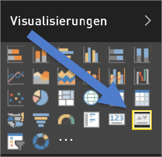
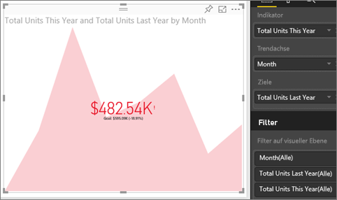

# KPI-Visualisierungen (Tutorial)
Ein Key Performance Indicator (KPI) ist ein visueller Hinweis, mit dem der Fortschritt in Bezug auf ein messbares Ziel kommuniziert wird. Weitere Informationen über KPIs finden Sie im [Microsoft Developer Network](https://msdn.microsoft.com/library/hh272050).

## Einsatzmöglichkeiten von KPIs
KPIs sind für folgende Zwecke gut geeignet:

* zum Messen des Fortschritts (wo habe ich Vorsprung, wo bin ich im Rückstand?)
* zum Messen der Entfernung bis zum Ziel (wie groß ist mein Vorsprung oder Rückstand?)   

## Anforderungen für KPI-Visualisierungen
Ein Key Performance Indicator (KPI) basiert auf einer bestimmten Kennzahl und ist so gestaltet, dass sich der aktuelle Wert und der Status einer Metrik im Vergleich zu einem definierten Ziel leicht auswerten lassen. Deshalb wird für eine KPI-Visualisierung eine *Basiskennzahl* benötigt, die im Hinblick auf einen Wert ausgewertet wird, und eine *Zielkennzahl* oder ein Zielwert sowie ein Schwellenwert oder ein Ziel.

> [!NOTE]
> Derzeit muss ein KPI-Dataset Zielwerte für einen KPI enthalten. Wenn Ihr Dataset keinen Zielwert enthält, können Sie Ziele erstellen, indem Sie dem Datenmodell oder der PBIX-Datei ein Excel-Arbeitsblatt mit Zielen hinzufügen.
> 
> 

## Erstellen eines KPI
Melden Sie sich beim Power BI-Dienst an, und wählen Sie **Daten abrufen > Beispiele > Analysebeispiel für Einzelhandel**. Im Folgenden wird ein KPI erstellt, der den Fortschritt beim Erreichen von Umsatzzielen misst.

Oder schauen Sie Will beim Erstellen von Einzelmetrik-Visualisierungen wie Messgeräten, Karten und KPIs zu.

<iframe width="560" height="315" src="https://www.youtube.com/embed/xmja6EpqaO0?list=PL1N57mwBHtN0JFoKSR0n-tBkUJHeMP2cP" frameborder="0" allowfullscreen></iframe>

1. Öffnen Sie den Bericht in der [Bearbeitungsansicht](service-reading-view-and-editing-view.md), und [fügen Sie eine neue Seite hinzu](power-bi-report-add-page.md).    
2. Wählen Sie **Umsatz > Gesamte Einheiten in diesem Jahr**.  Dies wird der Indikator.
3. Fügen Sie **Zeit > Monat** hinzu.  Dies dient zur Darstellung des Trends.
4. WICHTIG: Sortieren Sie das Diagramm nach **Monat**. Nachdem Sie die Visualisierung in einen KPI konvertiert haben, ist keine Option zum Sortieren vorhanden.

    
5. Wandeln Sie die Visualisierung in einen KPI um, indem Sie im Bereich „Visualisierungen“ das KPI-Symbol auswählen.
   
    
6. Fügen Sie ein Ziel hinzu. Verwenden Sie den Umsatz des letzten Jahres als Ziel. Ziehen Sie **Gesamte Einheiten im letzten Jahr** auf das Feld **Ziel**.
   
    
7. Optional können Sie den KPI formatieren. Wählen Sie dazu das Farbrollensymbol aus, um den Formatierungsbereich zu öffnen.
   
   * **Indikator**: Dient zum Steuern der Anzeigeeinheiten und der Dezimalstellen des Indikators.
   * **Trendachse**: Wenn hier **Ein** festgelegt ist, wird die Trendachse als Hintergrund der KPI-Visualisierung angezeigt.  
   * **Ziele**: Wenn hier **Ein** festgelegt ist, wird das Ziel in der Visualisierung angezeigt, und die Entfernung zum Ziel wird als Prozentsatz dargestellt.
   * **Farbcodierung > Richtung**: Bei einigen KPIs werden höhere Werte als *besser* betrachtet, und bei anderen gelten niedrigere Werte als *besser*. Nehmen Sie als Beispiel Erlös und Wartezeit. Im Gegensatz zur Wartezeit ist beim Erlös ist ein höherer Wert besser. Wählen Sie **hoch ist besser** aus, und ändern Sie optional die Farbeinstellungen.

1. Wenn der KPI Ihren Wünschen entspricht, [heften Sie ihn an ein Dashboard an](service-dashboard-pin-tile-from-report.md).

Die KPIs stehen Ihnen auch auf Mobilgeräten zur Verfügung, sodass Sie immer am Puls Ihres Unternehmens bleiben.

## Zu beachtende Aspekte und Problembehandlung
* Wenn der KPI nicht wie in der Abbildung oben aussieht, haben Sie möglicherweise keine Sortierung nach Monat ausgeführt. Da KPIs über keine Sortieroption verfügen, müssen Sie nach Monat sortieren, *bevor* Sie die Visualisierung in einen KPI umwandeln.

## Nächste Schritte

[Visualisierungen in Power BI-Berichten](power-bi-report-visualizations.md)

Weitere Fragen? [Wenden Sie sich an die Power BI-Community](http://community.powerbi.com/)

