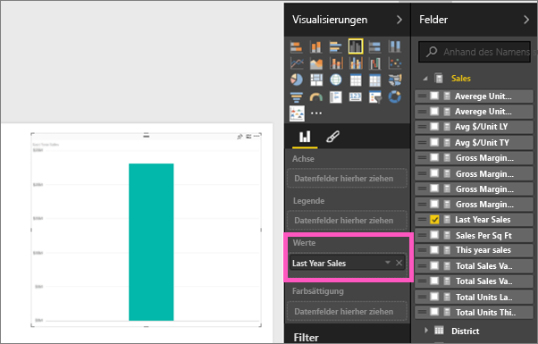
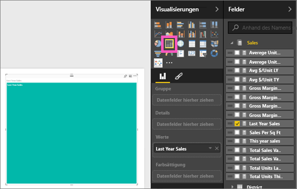
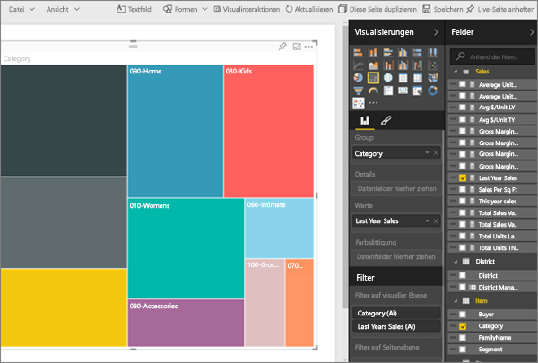
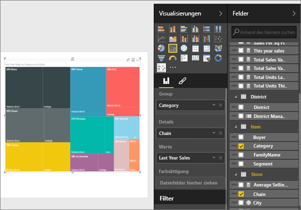
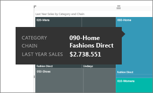
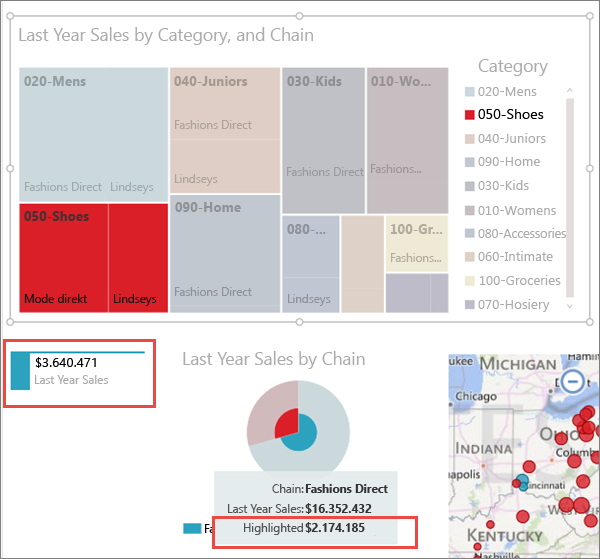

# Treemaps in Power BI (Tutorial)
Treemaps zeigen hierarchische Daten als verschachtelten Rechtecke an.  Jede Hierarchieebene wird durch ein farbiges Rechteck (auch als „Verzweigung“ bezeichnet) dargestellt, das andere Rechtecke („Blätter“) enthält.  Die Fläche jedes Rechtecks wird anhand des ermittelten quantitativen Werts zugewiesen, und die Rechtecke werden der Größe nach von oben links (am größten) nach unten rechts (am kleinsten) angeordnet.

Bei der Analyse der Verkäufe gibt es beispielsweise Rechtecke der obersten Ebene (Verzweigung) für die Bekleidungskategorien **Trend**, **Klassisch**, **Junge Mode** und **Mix**.  Die Kategorierechtecke enthalten kleinere Rechtecke (Blätter) für die einzelnen Bekleidungshersteller innerhalb dieser Kategorie. Größe und Schattierung dieser kleineren Rechtecke basieren auf der verkauften Stückanzahl.  Die Verzweigung **Trend** oben zeigt, dass viel Bekleidung von Maximus verkauft wurde, weniger von Natura und Fama und nur sehr wenig von Leo.  Maximus ist daher in der Verzweigung **Urban** des Treemap-Diagramms das größte Rechteck zugewiesen (oben links). Die Rechtecke von Natura und Fama sind etwas kleiner. Diverse andere Rechtecke stellen die weitere verkaufte Bekleidung dar, und Leo wird nur mit einem sehr kleinen Rechteck dargestellt.  Die Größe und Schattierung der einzelnen Blattknoten ermöglicht einen Vergleich der Verkaufszahlen. Je größer und dunkler schattiert das Rechteck ist, desto höher ist der Wert.

## Verwenden von Treemaps
Treemaps sind gut geeignet:

* Zum Anzeigen großer Mengen hierarchischer Daten
* Bei einer Anzahl von Werten, die für ein Balkendiagramm zu groß wäre
* Zum Darstellen des Verhältnisses zwischen den einzelnen Teilen und der Gesamtmenge
* Zum Anzeigen der Verteilung der einzelnen Werte innerhalb jeder Kategorieebene in der Hierarchie
* Zum Anzeigen von Attributen über Größe und Farbcodierung
* Zum Erkennen von Mustern, Ausreißern, den wichtigsten Einflussfaktoren und Ausnahmen

## Erstellen eines einfachen Treemap-Diagramms
Sie möchten sich zunächst einmal ansehen, wie ein Treemap-Diagramm erstellt wird?  Ab Position 2:10 erläutert Amanda in diesem Video das Erstellen eines Treemap-Diagramms.

<iframe width="560" height="315" src="https://www.youtube.com/embed/IkJda4O7oGs" frameborder="0" allowfullscreen></iframe>

Sie können auch ein eigenes Treemap-Diagramm erstellen. In dieser Anleitung wird das Analysebeispiel für den Einzelhandel verwendet. Gehen Sie wie folgt vor: [Laden Sie das Beispiel herunter](sample-datasets.md), melden Sie sich bei Power BI an, und wählen Sie **Daten abrufen \> Excel-Arbeitsmappe \> Verbinden \> Analysebeispiel für Einzelhandel**.**xlsx**.

1. Wählen Sie in der [Bearbeitungsansicht](service-interact-with-a-report-in-editing-view.md) das Measure **Umsätze** > **Umsätze letztes Jahr** aus.   
   
2. Wandeln Sie das Diagramm in ein Treemap-Diagramm um.  
   
3. Ziehen Sie **Element** > **Kategorie** in den Bereich **Gruppe**. Power BI erstellt ein Treemap-Diagramm, in dem die Größe der Rechtecke den Gesamtumsatz und die Farbe die Kategorie widerspiegelt.  Im Wesentlichen haben Sie eine Hierarchie erstellt, die die relative Größe des Gesamtumsatzes nach Kategorie visuell darstellt.  In der Kategorie **Herren** wurden die höchsten Umsätze verzeichnet, in der Kategorie **Strumpfwaren** hingegen die niedrigsten.
   
4. Ziehen Sie **Laden** > **Kette** in den Bereich **Details**, um das Treemap-Diagramm zu vervollständigen. Sie können den Vorjahresumsatzes jetzt nach Kategorie und Kette vergleichen.   
   
   
   > [!NOTE]
   > Farbsättigung und Details können nicht gleichzeitig verwendet werden.
   > 
   > 
5. Zeigen Sie auf einen **Kettenbereich** , um die QuickInfo für diesen Teil der **Kategorie**anzuzeigen.  Wenn Sie beispielsweise mit dem Mauszeiger auf **Lindseys** im Rechteck **040-Jugendliche** zeigen, wird die QuickInfo für Lindsey innerhalb der Kategorie „Jugendliche“ angezeigt.  
   
6. [Fügen Sie das Treemap-Diagramm als Dashboardkachel hinzu (heften Sie die Visualisierung an)](service-dashboard-tiles.md). 
7. [Speichern Sie den Bericht](service-report-save.md).

## Hervorheben und Kreuzfiltern
Informationen zur Verwendung des Filterbereichs finden Sie unter [Hinzufügen eines Filters zu einem Bericht in Power BI](power-bi-report-add-filter.md).

Das Markieren von Kategorien oder Details in einem Treemap-Diagramm ermöglicht Kreuzhervorhebung und Kreuzfilterung anderer Visualisierungen auf der Berichtsseite und umgekehrt. Fügen Sie hierfür derselben Seite einige visuelle Elemente hinzu, oder kopieren Sie das Treemap-Diagramm auf eine Berichtsseite, die bereits andere visuelle Elemente enthält.

1. Wählen Sie im Treemap-Diagramm entweder eine Kategorie oder eine Kette innerhalb einer Kategorie aus.  Dadurch erfolgt eine Kreuzhervorhebung der anderen Visualisierungen auf der Seite. Wenn Sie beispielsweise **050-Schuhe**auswählen, wird für Schuhe ein Umsatz von 3.640.471 $ für das letzte Jahr angezeigt, wobei 2.174.185 $ auf Fashions Direct entfielen.  
   
2. Wählen Sie im Kreisdiagramm **Verkäufe im letzten Jahr nach Kette** das Segment **Fashions Direct** aus.  
   
3. Informationen zum Steuern der Kreuzhervorhebung und Kreuzfilterung von Diagrammen finden Sie unter [Interaktionen mit Visualisierungen in einem Power BI-Bericht](service-reports-visual-interactions.md).

## Nächste Schritte
[Berichte in Power BI](service-reports.md)  
[Hinzufügen einer Visualisierung zu einem Bericht](power-bi-report-add-visualizations-i.md)  
[Visualisierungstypen in Power BI](power-bi-visualization-types-for-reports-and-q-and-a.md)
[ Anheften eine Visualisierung an ein Dashboard](service-dashboard-pin-tile-from-report.md)  
[Power BI – Grundkonzepte](service-basic-concepts.md)  
[Jetzt kostenlos testen](https://powerbi.com/)

Weitere Fragen? [Wenden Sie sich an die Power BI-Community](http://community.powerbi.com/)  

