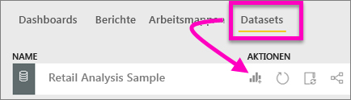
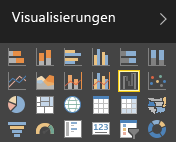
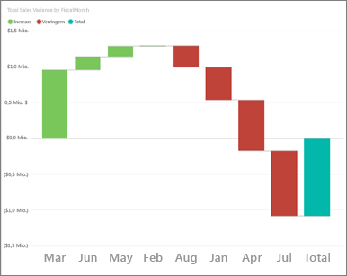
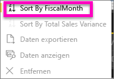
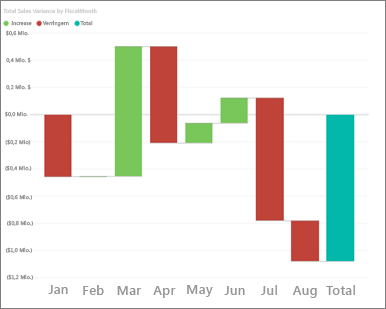
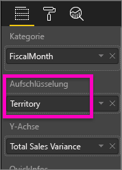
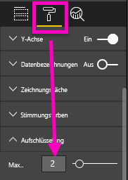
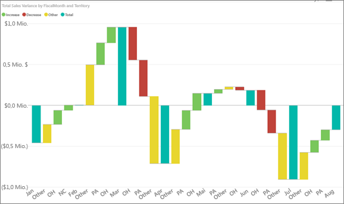

# Wasserfalldiagramme in Power BI (Tutorial)
Wasserfalldiagramme zeigen eine laufende Summe an, während Werte hinzugefügt oder entfernt werden. Sie zeigen, wie ein anfänglicher Wert (z. B. das Nettoeinkommen) durch eine Reihe von positiven und negativen Änderungen beeinflusst wird.

Die Säulen sind farbkodiert, damit Sie Zu- und Abnahmen der Werte schnell erkennen können. Die Säulen für den Anfangs- und den Endwert [gehen häufig von der horizontalen Achse aus](https://support.office.com/article/Create-a-waterfall-chart-in-Office-2016-for-Windows-8de1ece4-ff21-4d37-acd7-546f5527f185#BKMK_Float "gehen häufig von der horizontalen Achse aus"), während die Zwischenwerte unverankerte Säulen sind. Aufgrund dieses Aussehens werden Wasserfalldiagramme auch als „Brückendiagramme“ bezeichnet.

<iframe width="560" height="315" src="https://www.youtube.com/embed/qKRZPBnaUXM" frameborder="0" allow="autoplay; encrypted-media" allowfullscreen></iframe>

## Einsatz von Wasserfalldiagrammen
Wasserfalldiagramme sind gut für folgende Zwecke geeignet:

* Bei Änderungen der Zahlen im Laufe der Zeit oder über andere Kategorien hinweg
* Zum Überwachen der wichtigsten Änderungen am Gesamtwert
* Zum Anzeigen des jährlichen Gewinns Ihres Unternehmens mithilfe einer Darstellung verschiedener Umsatzquellen und letztendlich des Gesamtgewinns (oder -verlusts)
* Zum Illustrieren der Mitarbeiterzahl Ihres Unternehmens zu Jahresbeginn und -ende
* Zum Visualisieren Ihrer Einnahmen und Ausgaben pro Monat und des laufenden Kontostands für Ihr Konto 

## Erstellen eines Wasserfalldiagramms
Sie erstellen ein Wasserfalldiagramm, mit dem Abweichungen beim Umsatz (geschätzter Umsatz im Vergleich zu tatsächlichen Verkaufszahlen) nach Monat dargestellt werden. Melden Sie sich bei Power BI an, und wählen Sie **Daten abrufen \> Beispiele \>Analysebeispiel für Einzelhandel**. 

1. Wählen Sie die Registerkarte **Datasets** aus, und scrollen Sie zum neuen Dataset „Analysebeispiel für Einzelhandel“.  Wählen Sie das Symbol **Bericht erstellen** aus, um das Dataset in der Berichtsbearbeitungsansicht zu öffnen. 
   
    
2. Wählen Sie im Bereich **Felder** die Option **Verkäufe \> Gesamtabweichung Verkäufe**. Wenn sich **Gesamtabweichung Verkäufe** nicht im Bereich der **Y-Achse** befindet, ziehen Sie es dorthin.
3. Wandeln Sie das Diagramm in ein **Wasserfalldiagramm**um. 
   
    
4. Wählen Sie **Zeit** \> **Geschäftsmonat** aus, um den Wert dem Bereich **Kategorie** hinzuzufügen. 
   
    
5. Sortieren Sie das Wasserfalldiagramm chronologisch. Wählen Sie rechts oben im Diagramm die Auslassungspunkte (...) und dann **FiscalMonth** aus.
   
    
   
    
6. Analysieren Sie die Informationen genauer, um zu ermitteln, was von Monat zu Monat am stärksten zu den Änderungen beiträgt. Ziehen Sie **Store** > **Gebiet** in den Bucket **Aufschlüsselung**.
   
    
7. Standardmäßig fügt Power BI die wichtigsten fünf Faktoren für die Steigerungen oder Verringerungen pro Monat hinzu. Hier sind aber nur die ersten beiden Faktoren von Interesse.  Wählen Sie im Formatierungsbereich **Aufschlüsselung** aus, und legen Sie **Maximum** auf 2 fest.
   
    
   
    Ein kurzer Blick zeigt, dass die Gebiete „Ohio“ und „Pennsylvania“ im Wasserfalldiagramm den größten Anteil an positiven und negativen Änderungen haben. 
   
    
8. Dies ist ein bemerkenswertes Ergebnis. Haben Ohio und Pennsylvania so starken Einfluss, weil der Umsatz in diesen beiden Gebieten sehr viel höher als in den anderen Gebieten ist?  Das können wir nachprüfen. Erstellen Sie eine Karte, mit der der Umsatz nach Gebiet analysiert wird.  
   
    
   
    Diese Karte unterstützt unsere Theorie.  Sie zeigt, dass diese beiden Gebiete im letzten Jahr (Blasengröße) und in diesem Jahr (Blasenschattierung) die höchsten Umsätze erzielt haben.

## Hervorheben und Kreuzfiltern
Informationen zur Verwendung des Filterbereichs finden Sie unter [Hinzufügen eines Filters zu einem Bericht in Power BI](power-bi-report-add-filter.md).

Das Markieren einer Säule in einem Wasserfalldiagramm ermöglicht ein Kreuzfiltern anderer Visualisierungen auf der Berichtsseite und umgekehrt. Die Säule mit dem Gesamtwert löst jedoch keine Markierung aus und reagiert nicht auf Kreuzfiltern.

## Nächste Schritte
[Berichte in Power BI](service-reports.md)

[Visualisierungstypen in Power BI](power-bi-visualization-types-for-reports-and-q-and-a.md)

[Visualisierungen in Power BI-Berichten](power-bi-report-visualizations.md)

[Power BI – Grundkonzepte](service-basic-concepts.md)

Weitere Fragen? [Wenden Sie sich an die Power BI-Community](http://community.powerbi.com/)

