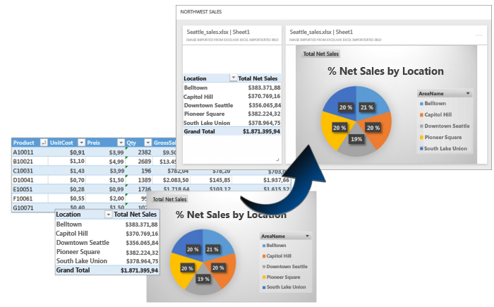
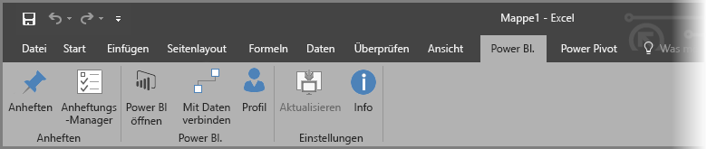
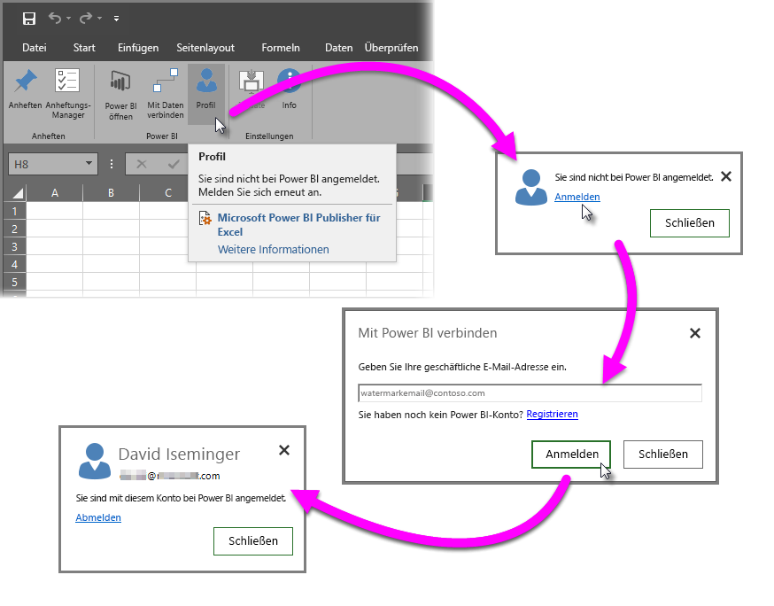
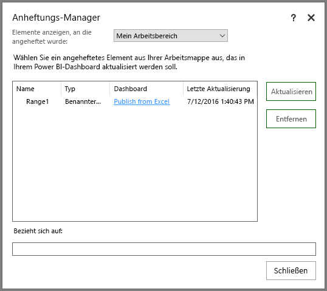
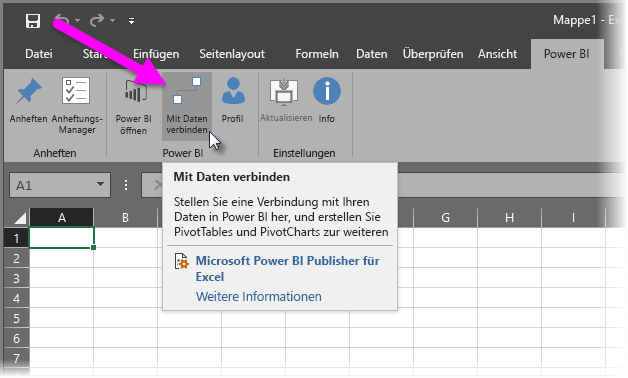
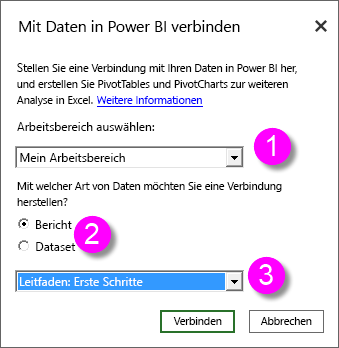
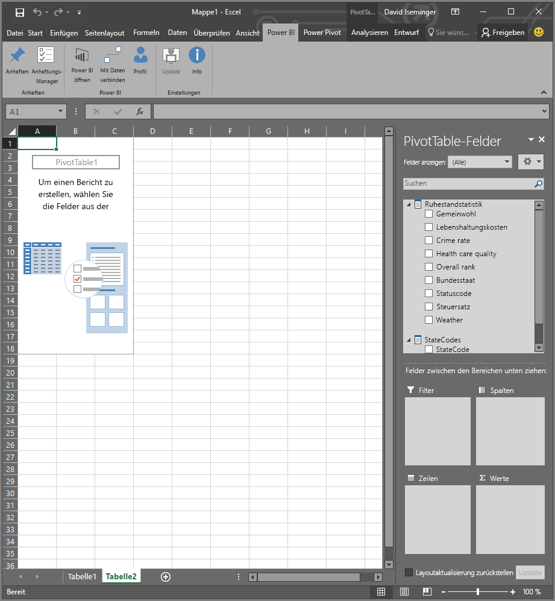
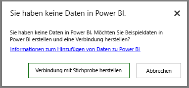

# Power BI Publisher für Excel
Mit Microsoft **Power BI Publisher für Excel** können Sie Momentaufnahmen Ihrer wichtigsten in Excel in PivotTables, Diagrammen und Bereichen gewonnenen Einblicke erstellen und diese an Dashboards in Power BI anheften.

Was können Sie anheften? Nahezu alles, was auf einem Excel-Arbeitsblatt zu finden ist. Sie können einen einfachen Zellbereich in einem einfachen Blatt oder einer Tabelle, eine PivotTable oder ein PivotChart, Abbildungen und Bilder auswählen.

Was Sie nicht anheften können: Sie können keine 3D-Karten oder Visualisierungen in Power View-Blättern anheften. Es gibt auch einige Elemente, die zwar angeheftet werden können, was jedoch nicht besonders sinnvoll ist, wie z. B. Datenschnitt oder Zeitachsenfilter.

Wenn Sie ein Element aus Excel anheften, wird einem neuen oder vorhandenen Dashboard in Power BI eine neue Kachel hinzugefügt. Die neue Kachel ist eine Momentaufnahme und daher nicht dynamisch, aber Sie können sie dennoch aktualisieren. Wenn Sie beispielsweise eine Änderung an einer PivotTable oder einem Diagramm vornehmen, die bzw. das Sie bereits angeheftet haben, wird die Dashboardkachel in Power BI nicht automatisch aktualisiert. Mithilfe des **Anheftungs-Managers** können Sie jedoch Ihre angehefteten Elemente dennoch aktualisieren. In den folgenden Abschnitten erfahren Sie mehr über den **Anheftungs-Manager**.

## Herunterladen und installieren
Power BI Publisher für Excel ist ein Add-In, das Sie für Desktopversionen ab Microsoft Excel 2007 herunterladen und installieren können.

[Power BI Publisher für Excel herunterladen](http://go.microsoft.com/fwlink/?LinkId=715729)

Sobald Sie den Publisher installiert haben, wird in Excel ein neues **Power BI**-Menüband angezeigt, über das Sie sich bei Power BI an- und abmelden, Elemente an Dashboards anheften und bereits angeheftete Elemente verwalten können.

Das **Power BI Publisher für Excel-Add-In** ist standardmäßig aktiviert. Wenn die Registerkarte für das Power BI-Menüband jedoch aus einem beliebigem Grund nicht in Excel angezeigt wird, müssen Sie sie aktivieren. Klicken Sie auf **Datei** > **Optionen** > **Add-Ins** > **COM-Add-Ins**. Wählen Sie **Microsoft Power BI Publisher für Excel** aus.

## Anheften eines Bereichs an ein Dashboard
Sie können eine beliebige Anzahl von Zellen in Ihrem Arbeitsblatt auswählen und diese an ein bestehendes oder ein neues Dashboard in Power BI anheften. Sie können dieselbe Momentaufnahme auch an mehrere Dashboards anheften.

Bevor Sie beginnen, müssen Sie sicherstellen, dass Sie bei Power BI angemeldet sind.

1. Wählen Sie **Profil** aus der Registerkarte für das **Power BI**-Menüband aus. Wenn Sie bereits bei Power BI angemeldet sind, wird in einem Dialogfeld angezeigt, mit welchem Konto Sie zurzeit angemeldet sind. Wenn das Konto angezeigt wird, das Sie verwenden möchten, dann ist alles bestens. Fahren Sie mit den nächsten Schritten fort, um Ihren Bereich anzuheften. Wählen Sie *Abmelden* aus, wenn Sie ein anderes Power BI-Konto verwenden möchten. Wenn Sie nicht angemeldet sind, fahren Sie mit dem nächsten Schritt (Schritt 2) fort.
   
   
2. Wenn Sie nicht angemeldet sind, wählen Sie den Link **Anmelden** aus, der bei der Auswahl von **Profil** aus der Registerkarte für das **Power BI**-Menüband in Excel erscheint. Geben Sie im Dialogfeld **Mit Power BI verbinden** die E-Mail-Adresse des gewünschten Power BI-Kontos ein, und wählen Sie anschließend **Anmelden** aus.
   
   

Sobald Sie sich angemeldet haben, folgen Sie diesen Schritten, um einen Bereich an das Dashboard anzuheften:

1. Wählen Sie in Excel die Registerkarte für das **Power BI**-Menüband, um die Menübandschaltfläche **Anheften** anzuzeigen.
2. Wählen Sie einen Bereich aus der Excel-Arbeitsmappe aus.
3. Klicken Sie auf die Schaltfläche **Anheften** auf dem **Power BI**-Menüband, um das Dialogfeld **An Dashboard anheften** anzuzeigen. Wenn Sie noch nicht bei Power BI angemeldet sind, werden Sie dazu aufgefordert. Wählen Sie in der Dropdownliste **Arbeitsbereich** einen Arbeitsbereich aus. Stellen Sie zum Anheften an Ihr eigenes Dashboard sicher, dass **Mein Arbeitsbereich** ausgewählt ist. Wählen Sie zum Anheften an ein Dashboard in einem Gruppenarbeitsbereich in der Dropdownliste die entsprechende Gruppe aus.
4. Entscheiden Sie, ob Sie die Kachel an ein *vorhandenes Dashboard* anheften oder ein *neues* erstellen möchten.
5. Klicken Sie auf **OK**, um Ihre Auswahl an das Dashboard anzuheften.
6. Wählen Sie unter **An Dashboard anheften** ein im Arbeitsbereich vorhandenes Dashboard aus, oder erstellen Sie ein neues Dashboard. Klicken Sie anschließend auf **OK**.
   
   

## Anheften eines Diagramms an ein Dashboard
Klicken Sie einfach auf das Diagramm und dann auf „Anheften“ .

## Verwalten angehefteter Elemente
Mit dem **Anheftungs-Manager** können Sie die einem angehefteten Element zugeordnete Kachel in Power BI aktualisieren. Sie können auch die Anheftung zwischen einem Element entfernen, das Sie bereits an Dashboards in Power BI angeheftet haben.

Zum Aktualisieren von Kacheln in Ihrem Dashboard wählen Sie im **Anheftungs-Manager** mindestens ein Element und anschließend **Aktualisieren** aus.

Klicken Sie auf **Entfernen**, um die Zuordnung zwischen einem angehefteten Element in Excel und der zugehörigen Kachel in einem Dashboard zu entfernen. Wenn Sie **Entfernen** auswählen, wird das Element *nicht* aus Ihrem Arbeitsblatt in Excel entfernt, ebenso wenig die zugehörige Kachel aus dem Dashboard. Sie entfernen lediglich die Anheftung oder *Zuordnung* zwischen ihnen. Das entfernte Element wird nicht mehr im **Anheftungs-Manager** angezeigt. Wenn Sie das Element erneut anheften, wird es als neue Kachel angezeigt.

Um ein angeheftetes Element (eine Kachel) aus einem Dashboard zu entfernen, müssen Sie zu Power BI wechseln. Klicken Sie auf der Kachel, die Sie löschen möchten, auf das Symbol **Menü öffnen**  und anschließend auf **Kachel löschen** .

## Verbinden mit Daten in Power BI
Beginnend mit dem Release von **Power BI Publisher für Excel** vom Juli 2016 (einschließlich des aktuellen Release, das mit dem oben genannten verknüpft ist) können Sie direkt eine Verbindung mit Daten im Power BI-Dienst herstellen und diese Daten in Excel mithilfe von PivotTables und PivotCharts analysieren. Dank dieser Funktion ist es einfach, Power BI-Daten und Excel zu kombinieren, um Ihre wichtigsten Daten auszuwerten.

Die Verbesserungen umfassen Folgendes:

* Alle für eine Verbindung zu den Daten in Power BI erforderlichen Treiber werden mit jedem Release automatisch aktualisiert – ohne dass Sie selbst Treiber installieren oder verwalten müssen.
* Sie müssen keine ODC-Dateien mehr herunterladen, um Verbindungen herzustellen – **Power BI Publisher für Excel** stellt die Verbindungen automatisch her, wenn Sie den gewünschten Bericht oder das gewünschte Dataset auswählen.
* Sie können nun mehrere Verbindungen und PivotTables in der gleichen Arbeitsmappe erstellen.
* Fehler wurden verbessert und an **Power BI Publisher für Excel** angepasst, statt die Standardfehlermeldungen von Excel zu verwenden.

### So stellen Sie in Excel eine Verbindung zu den Power BI-Daten her
Befolgen Sie diese einfachen Schritte, um eine Verbindung zu den Power BI-Daten mithilfe von **Power BI Publisher für Excel** herzustellen:

1. Stellen Sie sicher, dass Sie bei Power BI angemeldet sind. Die Schritte, die die Anmeldung (auch mit einem anderen Konto) beschreiben, finden Sie weiter oben in diesem Artikel.
2. Sobald Sie sich bei Power BI mit dem gewünschten Konto angemeldet haben, wählen Sie **Mit Daten verbinden** aus der Registerkarte des **Power BI**-Menübands in Excel aus.
   
   
3. Excel stellt über eine HTTPS-Verbindung eine Verbindung mit Power BI her und zeigt das Dialogfeld **Mit Daten in Power BI verbinden** an. Im Dialogfeld können Sie auswählen, von welchem *Arbeitsbereich* aus Sie Ihre Daten auswählen ((1) in Abbildung unten) und mit welchem *Datentyp* Sie eine Verbindung herstellen (**Bericht** oder **Dataset** (2)). Darüber hinaus können Sie eine Dropdownliste auswählen (3), mit der Sie den *verfügbaren Bericht oder das verfügbare Dataset* angeben können, mit dem Sie eine Verbindung herstellen möchten.
   
   
4. Wenn Sie Ihre Entscheidungen getroffen haben und im Dialogfeld **Mit Daten in Power BI verbinden** die Schaltfläche **Verbinden** auswählen, bereitet Excel eine PivotTable vor und zeigt den Bereich **PivotTable-Felder** dort an, wo Sie Felder aus den verbundenen Power BI-Daten auswählen und Tabellen oder Diagramme erstellen können, mit denen Sie die Daten analysieren.
   
   

Wenn Sie in Power BI über keine Daten verfügen, erkennt Excel dies und bietet Ihnen die Erstellung von Beispieldaten an, mit denen Sie sich verbinden und es ausprobieren können.

Mit diesem Release von **Power BI Publisher für Excel** müssen Sie Folgendes bedenken:

* **Freigegebene Daten:** Daten, die für Sie freigegeben wurden, für Sie aber nicht direkt in Power BI sichtbar sind; ist unter **Mit Daten verbinden** nicht verfügbar.
* **Lokales SSAS:** Wenn das von Ihnen ausgewählte Dataset aus der lokalen SQL Server Analysis Services-Funktion (SSAS) stammt und das Dataset in Power BI DirectQuery für den Datenzugriff verwendet, verbindet sich **Power BI Publisher für Excel** über das lokale Netzwerk mit diesen Daten und verwendet dazu *nicht* Power BI. Daher muss jeder Benutzer, der sich mit solchen Datasets verbinden möchte, mit dem lokalen Netzwerk verbunden sein und wird für den Datenzugriff mithilfe der Methode authentifiziert, die die Analysis Services-Instanz verwendet, bei der die Daten gespeichert sind.
* **Erforderlichen Treiber** - **Power BI Publisher für Excel** installiert die für diese Funktion erforderlichen Treiber automatisch. Unter diesen automatisch installierten Treibern befindet sich der Excel-OLE DB-Treiber für Analysis Services. Wenn dieser Treiber durch den Benutzer (oder aus einem anderen Grund) entfernt wird, funktioniert die Verbindung mit den Power BI-Daten nicht mehr.
* **Das Dataset muss über Measures verfügen:** Für das Dataset müssen Modellmeasures definiert sein, damit Excel die Measures als Werte in PivotTables behandelt und die Daten ordnungsgemäß analysiert werden. Weitere Informationen zu Measures finden Sie [hier](desktop-measures.md).
* **Unterstützung für Gruppen** Datasets, die für Personen außerhalb der angegebenen Gruppe freigegeben sind, werden nicht unterstützt, und es kann keine Verbindung mit ihnen hergestellt werden.
* **Kostenloses Abonnement und Pro-Abonnement**: Aktivitäten im Zusammenhang mit Gruppen werden für Benutzer mit einem kostenlosen Power BI-Abonnement nicht unterstützt. Daher werden für diese Benutzer keine Datasets oder Berichte angezeigt, die für eine Gruppe in ihrem eigenen Arbeitsbereich freigegeben sind.
* **Freigegebene Berichte oder Datasets** Es kann keine Verbindung mit Berichten oder Datasets hergestellt werden, die für Sie freigegeben wurden.
* **Verwenden von Tabellen anstelle von Datenmodellen** Datasets und Berichte, die erstellt werden, indem nur Tabellen aus Excel (ohne ein Datenmodell) importiert wurden, werden derzeit nicht unterstützt, und es kann keine Verbindung mit diesen hergestellt werden.

Wenn Sie ansprechende Diagramme oder andere Visualisierungen wie Datenbereiche erstellt haben, können Sie diese problemlos an ein Dashboard in Power BI anheften, wie zuvor in diesem Artikel beschrieben.

## Verwandte Artikel
Es gibt viele Möglichkeiten, Excel und Power BI zusammen zu verwenden und mit beiden optimale Ergebnisse zu erzielen. Weitere Informationen finden Sie in den folgenden Artikeln.

* [In Excel analysieren](service-analyze-in-excel.md)
* [Problembehandlung bei „In Excel analysieren“](desktop-troubleshooting-analyze-in-excel.md)

