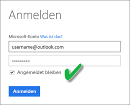

# Aktualisieren eines aus einer CSV-Datei erstellten Datasets auf OneDrive oder SharePoint Online
## Was sind die Vorteile?
Wenn Sie eine Verbindung mit einer CSV-Datei in OneDrive oder SharePoint Online herstellen, wird ein Dataset in Power BI erstellt. Die Daten aus der CSV-Datei werden dann in das Dataset in Power BI importiert. Power BI stellt anschließend automatisch eine Verbindung mit der Datei her und aktualisiert alle Änderungen im Dataset in Power BI. Wenn Sie die CSV-Datei in OneDrive oder SharePoint Online bearbeiten, werden diese Änderungen nach dem Speichern im Power BI angezeigt. Das geschieht normalerweise innerhalb ungefähr einer Stunde. Alle Visualisierungen auf Basis des Datasets werden in Power BI automatisch aktualisiert.

Wenn sich die Dateien in einem freigegebenen Ordner in OneDrive for Business oder SharePoint Online befinden, können andere Benutzer mit dieser Datei arbeiten. Nach dem Speichern werden alle vorgenommenen Änderungen normalerweise innerhalb einer Stunde automatisch in Power BI aktualisiert.

Viele Organisationen führen Prozesse aus, die Datenbanken automatisch auf Daten abfragen, die anschließend jeden Tag in einer CSV-Datei gespeichert werden. Wenn die Datei in OneDrive oder SharePoint Online gespeichert ist und jeden Tag überschrieben wird, können Sie eine Verbindung mit der Datei in Power BI herstellen, statt jeden Tag eine neue Datei mit einem anderen Namen zu erstellen. Das Dataset, das mit der Datei verbunden ist, wird kurz nach der Aktualisierung der Datei in OneDrive oder SharePoint Online synchronisiert. Alle Visualisierungen auf Basis des Datasets werden automatisch aktualisiert.

## Was wird unterstützt?
Dateien mit kommagetrennten Werten sind einfache Textdateien, daher werden keine Verbindungen mit externen Datenquellen und Berichten unterstützt. Sie können keine Zeitplanaktualisierung für ein Dataset planen, das aus einer kommagetrennten Datei erstellt wurde. Wenn sich die Datei in OneDrive oder SharePoint Online befindet, synchronisiert Power BI jedoch Änderungen an der Datei automatisch mit dem Dataset etwa einmal in der Stunde.

## OneDrive oder OneDrive for Business. Was ist der Unterschied?
Wenn Sie sowohl über ein privates OneDrive als auch OneDrive for Business verfügen, empfiehlt es sich, dass Sie alle Dateien beibehalten, die in Power BI in OneDrive for Business verbunden werden sollen. Dies wird empfohlen, da Sie wahrscheinlich zwei unterschiedliche Konten für die Anmeldung verwenden.

Das Herstellen einer Verbindung mit OneDrive for Business in Power BI erfolgt i. d. R. nahtlos, da für die Anmeldung bei Power BI häufig das gleiche Konto verwendet wird, das auch für OneDrive for Business verwendet wird. Bei einem privaten OneDrive melden Sie sich wahrscheinlich mit einem anderen [Microsoft-Konto](https://account.microsoft.com) an.

Wenn Sie sich bei Ihrem Microsoft-Konto anmelden, sollten Sie „Angemeldet bleiben“ auswählen. Power BI kann dann Aktualisierungen mit den Datasets in Power BI synchronisieren.

Wenn Sie Änderungen an der CSV-Datei in OneDrive vornehmen, die nicht mit dem Dataset in Power BI synchronisiert werden können, da die Anmeldeinformationen für Ihr Microsoft-Konto möglicherweise geändert wurden, müssen Sie eine Verbindung mit der Datei herstellen und sie wieder aus Ihrem privaten OneDrive importieren.

## Bei Problemen
Wenn die Daten in der CSV-Datei in OneDrive geändert und diese Änderungen nicht in Power BI wiedergegeben werden, liegt dies wahrscheinlich daran, dass Power BI keine Verbindung mit OneDrive herstellen kann. Stellen Sie eine Verbindung mit der Datei her, und importieren Sie sie erneut. Wenn Sie aufgefordert werden, sich anzumelden, stellen Sie sicher, dass **Angemeldet bleiben**aktiviert ist.

## Nächste Schritte
[Tools zur Behandlung von Aktualisierungsproblemen](service-gateway-onprem-tshoot.md)
[Problembehandlung bei Aktualisierungsszenarios](refresh-troubleshooting-refresh-scenarios.md)

Weitere Fragen? [Stellen Sie Ihre Frage in der Power BI-Community.](https://community.powerbi.com/)

