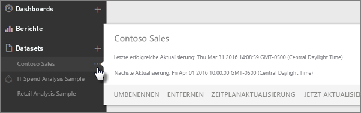
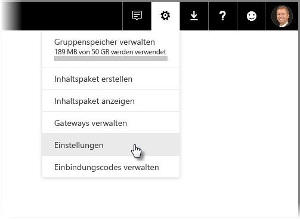
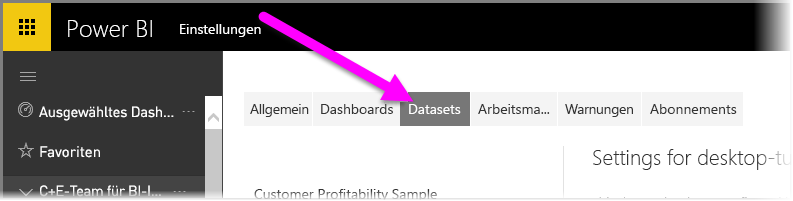
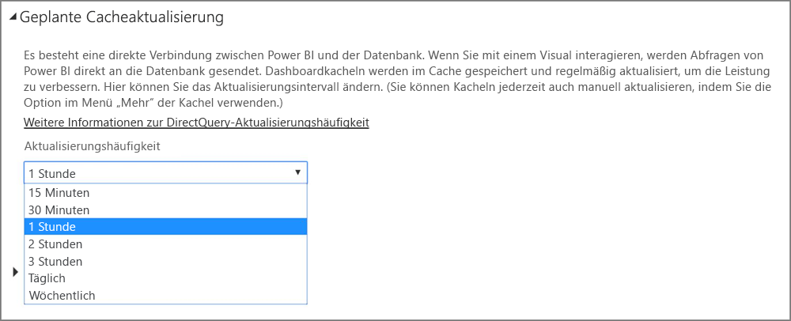

# Aktualisieren von Daten in Power BI
Es kann oftmals entscheidend sein, dass Sie immer die neuesten Daten erhalten, um die richtigen Entscheidungen zu treffen. Sie haben wahrscheinlich bereits die Funktion „Daten abrufen“ in Power BI verwendet, um eine Verbindung zu Daten herzustellen und diese hochzuladen sowie Berichte und ein Dashboard zu erstellen. Jetzt möchten Sie sicherstellen, dass Ihre Daten wirklich die neuesten und besten sind.

In vielen Fällen müssen Sie überhaupt nichts unternehmen. Einige Daten, wie z. B. solche aus einem Salesforce- oder Marketo-Inhaltspaket, werden automatisch für Sie aktualisiert. Wenn Ihre Verbindung eine Liveverbindung oder DirectQuery verwendet, sind die Daten immer auf den aktuellen Stand. Aber in anderen Fällen, wie beispielsweise einer Excel-Arbeitsmappe oder einer Power BI Desktop-Datei, die mit einer externen Online- oder lokalen Datenquelle verbunden ist, müssen Sie die Aktualisierung manuell durchführen oder einen Aktualisierungszeitplan einrichten, damit Power BI die Daten in den Berichten und Dashboards für Sie aktualisieren kann.

Dieser Artikel und einige andere sollen Ihnen helfen zu verstehen, wie die Datenaktualisierung in Power BI wirklich funktioniert, unabhängig davon, ob Sie einen Aktualisierungszeitplan einrichten müssen und was vorhanden sein muss, um Ihre Daten erfolgreich zu aktualisieren.

## Grundlegendes zur Datenaktualisierung
Vor dem Einrichten der Aktualisierung ist es wichtig zu verstehen, was Sie aktualisieren und woher Ihre Daten stammen.

Eine *Datenquelle* ist der tatsächliche Ursprung der Daten, die Sie in Ihren Berichten und Dashboards untersuchen. Dies kann beispielsweise ein Onlinedienst wie Google Analytics oder QuickBooks, eine Datenbank in der Cloud wie Azure SQL Database oder eine Datenbank bzw. Datei auf einem lokalen Computer oder Server in Ihrer eigenen Organisation sein. Dies sind alles Datenquellen. Der Typ der Datenquelle bestimmt, wie die Daten daraus aktualisiert werden. Wir erläutern die Aktualisierung für jeden Typ von Datenquelle etwas später im Abschnitt „[Was kann aktualisiert werden?](#what-can-be-refreshed).

Ein *Dataset* wird automatisch in Power BI erstellt, wenn Sie „Daten abrufen“ zum Herstellen einer Verbindung zu und zum Hochladen von Daten aus einem Inhaltspack oder einer Datei verwenden oder die Verbindung zu einer Livedatenquelle herstellen. In Power BI Desktop und Excel 2016 können Sie außerdem Ihre Datei direkt auf den Power BI-Dienst veröffentlichen, was der Verwendung von „Daten abrufen“ entspricht.

In jedem Fall wird ein Dataset erstellt, das in „Mein Arbeitsbereich“, in der Gruppe oder in Containern in dem Power BI-Dienst erscheint. Wenn Sie die **Auslassungspunkte (...)** für ein Dataset auswählen, können Sie die Daten in einem Bericht untersuchen, Einstellungen bearbeiten und die Aktualisierung einrichten.

Ein Dataset kann Daten aus einer oder mehreren Datenquellen abrufen. Sie können z. B. Power BI Desktop zum Abrufen von Daten aus einer SQL-Datenbank in Ihrer Organisation verwenden und zum Abrufen anderer Daten aus einem OData-Feed online. Wenn Sie die Datei dann in Power BI veröffentlichen, wird ein einzelnes Dataset erstellt, wobei es jedoch über Datenquellen sowohl für die SQL-Datenbank als auch den OData-Feed verfügt.

Ein Dataset enthält Informationen zu den Datenquellen, Anmeldeinformationen für die Datenquelle und in den meisten Fällen wird eine Teilmenge der Daten aus der Datenquelle kopiert. Wenn Sie Visualisierungen in Berichten und Dashboards erstellen, haben Sie es mit Daten im Dataset zu tun. Im Falle einer Liveverbindung wie Azure SQL Database, definiert das Dataset die Daten, die Ihnen direkt aus der Datenquelle angezeigt werden. Für eine Live-Verbindung mit Analysis Services stammt die Definition des Datasets direkt von Analysis Services.

> *Wenn Sie Ihre Daten aktualisieren, aktualisieren Sie Ihre Daten in dem in Power BI gespeicherten Dataset aus Ihrer Datenquelle. Hierbei handelt es sich um eine vollständige und keine inkrementelle Aktualisierung.*
> 
> 

Sobald Sie Daten in einem Dataset aktualisieren, ob mithilfe von „Jetzt aktualisieren“ oder dem Einrichten eines Aktualisierungszeitplans, verwendet Power BI Informationen im Dataset für die Verbindung zu den Datenquellen, die für diese definiert sind, für die Abfrage der hochgeladenen Daten und dem anschließenden Laden der aktualisierten Daten in das Dataset. Alle Visualisierungen in Ihren Berichte oder Dashboards basierend auf den Daten werden automatisch aktualisiert.

Bevor wir weiter fortfahren, gibt es noch etwas sehr wichtiges, das Sie verstehen müssen:

> *Unabhängig davon, wie oft Sie das Dataset aktualisieren oder wie oft Sie Livedaten betrachten, sind es die Daten in der Datenquelle, die zuerst auf dem neuesten Stand sein müssen.*
> 
> 

Die meisten Organisationen verarbeiten ihre Daten einmal täglich, in der Regel am Abend. Wenn Sie die Aktualisierung für ein Dataset aus einer Power BI Desktop-Datei planen, die mit einer lokalen Datenbank verbunden ist, und Ihre IT-Abteilung einmal abends die Verarbeitung auf der SQL-Datenbank ausführt, müssen Sie die planmäßige Aktualisierung nur für einmal täglich einrichten. Zum Beispiel nach der Verarbeitung in der Datenbank, aber bevor Sie in die Arbeit kommen. Natürlich ist dies nicht immer der Fall. Power BI bietet viele Methoden, um eine Verbindung mit Datenquellen herzustellen, die häufig oder sogar in Echtzeit aktualisiert werden.

## Typen der Aktualisierung
Es gibt vier Haupttypen der Aktualisierung, die innerhalb von Power BI auftreten. Paket aktualisieren, Modell-/Datenaktualisierung, Aktualisieren der Kachel und Aktualisierung des visuellen Containers.

### Paketerneuerung
Sie synchronisiert Ihren Power BI Desktop- oder Excel-Datei zwischen dem Power BI-Dienst und OneDrive oder SharePoint Online. Zieht die Daten nicht aus der ursprünglichen Datenquelle. Das Dataset in Power BI wird nur mit den Werten aus der Datei, die sich in OneDrive oder SharePoint Online befindet, aktualisiert.

### Modell-/Datenaktualisierung
Das bezieht sich auf die Aktualisierung des Datasets innerhalb des Power BI-Dienstes, mit Daten aus der ursprünglichen Datenquelle. Das erfolgt entweder mittels geplanter Aktualisierungen oder über „Jetzt aktualisieren“. Dabei ist ein Gateway für lokale Datenquellen erforderlich.

### Kachelaktualisierung
Kachelaktualisierung aktualisiert den Zwischenspeicher für Kachelinhalte im Dashboard, sobald sich die Daten ändern. Das passiert etwa alle 15 Minuten. Sie können eine Kachelaktualisierung auch erzwingen, indem Sie die **Auslassungspunkte (...)** oben rechts in einem Dashboard auswählen und dann **Dashboardkacheln aktualisieren** auswählen.

Weitere Details zu häufigen Kachelaktualisierungsfehlern finden Sie unter [Problembehandlung für Kachelfehler](refresh-troubleshooting-tile-errors.md).

### Aktualisierung des visuellen Containers
Die Aktualisierung des visuellen Containers aktualisiert die zwischengespeicherten Berichtsvisualisierungen, innerhalb eines Berichts, sobald sich die Daten ändern.

## Was kann aktualisiert werden?
In Power BI verwenden Sie in der Regel „Daten abrufen“, um Daten aus einer Datei auf einem lokalen Laufwerk, OneDrive oder SharePoint Online zu importieren, einen Bericht aus Power BI Desktop zu veröffentlichen oder direkt eine Verbindung zu einer Datenbank in der Cloud in Ihrer eigenen Organisation herzustellen. Fast alle Daten in Power BI können aktualisiert werden. Ob dies allerdings erforderlich ist, hängt davon ab, wie Ihr Dataset erstellt wurde und mit welcher Datenquelleeine Verbindung hergestellt wird. Betrachten wir, wie die Daten im einzelnen Fall aktualisiert werden.

Bevor wir fortfahren, folgen einige wichtige Definitionen zum Verständnis:

**Automatische Aktualisierung**: Das bedeutet, dass keine Benutzerkonfiguration erforderlich ist, damit das Dataset in regelmäßigen Abständen aktualisiert wird. Einstellungen zur Datenaktualisierung werden von Power BI für Sie konfiguriert. Für Onlinedienstanbieter erfolgt die Aktualisierung in der Regel einmal am Tag. Für Dateien, die aus OneDrive geladen werden, wird die automatische Aktualisierung etwa jede Stunde durchgeführt. Dies gilt für Daten, die nicht aus einer externen Quelle stammen. Obwohl Sie verschiedene Einstellungen zur Zeitplanaktualisierung konfigurieren können, wird dies wahrscheinlich nicht nötig sein.

**Benutzerdefinierte manuelle oder geplante Aktualisierung** : Das bedeutet, dass Sie ein Dataset mit „Jetzt aktualisieren“ manuell aktualisieren können oder einen Aktualisierungszeitplan mit der „Zeitplanaktualisierung“ in den Dataseteinstellungen einrichten können. Diese Art der Aktualisierung von Daten ist für Power BI Desktop-Dateien und Excel-Arbeitsmappen erforderlich, die die Verbindung zu externen Online- und lokalen Datenquellen herstellen.

> [!NOTE]
> Wenn Sie eine Uhrzeit für die geplante Aktualisierung konfigurieren, kann es eine Verzögerung von bis zu einer Stunde geben, bevor sie beginnt.
> 
> 

**Live/DirectQuery**: Das bedeutet, dass eine Liveverbindung zwischen Power BI und der Datenquelle besteht. Für lokale Datenquellen müssen Administratoren eine Datenquelle in einem Enterprise Gateway konfiguriert haben, eine Benutzerinteraktion ist jedoch möglicherweise nicht erforderlich.

> [!NOTE]
> Zum Verbessern der Leistung werden Dashboards mit über DirectQuery verbundenen Daten automatisch aktualisiert. Sie können Kacheln auch jederzeit über das Menü **Mehr** der betreffenden Kachel manuell aktualisieren.
> 
> 

## Lokale Dateien und Dateien auf OneDrive und SharePoint Online
Das Aktualisieren von Daten wird für Power BI Desktop-Dateien und Excel-Arbeitsmappen unterstützt, die die Verbindung zu externen Online- oder lokalen Datenquellen herstellen. Damit werden nur die Daten für das Dataset innerhalb des Power BI-Dienstes aktualisiert. Ihre lokale Datei wird nicht aktualisiert.

Ihre Dateien auf OneDrive oder SharePoint Online zu behalten und über Power BI eine Verbindung dazu herzustellen bietet viel Flexibilität. Allerdings geht mit dieser Flexibilität ein erschwertes Verständnis einher. Geplante Aktualisierungen für Dateien, die in OneDrive oder SharePoint Online gespeichert sind, unterscheiden sich von der Paketerneuerung. Weitere Informationen finden Sie Abschnitt [Typen der Aktualisierung](#types-of-refresh).

### Power BI Desktop-Datei

| **Datenquelle** | **Automatische Aktualisierung** | **Benutzerdefinierte manuelle oder geplante Aktualisierung** | **Gateway erforderlich** |
| --- | --- | --- | --- |
| „Daten abrufen“ (auf der Multifunktionsleiste) wird dazu verwendet, um eine Verbindung zu Daten aus einer beliebigen aufgelisteten Onlinedatenquelle herzustellen und diese abzufragen. |Nein |Ja |Keine (siehe unten) |
| „Daten abrufen“ wird dazu verwendet, um eine Verbindung zu einer Livedatenbank in Analysis Services herzustellen und diese zu durchsuchen. |Ja |Nein |Ja |
| „Daten abrufen“ wird verwendet um eine Verbindung zu einer lokalen DirectQuery-Datenquelle herzustellen und diese zu durchsuchen. |Ja |Nein |Ja |
| „Daten abrufen“ wird dazu verwendet, um eine Verbindung mit Daten aus einer Azure SQL-Datenbank, Azure SQL Data Warehouse und Azure HDInsight Spark herzustellen und diese abzufragen. |Ja |Ja |Nein |
| „Daten abrufen“ wird dazu verwendet, eine Verbindung mit Daten aus einer beliebigen aufgelisteten lokalen Datenquelle herzustellen und diese abzufragen. Ausgenommen sind Hadoop-Dateien (HDFS) und Microsoft Exchange. |Nein |Ja |Ja |

> [!NOTE]
> Wenn Sie die [**Web.Page**](https://msdn.microsoft.com/library/mt260924.aspx)-Funktion verwenden, benötigen Sie ein Gateway, sofern das Dataset oder der Bericht nach dem 18. November 2016 veröffentlicht wurde.
> 
> 

Weitere Informationen finden Sie unter [Aktualisieren eines aus einer Power BI Desktop-Datei erstellten Datasets auf OneDrive](refresh-desktop-file-onedrive.md).

### Excel-Arbeitsmappe

| **Datenquelle** | **Automatische Aktualisierung** | **Benutzerdefinierte manuelle oder geplante Aktualisierung** | **Gateway erforderlich** |
| --- | --- | --- | --- |
| Tabellen mit Daten in einem Arbeitsblatt, die nicht in ein Excel-Datenmodell geladen wurden. |Ja, stündlich *(nur OneDrive/SharePoint Online)* |Nur manuell *(nur OneDrive/SharePoint Online)* |Nein |
| Tabellen mit Daten in einem Arbeitsblatt, die mit einer Tabelle im Excel-Datenmodell verknüpft sind (verknüpfte Tabellen). |Ja, stündlich *(nur OneDrive/SharePoint Online)* |Nur manuell *(nur OneDrive/SharePoint Online)* |Nein |
| Power Query* wird dazu verwendet, eine Verbindung zu Daten aus einer beliebigen aufgelisteten Onlinedatenquelle herzustellen und diese abzufragen, sowie Daten in das Excel-Datenmodell zu laden. |Nein |Ja |Nein |
| Power Query* wird dazu verwendet, eine Verbindung zu Daten aus einer beliebigen aufgelisteten lokalen Datenquelle herzustellen und diese abzufragen. Ausgenommen sind Hadoop-Dateien (HDFS), Microsoft Exchange und das Laden von Daten in das Excel-Datenmodell. |Nein |Ja |Ja |
| Power Pivot wird dazu verwendet, eine Verbindung zu Daten aus einer beliebigen aufgelisteten Onlinedatenquelle herzustellen und diese abzufragen, sowie Daten in das Excel-Datenmodell zu laden. |Nein |Ja |Nein |
| Power Pivot wird dazu verwendet, eine Verbindung zu Daten aus einer beliebigen aufgelisteten lokalen Datenquelle herzustellen und diese abzufragen, sowie Daten in das Excel-Datenmodell zu laden. |Nein |Ja |Ja |

*\* Power Query ist als „Daten abrufen und transformieren“ in Excel 2016 bekannt.*

Ausführliche Informationen finden Sie unter [Aktualisieren eines aus einer Excel-Arbeitsmappe erstellten Datasets auf OneDrive](refresh-excel-file-onedrive.md).

### Datei mit kommagetrennten Werten (CSV) auf OneDrive oder SharePoint Online

| **Datenquelle** | **Automatische Aktualisierung** | **Benutzerdefinierte manuelle oder geplante Aktualisierung** | **Gateway erforderlich** |
| --- | --- | --- | --- |
| Einfache, kommagetrennte Werte |Ja (stündlich) |Nur manuell |Nein |

Ausführlichere Informationen finden Sie unter [Aktualisieren eines Datasets, das aus einer Datei mit kommagetrennten Werten (CSV) auf OneDrive erstellt wurde](refresh-csv-file-onedrive.md).

## Inhaltspakete
Es gibt zwei Arten von Inhaltspaketen in Power BI:

**Inhaltspakete von Onlinediensten**: wie z.B. Adobe Analytics, SalesForce und Dynamics CRM Online. Datasets, die aus Onlinediensten erstellt werden, werden automatisch einmal täglich aktualisiert. Während es wahrscheinlich nicht erforderlich ist, können Sie die Aktualisierung manuell vornehmen oder einen Aktualisierungszeitplan einrichten. Da sich Onlinedienste in der Cloud befinden, ist ein Gateway nicht erforderlich.

**Inhaltspakete von Organisationen** – von Benutzern in Ihrer eigenen Organisation erstellt und gemeinsam genutzt. Nutzer von Inhaltspaketen können keinen Aktualisierungszeitplan einrichten oder eine manuelle Aktualisierung durchführen. Nur der Ersteller des Inhaltspakets kann die Aktualisierung für die Datasets darin einrichten. Die Aktualisierungseinstellungen werden mit dem Dataset geerbt.

### Inhaltspakete aus Onlinediensten

| **Datenquelle** | **Automatische Aktualisierung** | **Benutzerdefinierte manuelle oder geplante Aktualisierung** | **Gateway erforderlich** |
| --- | --- | --- | --- |
| Onlinedienste in „Daten und Dienste abrufen“ |Ja |Ja |Nein |

### Organisationsbezogene Inhaltspakete
Die Aktualisierungsfunktionen für ein Datenset, die in einem Inhaltspaket einer Organisation enthalten sind, hängen vom Dataset ab. Informationen zu lokalen Dateien, OneDrive oder SharePoint Online finden Sie weiter oben.

Weitere Informationen finden Sie unter [Einführung in Inhaltspakete einer Organisation](service-organizational-content-pack-introduction.md).

## Liveverbindungen und DirectQuery an lokale Datenquellen
Mit dem lokalen Datengateway können Sie Abfragen aus Power BI an lokale Datenquellen ausgeben. Beim Interagieren mit einer Visualisierung werden Abfragen von Power BI direkt an die Datenbank gesendet. Dann werden aktualisierte Daten zurückgegeben und Visualisierungen aktualisiert. Weil eine direkte Verbindung zwischen Power BI und der Datenbank besteht, ist das Erstellen eines Aktualisierungszeitplans nicht erforderlich.

Beim Zugreifen auf eine SSAS-Datenquelle (SQL Service Analysis Services) über eine Liveverbindung kann anders als bei DirectQuery die Liveverbindung mit einer SSAS-Quelle über den Cache ausgeführt werden, selbst wenn ein Bericht geladen wird. Dieses Verhalten verbessert die Leistung beim Laden des Berichts. Sie können die aktuellen Daten aus der SSAS-Datenquelle über die Schaltfläche **Aktualisieren** anfordern. Besitzer von SSAS-Datenquellen können die geplante Häufigkeit von Cacheaktualisierungen für das Dataset konfigurieren, um sicherzustellen, dass Berichte entsprechend den jeweiligen Anforderungen stets auf dem aktuellen Stand sind. 

Wenn Sie eine Datenquelle mit dem lokalen Datengateway konfigurieren, können Sie diese Datenquelle als Option für die geplante Aktualisierung verwenden. Das wäre eine Alternative zur Verwendung des persönlichen Gateways.

> [!NOTE]
> Datasets, die für eine Live- oder DirectQuery-Verbindung konfiguriert sind, werden ungefähr stündlich oder bei Interaktion mit den Daten aktualisiert. Sie können das *Aktualisierungsintervall* im Power BI-Dienst mithilfe der Option *Geplante Cacheaktualisierung* manuell anpassen.
> 
> 

| **Datenquelle** | **Live/DirectQuery** | **Benutzerdefinierte manuelle oder geplante Aktualisierung** | **Gateway erforderlich** |
| --- | --- | --- | --- |
| Analysis Services (tabellarisch) |Ja |Ja |Ja |
| Analysis Services (mehrdimensional) |Ja |Ja |Ja |
| SQL Server |Ja |Ja |Ja |
| SAP HANA |Ja |Ja |Ja |
| Oracle |Ja |Ja |Ja |
| Teradata |Ja |Ja |Ja |

Lesen Sie zu diesem Thema den Artikel [Lokales Datengateway](service-gateway-onprem.md).

## Datenbanken in der Cloud
Mit DirectQuery besteht eine direkte Verbindung zwischen Power BI und der Datenbank in der Cloud. Beim Interagieren mit einer Visualisierung werden Abfragen von Power BI direkt an die Datenbank gesendet. Dann werden aktualisierte Daten zurückgegeben und Visualisierungen aktualisiert. Und da der Power BI-Dienst und die Datenquelle in der Cloud sind, besteht keine Notwendigkeit für ein Personal Gateway.

Gibt es keine Benutzerinteraktion in einer Visualisierung, werden die Daten ungefähr stündlich automatisch aktualisiert. Sie können das Aktualisierungsintervall mithilfe der Option *Geplante Cacheaktualisierung* ändern.

Um das Intervall einzustellen, wählen Sie rechts oben im Power BI-Dienst das **Zahnradsymbol** und dann **Einstellungen**.

Die Seite **Einstellungen** wird angezeigt. Dort können Sie das Dataset auswählen, für das Sie das Intervall anpassen möchten. Wählen Sie oben auf dieser Seite die Registerkarte **Datasets** aus.

Wählen Sie das gewünschte Dataset aus. Im rechten Bereich wird nun eine Reihe an Optionen für das Dataset angezeigt. Für die DirectQuery-/Liveverbindung können Sie das Aktualisierungsintervall von „15 Minuten“ auf „Wöchentlich“ einstellen. Verwenden Sie hierfür das Dropdownmenü (siehe die folgende Abbildung).

| **Datenquelle** | **Live/DirectQuery** | **Benutzerdefinierte manuelle oder geplante Aktualisierung** | **Gateway erforderlich** |
| --- | --- | --- | --- |
| SQL Azure Data Warehouse |Ja |Ja |Nein |
| Spark auf HDInsight |Ja |Ja |Nein |

Weitere Informationen finden Sie unter [Azure und Power BI](service-azure-and-power-bi.md).

## Echtzeitdashboards
Echtzeitdashboards verwenden die REST-API von Microsoft Power BI oder Microsoft Stream Analytics, um sicherzugehen das die Daten auf dem neuesten Stand sind. Da es bei Echtzeitdashboards nicht erforderlich ist, dass Benutzer die Aktualisierung konfigurieren, werden sie in diesem Artikel nicht behandelt.

| **Datenquelle** | **Automatisch** | **Benutzerdefinierte manuelle oder geplante Aktualisierung** | **Gateway erforderlich** |
| --- | --- | --- | --- |
| Benutzerdefinierte Apps, die mit der Power BI-Rest-API oder Microsoft Stream Analytics entwickelt wurden |Ja, Livestreaming |Nein |Nein |

Weitere Informationen finden Sie unter [Erstellen eines Echtzeitdashboards in Power BI](https://msdn.microsoft.com/library/mt267603.aspx).

## Konfigurieren von geplanten Aktualisierungen
Erfahren Sie unter [Konfigurieren von geplanten Aktualisierungen](refresh-scheduled-refresh.md), wie Sie geplante Aktualisierung konfigurieren

## Allgemeine Szenarios zur Datenaktualisierung
Manchmal ist es am einfachsten, mehr über die Datenaktualisierung in Power BI zu erfahren, wenn man sich einige Beispiele anschaut. Dies sind einige der allgemeineren Szenarios zur Datenaktualisierung:

### Excel-Arbeitsmappe mit Datentabellen
Sie haben eine Excel-Arbeitsmappe mit mehreren Datentabellen, aber keine von ihnen ist in das Excel-Datenmodell geladen. Sie verwenden „Daten abrufen“, um die Arbeitsmappendatei auf dem lokalen Laufwerk in Power BI hochzuladen, und erstellen ein Dashboard. Aber jetzt haben Sie Änderungen bei einer Reihe von Tabellen der Arbeitsmappe auf dem lokalen Laufwerk vorgenommen und Sie möchten das Dashboard in Power BI mit den neuen Daten aktualisieren.

Leider wird das Aktualisieren in diesem Szenario nicht unterstützt. Um das Dataset für das Dashboard zu aktualisieren, müssen Sie die Arbeitsmappe erneut hochladen. Es gibt jedoch eine hervorragende Lösung: Legen Sie die Arbeitsmappendatei auf OneDrive oder SharePoint Online ab.

Beim Herstellen einer Verbindung zu einer Datei auf OneDrive oder SharePoint Online zeigen die Berichte und Dashboards Daten so an, wie sie auch in der Datei sind. In diesem Fall die Excel-Arbeitsmappe. Power BI überprüft die Datei automatisch etwa einmal pro Stunde auf Aktualisierungen. Wenn Sie die Arbeitsmappe (gespeichert in OneDrive oder SharePoint Online) ändern, werden diese Änderungen in Ihrem Dashboard und Ihren Berichten innerhalb einer Stunde berücksichtigt. Sie müssen gar keine Aktualisierung einrichten. Wenn Sie jedoch die Aktualisierungen in Power BI sofort sehen möchten, können Sie das Dataset mithilfe von „Jetzt aktualisieren“ manuell aktualisieren.

Weitere Informationen erhalten Sie unter [Excel-Daten in Power BI](service-excel-workbook-files.md) und [Aktualisieren eines aus einer Excel-Arbeitsmappe erstellten Datasets auf OneDrive](refresh-excel-file-onedrive.md).

### Eine Excel-Arbeitsmappe stellt eine Verbindung mit einer SQL-Datenbank in Ihrem Unternehmen her
Angenommen, Sie haben eine Excel-Arbeitsmappe mit dem Namen „SalesReport.xlsx“ auf dem lokalen Computer gespeichert. Power Query in Excel wurde zum Herstellen einer Verbindung mit einer SQL-Datenbank auf einem Server in Ihrem Unternehmen und dem Abfragen von Verkaufsdaten verwendet, die in das Datenmodell geladen wurden. Jeden Morgen öffnen Sie die Arbeitsmappe und drücken die Aktualisierungstaste, um die Pivottabellen zu aktualisieren.

Nun möchten Sie Ihre Verkaufsdaten in Power BI untersuchen, weshalb Sie „Daten abrufen“ verwenden, um eine Verbindung zur „SalesReport.xlsx“-Arbeitsmappe auf dem lokalen Laufwerk herzustellen und es hochzuladen.

In diesem Fall können Sie die Daten im „SalesReport.xlsx“-Dataset manuell aktualisieren oder einen Aktualisierungszeitplan einrichten. Da die Daten wirklich aus der SQL-Datenbank in Ihrem Unternehmen stammen, müssen Sie ein Gateway herunterladen und installieren. Sobald Sie das Gateway installiert und konfiguriert haben, müssen Sie zu den Dataseteinstellungen in SalesReport wechseln und sich in der Datenquelle anmelden. Dies müssen Sie allerdings nur einmal tun. Anschließend können Sie einen Aktualisierungszeitplan einrichten, sodass Power BI automatisch eine Verbindung mit der SQL-Datenbank herstellt und aktualisierte Daten abruft. Die Berichte und Dashboards werden auch automatisch aktualisiert.

> [!NOTE]
> Hiermit werden nur die Daten innerhalb des Datasets im Power BI-Dienst aktualisiert. Die lokale Datei wird nicht als Teil der Aktualisierung aktualisiert.
> 
> 

Weitere Informationen finden Sie unter [Excel-Daten in Power BI](service-excel-workbook-files.md), [Power BI Gateway – Personal](service-gateway-personal-mode.md), [Lokales Datengateway](service-gateway-onprem.md) und [Aktualisieren eines aus einer Excel-Arbeitsmappe erstellten Datasets auf einem lokalen Laufwerk](refresh-excel-file-local-drive.md).

### Power BI Desktop-Datei mit Daten aus einem OData-Feed
Verwenden Sie in diesem Fall „Daten abrufen“ in Power BI Desktop, um eine Verbindung mit  herstellen Erhebungsdaten aus einem OData-Feed herzustellen und diese zu importieren.  Sie erstellen mehrere Berichte in Power BI Desktop, benennen die Datei dann „WACensus“, und speichern Sie auf einer Freigabe in Ihrem Unternehmen. Veröffentlichen Sie die Datei dann im Power BI-Dienst.

In diesem Fall können Sie die Daten im „WACensus“-Dataset manuell aktualisieren oder einen Aktualisierungszeitplan einrichten. Da die Daten in der Datenquelle aus einem OData-Feed online stammen, müssen Sie kein Gateway installieren. Allerdings müssen Sie in die Einstellungen des „WACensus“-Datasets wechseln und sich bei der OData-Datenquelle anmelden. Anschließend können Sie einen Aktualisierungszeitplan einrichten, sodass Power BI automatisch eine Verbindung mit dem OData-Feed herstellt und aktualisierte Daten abruft. Die Berichte und Dashboards werden auch automatisch aktualisiert.

Weitere Informationen finden Sie unter [Veröffentlichen aus Power BI Desktop](desktop-upload-desktop-files.md), [Aktualisieren eines aus einer Power BI Desktop-Datei erstellten Datasets auf einem lokalen Laufwerk](refresh-desktop-file-local-drive.md) und [Aktualisieren eines aus einer Power BI Desktop-Datei erstellten Datasets auf OneDrive](refresh-desktop-file-onedrive.md).

### Freigegebenes Inhaltspaket von einem anderen Benutzer in Ihrer Organisation
Sie haben die Verbindung zu einem organisationsbezogenen Inhaltspaket hergestellt. Es enthält ein Dashboard, mehrere Berichte und ein Dataset.

In diesem Szenario kann die Aktualisierung für das Dataset nicht eingerichtet werden. Der Datenanalyst, der das Inhaltspaket erstellt hat, muss sicherzustellen, dass das Dataset abhängig von den verwendeten Datenquellen aktualisiert wird.

Wenn die Dashboards und Berichte aus dem Inhaltspaket nicht aktualisiert werden, sollten Sie mit dem Datenanalysten sprechen, der das Inhaltspaket erstellt hat.

Weitere Informationen finden Sie unter [Einführung in Inhaltspakete von Organisationen](service-organizational-content-pack-introduction.md) und [Arbeiten mit Inhaltspaketen von Organisationen](service-organizational-content-pack-copy-refresh-access.md).

### Inhaltspaket von einem Onlinedienstanbieter wie Salesforce
In Power BI verwendeten Sie „Daten abrufen“, um eine Verbindung mit Ihren Daten herzustellen und sie von einem Onlinedienstanbieter wie beispielsweise Salesforce zu importieren. Also gibt es hier nicht viel zu tun. Ihr Salesforce-Dataset ist automatisch so eingerichtet, dass die Aktualisierung einmal täglich stattfindet. 

Wie die meisten Onlinedienstanbieter führt Salesforce die Aktualisierung einmal täglich durch, in der Regel nachts. Sie können das Salesforce-Dataset manuell aktualisieren oder einen Aktualisierungszeitplan einrichten, was allerdings nicht notwendig ist, da Power BI das Dataset sowie Berichte und Dashboards automatisch aktualisiert.

Weitere Informationen finden Sie unter [Salesforce-Inhaltspaket für Power BI](service-connect-to-salesforce.md).

## Problembehandlung
Wenn Probleme auftreten, liegt das i.d.R. daran, dass Power BI nicht bei den Datenquellen angemeldet werden kann oder dass das Dataset eine Verbindung mit einer lokalen Datenquelle herstellt und das Gateway offline ist. Stellen Sie sicher, dass sich Power BI bei den Datenquellen anmelden kann. Wenn sich ein Kennwort ändert, das Sie zum Anmeldenbei einer Datenquelle  verwenden, oder Power BI aus einer Datenquelle abgemeldet wird, sollten Sie in jedem Fall versuchen, sich mit Ihren Anmeldeinformationen für die Datenquelle erneut darin anzumelden.

Weitere Informationen zur Problembehandlung finden Sie unter [Tools zur Problembehandlung von Aktualisierungsproblemen](service-gateway-onprem-tshoot.md) und [Problembehandlung für Aktualisierungsszenarios](refresh-troubleshooting-refresh-scenarios.md).

## Nächste Schritte
[Tools zur Problembehandlung von Aktualisierungsproblemen](service-gateway-onprem-tshoot.md)  
[Problembehandlung bei Aktualisierungsszenarios](refresh-troubleshooting-refresh-scenarios.md)  
[Power BI Gateway – Personal](service-gateway-personal-mode.md)  
[Lokales Datengateway](service-gateway-onprem.md)  

Weitere Fragen? [Stellen Sie Ihre Frage in der Power BI-Community.](http://community.powerbi.com/)

