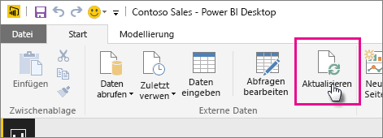

# Aktualisieren eines aus einer Power BI Desktop-Datei erstellten Datasets auf einem lokalen Laufwerk
## Was wird unterstützt?
In Power BI wird „Jetzt Aktualisieren“ und die „Zeitplanaktualisierung“ für Datasets unterstützt, die aus Power BI Desktop-Dateien erstellt wurden, die wiederum aus einem lokalen Laufwerk importiert wurden, bei dem „Daten abrufen“ oder der Abfrage-Editor verwendet wird, um sich mit den Daten zu verbinden und sie aus einer der folgenden Datenquellen zu laden:

### Power BI Gateway – Personal
* Alle Onlinedatenquellen, die unter „Daten abrufen“ und im Abfrage-Editor von Power BI Desktop angezeigt werden.
* Alle lokalen Datenquellen, die unter „Daten abrufen“ oder im Abfrage-Editor von Power BI Desktop angezeigt werden, außer Hadoop-Dateien (HDFS) und Microsoft Exchange.

<!-- Refresh Data sources-->
[!INCLUDE [refresh-datasources](./includes/refresh-datasources.md)]

> [!NOTE]
> Ein Gateway muss installiert sein und ausgeführt werden, damit Power BI auf lokale Datenquellen zugreifen und das Dataset aktualisieren kann.
> 
> 

Sie können eine einmalige, manuelle Aktualisierung direkt in Power BI Desktop ausführen, indem Sie auf dem Menüband „Start“ „Aktualisieren“ auswählen. Wenn Sie hier „Aktualisieren“ auswählen, werden die Daten im Modell der *Datei* mit den aktualisierten Daten aus der ursprünglichen Datenquelle aktualisiert. Diese Art der vollständig in der Power BI Desktop-Anwendung ausgeführten Aktualisierung unterscheidet sich von der manuellen oder Zeitplanaktualisierung in Power BI, und es ist wichtig, den Unterschied zu verstehen.

Beim Importieren der Power BI Desktop-Datei von einem lokalen Laufwerk werden die Daten gemeinsam mit anderen Informationen über das Modell in ein Dataset in den Power BI-Dienst geladen. Sie sollten die Daten im Dataset im Power BI-Dienst, nicht in Power BI Desktop, aktualisieren, da diese Daten für die Berichte des Power BI-Diensts genutzt werden. Da die Datenquellen extern sind, können Sie das Dataset mithilfe von **Jetzt aktualisieren** manuell aktualisieren, oder Sie richten eine **Zeitplanaktualisierung** ein.

Wenn Sie das Dataset aktualisieren, stellt Power BI keine Verbindung mit der Datei auf dem lokalen Laufwerk her, um aktualisierte Daten abzufragen. Power BI verwendet Informationen im Dataset für die direkte Verbindung mit den Datenquellen zum Abfragen von aktualisierten Daten, die anschließend in das Dataset geladen werden.

> [!NOTE]
> Diese aktualisierten Daten im Dataset werden nicht mit der Datei auf dem lokalen Laufwerk synchronisiert.
> 
> 

## Wie richte ich eine Zeitplanaktualisierung ein?
Beim Einrichten einer Zeitplanaktualisierung stellt Power BI eine direkte Verbindung mit den Datenquellen mithilfe von Verbindungsinformationen und Anmeldeinformationen aus dem Dataset her, um aktualisierte Daten abzufragen und die aktualisierten Daten in das Dataset zu laden. Alle Visualisierungen in Berichten und Dashboards, die auf dem Dataset des Power BI-Diensts basieren, werden ebenfalls aktualisiert.

Weitere Details zur Einrichtung einer Zeitplanaktualisierung Sie unter [Konfigurieren einer Zeitplanaktualisierung](refresh-scheduled-refresh.md).

## Bei Problemen
Wenn etwas schief geht, liegt das in der Regel daran, dass sich Power BI nicht bei den Datenquellen anmelden kann, oder, wenn das Dataset mit einer lokalen Datenquelle verbunden ist, daran, dass das Gateway offline ist. Stellen Sie sicher, dass sich Power BI bei den Datenquellen anmelden kann. Wenn sich ein Kennwort ändert, das Sie zum Anmeldenbei einer Datenquelle  verwenden, oder Power BI aus einer Datenquelle abgemeldet wird, sollten Sie in jedem Fall versuchen, sich mit Ihren Anmeldeinformationen für die Datenquelle erneut darin anzumelden.

Stellen Sie sicher, dass die Option **Benachrichtigungs-E-Mail zu Aktualisierungsfehlern an mich senden** aktiviert ist. Es ist wichtig, darüber informiert zu werden, wenn ein Fehler bei einer Zeitplanaktualisierung auftritt.

## Problembehandlung
Manchmal werden Daten nicht wie erwartet aktualisiert. Dies weist meistens auf ein Problem mit dem Gateway hin. In den Artikeln über die Fehlerbehebung bei Gateways finden Sie Tools und Informationen zu bekannten Problemen.

[Problembehandlung beim lokalen Datengateway](service-gateway-onprem-tshoot.md)

[Problembehandlung für Power BI Gateway – Personal](service-admin-troubleshooting-power-bi-personal-gateway.md)

Weitere Fragen? [Stellen Sie Ihre Frage in der Power BI-Community.](http://community.powerbi.com/)

