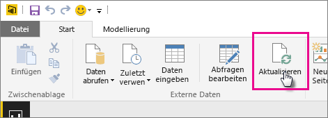
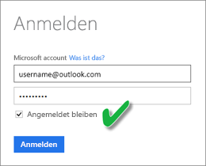

# Aktualisieren eines auf OneDrive oder in SharePoint Online gespeicherten Datasets
Das Importieren von Dateien aus OneDrive oder SharePoint Online in den Power BI-Dienst ist eine hervorragende Möglichkeit, um sicherzustellen, dass Ihre Arbeit in **Power BI Desktop** mit dem Power BI-Dienst synchronisiert wird.

## Vorteile beim Speichern einer Power BI Desktop-Datei auf OneDrive oder SharePoint Online
Wenn Sie eine **Power BI Desktop**-Datei auf OneDrive oder SharePoint Online speichern, werden alle Daten, die Sie in das Dateimodell geladen haben, in das Dataset importiert, und alle Berichte, die Sie in der Datei erstellt haben, werden in **Berichte** im Power BI-Dienst geladen. Wenn Sie Änderungen an Ihrer Datei auf OneDrive oder SharePoint Online vornehmen, z.B. neue Measures hinzufügen, Spaltennamen ändern oder Visualisierungen bearbeiten, werden diese Änderungen nach dem Speichern der Datei normalerweise innerhalb einer Stunde auch im Power BI-Dienst aktualisiert.

Sie können eine einmalige, manuelle Aktualisierung direkt in Power BI Desktop ausführen, indem Sie auf dem Menüband „Start“ „Aktualisieren“ auswählen. Wenn Sie hier „Aktualisieren“ auswählen, werden die Daten im Modell der *Datei* mit den aktualisierten Daten aus der ursprünglichen Datenquelle aktualisiert. Diese Art der vollständig in der Power BI Desktop-Anwendung ausgeführten Aktualisierung unterscheidet sich von der manuellen oder Zeitplanaktualisierung in Power BI, und es ist wichtig, den Unterschied zu verstehen.

Beim Importieren der Power BI Desktop-Datei aus OneDrive oder SharePoint Online werden die Daten gemeinsam mit anderen Informationen über das Modell in ein Dataset in Power BI geladen. Sie sollten die Daten im Dataset im Power BI-Dienst, nicht in Power BI Desktop, aktualisieren, da diese Daten für die Berichte des Power BI-Diensts genutzt werden. Da die Datenquellen extern sind, können Sie das Dataset mithilfe von **Jetzt aktualisieren** manuell aktualisieren, oder Sie richten eine **Zeitplanaktualisierung** ein.

Wenn Sie das Dataset aktualisieren, stellt Power BI keine Verbindung mit der Datei in OneDrive oder SharePoint Online her, um aktualisierte Daten abzufragen. Power BI verwendet Informationen im Dataset für die direkte Verbindung mit den Datenquellen zum Abfragen von aktualisierten Daten, die anschließend in das Dataset geladen werden. Diese aktualisierten Daten im Dataset werden nicht mit der Datei in OneDrive oder SharePoint Online zurück synchronisiert.

## Was wird unterstützt?
In Power BI wird „Jetzt Aktualisieren“ und die „Zeitplanaktualisierung“ für Datasets unterstützt, die aus Power BI Desktop-Dateien erstellt wurden, die wiederum aus einem lokalen Laufwerk importiert wurden, bei dem „Daten abrufen“ oder der Abfrage-Editor verwendet wird, um sich mit den Daten zu verbinden und sie aus einer der folgenden Datenquellen zu laden:

### Power BI Gateway – Personal
* Alle Onlinedatenquellen, die unter „Daten abrufen“ und im Abfrage-Editor von Power BI Desktop angezeigt werden.
* Alle lokalen Datenquellen, die unter „Daten abrufen“ oder im Abfrage-Editor von Power BI Desktop angezeigt werden, außer Hadoop-Dateien (HDFS) und Microsoft Exchange.

<!-- Refresh Data sources-->
[!INCLUDE [refresh-datasources](./includes/refresh-datasources.md)]

> [!NOTE]
> Ein Gateway muss installiert sein und ausgeführt werden, damit Power BI auf lokale Datenquellen zugreifen und das Dataset aktualisieren kann.
> 
> 

## OneDrive oder OneDrive for Business. Was ist der Unterschied?
Wenn Sie sowohl über ein privates OneDrive als auch OneDrive for Business verfügen, empfiehlt es sich, dass Sie alle Dateien beibehalten, die in Power BI in OneDrive for Business importiert werden sollen. Erfahren Sie, warum: Sie verwenden wahrscheinlich zwei unterschiedliche Konten für die Anmeldung.

Das Herstellen einer Verbindung mit OneDrive for Business in Power BI erfolgt i. d. R. nahtlos, da für die Anmeldung bei Power BI häufig das gleiche Konto verwendet wird, das auch für OneDrive for Business verwendet wird. Bei einem privaten OneDrive melden Sie sich wahrscheinlich mit einem anderen [Microsoft-Konto](https://account.microsoft.com) an.

Wenn Sie sich mit Ihrem Microsoft-Konto anmelden, sollten Sie „Angemeldet bleiben“ auswählen. Power BI kann dadurch Aktualisierungen, die Sie in der Datei in Power BI Desktop vornehmen mit Datasets in Power BI synchronisieren.  
    

Wenn Sie Änderungen an der Datei in OneDrive vornehmen, die nicht mit dem Dataset oder Berichten in Power BI synchronisiert werden können, da die Anmeldeinformationen für Ihr Microsoft-Konto möglicherweise geändert wurden, müssen Sie eine Verbindung mit der Datei herstellen und sie wieder aus Ihrem privaten OneDrive importieren.

## Wie richte ich eine Zeitplanaktualisierung ein?
Beim Einrichten einer Zeitplanaktualisierung stellt Power BI eine direkte Verbindung mit den Datenquellen mithilfe von Verbindungsinformationen und Anmeldeinformationen aus dem Dataset her, um aktualisierte Daten abzufragen und die aktualisierten Daten in das Dataset zu laden. Alle Visualisierungen in Berichten und Dashboards, die auf dem Dataset des Power BI-Diensts basieren, werden ebenfalls aktualisiert.

Weitere Details zur Einrichtung einer Zeitplanaktualisierung Sie unter [Konfigurieren einer Zeitplanaktualisierung](refresh-scheduled-refresh.md).

## Bei Problemen
Wenn etwas schief geht, liegt das in der Regel daran, dass sich Power BI nicht bei den Datenquellen anmelden kann, oder, wenn das Dataset mit einer lokalen Datenquelle verbunden ist, daran, dass das Gateway offline ist. Stellen Sie sicher, dass sich Power BI bei den Datenquellen anmelden kann. Wenn sich ein Kennwort ändert, das Sie zum Anmeldenbei einer Datenquelle  verwenden, oder Power BI aus einer Datenquelle abgemeldet wird, sollten Sie in jedem Fall versuchen, sich mit Ihren Anmeldeinformationen für die Datenquelle erneut darin anzumelden.

Wenn Sie Änderungen an der Power BI Desktop-Datei in OneDrive vornehmen und speichern und diese Änderungen nicht innerhalb einer Stunde in Power BI berücksichtigt werden, kann Power BI möglicherweise keine Verbindung mit OneDrive herstellen. Versuchen Sie erneut, eine Verbindung mit der Datei auf OneDrive herzustellen. Wenn Sie aufgefordert werden, sich anzumelden, stellen Sie sicher, dass „Angemeldet bleiben“ aktiviert ist. Da Power BI keine Verbindung mit Ihrem OneDrive zum Synchronisieren mit der Datei herstellen konnte, müssen Sie die Datei erneut importieren.

Stellen Sie sicher, dass die Option **Benachrichtigungs-E-Mail zu Aktualisierungsfehlern an mich senden** aktiviert ist. Es ist wichtig, darüber informiert zu werden, wenn ein Fehler bei einer Zeitplanaktualisierung auftritt.

## Problembehandlung
Manchmal werden Daten nicht wie erwartet aktualisiert. Dies weist meistens auf ein Problem mit dem Gateway hin. In den Artikeln über die Fehlerbehebung bei Gateways finden Sie Tools und Informationen zu bekannten Problemen.

[Problembehandlung beim lokalen Datengateway](service-gateway-onprem-tshoot.md)

[Problembehandlung für Power BI Gateway – Personal](service-admin-troubleshooting-power-bi-personal-gateway.md)

Weitere Fragen? [Stellen Sie Ihre Frage in der Power BI-Community.](http://community.powerbi.com/)

