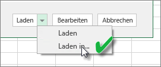
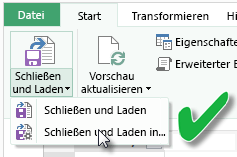
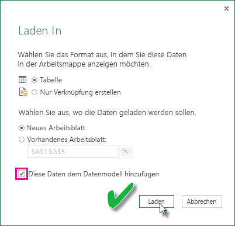

# Aktualisieren eines aus einer Excel-Arbeitsmappe erstellten Datasets auf einem lokalen Laufwerk
## Was wird unterstützt?
In Power BI wird „Jetzt Aktualisieren“ und die „Zeitplanaktualisierung“ für Datasets unterstützt, die aus Excel-Arbeitsmappen erstellt wurden, die wiederum aus einem lokalen Laufwerk importiert wurden, bei dem Power Query („Daten abrufen und transformieren“ in Excel 2016) oder Power Pivot verwendet wird, um sich mit den Datenquellen zu verbinden und Daten in das Excel-Datenmodell laden:  

### Power BI Gateway – Personal
* Alle in Power Query angezeigten Datenquellen.
* Alle lokalen Datenquellen, die unter Power Query angezeigt werden, außer Hadoop-Dateien (HDFS) und Microsoft Exchange.
* Alle in Power Pivot angezeigten Onlinedatenquellen.\*
* Alle lokalen Datenquellen, die unter Power Pivot angezeigt werden, außer Hadoop-Dateien (HDFS) und Microsoft Exchange.

<!-- Refresh Data sources-->
[!INCLUDE [refresh-datasources](./includes/refresh-datasources.md)]

> **Hinweise:**  
> 
> * Ein Gateway muss installiert sein und ausgeführt werden, damit Power BI auf lokale Datenquellen zugreifen und das Dataset aktualisieren kann.
> * Wenn Sie Excel 2013 verwenden, stellen Sie sicher, dass Sie die aktuelle Version von Power Query verwenden.
> * Die Aktualisierung wird für Excel-Arbeitsmappen, die von einem lokalen Laufwerk importiert wurden, auf dem Daten nur in Arbeitsblättern oder verknüpften Tabellen vorhanden sind, nicht unterstützt Die Aktualisierung wird für Arbeitsblattdaten unterstützt, wenn diese in OneDrive gespeichert sind und von dort importiert werden. Weitere Informationen erhalten Sie unter [Aktualisieren eines aus einer Excel-Arbeitsmappe erstellten Datasets auf OneDrive](refresh-excel-file-onedrive.md).
> * Wenn Sie ein Dataset aktualisieren, das aus einer lokal gespeicherten Excel-Arbeitsmappe importiert wurde, werden nur die aus Datenquellen abgefragten Daten aktualisiert. Wenn Sie die Struktur des Datenmodells in Excel oder Power Pivot ändern, wie z. B. zum Erstellen eines neuen Measures oder zum Ändern des Namens einer Spalte, werden diese Änderungen nicht in das Dataset kopiert. Wenn Sie solche Änderungen vornehmen, müssen Sie die Arbeitsmappe erneut hochladen oder veröffentlichen. Wenn Sie regelmäßig Änderungen an der Struktur Ihrer Arbeitsmappe vornehmen und möchten, dass diese im Dataset in Power BI wiedergegeben werden, ohne sie erneut hochladen zu müssen, sollten Sie in Erwägung ziehen, die Arbeitsmappe auf OneDrive hochzuladen. Power BI aktualisiert automatisch sowohl die Struktur als auch die Arbeitsblattdaten aus Arbeitsmappen, die in OneDrive gespeichert und importiert werden.
> 
> 

## Wie kann ich sicherstellen, dass Daten in das Excel-Datenmodell geladen werden?
Wenn Sie Power Query (Daten abrufen und transformieren in Excel 2016) für die Verbindung mit einer Datenquelle verwenden, haben Sie mehrere Möglichkeiten zum Laden der Daten. Um sicherzustellen, dass Sie Daten in das Datenmodell laden, müssen Sie im Dialogfeld **Laden in** die Option **Dem Datenmodell diese Daten hinzufügen** auswählen.

> [!NOTE]
> Die Bilder zeigen Excel 2016.
> 
> 

Klicken Sie im **Navigator**auf **Laden in...**  
    

Wenn Sie im Navigator auf **Bearbeiten** klicken, wird der Abfrage-Editor geöffnet. Dort können Sie auf **Schließen und Laden in...** klicken.  
    

Stellen Sie anschließend unter **Laden in**sicher, dass **Dem Datenmodell diese Daten hinzufügen**ausgewählt ist.  
    

### Was geschieht, wenn ich in Power Pivot „Externe Daten abrufen“ verwende?
Kein Problem. Bei Verwendung von Power Pivot zur Verbindung mit und Abfrage von Daten aus einer lokalen oder Onlinedatenquelle, werden die Daten automatisch in das Datenmodell geladen.

## Wie richte ich eine Zeitplanaktualisierung ein?
Beim Einrichten einer Zeitplanaktualisierung stellt Power BI eine direkte Verbindung mit den Datenquellen mithilfe von Verbindungsinformationen und Anmeldeinformationen aus dem Dataset her, um aktualisierte Daten abzufragen und die aktualisierten Daten in das Dataset zu laden. Alle Visualisierungen in Berichten und Dashboards, die auf dem Dataset des Power BI-Diensts basieren, werden ebenfalls aktualisiert.

Weitere Details zur Einrichtung einer Zeitplanaktualisierung Sie unter [Konfigurieren einer Zeitplanaktualisierung](refresh-scheduled-refresh.md).

## Bei Problemen
Wenn etwas schief geht, liegt das in der Regel daran, dass sich Power BI nicht bei den Datenquellen anmelden kann, oder, wenn das Dataset mit einer lokalen Datenquelle verbunden ist, daran, dass das Gateway offline ist. Stellen Sie sicher, dass sich Power BI bei den Datenquellen anmelden kann. Wenn sich ein Kennwort ändert, das Sie zum Anmeldenbei einer Datenquelle  verwenden, oder Power BI aus einer Datenquelle abgemeldet wird, sollten Sie in jedem Fall versuchen, sich mit Ihren Anmeldeinformationen für die Datenquelle erneut darin anzumelden.

Stellen Sie sicher, dass die Option **Benachrichtigungs-E-Mail zu Aktualisierungsfehlern an mich senden**aktiviert ist. Es ist wichtig, darüber informiert zu werden, wenn ein Fehler bei einer Zeitplanaktualisierung auftritt.

>[!IMPORTANT]
>Die Aktualisierung wird nicht für OData-Feeds unterstützt, die mit Power Pivot verbunden sind und darüber abgefragt werden. Bei einem OData-Feed als Datenquelle verwenden Sie Power Query.

## Problembehandlung
Manchmal werden Daten nicht wie erwartet aktualisiert. Dies weist meistens auf ein Problem mit dem Gateway hin. In den Artikeln über die Fehlerbehebung bei Gateways finden Sie Tools und Informationen zu bekannten Problemen.

[Problembehandlung beim lokalen Datengateway](service-gateway-onprem-tshoot.md)

[Problembehandlung für Power BI Gateway – Personal](service-admin-troubleshooting-power-bi-personal-gateway.md)

## Nächste Schritte
Weitere Fragen? [Wenden Sie sich an die Power BI-Community](http://community.powerbi.com/)

