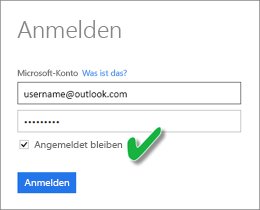
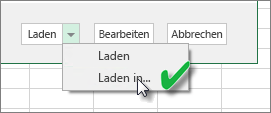
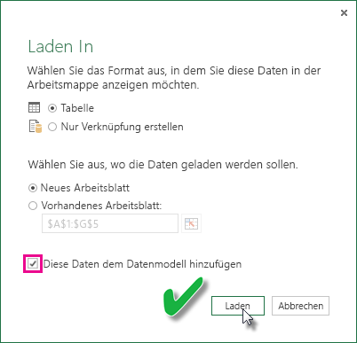

# Aktualisieren eines aus einer Excel-Arbeitsmappe erstellten Datasets in OneDrive oder SharePoint Online
Sie können Excel-Arbeitsmappen importieren, die auf Ihrem Computer lokal oder in der Cloud (z.B. bei OneDrive for Business oder SharePoint Online) gespeichert sind. Im Folgenden behandeln wir die Vorteile des Cloudspeichers für Excel-Dateien. Weitere Informationen zum Importieren von Excel-Dateien in Power BI finden Sie unter [Abrufen von Daten aus Excel-Arbeitsmappendateien](service-excel-workbook-files.md).

## Was sind die Vorteile?
Das Importieren von Dateien aus OneDrive oder SharePoint Online ist eine hervorragende Möglichkeit, sicherzustellen, dass Ihre Arbeit in Excel mit dem Power BI-Dienst synchron bleibt. Alle Daten, die Sie in das Dateimodell geladen haben, werden in das Dataset importiert, und alle Berichte, die Sie in der Datei erstellt haben, werden in Berichte in Power BI geladen. Wenn Sie Änderungen an Ihrer Datei auf OneDrive oder SharePoint Online vornehmen, wie z.B. neue Measures hinzufügen, Spaltennamen ändern oder Visualisierungen bearbeiten, werden diese Änderungen nach dem Speichern normalerweise innerhalb einer Stunde in Power BI aktualisiert.

Beim Importieren einer Excel-Arbeitsmappe aus Ihrem privaten OneDrive werden alle Daten in der Arbeitsmappe, wie Tabellen in Arbeitsblättern und/oder Daten, die in das Excel-Datenmodell geladen werden, sowie die Struktur des Datenmodells in ein neues Dataset in Power BI importiert. Power View-Visualisierungen werden in Berichten neu erstellt. Power BI verbindet sich ungefähr einmal pro Stunde automatisch mit der Arbeitsmappe in OneDrive oder SharePoint Online, um nach Aktualisierungen zu suchen. Falls die Arbeitsmappe geändert wurde, aktualisiert Power BI das Dataset und die Berichte im Power BI-Dienst.

Sie können das Dataset im Power BI-Dienst aktualisieren. Wenn Sie manuell aktualisieren oder eine Aktualisierung des Datasets mittels „Zeitplanaktualisierung“ durchführen, stellt Power BI direkt eine Verbindung mit den externen Datenquellen zur Abfrage von aktualisierten Daten her und lädt diese in das Dataset. Durch das Aktualisieren eines Datasets in Power BI werden die Daten in der Arbeitsmappe in OneDrive oder SharePoint Online nicht aktualisiert. 

## Was wird unterstützt?
In Power BI wird „Jetzt Aktualisieren“ und die „Zeitplanaktualisierung“ für Datasets unterstützt, die aus Power BI Desktop-Dateien erstellt wurden, die wiederum aus einem lokalen Laufwerk importiert wurden, bei dem „Daten abrufen“ oder der Abfrage-Editor verwendet wird, um sich mit den Daten zu verbinden und sie aus einer der folgenden Datenquellen zu laden:  

### Power BI Gateway – Personal
* Alle Onlinedatenquellen, die unter „Daten abrufen“ und im Abfrage-Editor von Power BI Desktop angezeigt werden.
* Alle lokalen Datenquellen, die unter „Daten abrufen“ oder im Abfrage-Editor von Power BI Desktop angezeigt werden, außer Hadoop-Dateien (HDFS) und Microsoft Exchange.

<!-- Refresh Data sources-->
[!INCLUDE [refresh-datasources](./includes/refresh-datasources.md)]

> [!NOTE]
> Ein Gateway muss installiert sein und ausgeführt werden, damit Power BI auf lokale Datenquellen zugreifen und das Dataset aktualisieren kann.
> 
> 

## OneDrive oder OneDrive for Business. Was ist der Unterschied?
Wenn Sie sowohl über ein privates OneDrive als auch OneDrive for Business verfügen, empfiehlt es sich, dass Sie alle Dateien beibehalten, die in Power BI in OneDrive for Business importiert werden sollen. Dies wird empfohlen, da Sie wahrscheinlich zwei unterschiedliche Konten für die Anmeldung verwenden.

Das Herstellen einer Verbindung mit OneDrive for Business in Power BI erfolgt i. d. R. nahtlos, da für die Anmeldung bei Power BI häufig das gleiche Konto verwendet wird, das auch für OneDrive for Business verwendet wird. Bei einem privaten OneDrive melden Sie sich wahrscheinlich mit einem anderen [Microsoft-Konto](http://www.microsoft.com/account/default.aspx) an.

Wenn Sie sich mit Ihrem Microsoft-Konto anmelden, sollten Sie „Angemeldet bleiben“ auswählen. Power BI kann dadurch Aktualisierungen, die Sie in der Datei in Power BI Desktop vornehmen mit Datasets in Power BI synchronisieren.  
    

Wenn Sie Änderungen an der Datei in OneDrive vornehmen, die nicht mit dem Dataset oder Berichten in Power BI synchronisiert werden können, da die Anmeldeinformationen für Ihr Microsoft-Konto möglicherweise geändert wurden, müssen Sie eine Verbindung mit der Datei herstellen und sie wieder aus Ihrem privaten OneDrive importieren.

## Optionen für die Verbindung mit einer Excel-Datei
Wenn Sie eine Verbindung mit einer Excel-Arbeitsmappe in OneDrive for Business oder SharePoint Online herstellen, haben Sie zwei Möglichkeiten zum Übertragen der Inhalte Ihrer Arbeitsmappe in Power BI.

[**Importieren von Excel-Daten in Power BI**](service-excel-workbook-files.md#import-or-connect-to-an-excel-workbook-from-power-bi): Wenn Sie eine Excel-Arbeitsmappe aus OneDrive for Business oder SharePoint Online importieren, funktioniert dies wie oben beschrieben.

[**Verbinden, Verwalten und Anzeigen von Excel in Power BI**](service-excel-workbook-files.md#one-excel-workbook--two-ways-to-use-it): Bei der Verwendung dieser Option erstellen Sie eine direkte Verbindung zwischen Power BI und der Arbeitsmappe in OneDrive for Business oder SharePoint Online.

Wenn Sie auf diese Weise eine Verbindung mit einer Excel-Arbeitsmappe herstellen, wird kein Dataset in Power BI erstellt. Jedoch wird die Arbeitsmappe in dem Power BI-Dienst im Bereich „Berichte“ mit einem Excel-Symbol neben dem Namen angezeigt. Im Gegensatz zu Excel Online können Sie eine Zeitplanaktualisierung einrichten, wenn Sie eine Verbindung mit der Arbeitsmappe aus Power BI herstellen, falls die Arbeitsmappe Verbindungen mit externen Datenquellen besitzt, die Daten in das Excel-Datenmodell laden.

Wenn Sie auf diese Weise eine Zeitplanaktualisierung einrichten, besteht der einzige Unterschied darin, dass die aktualisierten Daten in das Datenmodell der Arbeitsmappe in OneDrive oder SharePoint Online statt in ein Dataset in Power BI importiert werden.

## Wie kann ich sicherstellen, dass Daten in das Excel-Datenmodell geladen werden?
Wenn Sie Power Query (Daten abrufen und transformieren in Excel 2016) für die Verbindung mit einer Datenquelle verwenden, haben Sie mehrere Möglichkeiten zum Laden der Daten. Um sicherzustellen, dass Sie Daten in das Datenmodell laden, müssen Sie im Dialogfeld **Laden in** die Option **Dem Datenmodell diese Daten hinzufügen** auswählen.

> [!NOTE]
> Die Bilder zeigen Excel 2016.
> 
> 

Klicken Sie im **Navigator**auf **Laden in...**  
    

Wenn Sie im Navigator auf **Bearbeiten** klicken, wird der Abfrage-Editor geöffnet. Dort können Sie auf **Schließen und Laden in...** klicken.  
    

Stellen Sie anschließend unter **Laden in**sicher, dass **Dem Datenmodell diese Daten hinzufügen**ausgewählt ist.  
    

### Was geschieht, wenn ich in Power Pivot „Externe Daten abrufen“ verwende?
Kein Problem. Bei Verwendung von Power Pivot zur Verbindung mit und Abfrage von Daten aus einer lokalen oder Onlinedatenquelle, werden die Daten automatisch in das Datenmodell geladen.

## Wie richte ich eine Zeitplanaktualisierung ein?
Beim Einrichten einer Zeitplanaktualisierung stellt Power BI eine direkte Verbindung mit den Datenquellen mithilfe von Verbindungsinformationen und Anmeldeinformationen aus dem Dataset her, um aktualisierte Daten abzufragen und die aktualisierten Daten in das Dataset zu laden. Alle Visualisierungen in Berichten und Dashboards, die auf dem Dataset des Power BI-Diensts basieren, werden ebenfalls aktualisiert.

Weitere Details zur Einrichtung einer Zeitplanaktualisierung Sie unter [Konfigurieren einer Zeitplanaktualisierung](refresh-scheduled-refresh.md).

## Bei Problemen
Wenn etwas schief geht, liegt das in der Regel daran, dass sich Power BI nicht bei den Datenquellen anmelden kann, oder, wenn das Dataset mit einer lokalen Datenquelle verbunden ist, daran, dass das Gateway offline ist. Stellen Sie sicher, dass sich Power BI bei den Datenquellen anmelden kann. Wenn sich ein Kennwort ändert, das Sie zum Anmeldenbei einer Datenquelle  verwenden, oder Power BI aus einer Datenquelle abgemeldet wird, sollten Sie in jedem Fall versuchen, sich mit Ihren Anmeldeinformationen für die Datenquelle erneut darin anzumelden.

Stellen Sie sicher, dass die Option **Benachrichtigungs-E-Mail zu Aktualisierungsfehlern an mich senden**aktiviert ist. Es ist wichtig, darüber informiert zu werden, wenn ein Fehler bei einer Zeitplanaktualisierung auftritt.

## Wichtige Hinweise
\* Die Aktualisierung wird nicht für OData-Feeds unterstützt, die mit Power Pivot verbunden sind und darüber abgefragt werden. Bei einem OData-Feed als Datenquelle verwenden Sie Power Query.

## Problembehandlung
Manchmal werden Daten nicht wie erwartet aktualisiert. Dies weist meistens auf ein Problem mit dem Gateway hin. In den Artikeln über die Fehlerbehebung bei Gateways finden Sie Tools und Informationen zu bekannten Problemen.

[Problembehandlung beim lokalen Datengateway](service-gateway-onprem-tshoot.md)

[Problembehandlung für Power BI Gateway – Personal](service-admin-troubleshooting-power-bi-personal-gateway.md)

Weitere Fragen? [Wenden Sie sich an die Power BI-Community](http://community.powerbi.com/)

