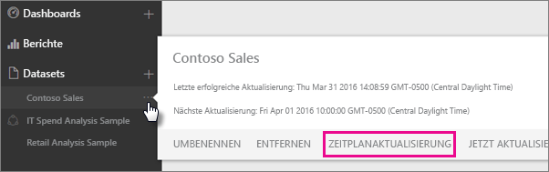
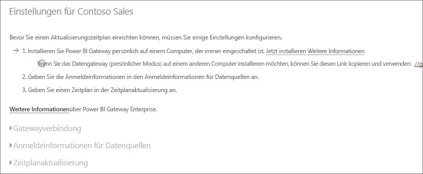
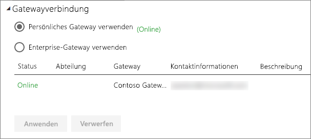
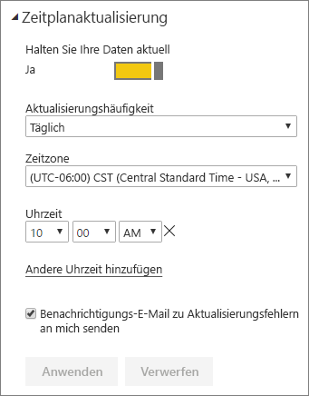

# Konfigurieren geplanter Aktualisierungen

>[!NOTE]
>Nach zwei Monaten der Inaktivität wird die geplante Aktualisierung Ihres Datasets ausgesetzt. Weitere Informationen finden Sie im Abschnitt [*Aktualisierung planen*](#schedule-refresh) weiter unten in diesem Artikel.
> 
> 

Wenn Ihr Dataset das geplante Aktualisieren durch „Jetzt aktualisieren“ und „Zeitplanaktualisierung“ unterstützt, gibt es einige Anforderungen und Einstellungen, die für eine erfolgreiche Aktualisierung wichtig sind. Diese sind **Gatewayverbindung**, **Anmeldeinformationen für Datenquellen**, und **Zeitplanaktualisierung**. Sehen wir uns diese im Einzelnen genauer an.

Dabei werden die Optionen beschrieben, die sowohl für [Power BI Gateway – Personal](service-gateway-personal-mode.md) als auch für das [lokale Datengateway](service-gateway-onprem.md) verfügbar sind.

Um in den Bildschirm für die Zeitplanaktualisierung zu gelangen, gehen sie wie folgt vor.

1. Wählen Sie die **Auslassungspunkte (...)** aus, die neben einem unter **Datasets** aufgelisteten Dataset stehen.
2. Wählen Sie **Zeitplanaktualisierung** aus.
   
    

## Gatewayverbindung
Abhängig davon, ob Sie ein Personal oder Enterprise-Gateway online und verfügbar haben, werden Ihnen hier verschiedene Optionen angezeigt.

Falls kein Gateway verfügbar ist, wird Ihnen **Gatewayeinstellungen** als deaktiviert angezeigt. Ihnen wird auch eine Meldung angezeigt, die angibt, wie Sie das Personal Gateway installieren.

Falls Sie ein persönliches Gateway konfiguriert haben, steht es Ihnen als Auswahlmöglichkeit zur Verfügung, sofern es online ist. Es wird „offline“ anzeigen, falls es nicht verfügbar ist.

Sie können auch das Enterprise-Gateway verwenden, falls Ihnen eins zur Verfügung steht. Ihnen wird nur ein Enterprise-Gateway als verfügbar angezeigt, falls Ihr Konto in der Registerkarte „Benutzer“ der für ein bestimmtes Gateway konfigurierten Datenquelle aufgelistet ist.

## Anmeldeinformationen für Datenquellen
### Power BI Gateway – Personal
Falls Sie das persönliche Gateway verwenden, um die Daten zu aktualisieren, müssen Sie die Anmeldeinformationen angeben, die für die Verbindung mit der Back-Enddatenquelle verwendet werden. Falls Sie mit einem Inhaltspaket von einem Onlinedienst verbunden sind, werden die eingegebenen Anmeldeinformationen für die geplante Aktualisierung übernommen.

Sie müssen sich nur beim ersten Mal bei Datenquellen anmelden, wenn Sie die Aktualisierung auf dieses Dataset verwenden. Sobald Sie sie eingegeben haben, werden diese Anmeldeinformationen im Dataset beibehalten.

> [!NOTE]
> Wenn sich das Kennwort, das Sie für die Anmeldung in der Datenquelle verwenden, geändert hat oder es abgelaufen ist, erfordern einige Authentifizierungsmethoden, dass Sie das Kennwort für die Datenquellen auch unter „Anmeldeinformationen für Datenquellen“ ändern.
> 
> 

Wenn etwas schief geht, steht das Problem normalerweise im Zusammenhang damit, dass das Gateway offline ist, weil es sich nicht bei Windows anmelden und den Dienst starten konnte, oder damit, dass sich Power BI nicht bei den Datenquellen anmelden konnte, um eine Abfrage nach aktualisierten Daten durchzuführen. Wenn die Aktualisierung fehlschlägt, überprüfen Sie das Dataseteinstellungen. Wenn der Gatewaydienst offline ist, wird Ihnen unter „Gateway-Status“ der Fehler angezeigt. Wenn sich Power BI nicht bei den Datenquellen anmelden kann, sehen Sie eine Fehlermeldung in den Anmeldeinformationen für die Datenquellen.

### Lokales Datengateway
Wenn Sie das lokale Datengateway verwenden, um die Daten zu aktualisieren, müssen Sie keine Anmeldeinformationen angeben, da diese vom Gatewayadministrator für die Datenquelle definiert werden.

> [!NOTE]
> Bei lokalen Verbindungen mit SharePoint für die Datenaktualisierung unterstützt Power BI nur *Anonyme Authentifizierung*, *Standardauthentifizierung* und *Windows-Authentifizierung (NTLM/Kerberos)*. Power BI unterstützt die *ADFS-Authentifizierung* und *formularbasierte Authentifizierung* für die Datenaktualisierung von lokalen SharePoint-Datenquellen nicht.
> 
> 

## Zeitplanaktualisierung
In dem Bereich „geplante Aktualisierung“ definieren Sie das Aktualisierungsintervall und Aktualisierungszeitfenster für das Dataset. Einige Datenquellen erfordern kein vorhandenes Gateway, um konfiguriert werden zu können. Andere erfordern ein Gateway.

Die Einstellung **Halten Sie Ihre Daten aktuell** muss auf **Ja** festgelegt sein, um die Einstellungen konfigurieren zu können.

> [!NOTE]
> Der Power BI-Dienst ist darauf ausgelegt, die Aktualisierung Ihrer Daten innerhalb einer Toleranz von **15 Minuten** für den geplanten Aktualisierungszeitraum zu initiieren.
> 
> 

> [!NOTE]
> Nach zwei Monaten der Inaktivität wird die geplante Aktualisierung Ihres Datasets ausgesetzt. Ein Dataset wird als inaktiv betrachtet, wenn kein Benutzer die darauf basierenden Dashboards oder Berichte aufgerufen hat. Zu diesem Zeitpunkt wird der Besitzer des Datasets per E-Mail benachrichtigt, dass die geplante Aktualisierung pausiert wird, und der Aktualisierungsplan für das Dataset wird als **deaktiviert** angezeigt. Um die geplante Aktualisierung wiederaufzunehmen, rufen Sie einfach ein Dashboard oder einen Bericht auf, dem das Dataset zugrunde liegt.
> 
> 

## Was wird unterstützt?
Bestimmte Datasets werden gegenüber verschiedenen Gateways für geplante Aktualisierungen unterstützt. Hier finden Sie eine Referenz, dazu was verfügbar ist.

### Power BI Gateway – Personal
**Power BI Desktop**

* Alle Onlinedatenquellen, die unter „Daten abrufen“ und im Abfrage-Editor von Power BI Desktop angezeigt werden.
* Alle lokalen Datenquellen, die unter „Daten abrufen“ oder im Abfrage-Editor von Power BI Desktop angezeigt werden, außer Hadoop-Dateien (HDFS) und Microsoft Exchange.

**Excel**

> [!NOTE]
> In Excel 2016 und höher wird Power Query jetzt im Datenabschnitt des Menübandes unter „Abrufen und Transformieren von Daten“ aufgeführt.
> 
> 

* Alle in Power Query angezeigten Datenquellen.
* Alle lokalen Datenquellen, die unter Power Query angezeigt werden, außer Hadoop-Dateien (HDFS) und Microsoft Exchange.
* Alle in Power Pivot angezeigten Onlinedatenquellen.\*
* Alle lokalen Datenquellen, die unter Power Pivot angezeigt werden, außer Hadoop-Dateien (HDFS) und Microsoft Exchange.

<!-- Refresh Data sources-->
[!INCLUDE [refresh-datasources](./includes/refresh-datasources.md)]

## Problembehandlung
Manchmal werden Daten nicht wie erwartet aktualisiert. Dies weist meistens auf ein Problem mit dem Gateway hin. In den Artikeln über die Fehlerbehebung bei Gateways finden Sie Tools und Informationen zu bekannten Problemen.

[Problembehandlung beim lokalen Datengateway](service-gateway-onprem-tshoot.md)

[Problembehandlung für Power BI Gateway – Personal](service-admin-troubleshooting-power-bi-personal-gateway.md)

## Nächste Schritte
[Aktualisieren von Daten in Power BI](refresh-data.md)  
[Power BI Gateway – Personal](service-gateway-personal-mode.md)  
[Lokales Datengateway](service-gateway-onprem.md)  
[Problembehandlung beim lokalen Datengateway](service-gateway-onprem-tshoot.md)  
[Problembehandlung für Power BI Gateway – Personal](service-admin-troubleshooting-power-bi-personal-gateway.md)  

Weitere Fragen? [Stellen Sie Ihre Frage in der Power BI-Community.](http://community.powerbi.com/)

