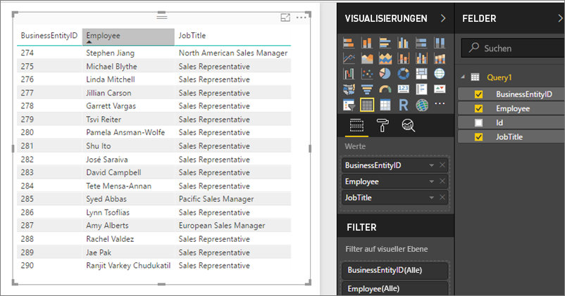

# Zugreifen auf freigegebene Datasets als OData-Feeds in Power BI-Berichtsserver
Sie können mit einem OData-Feed auf freigegebene Datasets aus Power BI Desktop zugreifen.

1. Mit der OData-Feed-URL können Sie eine Verbindung mit der OData-Quelle herstellen.
   
    
2. Nachdem Sie die Daten in Power BI Desktop übernommen haben, können Sie sie im Abfrage-Editor ändern.
   
    
3. Jetzt können Sie die Daten beim Entwerfen von Berichten verwenden.
   
    

Achten Sie darauf, dass Sie **Erweiterte Optionen** verwenden, sodass Sie OpenType-Spalten aktivieren und die Spalten entsprechend den jeweiligen Anforderungen in Power Query formatieren können.

Informieren Sie sich über das [Herstellen von Verbindungen mit OData-Feldern in Power BI Desktop](../desktop-connect-odata.md).

Weitere Fragen? [Stellen Sie Ihre Frage in der Power BI-Community.](https://community.powerbi.com/)

