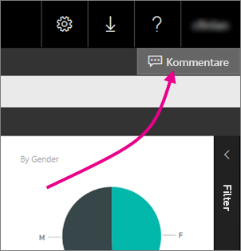
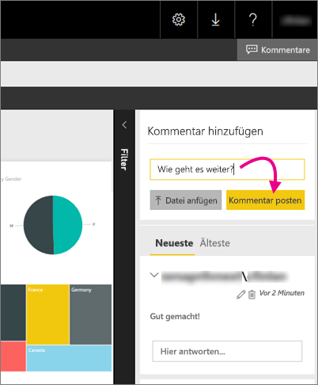

# Hinzufügen von Kommentaren zu einem Bericht in einem Berichtsserver – Power BI-Berichtsserver
Im Webportal eines Berichtsservers können Sie Berichten, einschließlich Power BI-Berichten, Kommentare hinzufügen. Die Kommentare verbleiben im Bericht, und jeder mit den entsprechenden Berechtigungen kann die Kommentare zum Bericht anzeigen. Weitere Informationen finden Sie weiter unten im Abschnitt [Berechtigungen](#permissions).

## Hinzufügen oder Anzeigen von Kommentaren
1. Öffnen eines paginierten Berichts oder eines Power BI-Berichts auf einem Berichtsserver.
2. Wählen Sie in der oberen rechten Ecke **Kommentare** aus.
   
    
   
    Im Bereich „Kommentare“ sehen Sie alle vorhandenen Kommentare.
3. Schreiben Sie Ihren Kommentar, und wählen Sie dann **Kommentar posten** aus.
   
    
   
    Ihr Kommentar wird zusammen mit allen früheren Kommentaren im Bereich auf dem Webportal angezeigt. Sie werden auch bei aktivierter Berichtsfunktion in den mobilen Power BI-Apps nicht angezeigt.
   
   > [!TIP]
   > Wussten Sie schon? Sie können [Power BI-Berichte in den mobilen Power BI-Apps kommentieren](../consumer/mobile/mobile-annotate-and-share-a-tile-from-the-mobile-apps.md) und die kommentierten Berichte mit anderen teilen.
   > 
   > 

## Berechtigungen
Abhängig von Ihren Berechtigungen zeigt sich Ihnen dieses Verhalten:

* Sie sehen keine Kommentare.
* Sie sehen alle Kommentare und können eigene Kommentare posten, bearbeiten und löschen.
* Sie sehen alle Kommentare, können eigene Kommentare posten, bearbeiten und löschen sowie die Kommentare anderer Benutzer löschen.

## Nächste Schritte
* [Was ist der Power BI-Berichtsserver?](get-started.md)  

Weitere Fragen? [Stellen Sie Ihre Frage in der Power BI-Community.](https://community.powerbi.com/)

