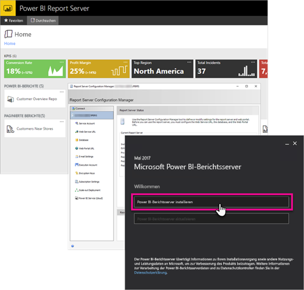

# Administratorhandbuch: Übersicht über Power BI-Berichtsserver
Willkommen beim Administratorhandbuch für Power BI-Berichtsserver, einem lokalen Speicherort zum Speichern und Verwalten Ihrer Power BI-, mobilen und paginierten Berichte.

Dieses Handbuch hilft Ihnen beim Verstehen der Konzepte für die Planung, Bereitstellung und Verwaltung Ihrer Instanz von Power BI-Berichtsserver.

## Installation und Migration
Sie müssen Power BI-Berichtsserver installieren, um damit arbeiten zu können. Wir bieten Ihnen eine Anleitung zum Erledigen dieser Aufgabe.

Sehen Sie sich vor dem Installieren oder Upgraden von bzw. Migrieren zu Power BI-Berichtsserver die [Systemanforderungen](system-requirements.md) für den Berichtsserver an.

### Installation
Wenn Sie eine neue Instanz von Power BI-Berichtsserver bereitstellen, stehen Ihnen die folgenden Dokumente als Hilfe zur Verfügung. Zum Einstieg steht eine Schnellstartanleitung bereit. Ausführliche Informationen finden Sie im Dokument zur Installation.

* [Schnellstart: Installieren von Power BI-Berichtsserver](quickstart-install-report-server.md)
* [Installieren von Power BI-Berichtsserver](install-report-server.md)

### Migration
Es gibt kein direktes Upgrade für SQL Server Reporting Services. Wenn Sie über eine SQL Server Reporting Services-Instanz verfügen, die Sie in eine Power BI-Berichtsserver-Instanz umwandeln möchten, müssen Sie eine Migration vornehmen. Eine Migration empfiehlt sich möglicherweise auch aus anderen Gründen. Im Dokument zur Migration finden Sie weitere Details.

[Migrieren einer Berichtsserverinstallation](migrate-report-server.md)

## Konfigurieren des Berichtsservers
Zum Konfigurieren Ihres Berichtsservers stehen Ihnen viele Optionen zur Verfügung. Verwenden Sie SSL? Konfigurieren Sie einen E-Mail-Server? Wünschen Sie eine Integration mit dem Power BI-Dienst zum Anheften von Visualisierungen?

Der Großteil der Konfigurationsaufgaben erfolgt im Berichtsserver-Konfigurations-Manager. In der Dokumentation zum [Konfigurations-Manager](https://docs.microsoft.com/sql/reporting-services/install-windows/reporting-services-configuration-manager-native-mode) finden Sie weitere Einzelheiten.

## Sicherheit
Sicherheit und Schutz sind für jede Organisation wichtig. In der Dokumentation zur [Sicherheit](https://docs.microsoft.com/sql/reporting-services/security/reporting-services-security-and-protection) erfahren Sie mehr zu Authentifizierung, Autorisierung, Rollen und Berechtigungen.

## Nächste Schritte
[Schnellstart: Installieren von Power BI-Berichtsserver](quickstart-install-report-server.md)  
[Ermitteln des Product Key für den Berichtsserver](find-product-key.md)  
[Installieren von für Power BI-Berichtsserver optimiertem Power BI Desktop](install-powerbi-desktop.md)  
[Installieren des Berichts-Generators](https://docs.microsoft.com/sql/reporting-services/install-windows/install-report-builder)  
[Herunterladen der SQL Server Data Tools](http://go.microsoft.com/fwlink/?LinkID=616714)

Weitere Fragen? [Stellen Sie Ihre Frage in der Power BI-Community.](https://community.powerbi.com/)

