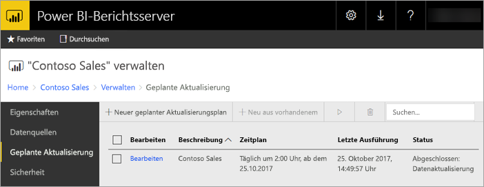
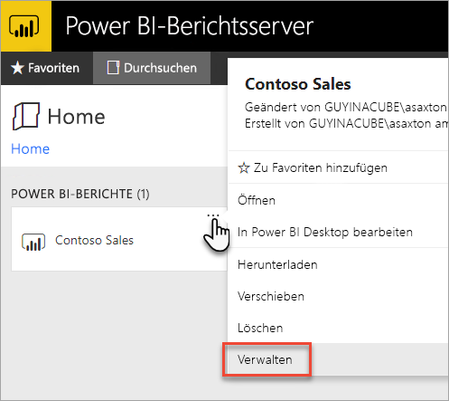
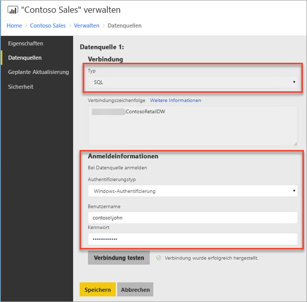
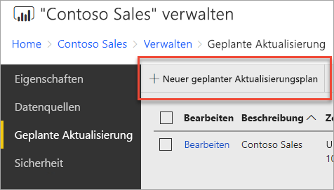
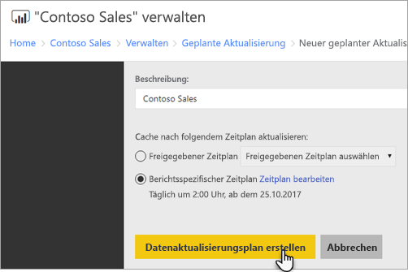
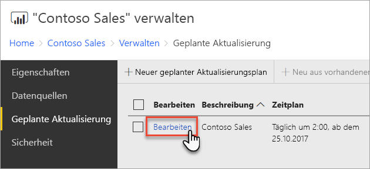
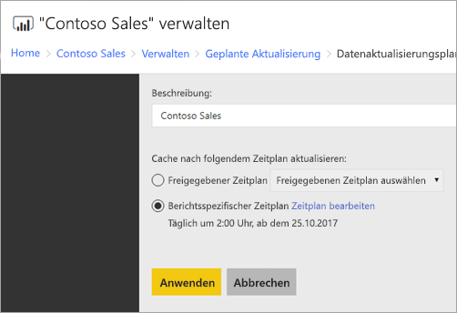

# Konfigurieren der geplanten Aktualisierung für Power BI-Berichte
Zum Aktualisieren von Daten in Ihrem Power BI-Bericht muss ein Plan für die geplante Aktualisierung erstellt werden. Dies erfolgt im Bereich *Verwalten* eines Power BI-Berichts.

## Konfigurieren von Anmeldeinformationen für Datenquellen
Vor dem Erstellen eines Plans für die geplante Datenaktualisierung müssen Sie die Anmeldeinformationen für **jede Datenquelle** festlegen, die im Power BI-Bericht verwendet wird.

1. Klicken Sie im Webportal mit der rechten Maustaste auf den Power BI-Bericht, und wählen Sie **Verwalten** aus.
   
    
2. Wählen Sie im linken Menü die Registerkarte **Datenquellen** aus.
3. Wählen Sie für jede angezeigte Datenquelle den Typ der Authentifizierung aus, die beim Herstellen einer Verbindung mit der betreffenden Datenquelle ausgeführt werden soll. Geben Sie die entsprechenden Anmeldeinformationen ein.
   
    

## Erstellen eines Plans für die geplante Aktualisierung
Führen Sie die folgenden Schritte aus, um einen Plan für die geplante Aktualisierung zu erstellen.

1. Klicken Sie im Webportal mit der rechten Maustaste auf den Power BI-Bericht, und wählen Sie **Verwalten** aus.
   
    
2. Wählen Sie im linken Menü die Registerkarte **Geplante Aktualisierung** aus.
3. Wählen Sie auf der Seite **Geplante Aktualisierung** die Option **Neuer geplanter Aktualisierungsplan** aus.
   
    
4. Geben Sie auf der Seite **Neuer geplanter Aktualisierungsplan** eine Beschreibung ein, und legen Sie einen Zeitplan für die Aktualisierung des Datenmodells fest.
5. Wählen Sie abschließend **Create scheduled refresh plan** (Plan für geplante Aktualisierung erstellen) aus.
   
    

## Ändern eines Plans für die geplante Aktualisierung
Beim Ändern eines Plans für die geplante Aktualisierung gehen Sie ähnlich wie beim Erstellen vor.

1. Klicken Sie im Webportal mit der rechten Maustaste auf den Power BI-Bericht, und wählen Sie **Verwalten** aus.
   
    
2. Wählen Sie im linken Menü die Registerkarte **Geplante Aktualisierung** aus.
3. Wählen Sie auf der Seite **Geplante Aktualisierung** neben dem zu verwaltenden Aktualisierungsplan auf **Bearbeiten**.
   
    
4. Geben Sie auf der Seite **Edit Scheduled Refresh Plan** (Plan für die geplante Aktualisierung bearbeiten) eine Beschreibung ein, und legen Sie einen Zeitplan für die Aktualisierung des Datenmodells fest.
5. Wählen Sie anschließend **Anwenden** aus.
   
    

## Anzeigen des Status des Plans für die geplante Aktualisierung
Zeigen Sie den Status eines Plans für die geplante Aktualisierung im Webportal an.

1. Klicken Sie im Webportal mit der rechten Maustaste auf den Power BI-Bericht, und wählen Sie **Verwalten** aus.
   
    
2. Wählen Sie im linken Menü die Registerkarte **Geplante Aktualisierung** aus.
3. Auf der Seite **Geplante Aktualisierung** wird der Status des Plans in der äußersten rechten Spalte angezeigt.
   
   | **Status** | **Beschreibung** |
   | --- | --- |
   | Neuer geplanter Aktualisierungsplan |Der Plan wurde erstellt, jedoch noch nicht ausgeführt. |
   | Aktualisieren |Der Aktualisierungsvorgang wurde gestartet. |
   | Streaming model to Analysis Server (Modell wird zu Analysis-Server gestreamt) |Das Modell wird aus der Katalogdatenbank des Berichtsservers in die gehostete Analysis Services-Instanz kopiert. |
   | Daten werden aktualisiert |Die Daten im Modell werden aktualisiert. |
   | Removing credentials from the model (Anmeldeinformationen werden aus dem Modell entfernt) |Die Anmeldeinformationen zum Herstellen der Verbindung mit der Datenquelle werden aus dem Modell entfernt. |
   | Saving model to the catalog (Modell wird im Katalog gespeichert) |Die Aktualisierung der Daten ist abgeschlossen, und das aktualisierte Modell wird wieder in der Berichtsserver-Katalogdatenbank gespeichert. |
   | Abgeschlossen: Datenaktualisierung |Die Aktualisierung wurde abgeschlossen. |
   | Fehler: |Während der Aktualisierung ist ein Fehler aufgetreten, und dieser wird angezeigt. |

Die Webseite muss aktualisiert werden, damit der aktuelle Status angezeigt wird. Der Status ändert sich nicht automatisch.

## Nächste Schritte
Weitere Informationen zum Erstellen und Ändern von Zeitplänen finden Sie unter [Erstellen, Ändern und Löschen von Zeitplänen](https://docs.microsoft.com/sql/reporting-services/subscriptions/create-modify-and-delete-schedules).

Informationen zur Problembehandlung von geplanten Aktualisierungen finden Sie unter [Problembehandlung für geplante Aktualisierungen in Power BI-Berichtsserver](scheduled-refresh-troubleshoot.md).

Weitere Fragen? [Stellen Sie Ihre Frage in der Power BI-Community.](https://community.powerbi.com/)

