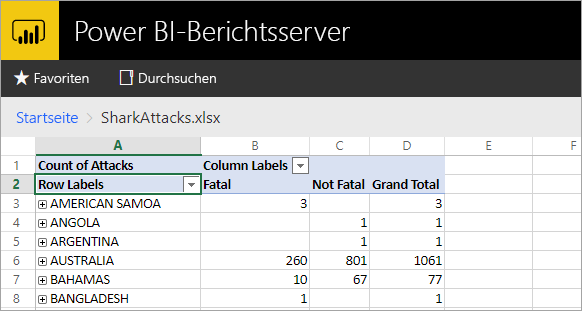
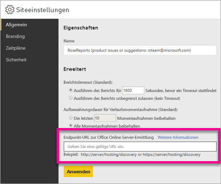

# <a name="configure-your-report-server-to-host-excel-workbooks-using-office-online-server-oos"></a>Konfigurieren des Berichtsservers zum Hosten von Excel-Arbeitsmappen mithilfe von Office Online Server (OOS)
Außer Power BI-Berichte im Webportal anzuzeigen kann der Power BI-Berichtsserver auch Excel-Arbeitsmappen mithilfe von [Office Online Server](https://docs.microsoft.com/officeonlineserver/office-online-server-overview) (OOS) hosten. Der Berichtsserver wird zu einem zentralen Ort zum Veröffentlichen und Anzeigen von Microsoft BI-Self-Service-Inhalt.



## <a name="prepare-server-to-run-office-online-server"></a>Vorbereiten des Servers für die Ausführung von Office Online Server
Führen Sie diese Vorgänge auf dem Server aus, auf dem Office Online Server ausgeführt werden soll. Auf diesem Server muss Windows Server 2012 R2 oder Windows Server 2016 ausgeführt werden. Für Windows Server 2016 ist Office Online Server April 2017 oder eine spätere Version erforderlich.

### <a name="install-prerequisite-software-for-office-online-server"></a>Installieren der erforderlichen Software für Office Online Server
1. Öffnen Sie die Windows PowerShell-Eingabeaufforderung mit Administratorrechten, und führen Sie den folgenden Befehl aus, um die erforderlichen Rollen und Dienste zu installieren.
   
    **Windows Server 2012 R2:**
   
    ```
    Add-WindowsFeature Web-Server,Web-Mgmt-Tools,Web-Mgmt-Console,Web-WebServer,Web-Common-Http,Web-Default-Doc,Web-Static-Content,Web-Performance,Web-Stat-Compression,Web-Dyn-Compression,Web-Security,Web-Filtering,Web-Windows-Auth,Web-App-Dev,Web-Net-Ext45,Web-Asp-Net45,Web-ISAPI-Ext,Web-ISAPI-Filter,Web-Includes,InkandHandwritingServices,NET-Framework-Features,NET-Framework-Core,NET-HTTP-Activation,NET-Non-HTTP-Activ,NET-WCF-HTTP-Activation45,Windows-Identity-Foundation,Server-Media-Foundation
    ```
   
    **Windows Server 2016:**
   
    ```
    Add-WindowsFeature Web-Server,Web-Mgmt-Tools,Web-Mgmt-Console,Web-WebServer,Web-Common-Http,Web-Default-Doc,Web-Static-Content,Web-Performance,Web-Stat-Compression,Web-Dyn-Compression,Web-Security,Web-Filtering,Web-Windows-Auth,Web-App-Dev,Web-Net-Ext45,Web-Asp-Net45,Web-ISAPI-Ext,Web-ISAPI-Filter,Web-Includes,NET-Framework-Features,NET-Framework-45-Features,NET-Framework-Core,NET-Framework-45-Core,NET-HTTP-Activation,NET-Non-HTTP-Activ,NET-WCF-HTTP-Activation45,Windows-Identity-Foundation,Server-Media-Foundation
    ```
   
    Starten Sie bei einer entsprechenden Aufforderung den Server neu.
2. Installieren Sie die folgende Software:
   
   * [.NET Framework 4.5.2](https://go.microsoft.com/fwlink/p/?LinkId=510096)
   * [Visual C++ Redistributable Packages für Visual Studio 2013](https://www.microsoft.com/download/details.aspx?id=40784)
   * [Visual C++ Redistributable für Visual Studio 2015](https://go.microsoft.com/fwlink/p/?LinkId=620071)
   * [Microsoft.IdentityModel.Extention.dll](https://go.microsoft.com/fwlink/p/?LinkId=620072)

### <a name="install-office-online-server"></a>Installieren von Office Online Server
Wenn Sie Excel Online-Funktionen verwenden möchten, die auf externe Daten zugreifen (z.B. Power Pivot), ist zu beachten, dass sich Office Online Server in derselben Active Directory-Gesamtstruktur befindet wie die zugehörigen Benutzer und externe Datenquellen, auf die über Windows-Authentifizierung zugegriffen werden soll.

1. Laden Sie Office Online Server aus dem [Volume Licensing Service Center (VLSC)](http://go.microsoft.com/fwlink/p/?LinkId=256561) herunter. Der Download befindet sich unter diesen Office-Produkten im VLSC-Portal. Für Entwicklungszwecke können Sie OOS unter den Downloads für MSDN-Abonnenten herunterladen.
2. Führen Sie „Setup.exe“ aus.
3. Aktivieren Sie auf der Seite **Microsoft-Software-Lizenzbedingungen lesen** die Option **Ich stimme den Bedingungen dieser Vereinbarung zu**, und klicken Sie dann auf **Weiter**.
4. Wählen Sie auf der Seite **Dateispeicherort auswählen** den Ordner aus, in dem die Office Online Server-Dateien installiert werden sollen (beispielsweise *C:\Programme\Microsoft Office Web Apps*), und wählen Sie **Jetzt installieren** aus. Wenn der angegebene Ordner nicht vorhanden ist, wird er von Setup automatisch erstellt.
   
    Es wird empfohlen, Office Online Server auf dem Systemlaufwerk zu installieren.
5. Wenn die Installation von Office Online Server abgeschlossen ist, wählen Sie **Schließen** aus.

### <a name="install-language-packs-for-office-web-apps-server-optional"></a>Installieren von Sprachpaketen für Office Web Apps-Server (optional)
Mit Office Online Server-Sprachpaketen können Benutzer webbasierte Office-Dateien in mehreren Sprachen anzeigen.

Gehen Sie wie folgt vor, um die Sprachpakete zu installieren.

1. Laden Sie die Office Online Server-Sprachpakete im [Microsoft Download Center](http://go.microsoft.com/fwlink/p/?LinkId=798136) herunter.
2. Führen Sie die Datei **wacserverlanguagepack.exe** aus.
3. Aktivieren Sie im Assistenten für Office Online Server-Sprachpakete auf der Seite **Microsoft-Software-Lizenzbedingungen lesen** die Option **Ich stimme den Bedingungen dieser Vereinbarung zu**, und klicken Sie dann auf **Weiter**.
4. Wenn die Installation von Office Online Server abgeschlossen ist, wählen Sie **Schließen** aus.

## <a name="deploy-office-online-server"></a>Bereitstellen von Office Online Server
### <a name="create-the-office-online-server-farm-https"></a>Erstellen der Office Online Server-Farm (HTTPS)
Erstellen Sie mit dem Befehl „New-OfficeWebAppsFarm“ eine neue Office Online Server-Farm, die aus einem einzigen Server besteht, wie im folgenden Beispiel veranschaulicht.

```
New-OfficeWebAppsFarm -InternalUrl "https://server.contoso.com" -ExternalUrl "https://wacweb01.contoso.com" -CertificateName "OfficeWebApps Certificate"
```

**Parameter**

* **–InternalURL** ist der vollqualifizierte Domänenname des Servers, auf dem Office Online Server ausgeführt wird, z.B. „http://servername.contoso.com“.
* **–ExternalURL** ist der FQDN, auf den aus dem Internet zugegriffen werden kann.
* **–CertificateName** ist der Anzeigename des Zertifikats.

### <a name="create-the-office-online-server-farm-http"></a>Erstellen der Office Online Server-Farm (HTTP)
Erstellen Sie mit dem Befehl „New-OfficeWebAppsFarm“ eine neue Office Online Server-Farm, die aus einem einzigen Server besteht, wie im folgenden Beispiel veranschaulicht.

```
New-OfficeWebAppsFarm -InternalURL "http://servername" -AllowHttp
```

**Parameter**

* **–InternalURL** ist der Name des Servers, auf dem Office Online Server ausgeführt wird, z.B. „http://servername“.
* **–AllowHttp** konfiguriert die Farm für die Verwendung von HTTP.

### <a name="verify-that-the-office-online-server-farm-was-created-successfully"></a>Vergewissern Sie sich, dass die Office Online Server-Farm erfolgreich erstellt wurde
Nach dem Erstellen der Farm werden in der Windows PowerShell-Eingabeaufforderung Details zur Farm angezeigt. Um sicherzustellen, dass Office Online Server ordnungsgemäß installiert und konfiguriert wurde, rufen Sie in einem Webbrowser die Office Online Server-Ermittlungs-URL auf, wie im folgenden Beispiel veranschaulicht. Die Ermittlungs-URL entspricht dem Parameter *InternalUrl*, den Sie beim Konfigurieren der Office Online Server-Farm angegeben haben, gefolgt von */hosting/discovery*. Beispiel:

```
<InternalUrl>/hosting/discovery
```

Wenn Office Online Server erwartungsgemäß funktioniert, sehen Sie eine WOPI-XML-Ermittlungsdatei (Web Application Open Platform Interface) im Webbrowser. Die ersten Zeilen der Datei sollten denen im folgenden Beispiel entsprechen:

```
<?xml version="1.0" encoding="utf-8" ?> 
- <wopi-discovery>
- <net-zone name="internal-http">
- <app name="Excel" favIconUrl="<InternalUrl>/x/_layouts/images/FavIcon_Excel.ico" checkLicense="true">
<action name="view" ext="ods" default="true" urlsrc="<InternalUrl>/x/_layouts/xlviewerinternal.aspx?<ui=UI_LLCC&><rs=DC_LLCC&>" /> 
<action name="view" ext="xls" default="true" urlsrc="<InternalUrl>/x/_layouts/xlviewerinternal.aspx?<ui=UI_LLCC&><rs=DC_LLCC&>" /> 
<action name="view" ext="xlsb" default="true" urlsrc="<InternalUrl>/x/_layouts/xlviewerinternal.aspx?<ui=UI_LLCC&><rs=DC_LLCC&>" /> 
<action name="view" ext="xlsm" default="true" urlsrc="<InternalUrl>/x/_layouts/xlviewerinternal.aspx?<ui=UI_LLCC&><rs=DC_LLCC&>" /> 
```

### <a name="configure-excel-workbook-maximum-size"></a>Konfigurieren der maximalen Größe von Excel-Arbeitsmappen
Die maximale Dateigröße für alle Dateien in Power BI-Berichtsserver beträgt 100 MB. Damit diese Anforderung erfüllt ist, müssen Sie dies in OOS manuell festlegen.

```
Set-OfficeWebAppsFarm -ExcelWorkbookSizeMax 100
```

## <a name="using-effectiveusername-with-analysis-services"></a>Verwenden von EffectiveUserName mit Analysis Services
Um Liveverbindungen mit Analysis Services zu ermöglichen, müssen Verbindungen in einer Excel-Arbeitsmappe EffectiveUserName verwenden. Damit OOS EffectiveUserName verwendet, müssen Sie das Computerkonto des OOS-Servers als Administrator für die Analysis Services-Instanz hinzufügen. Hierfür ist Management Studio für SQL Server 2016 oder höher erforderlich.

Derzeit werden nur eingebettete Analysis Services-Verbindungen in einer Excel-Arbeitsmappe unterstützt. Das Konto des Benutzers muss über die Berechtigung zum Herstellen von Verbindungen mit Analysis Services verfügen, da eine Weiterleitung des Benutzers mithilfe von Proxyfunktionen nicht möglich ist.

Führen Sie auf dem OOS-Server die folgenden PowerShell-Befehle aus.

```
Set-OfficeWebAppsFarm -ExcelUseEffectiveUserName:$true
Set-OfficeWebAppsFarm -ExcelAllowExternalData:$true
Set-OfficeWebAppsFarm -ExcelWarnOnDataRefresh:$false
```

## <a name="configure-a-power-pivot-instance-for-data-models"></a>Konfigurieren einer Power Pivot-Instanz für Datenmodelle
Durch Installieren einer Analysis Services-Instanz im Power Pivot-Modus können Sie mit Excel-Arbeitsmappen arbeiten, die Power Pivot verwenden. Der Instanzname muss *POWERPIVOT* lauten. Fügen Sie das Computerkonto des OOS-Servers als Administrator für die Analysis Services-Instanz im Power Pivot-Modus hinzu. Hierfür ist Management Studio für SQL Server 2016 oder höher erforderlich.

Führen Sie den folgenden Befehl aus, damit OOS die Instanz mit Power Pivot-Modus verwenden kann.

```
New-OfficeWebAppsExcelBIServer -ServerId <server_name>\POWERPIVOT
```

Wenn Sie die Verwendung externer Daten nicht bereits gestattet haben, führen Sie aus dem obigen Analysis Services-Schritt den folgenden Befehl aus.

```
Set-OfficeWebAppsFarm -ExcelAllowExternalData:$true
```

### <a name="firewall-considerations"></a>Überlegungen zu Firewall-Aspekten
Um Firewallprobleme zu vermeiden, müssen Sie u.U. die Ports 2382 und 2383 öffnen. Sie können auch die Datei *msmdsrv.exe* für die Power Pivot-Instanz als Firewallrichtlinie für Anwendungen hinzufügen.

## <a name="configure-power-bi-report-server-to-use-the-oos-server"></a>Konfigurieren von Power BI-Berichtsserver für die Verwendung des OOS-Servers
Geben Sie auf der Seite **Allgemein** der **Standorteinstellungen** die OOS-Ermittlungs-URL ein. Die OOS-Ermittlungs-URL ist der Parameter *InternalUrl*, der beim Bereitstellen des OOS-Servers angegeben wurde, gefolgt von */hosting/discovery*. Für HTTP lautet sie beispielsweise `http://servername/hosting/discovery`. Für HTTPS lautet sie `https://server.contoso.com/hosting/discovery`.

Um die **Standorteinstellungen** zu öffnen, wählen Sie rechts oben das **Zahnradsymbol** und anschließend **Standorteinstellungen** aus.

Die Einstellung für die Office Online Server-Ermittlungs-URL wird nur für Benutzer mit der Rolle **Systemadministrator** angezeigt.



Nachdem Sie die Ermittlungs-URL eingegeben und **Anwenden** ausgewählt haben, sollte bei Auswahl einer Excel-Arbeitsmappe im Webportal die Arbeitsmappe im Webportal angezeigt werden.

## <a name="limitations-and-considerations"></a>Einschränkungen und Überlegungen
* Die Fähigkeit zum Anzeigen von Excel-Arbeitsmappen in Power BI-Berichtsserver ist derzeit als Vorschaufunktion verfügbar.
* Arbeitsmappen werden schreibgeschützt angezeigt.

## <a name="next-steps"></a>Nächste Schritte
[Administratorhandbuch](admin-handbook-overview.md)  
[Schnellstart: Installieren von Power BI-Berichtsserver](quickstart-install-report-server.md)  
[Installieren des Berichts-Generators](https://docs.microsoft.com/sql/reporting-services/install-windows/install-report-builder)  
[Herunterladen der SQL Server Data Tools](http://go.microsoft.com/fwlink/?LinkID=616714)

Weitere Fragen? [Stellen Sie Ihre Frage in der Power BI-Community.](https://community.powerbi.com/)

