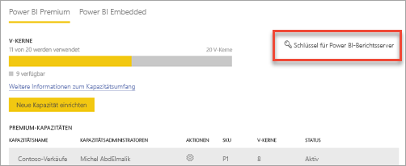
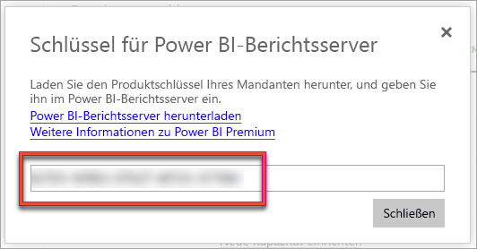
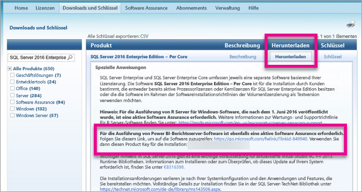

# Ermitteln des Product Key für den Berichtsserver
Hier erfahren Sie, wo Sie den Product Key für den Power BI-Berichtsserver finden, um den Berichtsserver in einer Produktionsumgebung zu installieren.

<iframe width="640" height="360" src="https://www.youtube.com/embed/6CQnf-NGtpU?rel=0&amp;showinfo=0" frameborder="0" allowfullscreen></iframe>

Sie haben den Power BI-Berichtsserver heruntergeladen, und Sie verfügen über einen SQL Server Enterprise Software Assurance-Vertrag. Oder Sie haben Power BI Premium erworben. Sie möchten den Server in einer Produktionsumgebung installieren, benötigen hierzu jedoch einen Product Key. Wo befindet sich der Product Key? 

Der Product Key befindet sich je nach erworbenem Produkt an einer von zwei Stellen.

## Power BI Premium
Wenn Sie Power BI Premium erworben haben, haben Sie auf der Registerkarte **Kapazitätseinstellungen** im Power BI-Verwaltungsportal Zugriff auf den Product Key Ihres Power BI-Berichtsservers. Dieser steht nur globalen Administratoren oder Benutzern zur Verfügung, denen die Administratorrolle für den Power BI-Dienst zugewiesen wurde.

Wenn Sie auf **Power BI Report Server key** (Schlüssel für den Power BI-Berichtsserver) klicken, wird ein Dialogfeld mit Ihrem Product Key angezeigt. Diesen können Sie kopieren und bei der Installation verwenden.

## Software Assurance-Vertrag
Wenn Sie über einen SQL Server Enterprise SA-Vertrag verfügen, können Sie Ihren Product Key im [Volume Licensing Service Center](https://www.microsoft.com/Licensing/servicecenter/) abrufen. Suchen Sie unter dem neuesten Service Pack nach der aktuellen Version von SQL Server. Wenn er dort nicht angezeigt wird, suchen Sie ihn unter der RTM-Version der neuesten SQL Server-Version.

> [!NOTE]
> Sie müssen unter dem Downloadabschnitt suchen. Suchen Sie nicht im Abschnitt für den Schlüssel.
> 
> 

## Nächste Schritte
[Installieren von Power BI-Berichtsserver](install-report-server.md)  
[Installieren von für Power BI-Berichtsserver optimiertem Power BI Desktop](install-powerbi-desktop.md)  
[Installieren des Berichts-Generators](https://docs.microsoft.com/sql/reporting-services/install-windows/install-report-builder)  
[Herunterladen der SQL Server Data Tools](http://go.microsoft.com/fwlink/?LinkID=616714)

Weitere Fragen? [Stellen Sie Ihre Frage in der Power BI-Community.](https://community.powerbi.com/)

