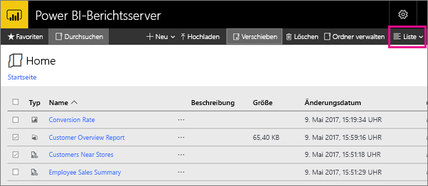

# Navigieren im Webportal von Power BI-Berichtsserver
Das Webportal von Power BI-Berichtsserver ist ein lokaler Speicherort zum Anzeigen, Speichern und Verwalten Ihrer Power BI-, mobilen und paginierten Berichte sowie von KPIs.

Sie können das Webportal in einem beliebigen modernen Browser anzeigen. Im Webportal sind Berichte und KPIs in Ordnern organisiert, die Sie als Favoriten markieren können. Sie können hier auch Excel-Arbeitsmappen speichern. Im Webportal können Sie die Tools starten, die Sie zum Erstellen von Berichten benötigen:

* Mit Power BI Desktop erstellte **Power BI-Berichte** können Sie im Webportal und den mobilen Power BI-Apps anzeigen.
* Im Berichts-Generator erstellte **paginierte Berichte** sind Dokumente mit einem moderne Aussehen und einem für das Drucken optimierten festen Layout.
* Direkt im Webportal erstellte **KPIs**.

Im Webportal können Sie die Berichtsserverordner durchsuchen oder nach bestimmten Berichten suchen. Sie können einen Bericht, seine allgemeinen Eigenschaften und Vorversionen anzeigen, die im Berichtsverlauf erfasst werden. Abhängig von Ihren Berechtigungen können Sie auch Berichte für die Übermittlung in Ihren E-Mail-Posteingang oder einen im Dateisystem freigegebenen Ordner abonnieren.

## Im Webportal ausgeführte Aufgaben
Im Webportal können Sie eine Reihe von Aufgaben ausführen:

* Anzeigen, Suchen, Drucken und Abonnieren von Berichten
* Erstellen, Schützen und Warten der Ordnerhierarchie zum Organisieren von Elementen auf dem Server
* Konfigurieren der Berichtsausführungseigenschaften, des Berichtsverlaufs und von Berichtsparametern
* Erstellen freigegebener Zeitpläne und Datenquellen, damit Zeitpläne und Datenquellenverbindungen besser verwaltet werden können
* Erstellen datengesteuerter Abonnements zum Übermitteln von Berichten an eine umfangreiche Empfängerliste
* Erstellen verknüpfter Berichte zum Wiederverwenden und Umfunktionieren eines vorhandenen Berichts auf verschiedene Weisen
* Herunterladen und Öffnen gängiger Tools wie Power BI Desktop (Berichtsserver), Berichts-Generator und Publisher für mobile Berichte
* [Erstellen von KPIs](https://docs.microsoft.com/sql/reporting-services/working-with-kpis-in-reporting-services)
* Senden von Feedback oder Anfragen zu gewünschten Features
* [Branding des Webportals](https://docs.microsoft.com/sql/reporting-services/branding-the-web-portal)
* [Arbeiten mit KPIs](https://docs.microsoft.com/sql/reporting-services/working-with-kpis-in-reporting-services)
* [Arbeiten mit freigegebenen Datasets](https://docs.microsoft.com/sql/reporting-services/work-with-shared-datasets-web-portal)

## Rollen und Berechtigungen im Webportal
Das Webportal ist eine Webanwendung, die in einem Browser ausgeführt wird. Nach Starten des Webportals variieren die angezeigten Seiten, Links und Optionen basierend auf Ihren Berechtigungen für den Berichtsserver. Wenn Ihnen eine Rolle mit Vollzugriffsberechtigungen zugewiesen ist, haben Sie Zugriff auf sämtliche Anwendungsmenüs und Seiten zum Verwalten eines Berichtsservers. Wenn Ihnen eine Rolle mit Berechtigungen zum Anzeigen und Ausführen von Berichten zugewiesen ist, werden Ihnen nur die Menüs und Seiten angezeigt, die Sie für diese Aktivitäten benötigen. Möglich sind unterschiedliche Rollenzuweisungen für verschiedene Berichtsserver oder sogar verschiedene Berichte und Ordner auf einem einzelnen Berichtsserver.

## Starten des Webportals
1. Öffnen Sie den Webbrowser.
   
    Diese Liste enthält [unterstützte Webbrowser und Versionen](browser-support.md).
2. Geben Sie in die Adressleiste die URL des Webportals ein.
   
    Standardmäßig lautet die URL *http://[Computername]/reports*.
   
    Der Berichtsserver kann für die Verwendung eines bestimmten Ports konfiguriert werden. Beispiele: *http://[Computername]:80/reports* oder *http://[Computername]:8080/reports*
   
    Wie Sie sehen, werden im Webportal Elemente in den folgenden Kategorien gruppiert:
   
   * KPIs
   * Mobile Berichte
   * Paginierte Berichte
   * Power BI Desktop-Berichte
   * Excel-Arbeitsmappen
   * Datasets
   * Datenquellen
   * Ressourcen

## Erstellen und Bearbeiten von Power BI Desktop-Berichten (PBIX-Dateien)
Sie können Berechtigungen für Power BI Desktop-Berichte im Webportal anzeigen, hochladen, erstellen, organisieren und verwalten.

### Erstellen eines Power BI Desktop-Berichts
1. Wählen Sie **Neu** > **Power BI-Bericht** aus.
   
    
   
    Die Power BI Desktop-App wird geöffnet.
   
    
2. Erstellen Sie Ihren Power BI-Bericht. Im [Schnellstart: Power BI-Berichte](quickstart-create-powerbi-report.md) finden Sie Details.
3. Laden Sie Ihren Bericht auf den Berichtsserver hoch.

### Bearbeiten eines vorhandenen Power BI Desktop-Berichts
1. Klicken Sie rechts oben auf der Berichtskachel auf die Auslassungspunkte (**...** ) und dann auf **In Power BI Desktop bearbeiten**.
   
    
   
    Die Power BI Desktop-App wird geöffnet.
2. Nehmen Sie Ihre Änderungen vor, und speichern Sie sie.

## Erstellen und Bearbeiten paginierter Berichte (RDL-Dateien)
Sie können Berechtigungen für paginierte Berichte im Webportal anzeigen, hochladen, erstellen, organisieren und verwalten.

### Erstellen eines paginierten Berichts
1. Wählen Sie **Neu** > **Paginierter Bericht** aus.
   
    Die App Berichts-Generator wird geöffnet.
   
    
2. Erstellen Sie Ihren paginierten Bericht. Im [Schnellstart: Paginierte Berichte](quickstart-create-paginated-report.md) finden Sie Details.
3. Laden Sie Ihren Bericht auf den Berichtsserver hoch.

### Bearbeiten eines vorhandenen paginierten Berichts
1. Klicken Sie rechts oben auf der Berichtskachel auf die Auslassungspunkte (...) und dann auf **In Berichts-Generator bearbeiten**.
   
    
   
    Die App Berichts-Generator wird geöffnet.
2. Nehmen Sie Ihre Änderungen vor, und speichern Sie sie.

## Hochladen und Organisieren von Excel-Arbeitsmappen
Sie können Berechtigungen für Power BI Desktop-Berichte und Excel-Arbeitsmappen hochladen, organisieren und verwalten. Diese werden innerhalb des Webportals gruppiert.

Die Arbeitsmappen werden in Power BI Berichtsserver ähnlich wie andere Ressourcendateien gespeichert. Wenn Sie eine der Arbeitsmappen auswählen, wird sie lokal auf Ihren Desktop heruntergeladen. Sie können vorgenommene Änderungen speichern, indem Sie diese erneut auf den Berichtsserver hochladen.

## Verwalten von Elementen im Webportal
Power BI-Berichtsserver bietet eine detaillierte Kontrolle über die Elemente, die Sie im Webportal speichern. Sie können beispielsweise Abonnements, die Zwischenspeicherung, Momentaufnahmen und Sicherheitseinstellungen für einzelne paginierte Berichte einrichten.

1. Klicken Sie rechts oben in einem Element auf die Auslassungspunkte (...), und wählen Sie dann **Verwalten** aus.
   
    
2. Wählen Sie die Eigenschaft oder ein anderes Feature aus, die/das Sie festlegen möchten.
   
    
3. Klicken Sie auf **Übernehmen**.

Erfahren Sie mehr über das [Arbeiten mit Abonnements im Webportal](https://docs.microsoft.com/sql/reporting-services/working-with-subscriptions-web-portal).

## Markieren von Berichten und KPIs als Favoriten
Sie können die Berichte und KPIs markieren, die Sie als Favoriten wünschen. Sie sind leichter zu finden, da sie alle, sowohl im Webportal als auch in den mobilen Power BI-Apps, im zentralen Ordner „Favoriten“ gesammelt werden. 

1. Klicken Sie rechts oben im KPI oder Bericht, den Sie als Favorit wünschen, auf die Auslassungspunkte (**...**), und wählen Sie **Zu Favoriten hinzufügen** aus.
   
    
2. Wählen Sie **Favoriten** im Menüband des Webportals aus, um dieses mit den anderen Favoriten auf der Seite „Favoriten“ im Webportal anzuzeigen.
   
    
   
    Jetzt werden in den mobilen Power BI-Apps diese Favoriten zusammen mit Ihren im Power BI-Dienst als Favoriten gespeicherten Dashboards angezeigt.
   
    

## Aus- oder Einblenden von Elementen im Webportal
Sie können Elemente im Webportal ausblenden und ausgeblendete Elemente wieder einblenden.

### Ausblenden eines Elements
1. Klicken Sie rechts oben in einem Element auf die Auslassungspunkte (...), und wählen Sie dann **Verwalten** aus.
   
    
2. Wählen Sie **Dieses Element ausblenden** aus.
   
    
3. Klicken Sie auf **Übernehmen**.

### Anzeigen ausgeblendeter Elemente
1. Wählen Sie rechts oben **Kacheln** (oder **Liste**) aus, und klicken Sie auf **Ausgeblendete Elemente anzeigen**.
   
    Die Elemente werden angezeigt. Sie sind zwar abgeblendet, aber Sie können sie dennoch öffnen und bearbeiten.
   
    

## Suchen nach Elementen
Geben Sie einen Suchbegriff ein. Das Ergebnis enthält alles, auf das Sie Zugriff haben. Ergebnisse werden in KPIs, Berichte, Datasets und andere Elemente kategorisiert. Sie können mit den Ergebnissen interagieren und sie zu Ihren Favoriten hinzufügen.  

## Verschieben oder Löschen von Elementen in der Listenansicht
Standardmäßig werden die Inhalte des Webportals in der Neben-/Untereinanderansicht angezeigt.

Sie können zur Listenansicht wechseln, in der das gleichzeitige Verschieben oder Löschen mehrerer Elemente einfach ist. 

1. Wählen Sie **Kacheln** > **Liste** aus.
   
    
2. Wählen Sie die Elemente und dann **Verschieben** oder **Löschen** aus.

## Nächste Schritte
[Benutzerhandbuch](user-handbook-overview.md)  
[Schnellstart: Paginierte Berichte](quickstart-create-paginated-report.md)  
[Schnellstart: Power BI-Berichte](quickstart-create-powerbi-report.md)

Weitere Fragen? [Stellen Sie Ihre Frage in der Power BI-Community.](https://community.powerbi.com/)

