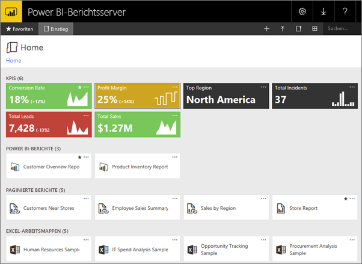
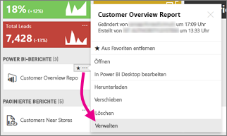
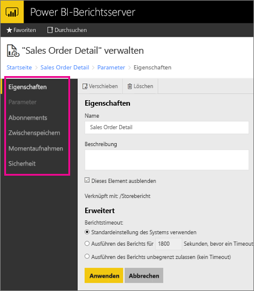

# Verwalten von Inhalten im Webportal 
Das Webportal von Power BI-Berichtsserver ist ein lokaler Speicherort zum Anzeigen, Speichern und Verwalten Ihrer Power BI-, mobilen und paginierten Berichte sowie von KPIs.

Sie können das Webportal in einem beliebigen modernen Browser anzeigen. Im Webportal sind Berichte und KPIs in Ordnern organisiert, die Sie als Favoriten markieren können. Sie können hier auch Excel-Arbeitsmappen speichern. Im Webportal können Sie die Tools starten, die Sie zum Erstellen von Berichten benötigen:

* Mit Power BI Desktop erstellte **Power BI-Berichte** können Sie im Webportal und den mobilen Power BI-Apps anzeigen.
* Im Berichts-Generator erstellte **paginierte Berichte** sind Dokumente mit einem moderne Aussehen und einem für das Drucken optimierten festen Layout.
* Direkt im Webportal erstellte **KPIs**.

Im Webportal können Sie die Berichtsserverordner durchsuchen oder nach bestimmten Berichten suchen. Sie können einen Bericht, seine allgemeinen Eigenschaften und Vorversionen anzeigen, die im Berichtsverlauf erfasst werden. Abhängig von Ihren Berechtigungen können Sie auch Berichte für die Übermittlung in Ihren E-Mail-Posteingang oder einen im Dateisystem freigegebenen Ordner abonnieren.

## Rollen und Berechtigungen im Webportal
Die Webportalanwendung wird in einem Browser ausgeführt. Nach Starten des Webportals variieren die angezeigten Seiten, Links und Optionen basierend auf Ihren Berechtigungen für den Berichtsserver. Wenn Ihnen eine Rolle mit Vollzugriffsberechtigungen zugewiesen ist, haben Sie Zugriff auf sämtliche Anwendungsmenüs und Seiten zum Verwalten eines Berichtsservers. Wenn Ihnen eine Rolle mit Berechtigungen zum Anzeigen und Ausführen von Berichten zugewiesen ist, werden Ihnen nur die Menüs und Seiten angezeigt, die Sie für diese Aktivitäten benötigen. Möglich sind unterschiedliche Rollenzuweisungen für verschiedene Berichtsserver oder sogar verschiedene Berichte und Ordner auf einem einzelnen Berichtsserver.

## Starten des Webportals
1. Öffnen Sie den Webbrowser.
   
    Diese Liste enthält [unterstützte Webbrowser und Versionen](browser-support.md).
2. Geben Sie in die Adressleiste die URL des Webportals ein.
   
    Standardmäßig lautet die URL *http://[Computername]/reports*.
   
    Der Berichtsserver kann für die Verwendung eines bestimmten Ports konfiguriert werden. Beispiele: *http://[Computername]:80/reports* oder *http://[Computername]:8080/reports*
   
    Wie Sie sehen, werden im Webportal Elemente in den folgenden Kategorien gruppiert:
   
   * KPIs
   * Mobile Berichte
   * Paginierte Berichte
   * Power BI Desktop-Berichte
   * Excel-Arbeitsmappen
   * Datasets
   * Datenquellen
   * Ressourcen

## Verwalten von Elementen im Webportal
Power BI-Berichtsserver bietet eine detaillierte Kontrolle über die Elemente, die Sie im Webportal speichern. Sie können beispielsweise Abonnements, die Zwischenspeicherung, Momentaufnahmen und Sicherheitseinstellungen für einzelne paginierte Berichte einrichten.

1. Klicken Sie rechts oben in einem Element auf die Auslassungspunkte (...), und wählen Sie dann **Verwalten** aus.
   
    
2. Wählen Sie die Eigenschaft oder ein anderes Feature aus, die/das Sie festlegen möchten.
   
    
3. Klicken Sie auf **Übernehmen**.

Erfahren Sie mehr über das [Arbeiten mit Abonnements im Webportal](https://docs.microsoft.com/sql/reporting-services/working-with-subscriptions-web-portal).

## Nächste Schritte
[Was ist der Power BI-Berichtsserver?](get-started.md)

Weitere Fragen? [Stellen Sie Ihre Frage in der Power BI-Community.](https://community.powerbi.com/)

