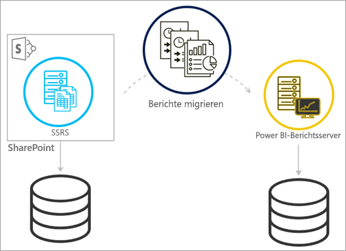
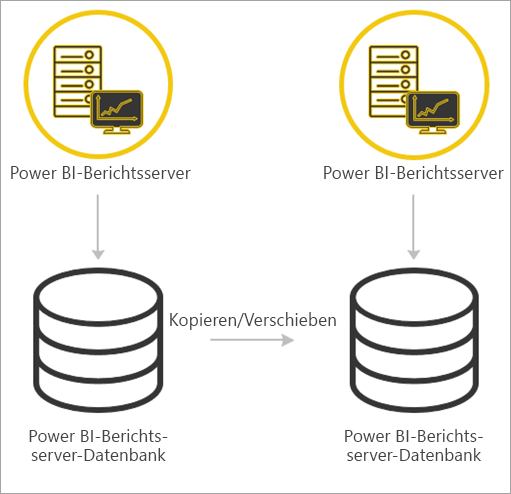

# <a name="migrate-a-report-server-installation"></a>Migrieren einer Berichtsserverinstallation
Erfahren Sie, wie Sie Ihre vorhandene SQL Server Reporting Services-Instanz (SSRS) in eine Instanz von Power BI-Berichtsserver migrieren.

Unter Migration ist das Verschieben von Anwendungsdatendateien in eine neue Instanz von Power BI-Berichtsserver zu verstehen. Es folgen gängige Gründe zum Migrieren Ihrer Installation:

* Sie möchten von SQL Server Reporting Services zu Power BI-Berichtsserver wechseln.
  
  > [!NOTE]
  > Es ist kein direktes Upgrade von SQL Server Reporting Services auf Power BI-Berichtsserver möglich. Eine Migration ist deshalb erforderlich.
  > 
  > 
* Sie verfügen über eine umfangreiche Bereitstellung oder hohe Updateanforderungen.
* Sie ändern die Hardware oder Topologie der Installation.
* Es ist ein Problem aufgetreten, das ein Upgrade blockiert.

## <a name="migrating-to-power-bi-report-server-from-ssrs-native-mode"></a>Migrieren von SSRS (einheitlicher Modus) zu Power BI-Berichtsserver
Das Migrieren von einer SSRS-Instanz (im einheitlichen Modus) zu Power BI-Berichtsserver erfolgt in einigen wenigen Schritten.

 zu Power BI-Berichtsserver")

> [!NOTE]
> SQL Server 2008 Reporting Services und höher werden für die Migration unterstützt.
> 
> 

* Sichern von Datenbank-, Anwendungs- und Konfigurationsdateien.
* Sichern des Verschlüsselungsschlüssels.
* Klonen der Berichtsserver-Datenbank, die Ihre Berichte hostet.
* Installieren von Power BI-Berichtsserver. Wenn Sie dieselbe Hardware verwenden, können Sie Power BI-Berichtsserver auf demselben Server wie die SSRS-Instanz installieren. Weitere Informationen zum Installieren von Power BI-Berichtsserver finden Sie unter [Installieren von Power BI-Berichtsserver](install-report-server.md).

> [!NOTE]
> Der Instanzname von Power BI-Berichtsserver lautet *PBIRS*.
> 
> 

* Konfigurieren Sie den Berichtsserver mit dem Berichtsserver-Konfigurations-Manager, und stellen Sie eine Verbindung mit der geklonten Datenbank her.
* Ausführen sämtlicher für die SSRS-Instanz (im einheitlichen Modus) erforderlichen Bereinigungen.

## <a name="migration-to-power-bi-report-server-from-ssrs-sharepoint-integrated-mode"></a>Migration von SSRS (integrierter SharePoint-Modus) zu Power BI-Berichtsserver
Das Migrieren von SSRS (im integrierten SharePoint-Modus) zu Power BI-Berichtsserver ist nicht so einfach wie im einheitlichen Modus. Wenngleich diese Schritte einen Leitfaden darstellen, gibt es ggf. andere Dateien und Ressourcen in SharePoint, die außerhalb dieser Schritte verwaltet werden müssen.



Sie müssen die spezifischen Berichtsserverinhalte aus SharePoint in Ihren Power BI-Berichtsserver migrieren. Dies setzt voraus, dass Sie Power BI-Berichtsserver bereits in Ihrer Umgebung installiert haben. Weitere Informationen zum Installieren von Power BI-Berichtsserver finden Sie unter [Installieren von Power BI-Berichtsserver](install-report-server.md).

Wenn Sie den Inhalt des Berichtsservers aus Ihrer SharePoint-Umgebung in Power BI-Berichtsserver kopieren möchten, müssen Sie dazu Tools wie **rs.exe** nutzen. Es folgt ein Beispiel des Skripts zum Kopieren des Inhalts des Berichtsservers aus SharePoint in Power BI-Berichtsserver.

> [!NOTE]
> Das Beispielskript sollte für SharePoint 2010 und höher und SQL Server 2008 Reporting Services und höher funktionieren.
> 
> 

### <a name="sample-script"></a>Beispielskript
```
Sample Script
rs.exe
-i ssrs_migration.rss -e Mgmt2010
-s http://SourceServer/_vti_bin/reportserver
-v st="sites/bi" -v f="Shared Documents“
-u Domain\User1 -p Password
-v ts=http://TargetServer/reportserver
-v tu="Domain\User" -v tp="Password"
```

## <a name="migrateing-from-one-power-bi-report-server-to-another"></a>Migrieren von einem Power BI-Berichtsserver zu einem anderen
Die Migration von einem Power BI-Berichtsserver zu einem anderen entspricht dem Migrieren von SSRS (im einheitlichen Modus).



* Sichern von Datenbank-, Anwendungs- und Konfigurationsdateien.
* Sichern des Verschlüsselungsschlüssels.
* Klonen der Berichtsserver-Datenbank, die Ihre Berichte hostet.
* Installieren von Power BI-Berichtsserver. Sie können den Power BI-Berichtsserver *nicht* auf dem gleichen Server installieren, von dem aus Sie migrieren. Weitere Informationen zum Installieren von Power BI-Berichtsserver finden Sie unter [Installieren von Power BI-Berichtsserver](install-report-server.md).

> [!NOTE]
> Der Instanzname von Power BI-Berichtsserver lautet *PBIRS*.
> 
> 

* Konfigurieren Sie den Berichtsserver mit dem Berichtsserver-Konfigurations-Manager, und stellen Sie eine Verbindung mit der geklonten Datenbank her.
* Führen Sie für die alte Installation von Power BI-Berichtsserver erforderliche Bereinigungen durch.

## <a name="next-steps"></a>Nächste Schritte
[Administratorübersicht](admin-handbook-overview.md)  
[Installieren von Power BI-Berichtsserver](install-report-server.md)  
[Skript mit dem Hilfsprogramm „rs.exe“ und dem Webdienst](https://docs.microsoft.com/sql/reporting-services/tools/script-with-the-rs-exe-utility-and-the-web-service)

Weitere Fragen? [Stellen Sie Ihre Frage in der Power BI-Community.](https://community.powerbi.com/)

