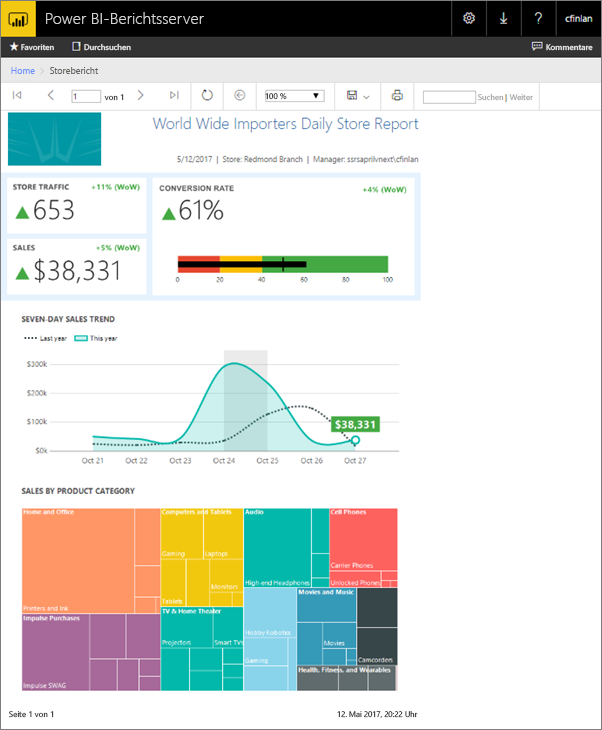
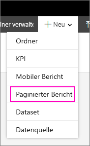
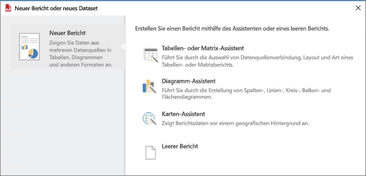
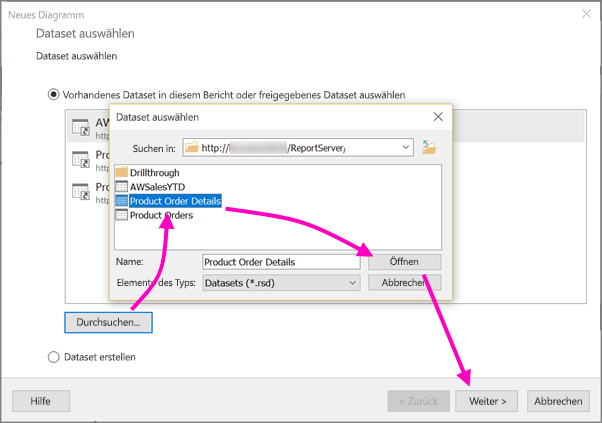
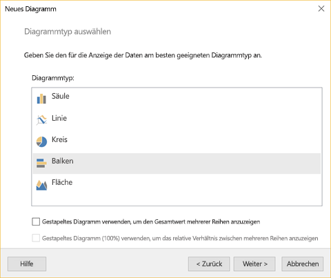
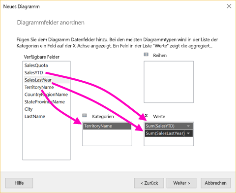
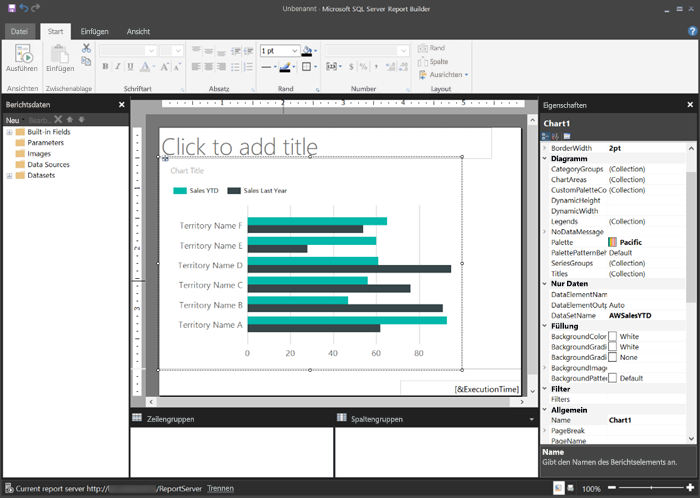
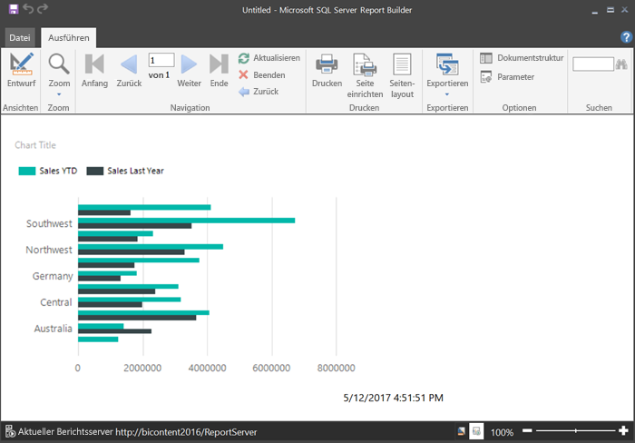
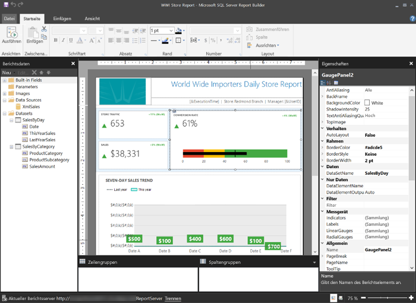

# Erstellen eines paginierten Berichts für Power BI-Berichtsserver
Wie der Name bereits vermuten lässt, können paginierte Berichte viele Seiten aufweisen. Sie verfügen über ein Layout in einem festen Format und ermöglichen eine präzise Anpassung. Bei paginierten Berichten handelt es sich um RDL-Dateien.

Sie können paginierte Berichte im Webportal von Power BI-Berichtsserver ebenso wie im Webportal von SQL Server Reporting Services (SSRS) speichern und verwalten. Sie erstellen und bearbeiten sie im Berichts-Generator oder Berichts-Designer von SQL Server Data Tools (SSDT) und veröffentlichen sie dann in einem der Webportale. Anschließend können Leser in Ihrer Organisation die Berichte in einem Browser oder einer mobilen Power BI-App auf einem Mobilgerät anzeigen.

Wenn Sie bereits im Berichts-Generator oder Berichts-Designer paginierte Berichte erstellt haben, sind Sie auch zum Erstellen paginierter Berichte für Power BI-Berichtsserver bereit. Falls nicht, folgen hier einige schnelle Schritte, um Ihnen den Einstieg zu erleichtern.

## Schritt 1: Installieren und Starten des Berichts-Generators
Möglicherweise haben Sie den Berichts-Generator bereits zum Erstellen von Berichten für einen SSRS-Server installiert. Sie können die gleiche Version des Berichts-Generators zum Erstellen von Berichten für Power BI-Berichtsserver verwenden. Falls nicht installiert, ist der Vorgang einfach.

1. Wählen Sie im Webportal von Power BI-Berichtsserver **Neu** > **Paginierter Bericht** aus.
   
    
   
    Wenn Sie den Berichts-Generator nicht bereits installiert haben, werden Sie jetzt durch den Installationsvorgang geführt.
2. Nach der Installation wird der Berichts-Generator mit dem Bildschirm **Neuer Bericht oder neues Dataset** geöffnet.
   
    
3. Wählen Sie den Assistenten für den Berichtstyp, den Sie erstellen möchten:
   
   * Tabelle oder Matrix
   * Diagramm
   * Zuordnung
   * Leer
4. Beginnen wir mit dem Diagramm-Assistenten.
   
    Der Diagramm-Assistent führt Sie durch die Schritte zum Erstellen eines einfachen Diagramms in einem Bericht. Anschließend können Sie den Bericht auf nahezu unbegrenzte Weisen anpassen.

## Schritt 2: Durchlaufen des Diagramm-Assistenten
Der Diagramm-Assistent begleitet Sie durch die grundlegenden Schritte zum Erstellen einer Visualisierung in einem Bericht.

Paginierte Berichte können mit einer Vielzahl von Datenquellen verbunden werden, z. B. Microsoft SQL Server, Microsoft Azure SQL-Datenbank, Oracle, Hyperion u.v.m. Erfahren Sie mehr zu [für paginierte Berichte unterstützten Datenquellen](connect-data-sources.md).

Auf der ersten Seite des Diagramm-Assistenten, **Dataset auswählen**, können Sie ein Dataset erstellen oder ein freigegebenes Dataset auf einem Server wählen. *Datasets* geben bei einer Abfrage einer externen Datenquelle Berichtsdaten zurück.

1. Klicken Sie auf **Durchsuchen**. Wählen Sie ein freigegebenes Dataset auf einem Server aus, und klicken Sie auf **Öffnen** > **Weiter**.
   
    
   
     Müssen Sie ein Dataset erstellen? Siehe [Erstellen eines freigegebenen oder eingebetteten Datasets](https://docs.microsoft.com/sql/reporting-services/report-data/create-a-shared-dataset-or-embedded-dataset-report-builder-and-ssrs).
2. Wählen Sie einen Diagrammtyp, in diesem Fall ein Balkendiagramm.
   
    
3. Ordnen Sie die Felder durch Ziehen zu den Feldern **Kategorien**, **Reihe** und **Werte** an.
   
    
4. Wählen Sie **Weiter** > **Fertig stellen** aus.

## Schritt 3: Entwerfen des Berichts
Nun sind Sie in der Berichtsentwurfsansicht. Beachten Sie, dass die Daten Platzhalterdaten und nicht Ihre Daten sind.

* Wählen Sie zum Anzeigen Ihrer Daten **Ausführen** aus.
  
     
* Um zur Entwurfsansicht zurückzukehren, wählen Sie **Entwurf** aus.

Sie können das zuvor erstellte Diagramm bearbeiten, d.h. das Layout, die Werte, die Legende und vieles mehr ändern.

Außerdem können Sie alle Arten anderer Visualisierungen hinzufügen: Messgeräte, Tabellen, Matrizen, Zuordnungen und mehr. Sie können Kopf- und Fußzeilen für mehrere Seiten hinzufügen. In den [Tutorials für Berichts-Generator](https://docs.microsoft.com/sql/reporting-services/report-builder-tutorials) können Sie dies alles einmal selbst ausprobieren.

## Schritt 4: Speichern des Berichts auf dem Berichtsserver
Wenn Ihr Bericht fertig ist, speichern Sie ihn in Power BI-Berichtsserver.

1. Wählen Sie im Menü **Datei** die Option **Speichern unter** aus, und speichern Sie ihn auf dem Berichtsserver. 
2. Jetzt können Sie ihn im Browser anzeigen.
   
    

## Nächste Schritte
Es gibt viele sehr hilfreiche Ressourcen für das Entwerfen von Berichten im Berichts-Generator und Berichts-Designer in SQL Server Data Tools. Die Tutorials zum Berichts-Generator sind ein guter Ausgangspunkt.

* [Berichts-Generator-Tutorials](https://docs.microsoft.com/sql/reporting-services/report-builder-tutorials)
* [Was ist der Power BI-Berichtsserver?](get-started.md)  

Weitere Fragen? [Stellen Sie Ihre Frage in der Power BI-Community.](https://community.powerbi.com/)

