# <a name="quickstart-embed-a-power-bi-report-server-report-using-an-iframe-in-sharepoint-server"></a>Schnellstart: Einbetten eines Power BI-Berichtsserver-Berichts in einen iFrame in SharePoint Server

In diesem Schnellstart erfahren Sie, wie Sie einen Power BI-Berichtsserver-Bericht mithilfe eines iFrames in eine SharePoint-Seite einbetten. Wenn Sie mit SharePoint Online arbeiten, muss der öffentliche Zugriff auf den Power BI-Berichtsserver möglich sein. In SharePoint Online funktioniert der Power BI-Webpart, der mit dem Power BI-Dienst funktioniert, nicht mit dem Power BI-Berichtsserver. 

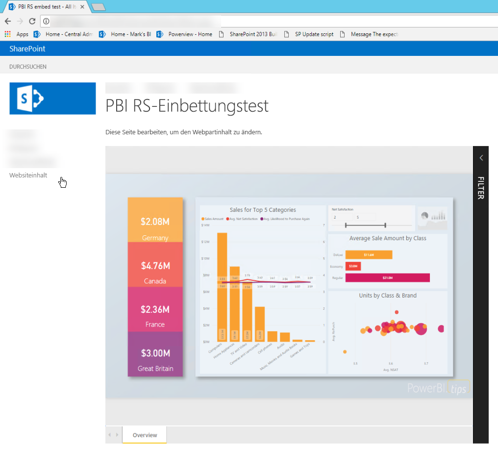
## <a name="prerequisites"></a>Voraussetzungen
* Der [Power BI-Berichtsserver](https://powerbi.microsoft.com/report-server/) muss installiert und konfiguriert sein.
* [Für den Power BI-Berichtsserver optimiertes Power BI Desktop](install-powerbi-desktop.md) muss installiert sein.
* Eine installierte und konfigurierte [SharePoint](https://docs.microsoft.com/sharepoint/install/install)-Umgebung ist erforderlich.

## <a name="creating-the-power-bi-report-server-report-url"></a>Erstellen der Berichts-URL für den Power BI-Berichtsserver

1. Laden Sie das Beispiel von GitHub herunter – [Blog-Demo](https://github.com/Microsoft/powerbi-desktop-samples).

    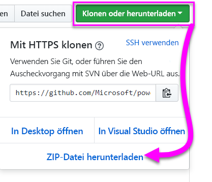

2. Öffnen Sie die PBIX-Beispieldatei über GitHub in **für den Power BI-Berichtsserver optimiertem Power BI Desktop**.

    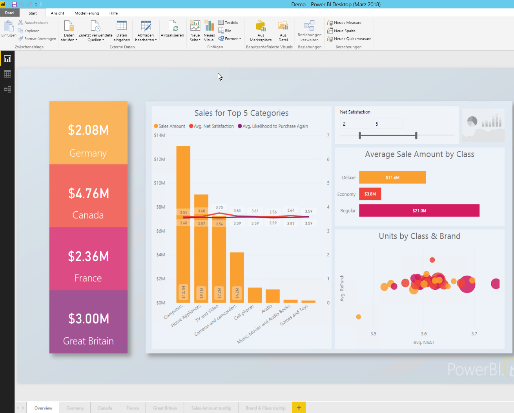

3. Speichern Sie den Bericht auf dem **Power BI-Berichtsserver**. 

    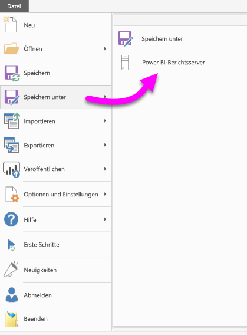

4. Zeigen Sie den Bericht im **Webportal** an.

    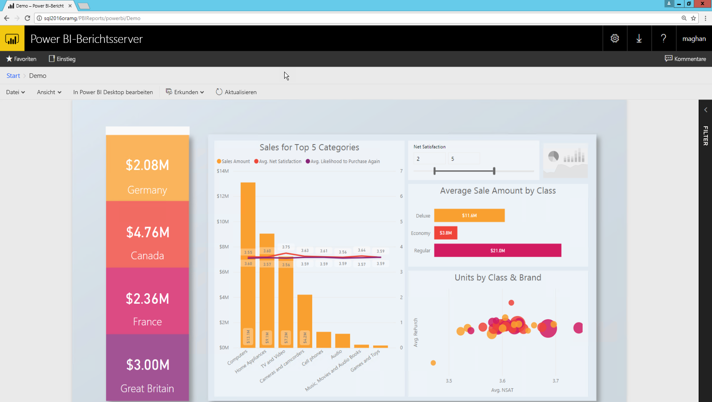

### <a name="capturing-the-url-parameter"></a>Erfassen des URL-Parameters

Sobald Sie die URL haben, können Sie einen iFrame auf einer SharePoint-Seite erstellen, in dem der Bericht gehostet wird. Sie können für jede Power BI-Berichtsserver-Berichts-URL einen querystring-Parameter von `?rs:embed=true` hinzufügen, um Ihren Bericht in einen iFrame einzubetten. 

   Beispiel:
    ``` 
    http://myserver/reports/powerbi/Sales?rs:embed=true
    ```
## <a name="embedding-a-power-bi-report-server-report-in-a-sharepoint-iframe"></a>Einbetten eines Power BI-Berichtsserver-Berichts in einen SharePoint-iFrame

1. Navigieren Sie zu einer **Websiteinhalte**-Seite in SharePoint.

    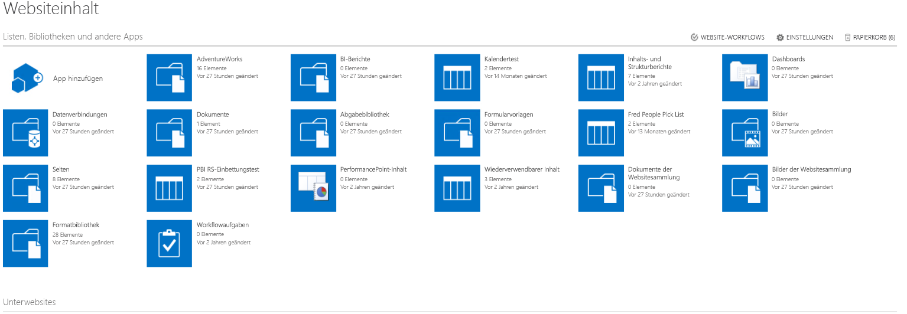

2. Wählen Sie die Seite aus, auf der Sie Ihren Bericht hinzufügen möchten.

    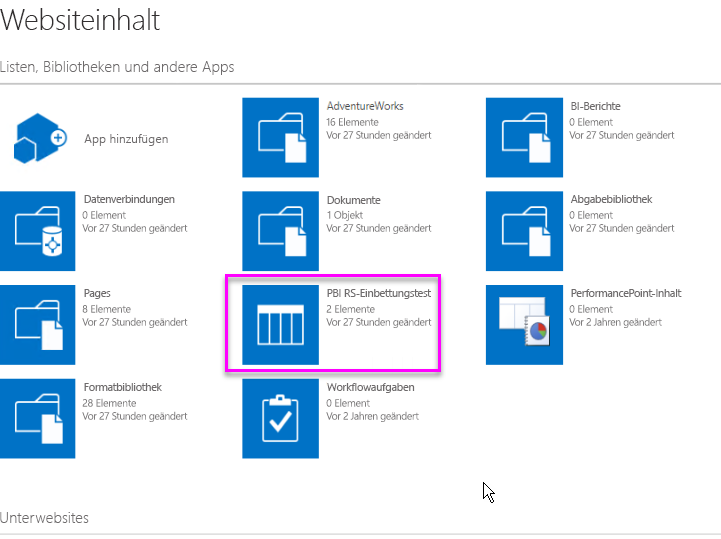

3. Wählen Sie das Zahnrad oben rechts und dann **Seite bearbeiten** aus.

    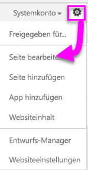

4. Wählen Sie **Webpart hinzufügen** aus.

    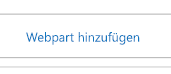

5. Wählen Sie unter **Kategorien** die Option **Medien und Inhalt** aus, unter **Teile** die Option **Inhalts-Editor**, und wählen Sie dann **Hinzufügen** aus.

    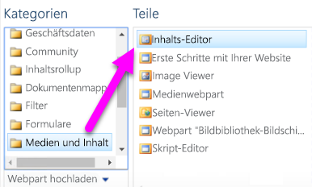 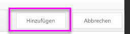

6. Wählen Sie **Hier klicken, um neue Inhalte hinzuzufügen** aus.

    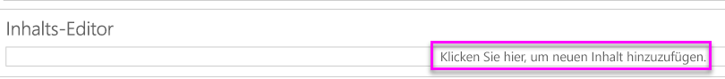

7. Wählen Sie im Menüband die Registerkarte **Text formatieren** aus und dann **Quelle bearbeiten**.

     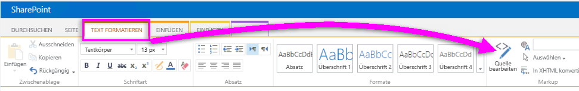

8. Fügen Sie im Fenster „Quelle bearbeiten“ Ihren iFrame-Code ein, und wählen Sie „OK“ aus.

    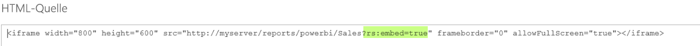

     Beispiel:
     ```html
     <iframe width="800" height="600" src="http://myserver/reports/powerbi/Sales?rs:embed=true" frameborder="0" allowFullScreen="true"></iframe>
     ```

9. Wählen Sie im Menüband die Registerkarte **Seite** aus und dann **Bearbeitung beenden**.

    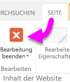

10. Jetzt sollte der Bericht auf der Seite angezeigt werden.

    

## <a name="next-steps"></a>Nächste Schritte

[Schnellstart: Erstellen eines Power BI-Berichts für Power BI-Berichtsserver](quickstart-create-powerbi-report.md)  
[Schnellstart: Erstellen eines paginierten Berichts für Power BI-Berichtsserver](quickstart-create-paginated-report.md)  

Weitere Fragen? [Stellen Sie Ihre Frage in der Power BI-Community.](https://community.powerbi.com/) 