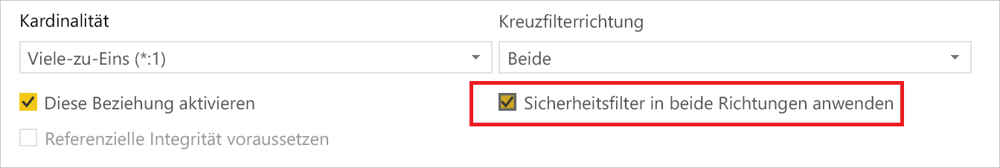
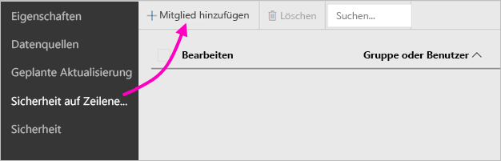
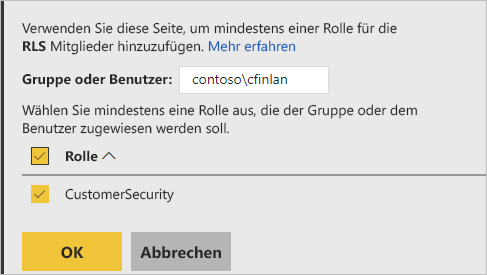
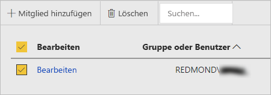

# Sicherheit auf Zeilenebene auf dem Power BI-Berichtsserver

Wenn Sie die Sicherheit auf Zeilenebene (Row Level Security, RLS) auf dem Power BI-Berichtsserver einrichten, können Sie den Datenzugriff für bestimmte Benutzer einschränken. Filter beschränken den Datenzugriff auf Zeilenebene, und Sie können Filter in Rollen definieren.  Wenn Sie die Standardberechtigungen auf dem Power BI-Berichtsserver verwenden, kann jeder Benutzer, der über die Berechtigung „Publisher“ (Herausgeber) oder „Content Manager“ (Inhalts-Manager) für einen Power BI-Bericht verfügt, Mitglieder zu Rollen für diesen Bericht hinzufügen.    

Sie konfigurieren die RLS für Berichte, die mithilfe von Power BI Desktop in Power BI importiert wurden. Sie können die RLS auch für Berichte konfigurieren, die DirectQuery verwenden, z. B. SQL Server.  Denken Sie daran, dass die RLS nicht berücksichtigt wird, wenn Ihre DirectQuery-Verbindung die integrierte Authentifizierung für Leser des Berichts verwendet. Für Liveverbindungen von Analysis Services konfigurieren Sie die RLS auf dem lokalen Modell. Die Sicherheitsoption wird nicht für Liveverbindungsdatasets angezeigt. 

[!INCLUDE [rls-desktop-define-roles](../includes/rls-desktop-define-roles.md)]

## Bidirektionale Kreuzfilterung

Standardmäßig werden beim Filtern mit Sicherheit auf Zeilenebene einzelne unidirektionale Filter verwendet, unabhängig davon, ob die Beziehungen als unidirektional oder bidirektional festgelegt wurden. Sie können die bidirektionale Kreuzfilterung mit Sicherheit auf Zeilenebene manuell aktivieren.

- Wählen Sie die Beziehung aus, und aktivieren Sie das Kontrollkästchen  **Sicherheitsfilter in beide Richtungen anwenden** . 

    

Aktivieren Sie dieses Kontrollkästchen, wenn Sie die  [dynamische Sicherheit auf Zeilenebene](https://docs.microsoft.com/sql/analysis-services/supplemental-lesson-implement-dynamic-security-by-using-row-filters) basierend auf dem Benutzernamen oder der Anmelde-ID implementieren. 

Weitere Informationen finden Sie unter [Bidirektionale Kreuzfilterung mithilfe von DirectQuery in Power BI Desktop](../desktop-bidirectional-filtering.md) und im Whitepaper [Securing the Tabular BI Semantic Model (Sichern des semantischen BI-Tabellenmodells)](http://download.microsoft.com/download/D/2/0/D20E1C5F-72EA-4505-9F26-FEF9550EFD44/Securing%20the%20Tabular%20BI%20Semantic%20Model.docx).

[!INCLUDE [rls-desktop-view-as-roles](../includes/rls-desktop-view-as-roles.md)]

## Hinzufügen von Mitgliedern zu Rollen 

Nachdem Sie Ihren Bericht im Power BI-Berichtsserver gespeichert haben, verwalten Sie die Sicherheit und fügen Mitglieder auf dem Server hinzu bzw. entfernen sie. Die Option für Sicherheit auf Zeilenebene ist nur für Benutzer mit der Berechtigung „Herausgeber“ oder „Inhalts-Manager“ für den Bericht verfügbar und nicht ausgegraut.

 Wenn für den Bericht nicht die erforderlichen Rollen verfügbar sind, müssen Sie den Bericht in Power BI Desktop öffnen und die Rollen hinzufügen oder ändern. Anschließend müssen Sie den Bericht wieder auf dem Power BI-Berichtsserver speichern. 

1. Speichern Sie den Bericht in Power BI Desktop auf dem Power BI-Berichtsserver. Sie müssen die Version von Power BI Desktop verwenden, die für den Power BI-Berichtsserver optimiert ist.
2. Wählen Sie auf dem Power BI-Berichtsserver die Auslassungspunkte (**...**) neben dem Bericht aus. 

3. Klicken Sie auf  **Verwalten** > **Sicherheit auf Zeilenebene**. 

     

    Auf der Seite **Sicherheit auf Zeilenebene** fügen Sie Mitglieder zu einer Rolle hinzu, die Sie in Power BI Desktop erstellt haben.

5. Klicken Sie auf **Mitglied hinzufügen**, um ein Mitglied hinzuzufügen.

1. Geben Sie den Benutzer oder die Gruppe im Benutzernamensformat (DOMÄNE\Benutzer) in das Textfeld ein, und wählen Sie die Rollen aus, die zugewiesen werden sollen. Das Mitglied muss sich in Ihrer Organisation befinden.   

    

    Je nachdem, wie Sie Active Directory konfiguriert haben, funktioniert diese Methode auch, wenn Sie den Benutzerprinzipalnamen eingeben. In diesem Fall zeigt der Berichtsserver den entsprechenden Benutzernamen in der Liste an.

1. Klicken Sie auf **OK**, um diese Einstellung zu übernehmen.   

8. Wenn Sie Mitglieder entfernen möchten, aktivieren Sie das Kontrollkästchen neben den Mitgliedsnamen, und klicken Sie auf **Löschen**.  Sie können mehrere Mitglieder gleichzeitig löschen. 

    

## username() und userprincipalname()

Sie können die DAX-Funktionen username() oder userprincipalname() in Ihrem Dataset verwenden. Sie können beide Funktionen in Ausdrücken in Power BI Desktop verwenden. Wenn Sie Ihr Modell veröffentlichen, verwendet der Power BI-Berichtsserver diese.

In Power BI Desktop gibt username() einen Benutzer im Format DOMÄNE\Benutzer und userprincipalname() einen Benutzer im Format user@contoso.com zurück.

Im Power BI-Berichtsserver geben username() und userprincipalname() jeweils den Benutzerprinzipalnamen des Benutzers zurück. Das format ähnelt einer E-Mail-Adresse.

Wenn Sie die benutzerdefinierte Authentifizierung auf dem Power BI-Berichtsserver verwenden, wird das Format des Benutzernamens zurückgegeben, das Sie für Benutzer eingerichtet haben.  

## Einschränkungen 

Nachfolgend finden Sie die aktuellen Einschränkungen für die Sicherheit auf Zeilenebene für Power BI-Modelle. 

Benutzer, die Berichte besessen haben, die die DAX-Funktion username() verwendet haben, bemerken ein neues Verhalten: der Benutzerprinzipalname (UPN) wird zurückgegeben, es sei denn, der DirectQuery-Modus mit integrierter Sicherheit wird verwendet.  Da die RLS in diesem Szenario nicht berücksichtigt wird, bleibt das Verhalten in diesem Szenario unverändert.

Sie können die RLS nur in den mithilfe von Power BI Desktop erstellten Datasets definieren. Wenn Sie die RLS für mit Excel erstellte Datasets aktivieren möchten, müssen Sie Ihre Dateien zunächst in PBIX-Dateien (Power BI Desktop) konvertieren. Erfahren Sie mehr über das [Konvertieren von Excel-Dateien](../desktop-import-excel-workbooks.md).

Es werden nur Verbindungen zum Extrahieren, Transformieren und Laden (ETL) und DirectQuery-Verbindungen unterstützt, die gespeicherte Anmeldeinformationen verwenden. Liveverbindungen zu Analysis Services und DirectQuery-Verbindungen über die integrierte Authentifizierung werden in den zugrunde liegenden Datenquellen behandelt. 

Wenn sie die integrierte Sicherheit mit DirectQuery verwenden, könnte Ihren Benutzern Folgendes auffallen:
- Die RLS ist deaktiviert, und alle Daten werden zurückgegeben.
- Benutzer können Ihre Rollenzuweisung nicht aktualisieren und erhalten eine Fehlermeldung auf der Seite zur RLS-Verwaltung.
- Für die DAX-Benutzernamensfunktion erhalten Sie weiterhin den Benutzernamen als DOMÄNE\Benutzer. 

Berichtsautoren haben keine Berechtigung, die Berichtsdaten auf dem Power BI-Berichtsserver anzuzeigen. Dies ist erst dann möglich, wenn sie sich selbst entsprechend Rollen zugewiesen haben, nachdem Sie den Bericht hochgeladen haben. 

 

## HÄUFIG GESTELLTE FRAGEN 

### Kann ich solche Rollen für Analysis Services-Datenquellen erstellen? 

Das ist möglich, wenn Sie die Daten in Power BI Desktop importiert haben. Wenn Sie eine Liveverbindung verwenden, können Sie die RLS nicht im Power BI-Dienst konfigurieren. Die RLS wird im lokalen Analysis Services-Modell definiert. 

### Kann ich mit der RLS die Spalten oder Measures einschränken, auf die Benutzer Zugriff haben? 

Nein. Wenn ein Benutzer Zugriff auf eine bestimmte Datenzeile hat, sind alle Datenspalten dieser Zeile für ihn sichtbar. 

### Kann ich mit der RLS Detaildaten in Visuals ausblenden und Zugriff auf in Visuals zusammengefasste Daten erteilen? 

Nein. Sie sichern einzelne Datenzeilen, für die Benutzer werden jedoch immer entweder die Details oder die zusammengefassten Daten angezeigt. 

### Kann ich in Power BI Desktop neue Rollen hinzufügen, wenn bereits Rollen vorhanden und Mitglieder zugewiesen sind? 

Ja, wenn Sie bereits vorhandene Rollen auf dem Power BI-Berichtsserver definiert und Mitglieder zugewiesen haben, können Sie zusätzliche Rollen erstellen und Ihren Bericht erneut veröffentlichen, ohne dass dies Auswirkungen auf Ihre aktuellen Zuweisungen hat. 
 

## Nächste Schritte

[Administratorübersicht](get-started.md) 
[Power BI-Berichtsserver](admin-handbook-overview.md)  

Weitere Fragen? [Stellen Sie Ihre Frage in der Power BI-Community.](https://community.powerbi.com/)