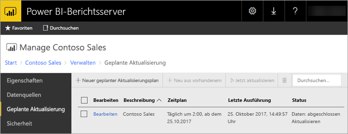

# Geplante Aktualisierung von Power BI-Berichten in Power BI-Berichtsserver
Durch die geplante Aktualisierung für Power BI-Berichte wird sichergestellt, dass die Daten für einen Bericht auf dem neuesten Stand bleiben.

Die geplante Aktualisierung ist spezifisch für Power BI-Berichte mit einem eingebetteten Modell. Das heißt, Sie haben Daten in den Bericht importiert und verwenden keine Liveverbindung oder DirectQuery. Beim Importieren von Daten werden diese von der ursprünglichen Datenquelle getrennt, und sie müssen aktualisiert werden, um sie auf dem aktuellen Stand zu halten. Mithilfe der geplanten Aktualisierung können Sie Ihre Daten auf dem neuesten Stand halten.

Die geplante Aktualisierung wird im Verwaltungsabschnitt eines Berichts konfiguriert. Weitere Informationen zum Konfigurieren der geplanten Aktualisierung finden Sie unter [Konfigurieren der geplanten Aktualisierung für Power BI-Berichte](configure-scheduled-refresh.md).

## Funktionsweise
Beim Verwenden der geplanten Aktualisierung für Ihre Power BI-Berichte werden verschiedene Komponenten verwendet.

* SQL Server-Agent fungiert als Zeitgeber beim Generieren von geplanten Ereignissen.
* Geplante Aufträge werden einer Warteschlange von Ereignissen und Benachrichtigungen in der Berichtsserver-Datenbank hinzugefügt. In einer Bereitstellung für horizontales Skalieren wird die Warteschlange für alle Berichtsserver in der Bereitstellung gemeinsam genutzt.
* Die gesamte Berichtsverarbeitung, die infolge eines geplanten Ereignisses auftritt, wird als Hintergrundprozess ausgeführt.
* Das Datenmodell wird in einer Analysis Services-Instanz geladen.
* Für einige Datenquellen wird das Power Query-Mashup-Engine verwendet, um eine Verbindung mit Datenquellen herzustellen und um die Daten zu transformieren. Die Verbindung mit anderen Datenquellen kann direkt aus einem Analysis Services-Dienst hergestellt werden, der die Datenmodelle für Power BI-Berichtsserver hostet.
* Neue Daten werden in das Datenmodell in Analysis Services geladen.
* Analysis Services verarbeitet die Daten und führt alle erforderlichen Berechnungen aus.

Power BI-Berichtsserver verwaltet eine Ereigniswarteschlange für alle geplanten Vorgänge. Dabei wird die Warteschlange in regelmäßigen Abständen nach neuen Ereignissen abgefragt. In der Standardeinstellung wird die Warteschlange alle 10 Sekunden überprüft. Sie können das Intervall ändern, indem Sie die Konfigurationseinstellungen **PollingInterval**, **IsNotificationService** und **IsEventService** in der Konfigurationsdatei „RSReportServer.config“ bearbeiten. Mit **IsDataModelRefreshService** kann zudem festgelegt werden, ob ein Berichtsserver geplante Ereignisse verarbeitet.

### Analysis Services
Für das Rendern eines Power BI-Berichts sowie das Durchführen einer geplanten Aktualisierung muss das Datenmodell des Power BI-Berichts in Analysis Services geladen werden. Ein Analysis Services-Prozess wird mit Power BI-Berichtsserver ausgeführt.

## Überlegungen und Einschränkungen
### Fälle, in denen die geplante Aktualisierung nicht verwendet werden kann
Nicht für alle Power BI-Berichte kann ein Plan für die geplante Aktualisierung erstellt werden. Im Folgenden sind die Power BI-Berichte aufgelistet, für die Sie keinen Plan für die geplante Aktualisierung erstellen können.

* Ihr Bericht enthält eine oder mehrere Analysis Services-Datenquellen, die eine Liveverbindung verwenden.
* Ihr Bericht enthält eine oder mehrere Datenquellen, die DirectQuery verwenden.
* Ihr Bericht enthält keine Datenquelle. Daten werden beispielsweise über *Daten eingeben* manuell eingegeben, oder der Bericht enthält ausschließlich statische Inhalte wie Bilder, Text usw.

Zusätzlich zur obigen Liste gibt es spezielle Szenarien mit Datenquellen im *Importmodus*, für die keine Pläne für die geplante Aktualisierung erstellt werden können.

* Wenn eine Datenquelle vom Typ *Datei* oder *Ordner* verwendet wird, und der Dateipfad lokal ist (z.B. „C:\Benutzer\Benutzer\Dokumente“), kann kein Aktualisierungsplan erstellt werden. Der Pfad muss ein Pfad sein, mit dem der Berichtsserver eine Verbindung wie mit einer Netzwerkfreigabe herstellen kann. Beispiel: *\\meineFreigabe\Dokumente*.
* Wenn eine Verbindung mit einer Datenquelle nur mit OAuth hergestellt werden kann (z.B. Facebook, Google Analytics, Salesforce usw.), kann kein Cache-Aktualisierungsplan erstellt werden. Derzeit wird OAuth von Berichtsserver für keine Datenquellen unterstützt, ganz gleich, ob es sich um paginierte, mobile oder Power BI-Berichte handelt.

### Arbeitsspeicherlimits
Die herkömmliche Arbeitsauslastung für einen Berichtsserver war vergleichbar mit einer Webanwendung. Die Fähigkeit, Berichte mit importierten oder über DirectQuery bezogenen Daten zu laden sowie die Fähigkeit, geplante Aktualisierungen durchzuführen, hängen von einer Analysis Services-Instanz ab, die parallel auf dem Berichtsserver gehostet wird. Daher kann dies zu einer unerwarteten Arbeitsspeicherbelegung auf dem Server führen. Planen Sie die Serverbereitstellung entsprechend, und berücksichtigen Sie dabei, dass Analysis Services Arbeitsspeicher parallel zum Berichtsserver belegen kann.

Weitere Informationen zum Überwachen einer Analysis Services-Instanz finden Sie unter [Überwachen einer Analysis Services-Instanz](https://docs.microsoft.com/sql/analysis-services/instances/monitor-an-analysis-services-instance).

Weitere Informationen zu Arbeitsspeichereinstellungen in Analysis Services finden Sie unter [Speichereigenschaften](https://docs.microsoft.com/sql/analysis-services/server-properties/memory-properties).

## Nächste Schritte
Konfigurieren Sie die [geplante Aktualisierung](configure-scheduled-refresh.md) für einen Power BI-Bericht.

Weitere Fragen? [Stellen Sie Ihre Frage in der Power BI-Community.](https://community.powerbi.com/)

