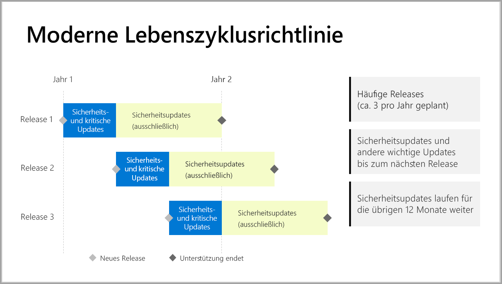

# Ablauffristen für den Support für Power BI-Berichtsserver

Power BI-Berichtsserver wird mehrmals pro Jahr veröffentlicht. Sicherheits- und wichtige Updates stehen bis zur allgemeinen Verfügbarkeit der nächsten Version zur Verfügung. Nach dem nächsten Release werden während der Restlaufzeit der zwölfmonatigen Lebensdauer weiterhin Sicherheitsupdates für das vorherige Release veröffentlicht.

Diese Supportrichtlinie erlaubt es uns, unseren Kunden Innovationen schnell zur Verfügung zu stellen und ihnen zugleich die Möglichkeit einzuräumen, die Innovationen flexibel im selbstgewählten Tempo einzuführen.

* Wartungsphase mit Sicherheits- und wichtigen Updates: Bei Ausführung der neuesten Version von Power BI-Berichtsserver erhalten Sie sowohl Sicherheits- als auch wichtige Updates.
* Wartungsphase mit (ausschließlich) Sicherheitsupdates: Nachdem eine neue Version veröffentlicht wurde, wird die Unterstützung älterer Version für die Restlaufzeit des zwölfmonatigen Supportlebenszyklus ausschließlich auf Sicherheitsupdates reduziert (siehe Abbildung 1).

    

## Versionsverlauf

| **Version** | **Verfügbarkeitsdatum** | **Enddatum für den Support** |
| --- | --- | --- |
| Juni 2017 |12. Juni 2017 |Nicht unterstützt |
| Oktober 2017 |31. Oktober 2017 |31. Oktober 2018 |
| März 2018 | 19. März 2018 | 19. März 2019 |
| August 2018 | 15. August 2018 | 15. August 2019 |

Um Power BI-Berichtsserver und Power BI Desktop mit Optimierung für Power BI-Berichtsserver herunterzuladen, navigieren Sie zu [Lokale Berichterstellung mit Power BI-Berichtsserver](https://powerbi.microsoft.com/report-server/).

## Nächste Schritte
[Neuerungen in Power BI-Berichtsserver](whats-new.md)  
[Was ist der Microsoft Power BI-Berichtsserver?](get-started.md)
[Administratorübersicht](admin-handbook-overview.md)  
[Installieren von Power BI-Berichtsserver](install-report-server.md)  

Weitere Fragen? [Stellen Sie Ihre Frage in der Power BI-Community.](https://community.powerbi.com/)