# Tutorial: Erkunden des Power BI-Berichtsserver-Webportals auf einem virtuellen Computer
In diesem Tutorial erstellen Sie einen virtuellen Azure-Computer mit bereits installiertem Power BI-Berichtsserver, sodass Sie das Anzeigen, Bearbeiten und Verwalten von Power BI-Beispielberichten und paginierten Berichten sowie KPIs üben können.

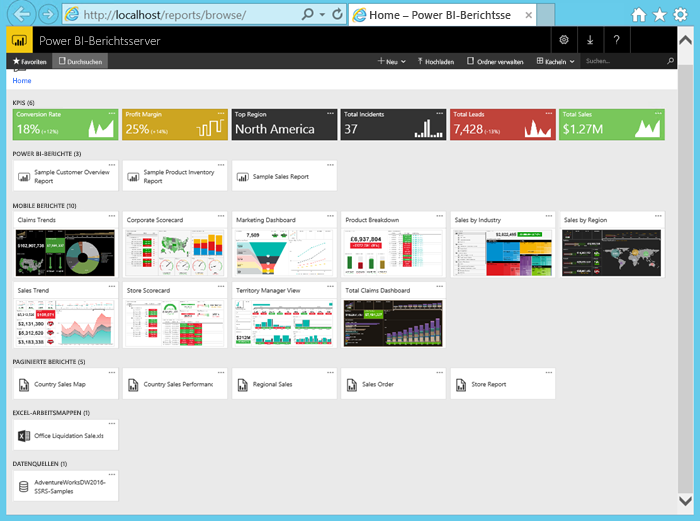

Folgende Aufgaben führen Sie in diesem Tutorial aus:

> [!div class="checklist"]
> * Erstellen eines virtuellen Computers und Herstellen einer Verbindung mit diesem Computer
> * Starten und Erkunden des Power BI-Berichtsserver-Webportals
> * Markieren eines Favoriten
> * Anzeigen und Bearbeiten eines Power BI-Berichts
> * Anzeigen, Verwalten und Bearbeiten eines paginierten Berichts
> * Anzeigen einer Excel-Arbeitsmappe in Excel Online

Für dieses Tutorial benötigen Sie ein Azure-Abonnement. Wenn Sie noch keins besitzen, erstellen Sie ein [kostenloses Konto](https://azure.microsoft.com/free/?WT.mc_id=A261C142F), bevor Sie beginnen.

## Erstellen eines virtuellen Computers mit Power BI-Berichtsserver

Das Power BI-Team hat einen virtuellen Computer erstellt, auf dem Power BI-Berichtsserver bereits installiert ist.

1. Öffnen Sie [Power BI-Berichtsserver](https://azuremarketplace.microsoft.com/marketplace/apps/reportingservices.technical-preview?tab=Overview) im Azure Marketplace.  

2. Wählen Sie **Jetzt anfordern** aus.
3. Um den Nutzungsbedingungen und der Datenschutzrichtlinie des Anbieters zuzustimmen, klicken Sie auf **Fortfahren**.

    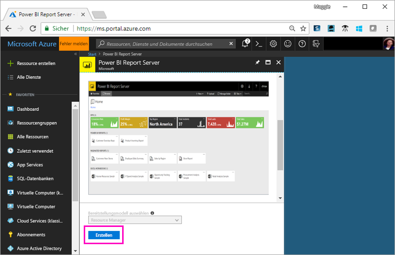

4. Geben Sie in **Schritt 1 – Grundlagen** **reportservervm** als **VM-Name** ein.

5. Erstellen Sie einen Benutzername und ein Kennwort.

6. Wählen Sie unter **Ressourcengruppe** die Option **Neu erstellen** aus, und geben Sie den Namen **reportserverresourcegroup** ein.

7. Behalten Sie die anderen Standardwerte bei, und klicken Sie auf **OK**.

    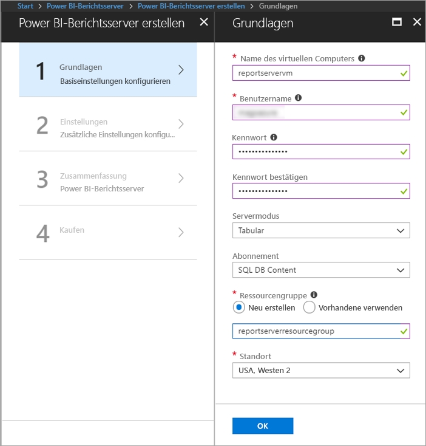

8. Behalten Sie in **Schritt 2 – Einstellungen** die Standardwerte bei, und klicken Sie auf **OK**.

9. Klicken Sie in **Schritt 3 – Zusammenfassung** auf **OK**.

10. Lesen Sie in **Schritt 4** die Nutzungsbedingungen und die Datenschutzrichtlinie, und klicken Sie auf **Erstellen**.

    Der Prozess **Bereitstellung für Power BI-Berichtsserver wird übermittelt** dauert einige Minuten.

## Herstellen einer Verbindung mit dem virtuellen Computer

1. Wählen Sie im linken Navigationsbereich von Azure die Option **Virtuelle Computer** aus. 

2. Geben Sie im Feld **Nach Name filtern** den Begriff „Report“ ein. 

3. Wählen Sie den virtuellen Computer namens **REPORTSERVERVM** aus.

    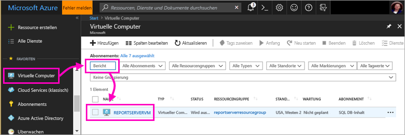

4. Klicken Sie im virtuellen Computer REPORTSERVERVM auf die Option **Verbinden**.

    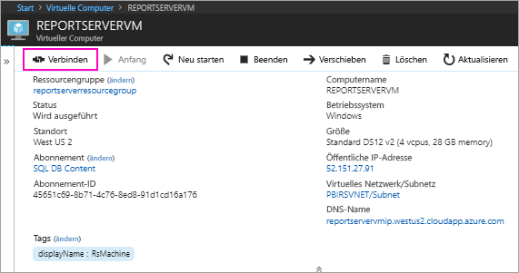

5. Klicken Sie im Dialogfeld „Remotedesktopverbindung“ auf **Verbinden**.

6. Geben Sie den Namen und das Kennwort ein, den bzw. das Sie für den virtuellen Computer erstellt haben, und klicken Sie auf **OK**.

7. Das nächste Dialogfeld informiert darüber, dass die Identität des Remotecomputers nicht identifiziert werden kann. Klicken Sie auf **OK**.

   Voilà! Ihr neuer virtueller Computer wird geöffnet.

## Power BI-Berichtsserver auf dem virtuellen Computer

Wenn der virtuelle Computer geöffnet wird, werden auf dem Desktop folgende Elemente angezeigt.

|Nummer  |Beschreibung  |
|---------|---------|
| | Startet SQL Server Data Tools zum Erstellen paginierter Berichte (RDL) |
| | Power BI-Beispielberichte (PBIX)  |
| | Links zur Dokumentation zu Power BI-Berichtsserver   |
| | Startet die für Power BI-Berichtsserver optimierte Power BI Desktop-Anwendung (März 2018)  |
| | Öffnet das Webportal von Power BI-Berichtsserver im Browser   |

Doppelklicken Sie auf das Symbol **Berichtsserver-Webportal**. Der Browser öffnet die Seite http://localhost/reports/browse. Im Webportal sehen Sie verschiedene Dateien nach Typ gruppiert. 

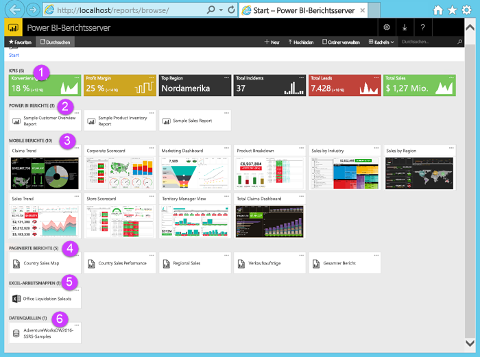

|Nummer  |Beschreibung  |
|---------|---------|
| | Im Webportal erstellte KPIs |
| |  Power BI-Berichte (PBIX)  |
| | Im Publisher für mobile Berichte von SQL Server erstellte mobile Berichte  |
| |  Im Berichts-Generator oder in SQL Server Data Tools erstellte paginierte Berichte  |
| | Excel-Arbeitsmappen   | 
| | Datenquellen für paginierte Berichte | 

## Markieren von Favoriten
Sie können die Berichte und KPIs markieren, die Sie als Favoriten wünschen. Sie sind leichter zu finden, da sie alle, sowohl im Webportal als auch in den mobilen Power BI-Apps, im zentralen Ordner „Favoriten“ gesammelt werden. 

1. Klicken Sie rechts oben in der KPI **Profit Margin** auf die Auslassungspunkte (**...**), und klicken Sie dann auf **Zu Favoriten hinzufügen**.
   
    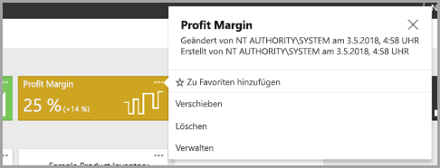
2. Wählen Sie **Favoriten** im Menüband des Webportals aus, um dieses mit den anderen Favoriten auf der Seite „Favoriten“ im Webportal anzuzeigen.
   
    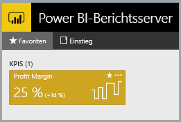

3. Klicken Sie auf **Durchsuchen**, um wieder zum Webportal zu wechseln.
   
## Anzeigen von Elementen in der Listenansicht
Standardmäßig werden die Inhalte des Webportals in der Neben-/Untereinanderansicht angezeigt.

Sie können zur Listenansicht wechseln, in der das gleichzeitige Verschieben oder Löschen mehrerer Elemente einfach ist. 

1. Wählen Sie **Kacheln** > **Liste** aus.
   
    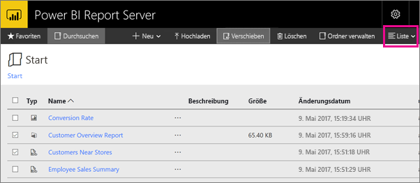

2. Wechseln Sie zurück zur Kachelansicht, indem Sie auf **Liste** > **Kacheln** klicken.

## Power BI-Berichte

Im Webportal können Sie Power BI-Berichte anzeigen und damit interagieren und Power BI Desktop starten.

### Anzeigen von Power BI-Berichten

1. Wählen Sie im Webportal unter **Power BI-Berichte** den **Sample Customer Overview Report** aus. Der Bericht wird im Browser geöffnet.

1. Wählen Sie in der Strukturzuordnung den Block „United States“ aus, um zu sehen, wie die verknüpften Werte in den anderen Visuals markiert werden.

    

### In Power BI Desktop bearbeiten

1. Wählen Sie **In Power BI Desktop bearbeiten** aus.

1. Klicken Sie auf **Zulassen**, um der Website zu erlauben, ein Programm auf Ihrem Computer zu öffnen. 

     Der Bericht wird in Power BI Desktop geöffnet. Beachten Sie den Namen in der oberen Leiste: Power BI Desktop (März 2018). Das ist die für Power BI-Berichtsserver optimierte Version.

    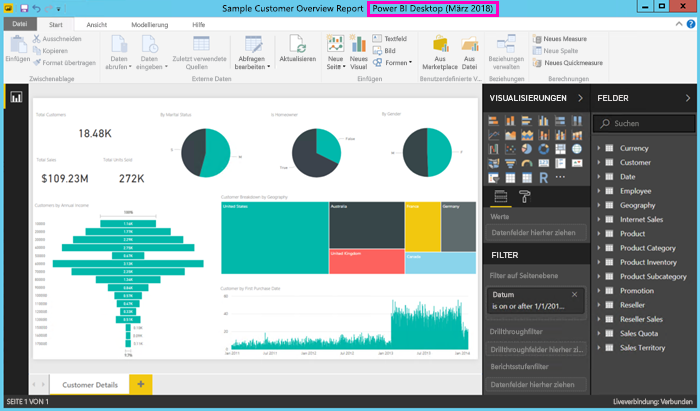

3. Erweitern Sie im Bereich „Felder“ die Tabelle „Customers“, und ziehen Sie das Feld „Occupation“ in den Filterbereich auf Berichtsebene.

    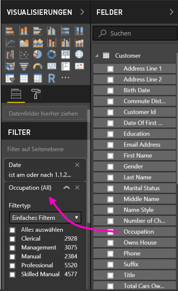

1. Speichern Sie den Bericht.

1. Wechseln Sie wieder zum Bericht im Browser, und klicken Sie auf das Browsersymbol **Aktualisieren**.

    

8. Erweitern Sie den Bereich **Filter** auf der rechten Seite, um den hinzugefügten Filter **Occupation** anzuzeigen. Wählen Sie **Professional** aus.

    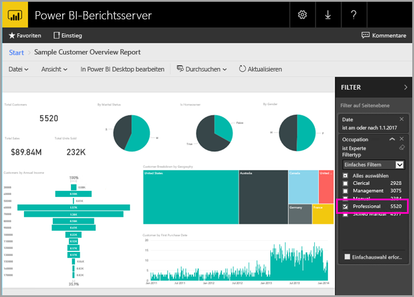

3. Klicken Sie auf **Durchsuchen**, um wieder zum Webportal zu wechseln.

## Paginierte Berichte (RDL)

Im Webportal können Sie paginierte Berichte anzeigen und verwalten sowie den Berichts-Generator starten.

### Verwalten eines paginierten Berichts

1. Klicken Sie im Webportal unter **Paginierte Berichte** auf die Auslassungspunkte (...) neben **Sales Order**, und klicken Sie dann auf **Verwalten**.

1. Wählen Sie **Parameter** aus, ändern Sie den Standardwert für **SalesOrderNumber** zu **SO50689**, und klicken Sie auf **Anwenden**.

   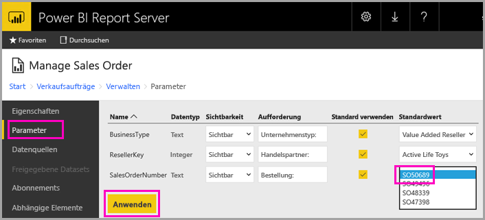

3. Klicken Sie auf **Durchsuchen**, um wieder zum Webportal zu wechseln.

### Anzeigen eines paginierten Berichts

1. Wählen Sie im Webportal die Option **Sales Order** aus.
 
3.  Der Auftrag wird mit dem **Order**-Parameter geöffnet, den Sie festgelegt haben: **SO50689**. 

    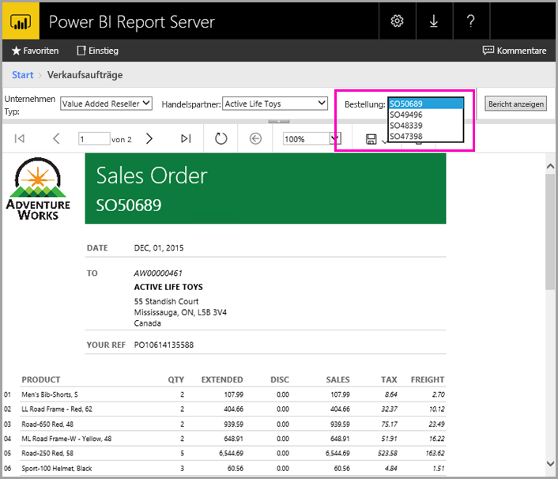

    Sie können diesen sowie weitere Parameter hier ändern, ohne dabei die Standardwerte zu verändern.

1. Wählen Sie **Order** **SO48339** > **Bericht anzeigen** aus.

4. Sie sehen, dass dies Seite 1 von 2 ist. Klicken Sie auf den Pfeil nach rechts, um die zweite Seite anzuzeigen. Die Tabelle wird auf dieser Seite fortgesetzt.

    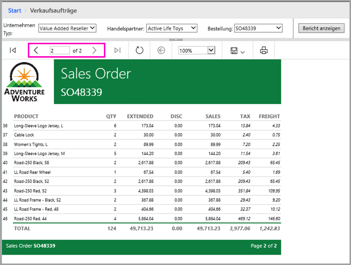

5. Klicken Sie auf **Durchsuchen**, um wieder zum Webportal zu wechseln.

### Bearbeiten eines paginierten Berichts

Sie können paginierte Berichte im Berichts-Generator bearbeiten, den Sie direkt aus dem Browser starten können.

1. Klicken Sie im Webportal auf die Auslassungspunkte (...) neben **Sales Order**, und wählen Sie **Im Berichts-Generator bearbeiten** aus.

1. Klicken Sie auf **Zulassen**, um der Website zu erlauben, ein Programm auf Ihrem Computer zu öffnen.

1. Der Sales Order-Bericht wird in der Designansicht im Berichts-Generator geöffnet.

    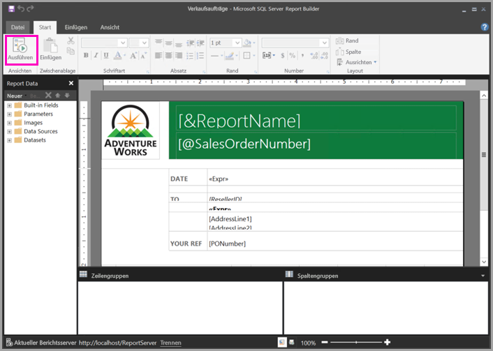

1. Klicken Sie auf **Ausführen**, um eine Vorschau des Berichts anzuzeigen.

    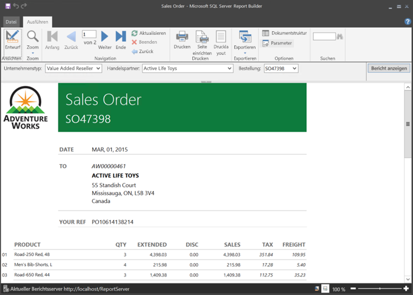

5. Schließen Sie den Berichts-Generator, und wechseln Sie wieder in den Browser.

## Anzeigen von Excel-Arbeitsmappen

Sie können Excel-Arbeitsmappen in Excel Online in Power BI-Berichtsserver anzeigen und mit ihnen interagieren. 

1. Wählen Sie die Excel-Arbeitsmappe **Office Liquidation Sale.xlsx** aus. Möglicherweise werden Sie zum Eingeben von Anmeldeinformationen aufgefordert. Klicken Sie auf **Abbrechen**. 
    Die Mappe wird im Webportal geöffnet.
1. Klicken Sie im Slicer auf **Appliance**.

    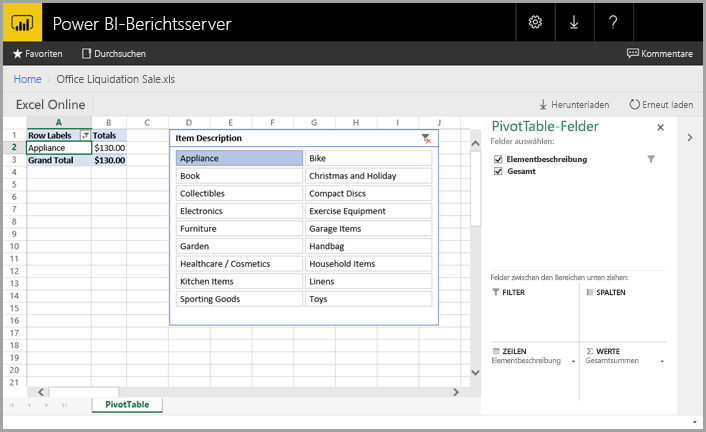

1. Klicken Sie auf **Durchsuchen**, um wieder zum Webportal zu wechseln.

## Bereinigen von Ressourcen

Nachdem Sie dieses Tutorial beendet haben, löschen Sie die Ressourcengruppe, den virtuellen Computer und alle zugehörigen Ressourcen. 

- Wählen Sie zu diesem Zweck die Ressourcengruppe für den virtuellen Computer aus, und klicken Sie auf **Löschen**.

## Nächste Schritte

In diesem Tutorial haben Sie einen virtuellen Computer mit Power BI-Berichtsserver erstellt. Sie haben einige der Funktionen des Webportals ausprobiert und einen Power BI-Bericht sowie einen paginierten Bericht in den jeweiligen Editoren geöffnet. Um mehr über die Erstellung von Berichten für Power BI-Berichtsserver zu erfahren, fahren Sie mit den nächsten Schritten fort.

> [!div class="nextstepaction"]
> [Erstellen eines Power BI-Berichts für Power BI-Berichtsserver](./quickstart-create-powerbi-report.md)

