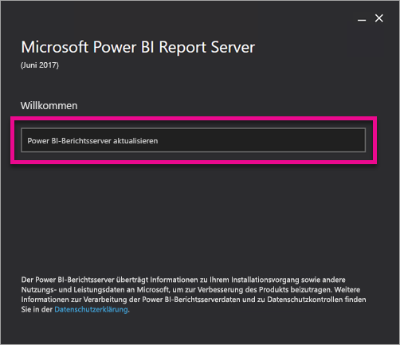
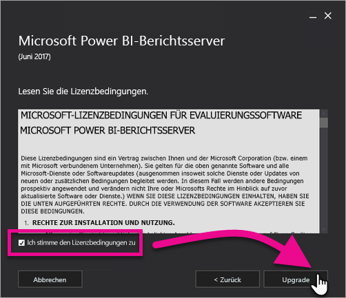
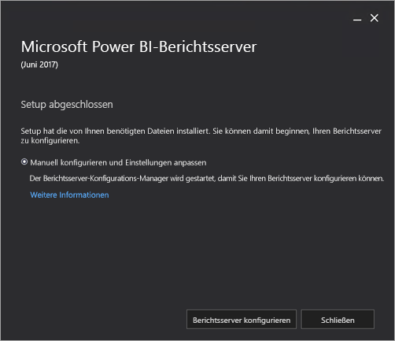

# Aktualisieren von Power BI-Berichtsserver

Erfahren Sie, wie Power BI-Berichtsserver aktualisiert wird.

 **Herunterladen** 

Um Power BI-Berichtsserver und Power BI Desktop mit Optimierung für Power BI-Berichtsserver herunterzuladen, navigieren Sie zu [Lokale Berichterstellung mit Power BI-Berichtsserver](https://powerbi.microsoft.com/report-server/).

## Vorbereitung

Bevor Sie ein Upgrade für einen Berichtsserver ausführen, empfehlen wir, die folgenden Schritte zum Sichern Ihres Berichtsservers auszuführen.

### Sichern der Verschlüsselungsschlüssel

Sie sollten die Verschlüsselungsschlüssel sichern, wenn Sie eine Berichtsserver-Installation zum ersten Mal konfigurieren. Sie sollten auch die Schlüssel sichern, jedes Mal, wenn Sie die Identität der Dienstkonten ändern oder des Computers umbenennen. Weitere Informationen finden Sie unter [Sichern und Wiederherstellen der Reporting Services-Verschlüsselungsschlüssel](https://docs.microsoft.com/sql/reporting-services/install-windows/ssrs-encryption-keys-back-up-and-restore-encryption-keys).

### Sichern der Berichtsserver-Datenbanken

Da es sich bei einem Berichtsserver um einen statusfreien Server handelt, sind alle Anwendungsdaten in den Datenbanken **reportserver** und **reportservertempdb** gespeichert, die auf einer Instanz einer SQL Server-Datenbank-Engine ausgeführt werden. Sie können Sichern der **Reportserver** und **Reportservertempdb** mithilfe einer der unterstützten Methoden zum Sichern von SQL Server-Datenbanken. Zu den für Berichtsserver-Datenbanken spezifischen Empfehlungen zählen die folgenden:

* Verwenden Sie das vollständige Wiederherstellungsmodell zum Sichern der **Reportserver** Datenbank.
* Verwenden Sie das einfache Wiederherstellungsmodell zum Sichern der **Reportservertempdb** Datenbank.
* Sie können für jede Datenbank verschiedene Sicherungszeitpläne verwenden. Der einzige Grund für das Sichern der **Reportservertempdb** besteht darin, zu vermeiden, dass es neu erstellen, wenn ein Hardwarefehler vorhanden ist. Bei einem Hardwareausfall müssen die Daten in **reportservertempdb** nicht wiederhergestellt werden, Sie benötigen aber die Tabellenstruktur. Wenn Sie **reportservertempdb** verlieren, besteht die einzige Möglichkeit zu ihrer Wiederherstellung in der Neuerstellung der Berichtsserver-Datenbank. Wenn Sie **reportservertempdb** neu erstellen, muss sie den gleichen Namen wie die primäre Berichtsserver-Datenbank aufweisen.

Weitere Informationen zu Sicherung und Wiederherstellung von relationalen SQL Server-Datenbanken finden Sie unter [Sichern und Wiederherstellen von SQL Server-Datenbanken](https://docs.microsoft.com/sql/relational-databases/backup-restore/back-up-and-restore-of-sql-server-databases).

### Sichern der Konfigurationsdateien

Power BI-Berichtsserver verwendet Konfigurationsdateien zum Speichern von Anwendungseinstellungen. Sie sollten die Dateien sichern, wenn Sie den Server erstmalig konfigurieren und nachdem Sie benutzerdefinierten Erweiterungen bereitgestellt. Folgende Dateien sollten gesichert werden:

* config.json
* RSHostingService.exe.config
* Rsreportserver.config
* Rssvrpolicy.config
* Reportingservicesservice.exe.config
* „Web.config“ für die ASP.NET-Anwendungen von Berichtsserver
* „Machine.config“ für ASP.NET

## Aktualisieren des Berichtsservers

Das Aktualisieren des Power BI-Berichtsservers ist einfach. Zum Installieren der Dateien müssen nur einige Schritte ausgeführt werden.

1. Bestimmen Sie den Speicherort der Datei „PowerBIReportServer.exe“, und starten Sie das Installationsprogramm.

2. Wählen Sie **Upgrade von Power BI-Berichtsserver ausführen** aus.

    

3. Lesen Sie die Lizenzbedingungen, stimmen Sie ihnen zu, und wählen Sie dann **Upgrade** aus.

    

4. Nach erfolgreichem Upgrade können Sie **Berichtsserver konfigurieren** auswählen, um den Konfigurations-Manager für Reporting Services zu starten, oder **Schließen**, um das Installationsprogramm zu beenden.

    

## Aktualisieren von Power BI Desktop

Nach der Aktualisierung des Berichtsservers sollten Sie sicherstellen, dass alle Autoren von Power BI-Berichten auf die Power BI Desktop-Version mit Optimierung für Power BI-Berichtsserver aktualisieren, die der Serverversion entspricht.

## Nächste Schritte

* [Administratorübersicht](admin-handbook-overview.md)  
* [Installieren von für Power BI-Berichtsserver optimiertem Power BI Desktop](install-powerbi-desktop.md)  
* [Überprüfen einer Reporting Services-Installation](https://docs.microsoft.com/sql/reporting-services/install-windows/verify-a-reporting-services-installation)  
* [Konfigurieren des Dienstkontos für den Berichtsserver](https://docs.microsoft.com/sql/reporting-services/install-windows/configure-the-report-server-service-account-ssrs-configuration-manager)  
* [Konfigurieren von Berichtsserver-URLs](https://docs.microsoft.com/sql/reporting-services/install-windows/configure-report-server-urls-ssrs-configuration-manager)  
* [Konfigurieren einer Verbindung mit der Berichtsserver-Datenbank](https://docs.microsoft.com/sql/reporting-services/install-windows/configure-a-report-server-database-connection-ssrs-configuration-manager)  
* [Initialisieren eines Berichtsservers](https://docs.microsoft.com/sql/reporting-services/install-windows/ssrs-encryption-keys-initialize-a-report-server)  
* [Konfigurieren von SSL-Verbindungen für einen Berichtsserver](https://docs.microsoft.com/sql/reporting-services/security/configure-ssl-connections-on-a-native-mode-report-server)  
* [Konfigurieren von Windows-Dienstkonten und -Berechtigungen](https://docs.microsoft.com/sql/database-engine/configure-windows/configure-windows-service-accounts-and-permissions)  
* [Browserunterstützung für Power BI-Berichtsserver](browser-support.md)

Weitere Fragen? [Stellen Sie Ihre Frage in der Power BI-Community.](https://community.powerbi.com/)