# Analysebeispiel für Einzelhandel für Power BI: Tour
## Informationen zum Analysebeispiel für Einzelhandel
Dieses Branchenbeispieldashboard und der zugrunde liegende Bericht analysieren Umsatzdaten des Einzelhandels von Artikeln, die in verschiedenen Läden und Bezirken verkauft wurden. Die Metriken vergleichen die Leistung dieses Jahres mit der des letzten Jahres in den folgenden Bereichen: Umsatz, Einheiten, Bruttogewinn und Varianz sowie Analyse neuer Läden. Hierbei handelt es sich um echte Daten von obviEnce ([www.obvience.com](http://www.obvience.com)) in anonymisierter Form.

Alternativ können Sie [nur das Dataset (Excel-Arbeitsmappe) für dieses Beispiel herunterladen](http://go.microsoft.com/fwlink/?LinkId=529778).

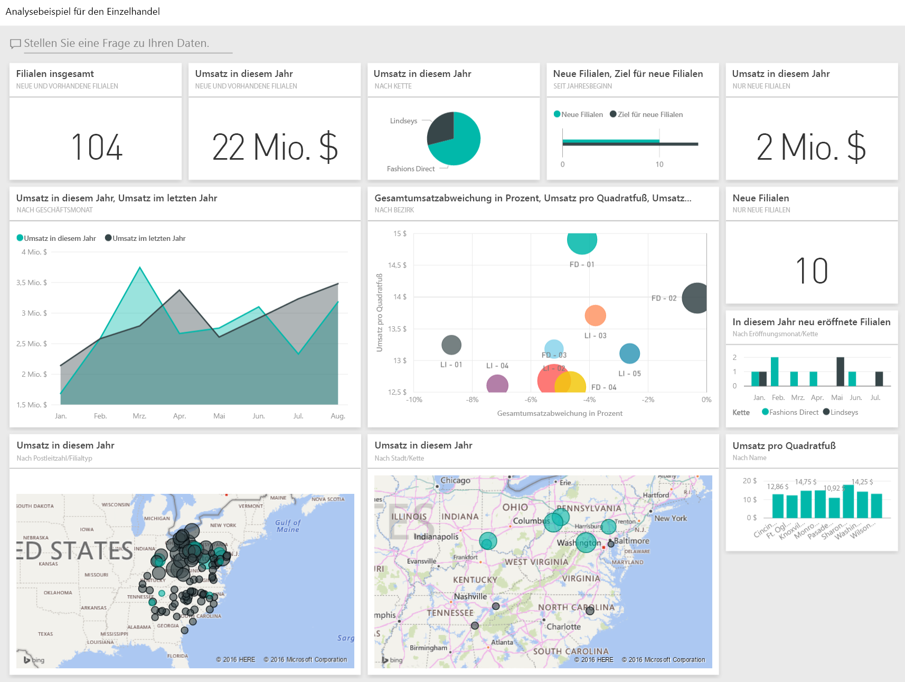

## Starten auf dem Dashboard und Öffnen des Berichts
1. Wählen Sie im Dashboard die Kachel „Total Stores“ aus:
   
     
   
   Dadurch gelangen Sie im Bericht zur Seite „Store Sales Overview“ im Bericht. Sie sehen, wir haben insgesamt 104 Geschäfte, davon 10 neue. Wir haben zwei Ketten Fashions Direct und Lindseys. Die Fashions Direct-Geschäfte sind im Durchschnitt größer.
2. Wählen Sie im Kreisdiagramm **Fashions Direct** aus.
   
   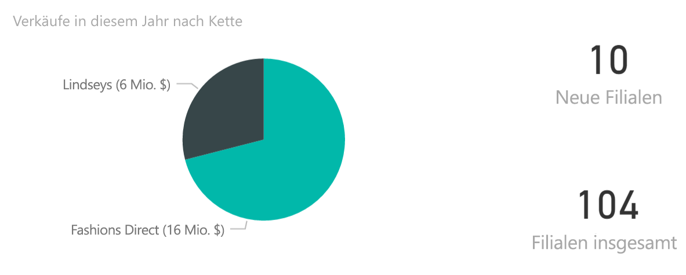  
   
   Beachten Sie das Ergebnis im Blasendiagramm:
   
   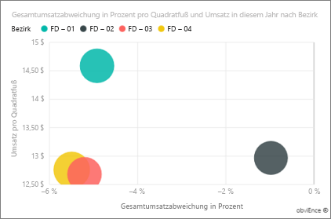  
   
   Der Bezirk FD-01 hat den höchsten durchschnittlichen Umsatz pro Quadratfuß, FD-02 hat die niedrigste Abweichung im Vergleich zum Vorjahr, FD-03 und FD-04 schneiden insgesamt am schlechtesten ab.
3. Wählen Sie einige der einzelnen Blasen oder andere Diagramme, um die übergreifende Hervorhebung den Einfluss Ihrer Auswahl sichtbar machen zu lassen.
4. Um zum Dashboard zurückzukehren, wählen Sie dessen Namen aus der oberen Navigationsleiste aus (Brotkrümel). 
   
   
5. Wählen Sie im Dashboard die Kachel mit dem Titel „This Year’s Sales“ aus.
   
   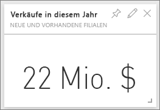
   
   Das ist gleichbedeutend mit der Eingabe von „Verkäufe in diesem Jahr“ im Q&A-Feld.
   
   Dieser Bildschirm wird angezeigt:
   
   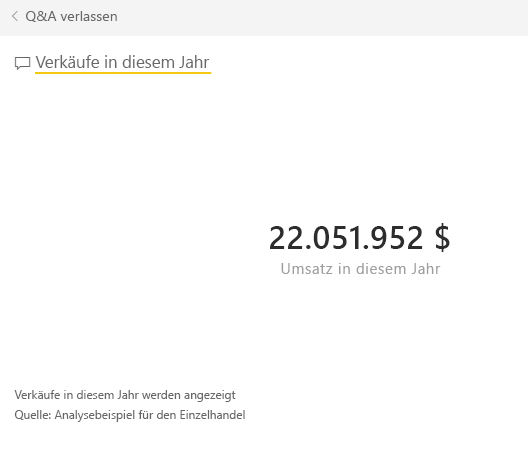

## Überprüfen einer Kachel, die über Fragen und Antworten in Power BI erstellt wurde
Gehen wir mehr ins Detail.

1. Fügen Sie „this year sales **by district**“ zur Frage hinzu. Beobachten Sie das Ergebnis: Die Antwort wird automatisch in ein Balkendiagramm gesetzt, und es werden andere Formulierungen vorgeschlagen.
   
   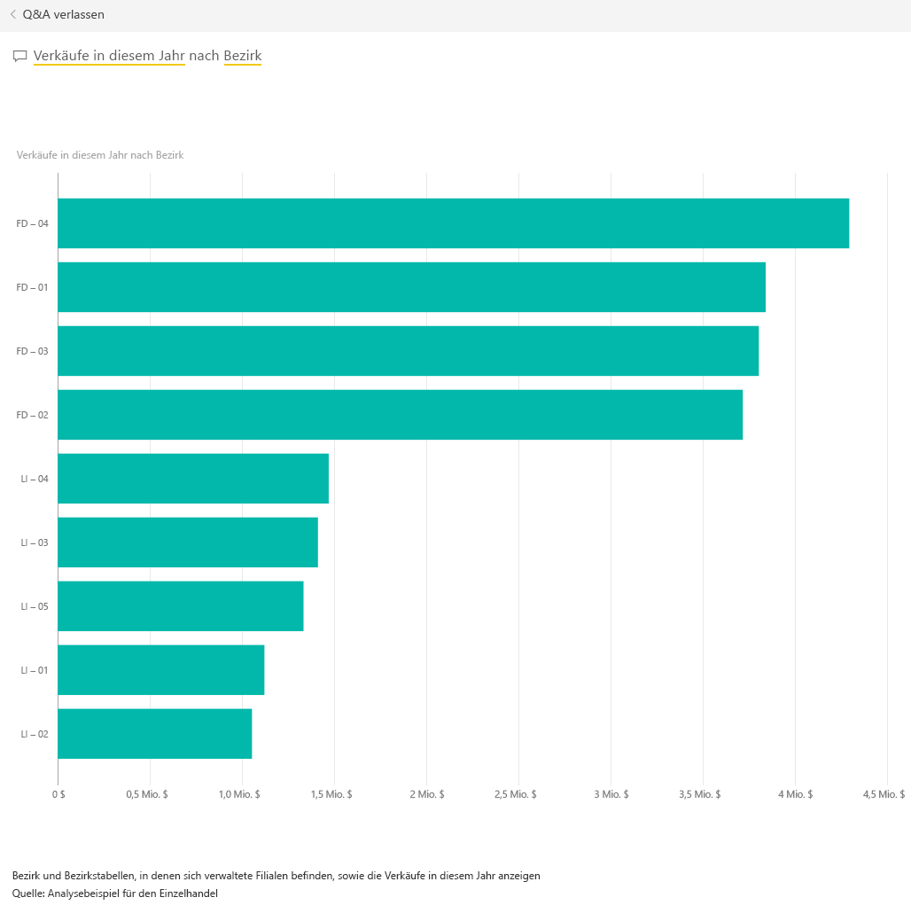
2. Ändern Sie jetzt die Frage in „this year sales **by zip and chain**“.
   
   Beachten Sie, wie die Frage während Ihrer Eingabe mit den entsprechenden Diagrammen beantwortet wird.
3. Experimentieren Sie ein bisschen mit weiteren Fragen, und sehen Sie sich die erzielten Ergebnisse an.
4. Wenn Sie soweit sind, kehren Sie zum Dashboard zurück.

## Eingehendere Untersuchung der Daten
Führen wir unsere Untersuchung auf einer Ebene mit mehr Details fort, indem wir die Leistung der einzelnen Regionen ansehen.

1. Wählen Sie auf dem Dashboard die Kachel aus, auf der die Umsätze dieses Jahres mit denen des letzten verglichen werden.
   
   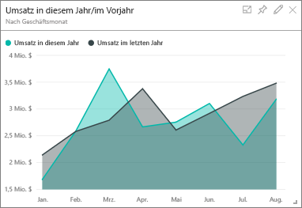
   
   Beachten Sie die große Variabilität in „Variance %“ gegenüber dem Vorjahr, mit Jan, Apr und Jul als besonders schlechten Monaten.
   
   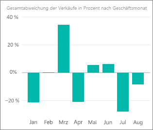
   
   Sehen wir uns einmal an, ob wir die Probleme eingrenzen können.
2. Wählen Sie das Blasendiagramm und dann **020-Herren**aus.
   
   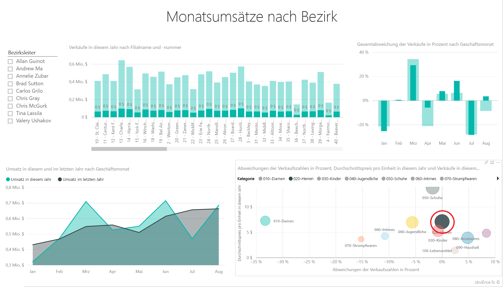  
   
   Beobachten Sie, dass die Herrenkategorie im April nicht so stark betroffen war wie das Geschäft insgesamt, wobei Januar und Juli dennoch problematische Monate waren.
3. Wählen Sie jetzt die Blase **010-Damen**aus.
   
   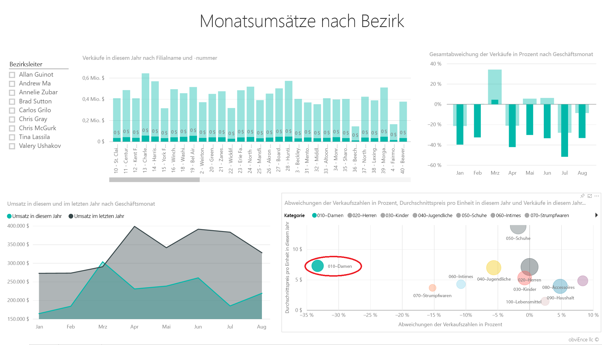
   
   Beachten Sie, dass die Frauenkategorie viel schlechter abgeschnitten hat als das Unternehmen insgesamt in allen Monaten und außerdem fast jeden Monat viel schlechter im Vergleich zum Vorjahr.
4. Wählen Sie die Blase erneut aus, um den Filter zu löschen.

## Testen des Datenschnitts
Betrachten wir, wie sich einzelne Regionen entwickelt haben.

1. Wählen Sie im Datenschnitt oben links „Allan Guinot“ aus.
   
   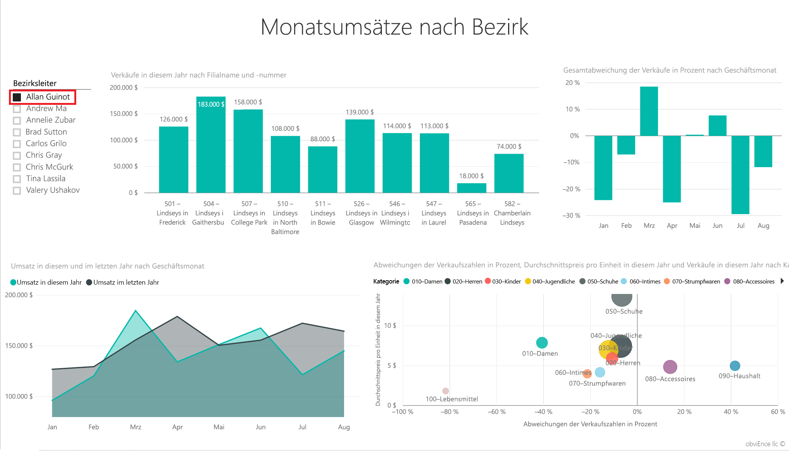
   
   Beachten Sie, dass Allans Region letztes Jahr in März und Juni outperformt hat.
2. Wählen Sie nun die Blase für die Damen aus, während Allan weiterhin ausgewählt ist.
   
   
   
   Beachten Sie, dass sein Bezirk in der Frauenkategorie in keinem Fall das Umsatzvolumen des Vorjahres erreichte.
3. Untersuchen  Sie die anderen Regionalmanager und Kategorien – welche Einsichten können Sie außerdem noch gewinnen?
4. Wenn Sie soweit sind – kehren Sie zum Dashboard zurück.

## Was sagen unsere Daten zur Umsatzsteigerung in diesem Jahr aus?
Der letzte Bereich, den wir untersuchen möchten, ist unser Wachstum – wir haben in diesem Jahr neue Geschäfte eröffnet.

1. Wählen Sie die Kachel „Stores Opened This Year“.
   
   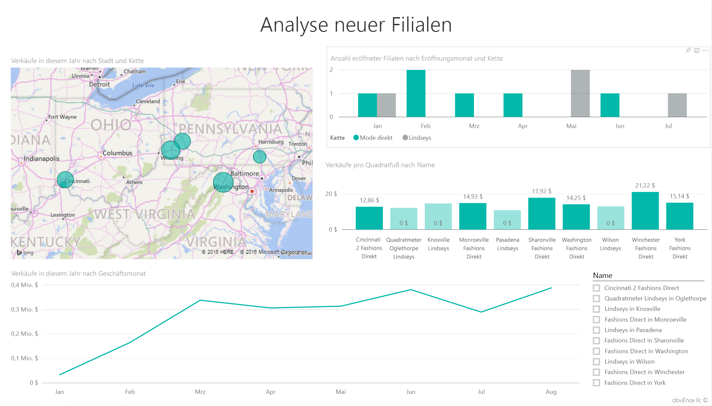
   
   Wie auf der Kachel deutlich zu sehen – dieses Jahr wurden mehr Fashions Direct-Geschäfte als Lindseys-Geschäfte eröffnet.
2. Betrachten Sie das Diagramm „Sales Per Sq Ft by Name“:
   
   
   
    Es gibt einen deutlichen Unterschied bei „Average Sales per SQF“ über die Gesamtheit der neuen Geschäfte.
3. Klicken Sie auf das Legendenelement „Fashions Direct“ im oberen rechten Diagramm. Beachten Sie, dass auch innerhalb der gleichen Kette das stärkste Geschäft (Winchester Fashions Direct) das schwächste Geschäft (Cincinnati 2 Fashions Direct) mit 21,22 $ gegen 12,86 $ deutlich schlägt.
   
   
4. Klicken Sie im Datenschnitt auf „Winchester Fashions Direct“, und beobachten Sie das Liniendiagramm. Die ersten Umsatzzahlen wurden im Februar gemeldet.
5. Klicken Sie im Datenschnitt auf „Cincinnati 2 Fashions Direct“, daraufhin sehen Sie im Liniendiagramm, dass das Geschäft im Juni eröffnet wurde und die schlechteste Leistung aller Geschäfte zu bringen scheint.
6. Untersuchen Sie wie zuvor durch Klicken auf andere Balken, Linien und Blasen quer durch alle Diagramme, welche Einblicke Sie gewinnen können.

Dies ist eine Umgebung, in der Sie sicher experimentieren können. Sie können sich immer noch entscheiden, Ihre Änderungen nicht zu speichern. Wenn Sie sie aber speichern, können Sie immer wieder zu „Daten abrufen“ zurückkehren, um ein neues Exemplar dieses Beispiels herunterzuladen.

## Nächste Schritte: Herstellen der Verbindung mit Ihren Daten
Wir hoffen, diese Tour hat Ihnen gezeigt, wie Power BI-Dashboards, das Fragen- und Antwortenmodul und Berichte Ihnen Einblicke in Daten zum Einzelhandel geben können. Es ist jetzt an Ihnen – stellen Sie Verbindungen mit Ihren eigenen Daten her. Mit Power BI können Sie Verbindungen zu einer Vielzahl von Datenquellen herstellen. Weitere Informationen zum [Einstieg in Power BI](service-get-started.md).

## Nächste Schritte
* [Herunterladen des Beispielinhaltspakets für die Einzelhandelsanalyse](sample-tutorial-connect-to-the-samples.md)    
* [Herunterladen der Excel-Arbeitsmappe für dieses Power BI-Beispiel](http://go.microsoft.com/fwlink/?LinkId=529778)    
* [Abrufen von Daten (für Power BI)](service-get-data.md)    
* [Power BI – Grundkonzepte](service-basic-concepts.md)    
* Weitere Fragen? [Wenden Sie sich an die Power BI-Community](http://community.powerbi.com/)

