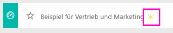
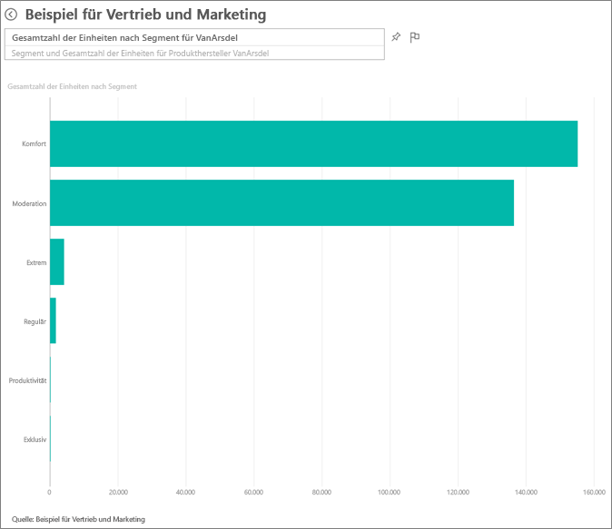
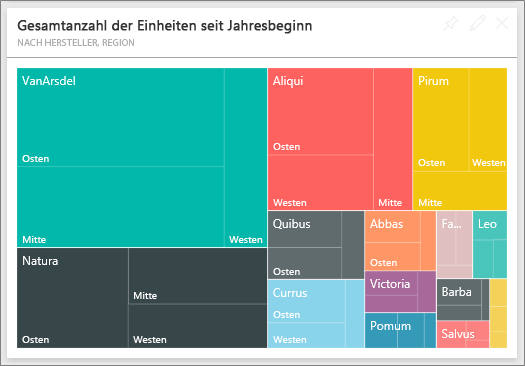
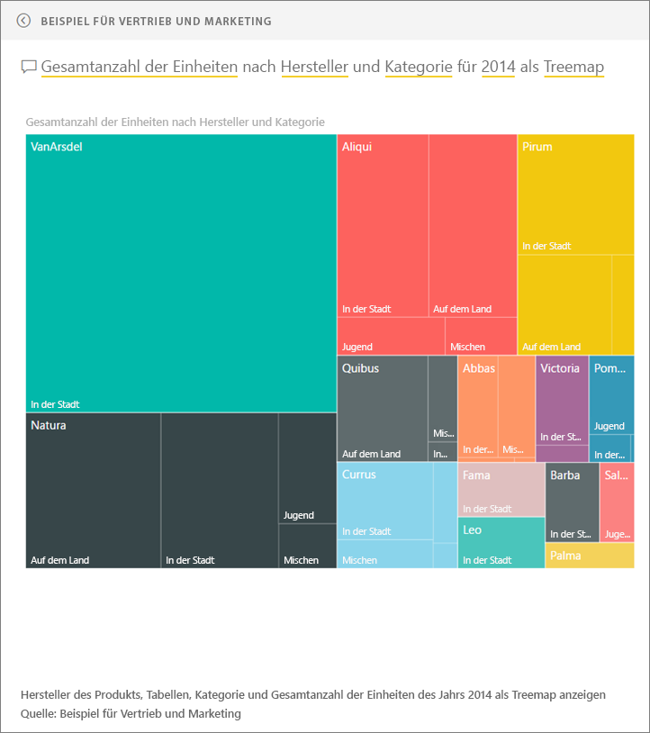
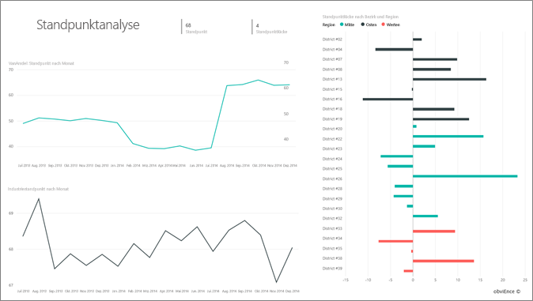
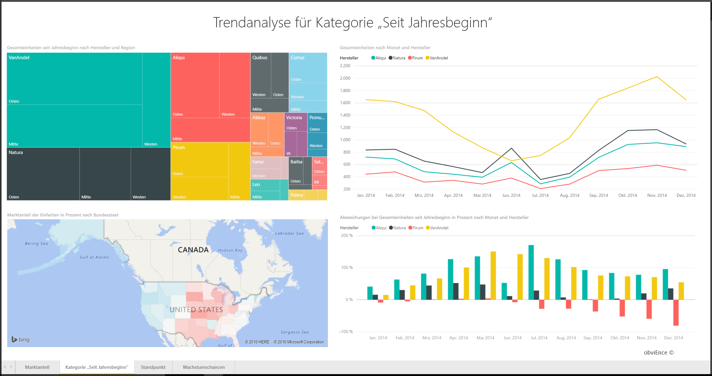
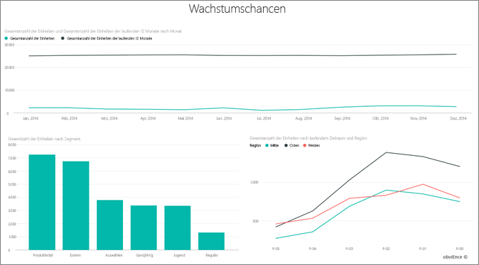

# Beispiel für Vertrieb und Marketing für Power BI: Tour

## Übersicht über das Beispiel für Vertrieb und Marketing
Das **Vertriebs- und Marketingbeispiel** enthält ein Dashboard und einen Bericht für das fiktive Fertigungsunternehmen VanArsdel Ltd. Dieses Dashboard wurde vom Chief Marketing Officer (CMO) von VanArsdel erstellt, um die Branche sowie den Marktanteil, das Produktvolumen, die Verkäufe und die Stimmungslage des Unternehmens im Blick zu haben.

VanArsdel hat viel Konkurrenz, aber ist Marktführer seiner Branche. Der CMO möchte den Marktanteil erhöhen und Wachstumschancen aufzeigen. Doch aus irgendeinem Grund geht der Marktanteil von VanArsdel zurück, insbesondere im Juni wurden größere Einbußen verzeichnet.

Dieses Beispiel ist Teil einer Reihe, die Ihnen die Verwendung von Power BI anhand geschäftsbezogener Daten, Berichte und Dashboards veranschaulicht. Hierbei handelt es sich um echte Daten von obviEnce (www.obvience.com) in anonymisierter Form.

## Voraussetzungen

 Bevor Sie das Beispiel verwenden können, müssen Sie es zunächst als [Inhaltspaket](https://docs.microsoft.com/en-us/power-bi/sample-sales-and-marketing#get-the-content-pack-for-this-sample), [PBIX-Datei](http://download.microsoft.com/download/9/7/6/9767913A-29DB-40CF-8944-9AC2BC940C53/Sales and Marketing Sample PBIX.pbix) oder [Excel-Arbeitsmappe](http://go.microsoft.com/fwlink/?LinkId=529785) herunterladen.

### Abrufen des Inhaltspakets für dieses Beispiel

1. Öffnen Sie den Power BI-Dienst (app.powerbi.com), und melden Sie sich an.
2. Wählen Sie in der linken unteren Ecke **Daten abrufen** aus.
   
    
3. Wählen Sie auf der daraufhin angezeigten Seite „Daten abrufen“ das Symbol **Beispiele** aus.
   
   
4. Wählen Sie das **Beispiel für Vertrieb und Marketing** aus, und wählen Sie dann **Verbinden**.  
  
   
   
5. Das Inhaltspaket wird in Power BI importiert, und dem aktuellen Arbeitsbereich werden ein neues Dashboard, ein neuer Bericht und ein neues Dataset hinzugefügt. Die neuen Inhalte sind mit einem gelben Sternchen markiert. 
   
   
  
### Abrufen der PBIX-Datei für dieses Beispiel

Alternativ können Sie das Beispiel als PBIX-Datei herunterladen, ein für Power BI Desktop entworfenes Dateiformat. 

 * [Beispiel für Vertrieb und Marketing](http://download.microsoft.com/download/9/7/6/9767913A-29DB-40CF-8944-9AC2BC940C53/Sales%20and%20Marketing%20Sample%20PBIX.pbix)

### Abrufen der Excel-Arbeitsmappe für dieses Beispiel
Alternativ können Sie [nur das Dataset (Excel-Arbeitsmappe) für dieses Beispiel herunterladen](http://go.microsoft.com/fwlink/?LinkId=529785). Die Arbeitsmappe enthält Power View-Blätter, die Sie anzeigen und ändern können. Wenn Sie die Rohdaten anzeigen möchten, wählen Sie **Power Pivot > Verwalten** aus.

## Welche Erkenntnisse gewinnen wir über unser Dashboard?
Wir werden uns nun das Dashboard und die Kacheln ansehen, die der CMO angeheftet hat. Wir sehen Informationen zu unserem Marktanteil, den Verkäufen und der Stimmungslage. Die Daten werden nach Region, Zeitraum und Konkurrenz aufgeschlüsselt.

* In den Zahlenkacheln auf der linken Seite sind das Verkaufsvolumen der Branche im vergangenen Jahr (50.000), der Marktanteil (32,86 %), Verkaufsvolumen (16.000), Bewertung der Stimmungslage (68), Stimmungslücke (4 und) insgesamt verkaufte Einheiten (1.000.000) aufgeführt.
* Das obere Liniendiagramm zeigt, wie unser Marktanteil mit der Zeit schwankt. Unser Marktanteil bricht im Juni richtig ein. Zudem begann unser Marktanteil der letzten 12 Monate zu stagnieren, nachdem er zuvor eine Weile lang gestiegen war.
* Unser größter Konkurrent ist Aliqui (im Säulendiagramm auf der mittleren Kachel aufgeführt).
* Unser Kerngeschäft wird in Ost- und Mittelamerika erzielt.
* Das untere Liniendiagramm zeigt, dass der Rückgang im Juni nicht saisonbedingt ist, da sich dieser Trend bei keinem unserer Konkurrenten abzeichnet.
* Die beiden Kacheln für „Gesamte Einheiten“ enthalten die verkauften Einheiten nach Segment und Region/Hersteller. Das größte Marktsegment unserer Branche machen **Produktivität** und **Komfort**aus.

### Weitere Informationen mit Q&A erhalten
#### Welche Segmente steigern unseren Umsatz? Entspricht das dem Branchentrend?
1. Wählen Sie die Kachel „Gesamte Einheiten nach Segment“ aus, um Q&A zu öffnen.
2. Geben Sie am Ende der vorhandenen Frage **für VanArsdel** ein. Q&A zeigt die Antwort auf die Frage in einem aktualisierten Diagramm an. Unser Produktvolumen ergibt sich aus Komfort und Moderation.

   
3. Unser Anteil in dem Kategorien **Moderation** und **Komfort** ist sehr hoch – in diesen Segmenten behaupten wir uns im Wettbewerb.
4. Navigieren Sie zurück zum Dashboard, indem Sie den Namen des Dashboards in der oberen Navigationsleiste (Brotkrümel) auswählen.

#### Wie sieht der Marktanteil für die gesamten Einheiten für die Kategorie (im Vergleich zur Region) aus?
1. Sehen Sie die Kachel „Gesamte Einheiten nach seit Jahresbeginn nach Hersteller, Region“ an. Ich frage mich, wie der Marktanteil für die Einheiten insgesamt nach Kategorie aufgeschlüsselt aussieht.

   
2. Geben Sie im Fragefeld am oberen Rand des Dashboards die Frage **total units by manufacturer and category for 2014 as a treemap** (Einheiten insgesamt nach Hersteller und Kategorie für 2014 als Treemap) ein. Sie sehen, wie die Visualisierung beim Eingeben der Frage aktualisiert wird.
   
3. Heften Sie das Diagramm an Ihr Dashboard an, um die Ergebnisse zu vergleichen. Interessant: 2014 verkaufte VanArsdel nur Produkte aus der Kategorie **Städtisch** .
4. Kehren Sie zum Dashboard zurück.

Über Dashboards können Sie auch Berichte aufrufen.  Wurde eine Kachel aus einem zugrunde liegenden Bericht erstellt, so wird der Bericht geöffnet, wenn Sie auf diese Kachel klicken.

Auf dem Dashboard wird in der Zeile zum vergangen Jahr angezeigt, dass unser Marktanteil mit der Zeit nicht mehr steigt, sondern eher zurückgeht. Und warum verzeichnen wir im Juni so große Einbußen? Klicken Sie auf diese Visualisierung, um den zugrunde liegenden Bericht zu öffnen und mehr zu erfahren.

### Die vier Seiten unseres Berichts
#### Die erste Seite unseres Berichts konzentriert sich auf den Marktanteil von VanArsdel.

1. Betrachten Sie das Säulendiagramm „Gesamte Einheiten nach Monat und isVanArsdel“ am unteren Seitenrand. Die schwarze Säule zeigt VanArsdel (unsere Produkte) und die grüne Säule unsere Mitbewerber. Die Einbußen, die VanArsdel im Juni 2014 verzeichnet, lassen sich bei der Konkurrenz nicht feststellen.
2. Das Balkendiagramm „Gesamtes Kategorievolumen nach Segment“ in der Mitte der rechten Seite wird gefiltert, um die zwei besten Segmente von VanArsdel anzuzeigen. Dieser Filter wird folgendermaßen erstellt:  

   a.  Erweitern Sie den Filterbereich auf der rechten Seite.  
   b.  Klicken Sie auf diese Option, um die Visualisierung auszuwählen.  
   c.  Unter „Filter auf visueller Ebene“ wird nach **Segment** gefiltert, sodass nur **Komfort** und **Moderation** einbezogen werden.  
   d.  Ändern Sie den Filter, indem Sie „Segment“ auswählen, um diesen Abschnitt zu erweitern, und aktivieren Sie dann **Produktivität**, um dieses Segment ebenfalls hinzuzufügen.  
3. Klicken Sie unter „Gesamte Einheiten nach Monat und isVanArsdel“ auf das schwarze „Ja“ in der Legende, um die Seite nach VanArsdel zu filtern. Beachten Sie, dass wir uns im Segment „Produktivität“ nicht im Wettbewerb behaupten.
4. Klicken Sie erneut auf das schwarze „Ja“, um den Filter zu entfernen.
5. Sehen Sie das Liniendiagramm an. Es zeigt unseren monatlichen Marktanteil und die Marktanteile in den vergangenen 12 Monaten. Die Daten der vergangenen 12 Monate helfen uns, monatliche Schwankungen zu glätten und langfristige Trends zu erkennen. Wählen Sie im Balkendiagramm „Komfort“ und „Moderation“ aus, um die Schwankungen des Marktanteils für jedes Segment anzuzeigen. Das Segment „Moderation“ weist stärkere Schwankungen beim Marktanteil auf als das Segment „Komfort“.

Wir versuchen immer noch herauszufinden, warum unser Marktanteil im Juni derart einbricht. Sehen wir uns die Stimmungslage an.

#### Die dritte Seite unseres Berichts konzentriert sich auf die Stimmungslage.

Tweets, Facebook, Blogs, Artikel usw. fließen in die Stimmungslage ein, die in den beiden Liniendiagrammen angezeigt wird. Das Diagramm „Stimmungslage“ oben links zeigt, dass die Stimmungslage zu unseren Produkten bis Februar relativ neutral war. Im Februar verschlechterte sich die Stimmung und erreichte im Juni ihren Tiefpunkt. Wo liegen die Ursachen für diesen Einbruch? Wir müssen externe Quellen prüfen. Im Februar erhielt der Kundeservice von VanArsdel in mehreren Artikeln und Blogs die schlechteste Bewertung der Branche. Diese negativen Schlagzeilen wirkten sich auf Stimmungslage und Verkauf aus. VanArsdel arbeitete hart daran, den Kundenservice zu verbessern, was in der Branche nicht unbemerkt blieb. Im Juli begann wandte sich die Stimmungslage wieder zum Positiven und erreichte den Höchststand im 60er-Bereich. Dieser Aufwärtstrend bei der Stimmungslage ist auch unter „Gesamteinheiten nach Monat“ auf den Seiten 1 und 3 zu erkennen. Ist das möglicherweise die Erklärung für unsere Markteinbußen im Juni?

Interessant wäre hier auch eine Untersuchung der Stimmungslage – welche Regionen die größte Stimmungslücke verzeichnen, wie das Management daraus Kapital schlagen kann und wie das auf andere Regionen übertragen werden kann.

#### Die zweite Seite unseres Berichts konzentriert sich auf den Kategorietrend seit Jahresbeginn.

* Alle Unternehmen in dieser Kategorie VanArsdel ist das größte Unternehmen in dieser Kategorie und unserer größten Mitbewerber sind Natura, Aliqui und Pirium. Wir werden sie im Auge behalten.
* Aliqui wächst, aber im Vergleich zu uns ist ihr Produktvolumen immer noch niedrig.
* In der Treemap wird VanArsdel in grün angezeigt. Im Osten bevorzugen die Kunden unsere Konkurrenz, in Mittelamerika ist unsere Leistung in Ordnung, und den geringsten Marktanteil verzeichnen wir im Osten.
* Die Geografie wirkt sich auf verkaufte Einheiten aus. Der Osten ist für die meisten Hersteller die vorherrschende Region und VanArsdel verfügt über eine starke Präsenz in Mittelamerika.
* Im Diagramm „Prozentuale Abweichung bei den gesamten Einheiten seit Jahresbeginn nach Monat und Hersteller“ unten rechts verzeichnen wir eine positive Abweichung – ein gutes Zeichen – und eine bessere Leistung als im Vorjahr. Dies ist aber auch bei unserem Mitbewerber Aliqui der Fall.

#### Die vierte Seite unseres Berichts konzentriert sich auf die Analyse von Konkurrenzprodukten.

* Das Diagramm unten links zeigt alle Kategoriesegmente außer die beiden stärksten Segmente von VanArsdel. Filtern Sie nach Kategorie, indem Sie auf die Balken klicken, um mögliche Wachstumsbereiche für VanArsdel zu identifizieren. Die Segmente **Extrem** und **Produktivität** wachsen schneller als andere.
* Aber in diesen Segmenten behaupten wir uns nicht im Wettbewerb. Wenn wir in diesen Bereichen Fortschritte erzielen möchten, können wir anhand unserer Daten feststellen, welche Segmente in welchen Regionen beliebt sind. Wir können weitere Fragen klären, z.B. welche Region schneller wächst und wer unser größter Konkurrent in diesem Segment wäre.
* Erinnern Sie sich an den Einbruch unserer Marktanteile im Juni? Der Juni ist ein wichtiger Monat für das Produktivitätssegment – ein Segment, in dem wir uns überhaupt nicht im Wettbewerb behaupten. Dies könnte den Einbruch unseres Marktanteils im Juni erklären.

Wenn wir die Visualisierungen nach VanArsdel, Segment, Monat und Region filtern, können wir die Wachstumschancen für VanArsdel ermitteln.

Dies ist eine Umgebung, in der Sie sicher experimentieren können. Sie können sich immer noch entscheiden, Ihre Änderungen nicht zu speichern. Wenn Sie sie speichern, können Sie immer wieder zu **Daten abrufen** zurückkehren, um ein neues Exemplar dieses Beispiels herunterzuladen.

## Nächste Schritte: Herstellen der Verbindung mit Ihren Daten
Wir hoffen, diese Tour hat Ihnen gezeigt, wie Power BI-Dashboards, Q&A und Berichte Ihnen Einblicke in Vertriebs- und Marketingdaten geben können. Es ist jetzt an Ihnen – stellen Sie Verbindungen mit Ihren eigenen Daten her. Mit Power BI können Sie Verbindungen zu einer Vielzahl von Datenquellen herstellen. Weitere Informationen zum [Einstieg in Power BI](service-get-started.md).  
