# Analysebeispiel für Lieferantenqualität für Power BI: Tour

## Eine kurze Übersicht über das Analysebeispiel für Lieferantenqualität
Dieses branchenspezifische Beispieldashboard und der zugrunde liegende Bericht legen den Schwerpunkt auf eine der typischen Herausforderungen einer Lieferkette – die Lieferantenqualitätsanalyse.
In dieser Analyse sind hauptsächlich zwei Metriken von Interesse: die Gesamtzahl der Defekte und die Ausfallzeiten, die durch diese Defekte verursacht wurden. Dieses Beispiel hat zwei wichtige Ziele:

* Erkennen, welcher Lieferant die beste und welcher die schlechteste Qualität liefert.
* Ermitteln, welche Werke Mängel besser erkennen und zurückweisen, um Ausfallzeiten zu minimieren.

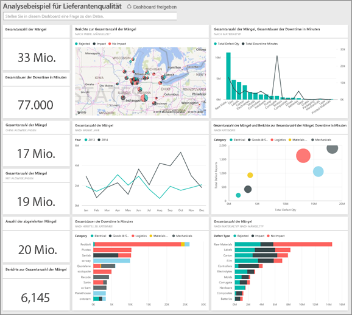

Dieses Beispiel ist Teil einer Reihe, die Ihnen die Verwendung von Power BI anhand geschäftsbezogener Daten, Berichte und Dashboards veranschaulicht.
Hierbei handelt es sich um echte Daten von obviEnce ([www.obvience.com](http://www.obvience.com/)) in anonymisierter Form.

## Voraussetzungen

 Bevor Sie das Beispiel verwenden können, müssen Sie es zunächst als [Inhaltspaket](https://docs.microsoft.com/power-bi/sample-supplier-quality#get-the-content-pack-for-this-sample), [PBIX-Datei](http://download.microsoft.com/download/8/C/6/8C661638-C102-4C04-992E-9EA56A5D319B/Supplier-Quality-Analysis-Sample-PBIX.pbix) oder [Excel-Arbeitsmappe](http://go.microsoft.com/fwlink/?LinkId=529779) herunterladen.

### Abrufen des Inhaltspakets für dieses Beispiel

1. Öffnen Sie den Power BI-Dienst (app.powerbi.com), und melden Sie sich an.
2. Wählen Sie in der linken unteren Ecke **Daten abrufen** aus.
   
    
3. Wählen Sie auf der daraufhin angezeigten Seite „Daten abrufen“ das Symbol **Beispiele** aus.
   
   
4. Wählen Sie das **Analysebeispiel für Lieferantenqualität** aus, und wählen Sie dann **Verbinden**.  
  
   
   
5. Das Inhaltspaket wird in Power BI importiert, und dem aktuellen Arbeitsbereich werden ein neues Dashboard, ein neuer Bericht und ein neues Dataset hinzugefügt. Die neuen Inhalte sind mit einem gelben Sternchen markiert. 
   
   
  
### Abrufen der PBIX-Datei für dieses Beispiel

Alternativ können Sie das Beispiel als PBIX-Datei herunterladen, ein für Power BI Desktop entworfenes Dateiformat. 

 * [PBIX-Datei zum Analysebeispiel für Lieferantenqualität](http://download.microsoft.com/download/8/C/6/8C661638-C102-4C04-992E-9EA56A5D319B/Supplier-Quality-Analysis-Sample-PBIX.pbix)

### Abrufen der Excel-Arbeitsmappe für dieses Beispiel
Alternativ können Sie [nur das Dataset (Excel-Arbeitsmappe) für dieses Beispiel herunterladen](http://go.microsoft.com/fwlink/?LinkId=529779). Die Arbeitsmappe enthält Power View-Blätter, die Sie anzeigen und ändern können. Wenn Sie die Rohdaten anzeigen möchten, wählen Sie **Power Pivot > Verwalten** aus.

## Ausfallzeiten durch Materialmängel
Wir analysieren die Ausfallzeiten durch Materialmängel und stellen fest, welche Anbieter verantwortlich sind.  

1. Wählen Sie im Dashboard die Zahlenkachel **Gesamtzahl der Mängel** oder **Gesamte Ausfallzeiten in Minuten** .  

   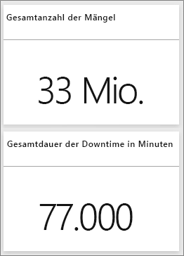  

   Der Bericht „Analysebeispiel für Lieferantenqualität“ wird auf der Seite „Analyse der Ausfallzeiten“ geöffnet. Beachten Sie, dass bei uns 33 Millionen Mängel vorliegen, und die dadurch bedingte Gesamtausfallzeit beträgt 77.000 Minuten. Einige Materialien weisen weniger Mängel auf, können jedoch zu großen Verzögerungen und somit längeren Ausfallzeiten führen. Sehen wir uns die Berichte dazu an.  
2. Beim Prüfen der Zeile **Gesamte Ausfallzeiten in Minuten** im Kombinationsdiagramm **Mängel und Ausfallzeiten (Min.) nach Materialtyp** werden wellende Materialien mit den meisten Ausfallzeiten aufgeführt.  
3. In der Spalte **Wellen** im selben Kombinationsdiagramm sehen Sie, welche Werke am häufigsten von diesen Mängeln betroffen sind und welcher Lieferant verantwortlich ist.  

     
4. Wählen Sie einzelne Werke in der Karte aus, um anzuzeigen, welche Hersteller oder Materialien für die Ausfallzeiten in diesem Werk verantwortlich sind.

### Wer sind die schlechtesten Lieferanten?
 Wir möchten die acht schlechtesten Lieferanten finden und den Prozentsatz der durch sie verursachten Ausfallzeiten ermitteln. Hierzu ändern wir das Flächendiagramm **Ausfallzeiten (Min.) nach Hersteller** zu einer Treemap.  

1. Wählen Sie auf Seite 3 des Berichts „Analyse der Ausfallzeiten“ **Bericht bearbeiten** in der oberen linken Ecke.  
2. Wählen Sie im Flächendiagramm **Ausfallzeiten (Min.) nach Hersteller** , und wählen Sie im Bereich „Visualisierungen“ die Treemap.  

   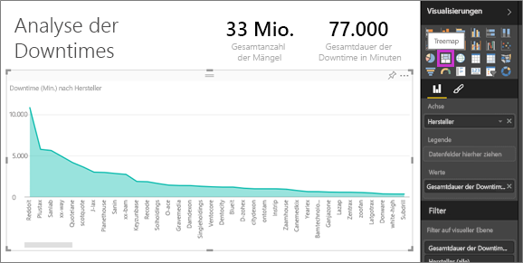  

    Die Treemap setzt automatisch das Feld **Hersteller** als **Gruppe**ein.  

    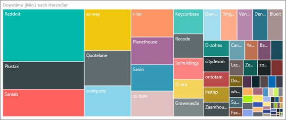  

   Auf dieser Treemap sehen wir die acht wichtigsten Hersteller in den acht Blöcken auf der linken Seite der Treemap. Wir sehen auch, dass sie für knapp 50 % aller Ausfallzeiten in Minuten verantwortlich sind.  
3. Wählen Sie in der oberen Navigationsleiste **Analysebeispiel für Lieferantenqualität** aus, um zum Dashboard zurückzukehren.

### Werke vergleichen
Nun möchten wir prüfen, welches Werk beim Umgang mit Materialmängeln besser abschneidet und weniger Ausfallzeiten verzeichnet.  

1. Wählen Sie die Kartenkachel **Gesamte Mängelberichte nach Werk, Mängelart** .  

    Der Bericht wird auf der Seite „Lieferantenqualität“ geöffnet.  

   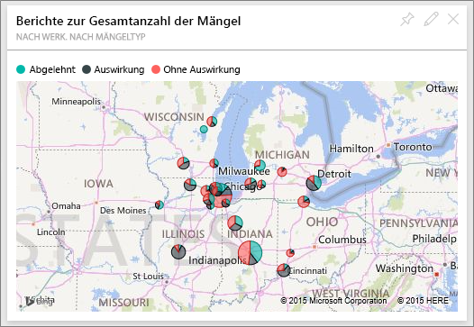  
2. Wählen Sie in der Kartenlegende **Auswirkung** .  

    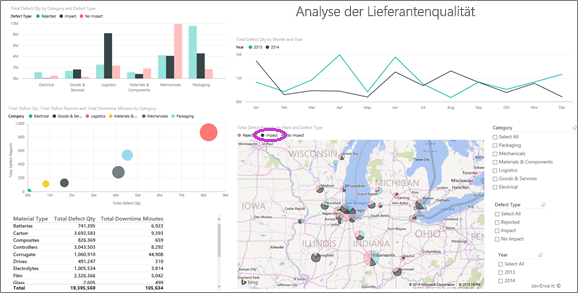  

    Beachten Sie, dass im Blasendiagramm **Logistik** die Kategorie mit den meisten Problemen ist – sie weist die meisten Mängel, Mängelberichte und Ausfallzeiten in Minuten auf. Untersuchen wir diese Kategorie genauer.  
3. Wählen Sie die Logistik-Blase im Blasendiagramm, und sehen Sie die Werke in Springfield, IL und Naperville IL genauer an. Naperville scheint beim Umgang mit Mängeln erfolgreicher zu sein, da es eine Vielzahl an Reklamationen und eine geringe Auswirkung hat – Springfield verzeichnet hingegen einen hohen Wert bei der Auswirkung.  

   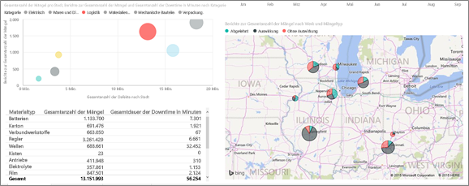  
4. Wählen Sie in der oberen Navigationsleiste **Analysebeispiel für Lieferantenqualität** aus, um zum aktiven Arbeitsbereich zurückzukehren.

## Welcher Materialart schneidet am besten ab?
Der am besten verwaltete Materialtyp ist unabhängig von der Anzahl der Mängel der Typ mit den geringsten Ausfallzeiten oder gar keiner Beeinträchtigung.

* Sehen wir uns im Dashboard die Kachel **Gesamte Mängel nach Materialart, Fehlerart** an.

  

Beachten Sie, dass **Rohmaterialien** insgesamt eine hohe Anzahl von Mängel aufweisen, die meisten davon jedoch entweder reklamiert werden oder keine Auswirkung haben.

Wir stellen fest, dass Rohmaterialien trotz relativ hoher Anzahl von Mängeln nicht viele Ausfallzeiten verursachen.

* Sehen wir uns im Dashboard die Kachel **Gesamtzahl der Mängel, gesamte Ausfallzeiten in Minuten nach Materialart** an.

  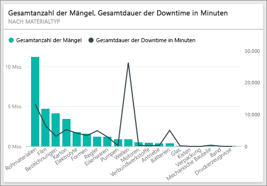

Anscheinend schneiden Rohmaterialien gut ab – sie haben mehr Mängel, aber die Ausfallzeiten in Minuten sind geringer.

### Mängel nach Ausfallzeiten pro Jahr vergleichen
1. Wählen Sie die Kartenkachel **Bericht der gesamten Mängel nach Werk, Mängelart** aus, um den Bericht auf der ersten Seite des Berichts („Lieferantenqualität“) zu öffnen.
2. Wir stellen fest, dass die **Gesamtzahl der Mängel** 2014 höher als 2013 ist.  

    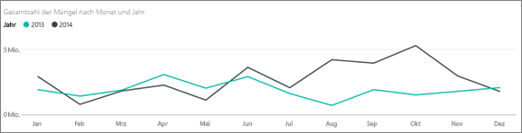  
3. Führen mehr Mängel zwangsläufig zu mehr Ausfallzeiten? Wir können im Q&A-Feld Fragen eingeben, um das in Erfahrung zu bringen.  
4. Wählen Sie in der oberen Navigationsleiste **Analysebeispiel für Lieferantenqualität** aus, um zum Dashboard zurückzukehren.  
5. Da wir wissen, dass Rohmaterialien die höchste Anzahl an Mängeln aufweisen, geben wir im Fragefeld „Materialarten, Jahr und Gesamtzahl der Mängel“ ein.  

    2014 lagen mehr Mängel bei Rohmaterialien vor als 2013.  

    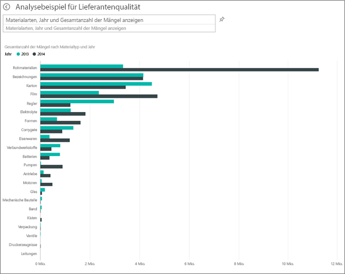  
6. Ändern Sie nun die Frage in „Materialarten, Jahr und gesamte Ausfallzeiten in Minuten anzeigen“.  

   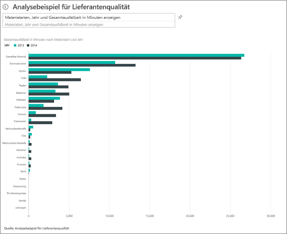

Durch Rohmaterialien bedingte Ausfallzeiten waren 2013 und 2014 etwa identisch, obwohl 2014 mehr Mängel bei Rohmaterialien vorlagen.

2014 führten mehr Mängel bei Rohmaterialien also nicht zu mehr durch Rohmaterialien bedingte Ausfallzeiten.

### Mängel nach Ausfallzeit pro Monat vergleichen
Sehen wir uns ein weiteres Dashboard-Kachel zur Gesamtzahl der Mängel an.  

1. Wählen Sie den Zurück-Pfeil  in der oberen linken Ecke über dem Fragefeld, um zum Dashboard zurückzukehren.  

    Bei näherer Betrachtung der Kachel **Gesamtzahl der Mängel nach Monat, Jahr** zeigt sich, dass in der ersten Hälfte 2014 genauso viele Mängel auftraten wie 2013, die Anzahl der Mängel jedoch in der zweiten Hälfte 2014 deutlich anstieg.  

    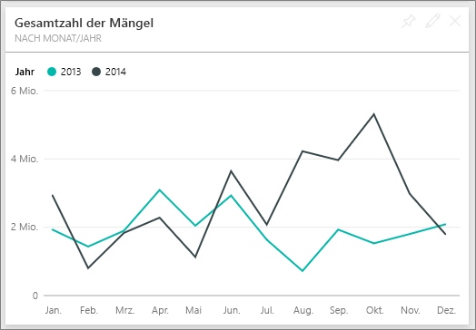  

    Prüfen wir nun, ob durch den Anstieg der Mängel auch die Ausfallzeiten in Minuten angestiegen sind.  
2. Geben Sie im Fragefeld „Gesamte Ausfallzeiten in Minuten nach Monat und Jahr als Liniendiagramm“ ein.  

   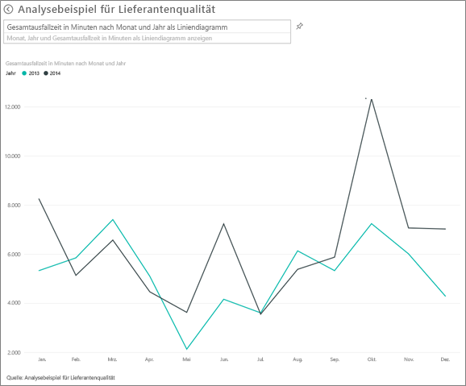

   Wir verzeichnen im Juni und Oktober einen starken Anstieg der Ausfallzeiten in Minuten. Der Anstieg der Gesamtzahl an Mängeln führt jedoch nicht zu einem starken Anstieg der Ausfallzeiten. Dies zeigt, dass wir bei Mängeln gut abschneiden.  
3. Wählen Sie das Anheftsymbol  rechts neben dem Fragefeld, um dieses Diagramm an Ihr Dashboard anzuheften.  
4. Prüfen Sie zum Untersuchen der Monate mit Ausreißern die Ausfallzeiten in Minuten im Oktober nach Materialart, Werksstandort, Kategorie usw., indem Sie Fragen wie „Gesamte Ausfallzeiten in Minuten im Oktober nach Werk“ stellen.    
5. Wählen Sie den Zurück-Pfeil  in der oberen linken Ecke über dem Fragefeld, um zum Dashboard zurückzukehren.

Dies ist eine Umgebung, in der Sie sicher experimentieren können. Sie können sich immer noch entscheiden, Ihre Änderungen nicht zu speichern. Wenn Sie sie speichern, können Sie immer wieder zu **Daten abrufen** zurückkehren, um ein neues Exemplar dieses Beispiels herunterzuladen.

## Nächste Schritte: Herstellen der Verbindung mit Ihren Daten
Wir hoffen, diese Tour hat Ihnen gezeigt, wie Sie mit Power BI-Dashboards, Q&A und Berichten Einblicke in Daten zur Lieferantenqualität erhalten können. Es ist jetzt an Ihnen – stellen Sie Verbindungen mit Ihren eigenen Daten her. Mit Power BI können Sie Verbindungen zu einer Vielzahl von Datenquellen herstellen. Weitere Informationen zum [Einstieg in Power BI](service-get-started.md).
