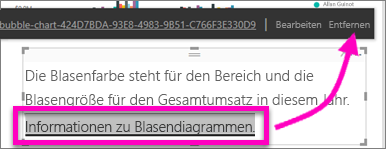

# Hinzufügen eines Links zu einem Textfeld in einem Bericht
Textfelder können zu Berichten hinzugefügt, aus Berichten an Dashboards angeheftet und direkt zu Dashboards hinzugefügt werden. Links können jedem Textfeld hinzugefügt werden, unabhängig davon, wo sich dieses befindet. **In diesem Thema werden Textfelder in Berichten behandelt.**

> **HINWEIS**: Informationen zu Links in Power BI-Tabellen und -Matrizen finden Sie unter [Links in Tabellen](power-bi-hyperlinks-in-tables.md). Informationen zum Hinzufügen von Textfeldern zu Ihrem **Dashboard** finden Sie unter [Hinzufügen einer Kachel direkt aus dem Dashboard](service-dashboard-add-widget.md). 
> 
> 

<iframe width="560" height="315" src="https://www.youtube.com/embed/_3q6VEBhGew#t=0m55s" frameborder="0" allowfullscreen></iframe>

## So fügen Sie einen Link einem Textfeld in einem Bericht hinzu
1. [Erstellen Sie ein Textfeld und fügen Sie Text hinzu](power-bi-reports-add-text-and-shapes.md). 
2. Markieren Sie den vorhandenen Text oder fügen Sie neuen Text als Link hinzu.
   
   
3. Wählen Sie das Linksymbol .
4. Geben Sie die URL im Linkfeld ein oder kopieren Sie diese dort hinein. Wählen Sie dann **Fertig**.
   
   
5. Testen Sie den Link.  
   
   
   
   * Wählen Sie den Link im Textfeld aus, um die URL anzuzeigen.
     
      
   * Wählen Sie die URL aus, um die Seite in einem neuen Browserfenster zu öffnen.

## Zum Entfernen des Links, ohne den Text zu entfernen,
1. Wählen Sie den Link im Textfeld aus, um ihn zu markieren.
   
     
2. Wählen Sie **Entfernen**. 

## Nächste Schritte
[Textfelder in Power BI-Berichten](power-bi-reports-add-text-and-shapes.md)

[Hinzufügen eines Textfelds zu einem Dashboard](service-dashboard-add-widget.md)

Weitere Fragen? [Wenden Sie sich an die Power BI-Community](http://community.powerbi.com/)

